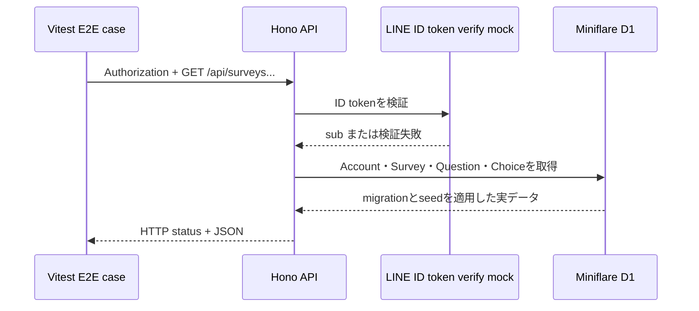
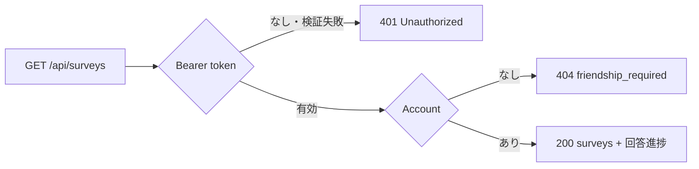
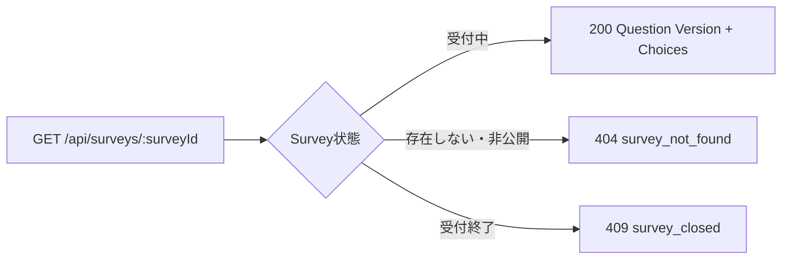

# アンケートAPI E2Eケースマップ

## 目的

この文書は、アンケートAPIのローカルD1 E2Eテストについて、どのリクエストがどのレスポンスへ対応するかを視覚的に確認するためのケース索引です。各ケースIDは[`survey-list.test.ts`](survey-list.test.ts)のテスト名と対応します。

APIの正式なパス、認証、入出力、エラー契約は[アンケートAPI契約](../../../../docs/development/questionnaire-api.md)を正とします。この文書はAPI契約を所有せず、テスト対象と期待結果の対応だけを所有します。

## テストの境界



LINEのIDトークン検証通信だけをモックします。Honoのルーティング、認証ヘッダーの解釈、Account解決、Drizzleのクエリ、D1の集計、JSON変換は実際の処理を通します。

## 一覧API



| Case ID | リクエスト・前提 | Status | 主なレスポンス |
| --- | --- | --- | --- |
| `LIST-001` | `GET /api/surveys`、既知のBearer token、回答をD1へ登録 | `200` | `surveys[].responseStatus`が`unanswered`、`in-progress`、`answered`へ変化 |
| `LIST-002` | `GET /api/surveys`、Authorizationなし | `401` | `{ "error": "Unauthorized" }` |
| `LIST-003` | `GET /api/surveys`、LINEが拒否するBearer token | `401` | `{ "error": "Unauthorized" }` |
| `LIST-004` | `GET /api/surveys`、検証済みだがAccountなし | `404` | `{ "error": "Account not found", "reason": "friendship_required" }` |

## 詳細API



| Case ID | リクエスト・前提 | Status | 主なレスポンス |
| --- | --- | --- | --- |
| `DETAIL-001` | `GET /api/surveys/relationship-priority`、既知のBearer token | `200` | Surveyが固定した10問と、位置順のQuestion Version・Choice |
| `DETAIL-002` | `GET /api/surveys/missing`、既知のBearer token | `404` | `{ "error": "Survey not found", "reason": "survey_not_found" }` |
| `DETAIL-003` | `GET /api/surveys/relationship-priority`、D1上で受付終了 | `409` | `{ "error": "Survey closed", "reason": "survey_closed" }` |

## 実行方法

```bash
bun --cwd apps/api test:e2e
```

通常の全体検証では`task ci`からも実行されます。
