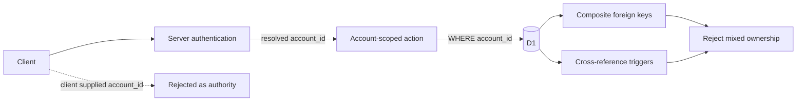
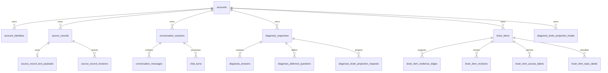

# Accountデータ分離設計

## 1. 目的

この文書は、同じD1 databaseへ複数Accountのデータを保存する際に、Account間の読み取りと関連付けの混在を防ぐ共通規則を定義します。

この文書が所有するもの:

- Account所有データを識別する規則
- ユーザー起点query、background処理、管理者集計のAccount境界
- D1 schemaでAccount境界を強制する方法
- 既存データへ境界を追加するmigration規則

この文書が所有しないもの:

- Accountの本人確認とIdentity統合は[ドメイン設計](../domain/domain-design.md)を正とします
- Brain Itemの用途別開示は[Brainのラベル・アクセス制御設計](../domain/brain/brain-access-label-design.md)を正とします
- 管理者の認可方式と統計項目は[管理者向け統計ダッシュボード設計](admin-statistics-dashboard.md)を正とします

## 2. 前提

API Server、Worker、MCP Serverは、Accountごとに異なるdatabase credentialを使わず、同じD1 bindingを利用します。そのためdatabase接続自体は現在のAccountを識別せず、PostgreSQLのRLSのように接続主体へ自動適用される行filterを認可の根拠にはできません。

認可の本体は、サーバーが検証済みIdentityから解決した`account_id`をD1 actionへ渡し、すべてのユーザー起点queryで条件に含めることです。D1の複合外部キーとtriggerは、別Accountの行を誤って関連付ける書き込みを拒否する防御層です。

## 3. データの区分

| 区分 | 例 | `account_id` | 参照規則 |
| --- | --- | --- | --- |
| 全Account共通 | Question、Diagnosis、Scoring Config | 持たない | 公開状態など各ドメインの条件で参照 |
| Account所有root | Source Record、Conversation Session、Diagnosis Response、Brain Item | 必須 | `accounts.id`を参照 |
| Account所有descendant | payload、message、turn、answer、edge、revision、projection request | 必須 | 所有rootへ`(id, account_id)`で参照 |
| 全体運用 | scheduled retry、管理者統計 | 対象に応じる | ユーザー向けqueryと明確に分離 |

`account_id`が親から導出できる子行にも同じ値を保存します。これは検索最適化のためだけの重複ではなく、所有者を行自身に固定し、複合外部キーで関係全体のAccount一致を検証するためのsecurity invariantです。

## 4. 不変条件

### 4.1 読み取り

1. ユーザー起点のD1 actionは、認証結果から得た`account_id`を必須引数にします。
2. クライアントがbody、query、pathで送ったAccount IDを認可に利用しません。
3. Account所有行をIDだけで取得するユーザー向けactionを作りません。`id`と`account_id`を同じqueryで照合します。
4. 所有者が一致しない場合はnot-found相当へ寄せ、別AccountにIDが存在することを開示しません。
5. 子行の取得でもrootの所有者を暗黙に信用せず、子行自身の`account_id`またはAccount一致済みの複合joinを条件に含めます。

### 4.2 書き込み

1. Account所有rootは`account_id NOT NULL`と`accounts.id`への外部キーを持ちます。
2. Account所有descendantは`account_id NOT NULL`を持ち、所有rootへ`(parent_id, account_id)`の複合外部キーを張ります。
3. 同じ行を複合外部キーから参照するrootには`UNIQUE(id, account_id)`を置きます。
4. 循環参照のため複合外部キーを表現できないConversation MessageとChat Turnの相互参照は、insert/update triggerで`account_id`一致を強制します。
5. application codeは親から解決した同じ`account_id`を、同一batchで作るすべてのdescendantへ明示的に書き込みます。

### 4.3 全Accountを扱う処理

scheduled retryや期限切れSession終了は全Accountを走査できますが、取得した行ごとの`account_id`境界を維持し、ユーザーへ別Accountの内容を返しません。

管理者統計は管理者認可後の集計専用経路に限定します。通常ユーザー向けactionから全Account queryを再利用せず、原文やBrain Item本文を統計レスポンスへ含めません。

## 5. 現在のAccount所有関係

関係tableが2つのAccount所有rootを結ぶ場合、両方の複合外部キーが同じ`account_id`列を使います。これにより、Source RecordとBrain Item、Diagnosis ResponseとSource Recordなどを別Account間で結べません。

## 6. Migration規則

既存tableへAccount境界を追加するときは、次の順序を守ります。

1. 既存の親子関係から`account_id`を比較し、既に混在していればmigrationを失敗させる
2. 親行の`account_id`からdescendantへbackfillする
3. `account_id NOT NULL`、Account外部キー、複合外部キーを有効にする
4. `PRAGMA foreign_key_check`が空であることをmigration testで確認する
5. 別Accountを結ぶnegative testを追加する

不一致行を削除したり、片方の所有者へ自動的に寄せたりしてmigrationを成功させてはいけません。混在が見つかった場合は、データごとの正しい所有者を調査してからrepairします。

Conversation MessageまたはChat Turnを将来のmigrationでtable再作成する場合は、相互参照のAccount一致を検証するtriggerも同じmigration内で再作成します。Drizzle schemaだけではこの循環参照triggerを表現していないため、生成SQLから脱落していないことをnegative testで確認します。

## 7. 変更時チェックリスト

- [ ] 新しいtableが全Account共通かAccount所有かを決めたか
- [ ] Account所有descendant自身にも`account_id`があるか
- [ ] Account所有table間の参照が`(id, account_id)`で固定されているか
- [ ] ユーザー起点actionが認証済み`account_id`を必須にしているか
- [ ] IDだけのAccount所有データ取得を追加していないか
- [ ] 全Account処理が通常ユーザー向け経路から分離されているか
- [ ] migrationが既存の混在を検出し、backfill後の外部キーを検証するか
- [ ] Conversation MessageまたはChat Turnを再作成した場合、Account境界triggerも再作成したか
- [ ] 別Accountを使うnegative testがあるか
