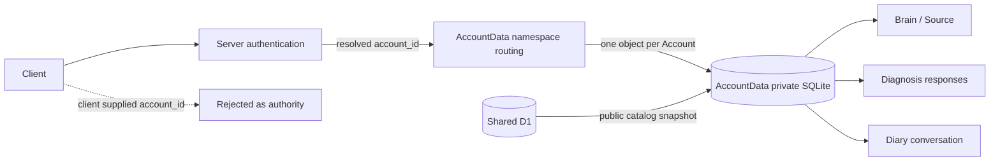
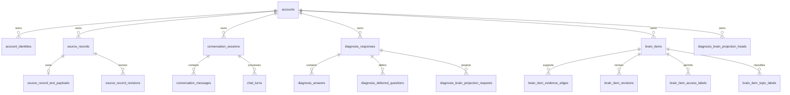

# Accountデータ分離設計

## 1. 目的

この文書は、Accountごとに独立したSQLite-backed Durable ObjectへAccount所有データを保存し、Account間の読み取りと関連付けの混在を構造的に防ぐ共通規則を定義します。

この文書が所有するもの:

- Account所有データを識別する規則
- ユーザー起点query、background処理、管理者集計のAccount境界
- Account Data Durable Objectと共有D1の責務境界
- Account Data schemaでAccount境界を強制する方法
- 既存の共有D1データをAccount Dataへ移すmigration規則

この文書が所有しないもの:

- Accountの本人確認とIdentity統合は[ドメイン設計](../domain/domain-design.md)を正とします
- Brain Itemの用途別開示は[Brainのラベル・アクセス制御設計](../domain/brain/brain-access-label-design.md)を正とします
- 管理者の認可方式と統計項目は[管理者向け統計ダッシュボード設計](admin-statistics-dashboard.md)を正とします

## 2. 前提

共有D1の1つのbindingをすべてのAccount所有データへ使う方式では、接続自体が現在のAccountを識別しません。SQLite / D1にはPostgreSQLのRLSに相当するrequest-scopedな行filterがないため、`WHERE account_id`の記述だけを認可の最終境界にしません。

Account所有データのSSoTは、`account_id`から決定的に選ぶ`AccountData` Durable Objectのprivate SQLiteです。1つのObjectには1 Accountのデータだけを保存し、API Server、Worker、MCP Serverへraw SQLite clientを公開しません。共有D1にはIdentity解決、全Account共通の公開定義、原文を含まない運用projectionだけを保存します。



## 3. データの区分

| 区分 | 例 | 保存先 | 参照規則 |
| --- | --- | --- | --- |
| 全Account共通 | Account Identity、Question、Diagnosis、Scoring Config | 共有D1 | 公開状態など各ドメインの条件で参照 |
| Account所有root | Source Record、Conversation Session、Diagnosis Response、Brain Item | AccountData SQLite | Objectに固定したAccountだけを保存 |
| Account所有descendant | payload、message、turn、answer、edge、revision、projection request | AccountData SQLite | 所有rootと同じObject内で参照 |
| 全体運用 | 管理者統計、配送先解決 | 共有D1 | 原文・Brain Item本文を保存しない |

AccountData SQLiteでは、Object identityとAccount所有rootだけが`account_id`を持つことを原則とします。descendantの所有者はrootへの外部キーから一意に決まるため、同じ`account_id`を重複保存しません。Objectの物理分離を第一境界、Object identityとrootの`account_id`一致を誤routing検出の第二境界とします。

移行期間中の既知の例外として、既存の共有D1 actionとschemaを再利用するBrainのedge、revision、labelとDiagnosis Brain projection headには、本変更以前から存在する`account_id`が残ります。これは認可境界として利用せず、AccountData専用schemaへ分離した時点で親への外部キーへ置き換えます。Conversation、Source、Diagnosis回答のdescendantへ移行専用の`account_id`は追加しません。

## 4. 不変条件

### 4.1 読み取り

1. ユーザー起点処理は、認証結果から得た`account_id`でAccountData Objectを選びます。
2. クライアントがbody、query、pathで送ったAccount IDを認可に利用しません。
3. AccountData Objectは初回利用時にObject identityをAccountへ固定し、以後異なる`account_id`を含むRPCを拒否します。
4. API Server、Worker、MCP ServerへAccountDataのraw SQLite clientまたはAccount所有tableを公開しません。
5. Account所有データは、AccountData RPCのドメイン操作を通してだけ読み取ります。
6. 所有者が一致しない場合はnot-found相当へ寄せ、別AccountにIDが存在することを開示しません。

### 4.2 書き込み

1. Account所有rootは`account_id NOT NULL`とAccountData内のsingleton Accountへの外部キーを持ちます。
2. Account所有descendantは原則として`account_id`を持たず、所有rootまたは同じaggregateの親へ通常の外部キーを張ります。移行中の既知の例外は[データの区分](#3-データの区分)だけで管理します。
3. 2つのAccount所有rootを結ぶ関係も、同じAccountData Object内に片方のAccountしか存在しないため、両方のroot IDへの外部キーで混在を防ぎます。
4. Conversation MessageとChat Turnの循環参照は、両方を同じObject内に作成してから参照を復元します。
5. AccountData repositoryはdescendantへ所有者を重複転記せず、rootの所有者とObject identityだけを検証します。

### 4.3 全Accountを扱う処理

projection retryや期限切れSession終了は各AccountData Objectのalarmで処理します。共有D1からAccount所有行を全走査しません。

管理者統計は管理者認可後の集計専用経路に限定します。AccountDataから共有D1へ送る場合も非機密な集計projectionだけとし、原文やBrain Item本文を含めません。

## 5. 現在のAccount所有関係



関係tableが2つのAccount所有rootを結ぶ場合も、両rootは同じAccountData Object内にしか存在しません。通常の外部キーでSource RecordとBrain Item、Diagnosis ResponseとSource Recordを結び、別ObjectのIDは参照先そのものが存在しないため関連付けられません。

## 6. Storageとmodule境界

AccountDataは1つのprivate SQLiteを使い、物理databaseをBrain、Diagnosis、Diaryごとに分割しません。Sourceを根拠としてBrain Itemを作る処理、Diagnosis回答からSourceとprojection requestを作る処理、Diary MessageからSourceを参照する処理を同じtransaction境界に置くためです。

実装は次のmoduleへ分け、単一のAccountData RPC facadeから公開します。

```text
account-data/
├── brain.ts
├── diagnosis.ts
├── diary.ts
├── repository.ts
└── schema
```

Conversation Coordinatorは連投調停、generation lease、配送outboxだけを所有し、本文やBrain ItemのSSoTにしません。Geminiなど外部APIの待機中にAccountData Objectを占有せず、読み取りと永続化を短いRPCへ分けます。

## 7. Migration規則

共有D1の既存Account所有tableをAccountDataへ移すときは、次の順序を守ります。

1. 既存の親子関係から`account_id`を比較し、既に混在していればmigrationを失敗させる
2. Accountごとに同じAccountData Objectを決定し、rootとdescendantを同じObjectへcopyする
3. copy後に行数、ID集合、rootの`account_id`、`PRAGMA foreign_key_check`を照合する
4. 読み取りをAccountDataへ切り替えてから、共有D1へのAccount所有データ書き込みを停止する
5. rollback期間後に共有D1のAccount所有tableを削除する
6. 異なるAccountを同じObjectへ渡すnegative testと、共有D1から原文を取得できないtestを追加する

現在の移行期間は、AccountDataへの最初のRPCで旧共有D1からそのAccountの所有行をlazy copyします。公開Diagnosis catalogを先に同期し、Source、Brain、Diary、Diagnosisの親子順に1つのSQLite transactionへ保存します。Conversation MessageとChat Turnの循環参照は一度NULLでcopyし、両方のrootを作成してから復元します。完了時刻を`account_data_identity.legacy_imported_at`へ保存し、失敗時は完了扱いにせず次のRPCで再試行します。

共有D1のdescendantへ移行専用の`account_id`を追加してはいけません。copy対象は既存の親子関係から導出し、別Accountのrootを参照する既存行はAccountData側の外部キー検証で移行を失敗させます。deploy時は旧書き込みと最初のlazy copyが競合しないようAccount所有データへの書き込みを停止してからWorker、APIを切り替えます。移行完了Account数とcopy失敗を監視し、全対象Accountの照合が終わるまで共有D1の旧tableを削除しません。

descendantの`account_id`を削除するcontract migrationは、AccountDataへの切り替えを含むdeployと同時に適用しません。切り替え済みのWorkerとAPIが本番で稼働し、共有D1へAccount所有データを書かないことを確認した後のstacked deployで適用します。これにより、migrationが先に適用される時間帯に旧アプリケーションが削除済み列へ書き込む事態を防ぎます。

不一致行を削除したり、片方の所有者へ自動的に寄せたりしてmigrationを成功させてはいけません。混在が見つかった場合は、データごとの正しい所有者を調査してからrepairします。

新規環境では共有D1にAccount所有tableを作らず、AccountDataだけを利用します。既存環境の共有D1 schemaはlazy copyの入力としてだけ維持し、AccountData向けに列やtriggerを追加しません。

## 8. 変更時チェックリスト

- [ ] 新しいtableが全Account共通かAccount所有かを決めたか
- [ ] Account所有tableを共有D1ではなくAccountData schemaへ追加したか
- [ ] AccountData Objectが認証済み`account_id`から選ばれているか
- [ ] Object identityと異なる`account_id`をRPCで拒否するか
- [ ] descendantへ新しい`account_id`を重複追加していないか。既知の移行例外を増やしていないか
- [ ] Account所有table間の参照が同じObject内の外部キーで固定されているか
- [ ] API・Worker・MCPがAccountDataのraw SQLite clientを取得できないか
- [ ] 全Account処理がAccountData RPCから分離され、原文を集約していないか
- [ ] migrationが既存の混在を検出し、copy後のID集合と外部キーを検証するか
- [ ] 別Accountを使うnegative testがあるか
