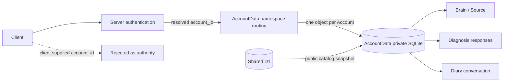
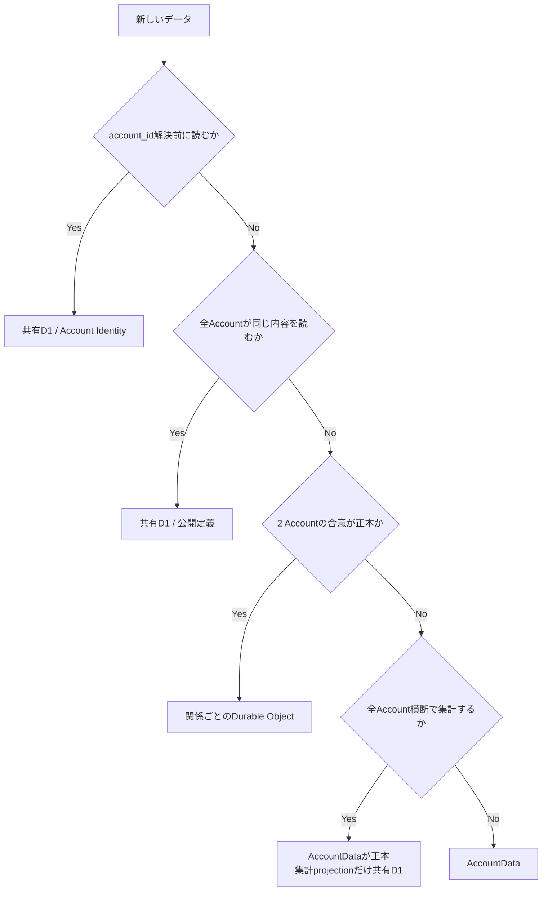
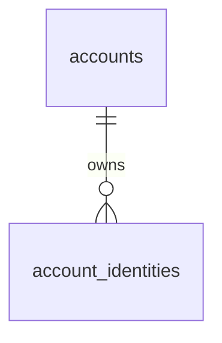
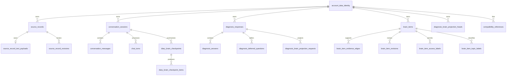

# Accountデータ分離設計

## 1. 目的

この文書は、Accountごとに独立したSQLite-backed Durable ObjectへAccount所有データを保存し、Account間の読み取りと関連付けの混在を構造的に防ぐ共通規則を定義します。

この文書が所有するもの:

- Account所有データを識別する規則
- ユーザー起点query、background処理、管理者集計のAccount境界
- Account Data Durable Objectと共有D1の責務境界
- Account Data schemaでAccount境界を強制する方法
- 保存先の判定規則と、共有D1のAccount所有tableを破棄して完了形へ切り替える規則

この文書が所有しないもの:

- Accountの本人確認とIdentity統合は[ドメイン設計](../domain/domain-design.md)を正とします
- Brain Itemの用途別開示は[Brainのラベル・アクセス制御設計](../domain/brain/brain-access-label-design.md)を正とします
- 管理者の認可方式と統計項目は[管理者向け統計ダッシュボード設計](admin-statistics-dashboard.md)を正とします

## 2. 前提

共有D1の1つのbindingをすべてのAccount所有データへ使う方式では、接続自体が現在のAccountを識別しません。SQLite / D1にはPostgreSQLのRLSに相当するrequest-scopedな行filterがないため、`WHERE account_id`の記述だけを認可の最終境界にしません。

Account所有データのSSoTは、`account_id`から決定的に選ぶ`AccountData` Durable Objectのprivate SQLiteです。1つのObjectには1 Accountのデータだけを保存し、API Server、Worker、MCP Serverへraw SQLite clientを公開しません。共有D1にはIdentity解決、全Account共通の公開定義、原文を含まない運用projectionだけを保存します。



## 3. データの区分

| 区分 | 例 | 保存先 | 参照規則 |
| --- | --- | --- | --- |
| 全Account共通 | Account Identity、Question、Diagnosis、Scoring Config | 共有D1 | 公開状態など各ドメインの条件で参照 |
| Account所有root | Source Record、Conversation Session、Diagnosis Response、Brain Item | AccountData SQLite | Objectに固定したAccountだけを保存 |
| Account所有descendant | payload、message、turn、answer、edge、revision、projection request | AccountData SQLite | 所有rootと同じObject内で参照 |
| 複数Account間の共有関係 | 相性招待、双方の同意 | 関係ごとの専用Durable Object | 片方のAccountDataへ正本を寄せない |
| 全体運用 | 管理者統計、配送先解決 | 共有D1 | 原文・Brain Item本文を保存しない |

新しいデータの保存先は、次の順で判定します。

1. 認証が`account_id`を解決するより前に読む必要があるか。必要なら共有D1のAccount Identity
2. 全Accountが同じ内容を読むか。読むなら共有D1の公開定義
3. 2つのAccountの合意そのものが正本か。そうなら関係ごとの専用Durable Object
4. 全Account横断で集計するか。するなら正本をAccountDataに残し、原文を含まない集計projectionだけを共有D1へ押し出す
5. いずれにも当てはまらないならAccountData

「本人だけが読むデータ」を共有D1へ置く理由は、この判定のどこにも現れません。Source Record、Brain Item、Diary、Diagnosis回答はいずれも5に該当します。



AccountData SQLiteでは、Object identityとAccount所有rootだけが`account_id`を持ちます。descendantの所有者はrootへの外部キーから一意に決まるため、同じ`account_id`を重複保存しません。Objectの物理分離を第一境界、Object identityとrootの`account_id`一致を誤routing検出の第二境界とします。この原則へ例外を作りません。

## 4. 不変条件

### 4.1 読み取り

1. ユーザー起点処理は、認証結果から得た`account_id`でAccountData Objectを選びます。
2. クライアントがbody、query、pathで送ったAccount IDを認可に利用しません。
3. AccountData Objectは初回利用時にObject identityをAccountへ固定し、以後異なる`account_id`を含むRPCを拒否します。
4. API Server、Worker、MCP ServerへAccountDataのraw SQLite clientまたはAccount所有tableを公開しません。
5. Account所有データは、AccountData RPCのドメイン操作を通してだけ読み取ります。
6. 所有者が一致しない場合はnot-found相当へ寄せ、別AccountにIDが存在することを開示しません。

### 4.2 書き込み

1. Account所有rootは`account_id NOT NULL`と、Objectへ固定したidentityへの外部キーを持ちます。AccountDataは共有D1のAccount行を複製せず、identityだけをFK先にします。
2. Account所有descendantは`account_id`を持たず、所有rootまたは同じaggregateの親へ通常の外部キーを張ります。
3. 2つのAccount所有rootを結ぶ関係も、同じAccountData Object内に片方のAccountしか存在しないため、両方のroot IDへの外部キーで混在を防ぎます。
4. Conversation MessageとChat Turnの循環参照は、両方を同じObject内に作成してから参照を復元します。
5. AccountData repositoryはdescendantへ所有者を重複転記せず、rootの所有者とObject identityだけを検証します。

### 4.3 全Accountを扱う処理

projection retryや期限切れSession終了は各AccountData Objectのalarmで処理します。共有D1からAccount所有行を全走査しません。

管理者統計は管理者認可後の集計専用経路に限定します。AccountDataから共有D1へ送る場合も非機密な集計projectionだけとし、原文やBrain Item本文を含めません。

## 5. 現在のAccount所有関係

共有D1はAccountとログイン手段だけを持ちます。



AccountData内のAccount所有rootは、共有D1のAccount行ではなく、Objectへ固定したidentityを親にします。



関係tableが2つのAccount所有rootを結ぶ場合も、両rootは同じAccountData Object内にしか存在しません。通常の外部キーでSource RecordとBrain Item、Diagnosis ResponseとSource Recordを結び、別ObjectのIDは参照先そのものが存在しないため関連付けられません。

## 6. Storageとmodule境界

AccountDataは1つのprivate SQLiteを使い、物理databaseをBrain、Diagnosis、Diaryごとに分割しません。Sourceを根拠としてBrain Itemを作る処理、Diagnosis回答からSourceとprojection requestを作る処理、Diary MessageからSourceを参照する処理を同じtransaction境界に置くためです。

実装は次のmoduleへ分け、単一のAccountData RPC facadeから公開します。

```text
account-data/
├── brain.ts
├── diagnosis.ts
├── diary.ts
├── repository.ts
└── schema
```

共有ライブラリのschemaとactionも、実行基盤の名前ではなく所有者で分けます。1つの`d1`名前空間へAccountData所有tableと共有D1所有tableが同居すると、module名が保存先を示さなくなり、[データの区分](#3-データの区分)の判定が読めなくなります。

```text
packages/lib/src/
├── shared-d1/        # 共有D1が所有: Account Identity、公開定義、集計projection
└── account-data/     # AccountDataが所有: Source、Brain、Diary、Diagnosis回答
```

AccountDataのactionは、Durable Object SQLite用のdatabase型を引数に取ります。D1 client型へ変換して同じactionを両方の保存先から呼べる状態を作りません。同じ関数が両方から呼べる限り、保存先を間違えてもtypecheckで検出できないためです。

AccountDataは共有D1の公開定義をsnapshotとして保持しますが、同期は版の比較で必要なときだけ行います。RPCごとに公開定義を全件読み直す実装は、定義が増えるほど1回の操作コストが増えるため完了形にしません。

Conversation Coordinatorは連投調停、generation lease、配送outboxだけを所有し、本文やBrain ItemのSSoTにしません。Geminiなど外部APIの待機中にAccountData Objectを占有せず、読み取りと永続化を短いRPCへ分けます。

複数Account間の相性共有は、関係ごとの`CompatibilityData`を正本とし、各AccountDataには一覧用参照だけを置きます。具体的な境界と整合性は[相性共有データ実装設計](compatibility-data-design.md)を正とします。

## 7. 完了形

共有D1には次の3種類だけを残し、Account所有tableをすべて削除します。

| 種類 | 共有D1に残す理由 |
| --- | --- |
| Account Identity | 認証が`account_id`を解決する処理そのものであり、AccountDataを選ぶより前に読む必要がある |
| 全Account共通の公開定義 | 全Accountが同じ内容を読むため、AccountDataへ置くとAccount数だけ複製される |
| 原文を含まない集計projection | 全Account横断の集計にAccountDataの全走査を使わないため |

次の状態が1つでも残っている間は完了形ではありません。

- 共有D1にAccount所有tableが存在する
- AccountData内にAccount Identityの状態（利用停止、role、退会）を複製した列がある。これらは共有D1が所有し、認可のたびにIdentity側で判定します
- Account所有descendantに`account_id`がある
- 公開定義のsnapshotを版の比較なしに同期している
- 1つの名前空間へ共有D1所有とAccountData所有のschema・actionが同居している
- 共有D1のAccount所有データを読む経路がアプリケーションに残っている

Brain Itemのベクトル検索を追加する場合も、`WHERE`相当のmetadata filterだけをAccount境界にしません。認証済み`account_id`から決定的に選ぶ検索名前空間を境界とし、正本はAccountDataに残します。

## 8. 完了形への切り替え規則

Phase 1では共有D1のAccount所有データを保持対象にしません。段階移行とrollback期間を設けず、破棄して作り直します。copy経路を残すほうが、二重の正本と移行専用の列を長期間抱えることになり、[データの区分](#3-データの区分)の判定を曖昧にするためです。

切り替えは次の順序で行います。

1. AccountData schemaをAccount所有tableの唯一の定義にし、共有D1側の定義とactionを削除する
2. 共有D1へAccount所有tableをdropするmigrationを適用する
3. 既存のAccountData Objectを破棄し、新しいschemaで作り直す
4. copy経路（legacy snapshotと完了時刻の記録）をアプリケーションから削除する

破棄する範囲はAccount所有データだけです。Account Identityと公開定義は共有D1に残るため、Accountとログイン手段、診断の定義は作り直しません。利用者から見るとSource Record、Brain Item、日記、診断回答が消えるため、実データを持つ環境では破棄前に影響範囲を確認します。

破棄後も次のtestを維持します。

- 別Accountの`account_id`を同じObjectへ渡すと拒否される
- 共有D1からAccount所有データの原文を取得できない
- 共有D1にAccount所有tableが存在しない

## 9. 変更時チェックリスト

- [ ] [データの区分](#3-データの区分)の判定順で保存先を決めたか
- [ ] Account所有tableを共有D1ではなくAccountData schemaへ追加したか
- [ ] AccountDataへAccount Identityの状態を複製していないか
- [ ] 公開定義のsnapshotを版の比較で必要なときだけ同期しているか
- [ ] AccountData Objectが認証済み`account_id`から選ばれているか
- [ ] Object identityと異なる`account_id`をRPCで拒否するか
- [ ] descendantへ`account_id`を重複追加していないか
- [ ] Account所有table間の参照が同じObject内の外部キーで固定されているか
- [ ] API・Worker・MCPがAccountDataのraw SQLite clientを取得できないか
- [ ] 全Account処理がAccountData RPCから分離され、原文を集約していないか
- [ ] 別Accountを使うnegative testがあるか
