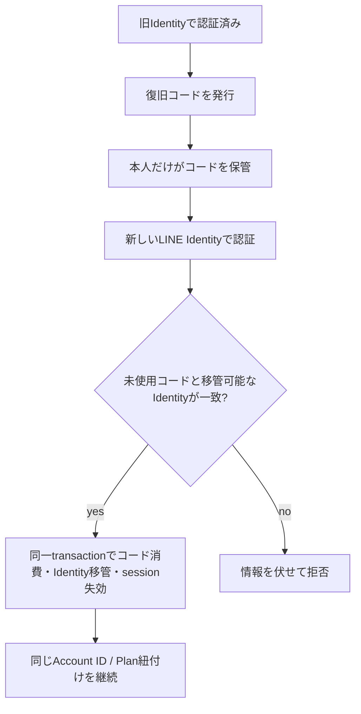

# Account復旧設計

## 1. 目的と所有範囲

この文書は、LINE Accountを利用できなくなった本人が、既存の有料契約と本人データを持つAccountへ新しいIdentityを安全に接続するための本人確認、認可、監査、失敗時の扱いを定義します。

### 所有する概念

- 復旧資格情報の発行、保管、失効
- 新しいLINE Identityを既存Accountへ接続する認可条件
- 乗っ取り、重複Account、再送を防ぐ不変条件
- 復旧不能時の解約・問い合わせ経路
- 復旧操作の監査範囲

### 所有しない概念

- Account、Identity、個人コンテンツの一般的な所有境界
- Plan、価格、契約状態の定義
- Stripe契約projectionの更新方法
- 問い合わせ担当者向けの組織的な本人確認手順

AccountとIdentityは[ドメイン設計](../domain/domain-design.md)、保存先は[Accountデータ分離設計](account-data-isolation.md)、契約との接続は[課金・Plan紐付け実装設計](billing-implementation-design.md)を正とします。

## 2. 結論

通常の復旧は、旧Identityでログインできる間に本人が発行・保管した一回限りの復旧コードと、新しいLINE Identityで確立したapplication sessionの両方で認可します。Stripeのメールアドレス、Customer ID、Subscription ID、請求明細だけではAccount所有の証明にしません。

復旧コードは十分な乱数から作り、平文は発行時に一度だけ返します。共有D1にはversion付きのsalted hash、対象Account、有効期限、使用・失効時刻だけを保存します。ログ、分析、問い合わせ記録へ平文を残しません。

## 3. 不変条件

- 1つの有効な`provider + provider account ID`は高々1つのAccountに属する
- 復旧コードは1つのAccountにだけ属し、使用または失効後は再利用できない
- コード消費、新Identityの移管、復旧先と移管元のsession version更新は同じtransactionで完了する
- 新Identityの認証時に作られた移管元Accountからは、現在認証中の`line_login` Identityだけを移す。AccountData、Plan、その他のIdentityは統合しない
- 新Identityが移管元と復旧先以外のAccountへ接続済みなら自動統合せず拒否する
- 復旧によってAccount ID、AccountData、`AccountPlanAssignment`を作り直さない
- リクエスト再送は同じ結果へ収束し、IdentityやAccountを二重作成しない
- 復旧操作からStripe CustomerやSubscriptionを別Accountへ移動しない

## 4. 復旧手順

### 4.1 事前準備

認証済み本人の現在Planが有料の場合だけ、設定画面で復旧コードを発行できます。Stripe Customerとの紐付けだけでは発行資格にしません。新しいコードを発行すると未使用の旧コードを失効させ、コードの保存が本人の責任であること、有効期限、再表示できないことを明示します。Accountの削除、停止、乗っ取り調査中は発行しません。

### 4.2 Identity再接続

利用者は新しいLINE Identityで認証し、一時的な移管元Accountのapplication sessionを確立した後、復旧コードを入力します。サーバーはコード照合、期限、試行制限、Account状態を確認し、新Identityが現在の移管元Accountだけに接続されている場合に限り、同一transactionでコードを消費してIdentityを復旧先Accountへ移します。同じtransactionで復旧先と移管元のsession versionを進め、両Accountの既存sessionを失効させます。

処理途中で失敗した場合はコード消費、Identity移管、session失効をすべてrollbackします。同じ成功リクエストの再送には成功済みであることだけを返し、Accountの存在、旧Identity、Stripe識別子は返しません。移管元AccountのAccountData、Plan、他のIdentityは復旧先へ移さず、別Accountの統合として扱いません。

### 4.3 旧Identityの扱い

復旧成功時、喪失した旧Identityは無効化します。旧Identityを維持したい通常のIdentity追加は復旧と分け、旧Identityでの再認証を必須にします。これにより復旧後に旧LINE Accountから再侵入されることを防ぎます。

## 5. 失敗と濫用への対応

コード照合の失敗応答は、Accountやコードの存在を推測できない同一内容にします。IPの非可逆hashと新Identityのfingerprintごとに15分間の失敗を数え、5回失敗した場合は30分間ロックします。成功、失敗、ロック、コード発行・失効を監査しますが、復旧コード、LINE token、IP、Stripe識別子は記録しません。

新Identityが現在認証中の移管元Accountと復旧先以外のAccountにも属する場合、どのAccountも削除・統合しません。本人には認証済みのAccountから問い合わせるよう案内し、運営者による統合も別の審査済み手順なしでは行いません。

## 6. 事前コードがない場合

自動のAccount再接続は行いません。本人データの開示やIdentity移動は保留し、問い合わせ窓口へ誘導します。有料契約の停止だけを希望する場合は、Stripeが提供する本人向けの契約管理・支払異議申立て経路を案内し、メールアドレスや請求情報を使ってアプリAccountを復旧した扱いにはしません。

運営者が例外復旧を提供する場合は、別途承認された複数要素の確認手順、二者承認、待機期間、対象Accountへの通知を必要とします。この手順が定義されるまではAccount再接続を実施しません。

## 7. 監査

監査記録は内部operation ID、対象Account、操作種別、結果、原因分類、実行時刻、新旧Identityの非可逆fingerprintを持ちます。個人コンテンツ、token、復旧コード、Stripe識別子は持ちません。監査記録はAccountDataではなく共有D1に保存し、一般のAccount APIから読み出せないようにします。
