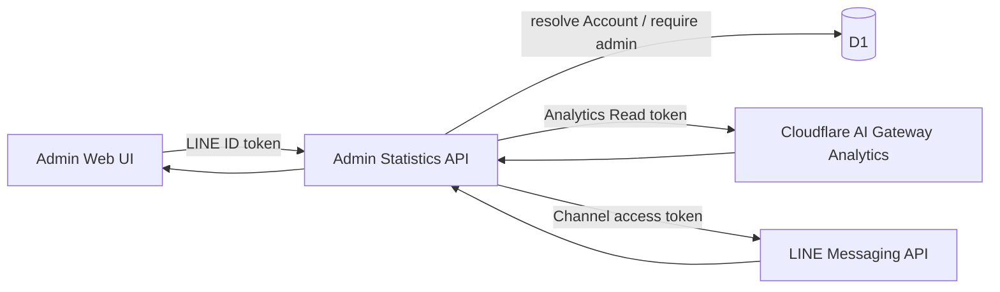

# 管理者向け統計ダッシュボード設計

## 1. 目的

運用者が、外部サービスの利用量と概算費用をme-builder内で確認できるようにします。最初の対象はGeminiとLINE Messaging APIです。

この文書は管理者の認可境界、統計項目、取得元、障害時の表示を所有します。一般利用者の診断体験、各外部サービスの呼び出し処理、データベースの物理設計は所有しません。

Accountの責務は[ドメイン設計](../domain/domain-design.md)、実行基盤は[インフラ・システム構成](infrastructure-architecture.md)を正とします。

## 2. 認可境界

`Account`は通常利用者の`user`と運用者の`admin`を区別します。既定値は`user`です。

- 管理者画面の表示可否だけで認可せず、`/api/admin/`配下のAPIが検証済みLINE IDトークンからAccountを解決して`admin`を確認する
- roleはクライアントから変更できるAPIを提供しない
- 最初の管理者はD1への明示的な運用操作で付与する
- `admin`は統計閲覧を許可するが、日記本文や診断回答など本人データの閲覧権限を含まない
- 未認証は`401`、Account未解決は`404`、管理者でないAccountは`403`とする

将来、運用権限が複数種類必要になった場合にroleの複数化を検討します。初期段階では汎用的なRBACを導入しません。

## 3. 最初に表示する統計

期間は当月1日から現在までとし、画面上に集計期間と最終取得時刻を表示します。

| 区分 | 項目 | 取得元 | 注意点 |
| --- | --- | --- | --- |
| Gemini | 概算コスト（USD） | Cloudflare AI Gateway Analytics | provider請求額ではなくGatewayによる推定値 |
| Gemini | リクエスト数 | Cloudflare AI Gateway Analytics | 対象gatewayの当月累計 |
| Gemini | 入力・出力token数 | Cloudflare AI Gateway Analytics | cache済みと未cacheを合算 |
| LINE | 課金対象送信数 | Messaging API quota consumption | reply messageは含まれない |
| LINE | 当月送信上限 | Messaging API quota | 上限なしのplanではその状態を表示 |
| LINE | 返信送信数 | Messaging API delivery/reply | 日別の成功数を当月分集計 |

「LINEメッセージ数」という単一の値にはまとめません。現在のme-builderが主に使うreply messageは課金対象送信数に含まれず、同じ名称で表示すると費用判断を誤るためです。

## 4. データフロー

外部サービスのtokenはAPI Serverだけに配布し、Web UIへ返しません。Cloudflare AI Gatewayへの生成用tokenと、Analytics参照用API tokenは用途が異なるため分けます。

## 5. 取得失敗時の扱い

- GeminiとLINEは独立して取得し、一方の失敗で他方を非表示にしない
- 未設定、外部APIエラー、レスポンス不正を区別できる状態を各sectionに返す
- 外部APIのエラー本文やsecretをクライアントへ返さない
- 統計値は運用判断用であり、請求額の確定値として表示しない
- 初期版では結果をD1へ保存せず、管理者が画面を開いた時点で取得する

履歴保存、日次snapshot、予算通知、費用上限の自動制御は後続対応とします。
