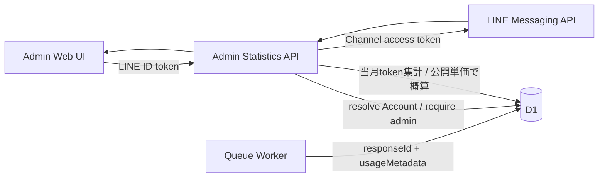

# 管理者向け統計ダッシュボード設計

## 1. 目的

運用者が、外部サービスの利用量をme-builder内で確認できるようにします。対象はVertex AI Express ModeのGeminiとLINE Messaging APIです。

この文書は管理者の認可境界、統計項目、取得元、障害時の表示を所有します。一般利用者の診断体験、各外部サービスの呼び出し処理、データベースの物理設計は所有しません。

Accountの責務は[ドメイン設計](../domain/domain-design.md)、実行基盤は[インフラ・システム構成](infrastructure-architecture.md)を正とします。

## 2. 認可境界

`Account`は通常利用者の`user`と運用者の`admin`を区別します。既定値は`user`です。

- 管理者画面の表示可否だけで認可せず、`/api/admin/`配下のAPIが検証済みLINE IDトークンからAccountを解決して`admin`を確認する
- roleはクライアントから変更できるAPIを提供しない
- `ADMIN_LINE_USER_IDS`に含まれる検証済みLINE user IDは、Accountの新規作成時に`admin`を付与し、既存Accountなら次回のLIFF認証またはLINE Webhook受信時に`admin`へ昇格する
- `admin`は統計閲覧を許可するが、日記本文や診断回答など本人データの閲覧権限を含まない
- 未認証は`401`、Account未解決は`404`、管理者でないAccountは`403`とする

将来、運用権限が複数種類必要になった場合にroleの複数化を検討します。初期段階では汎用的なRBACを導入しません。

## 3. 最初に表示する統計

期間は当月1日から現在までとし、画面上に集計期間と最終取得時刻を表示します。

| 区分 | 項目 | 取得元 | 注意点 |
| --- | --- | --- | --- |
| Gemini | 成功レスポンス数 | Vertex AI `GenerateContentResponse` | `responseId`単位の当月累計 |
| Gemini | 入力・出力token数 | Vertex AI `usageMetadata` | 入力は`promptTokenCount`、出力は`candidatesTokenCount`を合算 |
| Gemini | 生成概算料金 | Vertex AI `usageMetadata`と[Google公式料金表](https://cloud.google.com/vertex-ai/generative-ai/pricing) | 対応モデルのStandard・Global公開単価からUSDで算出 |
| Gemini | Account別利用量 | 共有D1の内部Account ID | 当月の成功レスポンス数、入力・出力token数、生成概算料金をAccountごとに表示 |
| LINE | 課金対象送信数 | Messaging API quota consumption | reply messageは含まれない |
| LINE | 当月送信上限 | Messaging API quota | 上限なしのplanではその状態を表示 |
| LINE | 返信送信数（前日まで） | Messaging API delivery/reply | 集計未完了の当日を除き、日別の成功数を当月分集計 |

「LINEメッセージ数」という単一の値にはまとめません。現在のme-builderが主に使うreply messageは課金対象送信数に含まれず、同じ名称で表示すると費用判断を誤るためです。

Geminiの各成功レスポンスについて、Googleが返した`responseId`、model、用途、生成時刻、`usageMetadata`のtoken数と、me-builder内部のAccount IDだけを共有D1へ保存します。対象用途は日記チャット、日記からのBrain Item生成・重複判定、「わたしのまとめ」生成です。prompt、生成本文、LINE user IDなど外部providerの識別子は利用量recordへ保存しません。Account別利用量は管理者だけに返します。`responseId`を一意キーにして同じGoogleレスポンスの再保存を無視し、構造化出力のschema修正などでGoogleへ再生成した場合は別レスポンスとして数えます。

Google由来の`responseId`、入力token数、合計token数が欠けたレスポンスは、0として補完したり独自IDを発行したりせず保存対象外にします。安全フィルター応答などで出力token数だけが省略された場合は、Googleが定義する合計token数から入力・思考・tool実行結果のtoken数を引いて導出します。欠落した項目名だけを運用ログへ記録し、生成済みのユーザー応答は継続します。

Googleの`usageMetadata`はtoken数であり、請求額の確定値ではありません。管理画面では次の式により、保存済み生成レスポンスの概算料金だけを表示します。

```text
通常入力token = promptTokenCount - cachedContentTokenCount + toolUsePromptTokenCount
出力token = candidatesTokenCount + thoughtsTokenCount
生成概算料金 = 通常入力token料金 + cached input token料金 + 出力token料金
```

- responseの`model`と`generatedAt`に対応する有効期間付きのStandard・Global公開単価を使用し、通貨はUSDとする。単価改定後も旧periodを残し、改定前のrecordへ新単価を適用しない
- 単価の確認日をAPIレスポンスと画面に表示する
- 現在の対応モデルはme-builderの既定生成モデルとする。単価未対応model、不正なtoken利用量、料金計算の桁あふれを区別し、いずれかを期間内に1件でも含む全体額は「算出不可」とする。対象Accountの金額も「算出不可」とするが、token統計は継続して表示する
- Embedding利用量、Express Mode無料期間、クレジット、割引、税、為替、請求調整は含めない
- 金額は「生成概算料金」と表示し、「Gemini総額」「請求額」とは表示しない

確定費用が必要になった場合は、[Cloud BillingのStandard usage cost export](https://cloud.google.com/billing/docs/how-to/export-data-bigquery)をBigQueryへ出力し、GeminiのSKUを集計する経路を別途設計します。この値は請求アカウント側の確定費用に近い全体額を確認する用途とし、me-builderの内部Account別概算へ按分しません。Cloud Billing側の行には内部Account IDがなく、無料枠やcredit適用後の全体額を各Accountへ正確に対応付けられないためです。

## 4. データフロー



外部サービスのtokenは必要なServerだけに配布し、Web UIへ返しません。LINE Channel access tokenはAPI Serverへ、Vertex AI API keyはQueue Workerへだけ配布します。Cloudflareへデプロイするための`CLOUDFLARE_DEPLOY_API_TOKEN`はCDだけで使用します。

## 5. 取得失敗時の扱い

- GeminiのD1集計とLINE外部取得は独立して実行し、一方の失敗で他方を非表示にしない
- D1エラー、外部APIエラー、レスポンス不正を区別できる状態を各sectionに返す
- 外部APIのエラー本文やsecretをクライアントへ返さない
- token統計はGoogleのレスポンス値を保存し、対応モデルだけ生成概算料金を表示する
- LINE統計はD1へ保存せず、管理者が画面を開いた時点で取得する

Embedding利用量の記録、Cloud Billing Export連携、token利用量recordのretention、日次snapshot、予算通知、費用上限の自動制御は後続対応とします。
