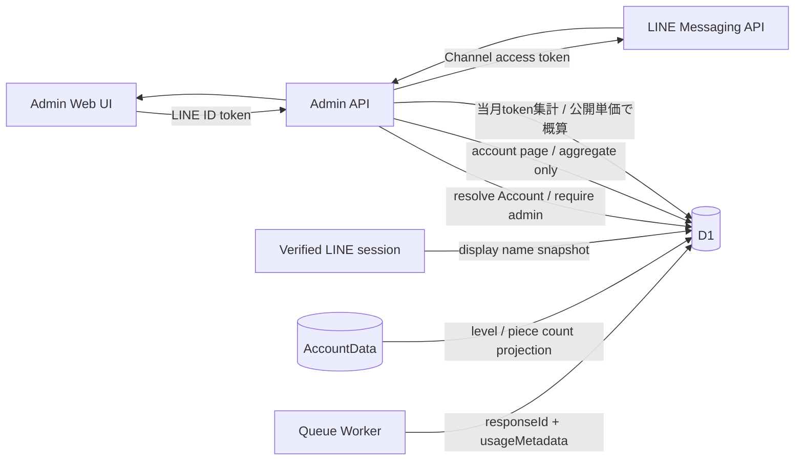

# 管理者向けダッシュボード設計

## 1. 目的

運用者が、Accountの利用状況と外部サービスの利用量をme-builder内で確認できるようにします。Account一覧では表示名、うつしレベル、かけら数などの運用に必要な集計値を扱い、外部サービス統計ではVertex AI Express ModeのGeminiとLINE Messaging APIを扱います。

この文書は管理者の認可境界、ダッシュボードの画面構成、Account一覧の表示項目、統計項目、取得元、障害時の表示を所有します。一般利用者の診断体験、レベル式、各外部サービスの呼び出し処理、データベースの物理設計は所有しません。

Accountの責務は[ドメイン設計](../domain/domain-design.md)、うつしレベルとかけら数の定義は[成長・報酬体験の提案](../product/progression-reward-experience.md)、実行基盤は[インフラ・システム構成](infrastructure-architecture.md)を正とします。

## 2. 認可境界

`Account`は通常利用者の`user`と運用者の`admin`を区別します。既定値は`user`です。

- 管理者画面の表示可否だけで認可せず、`/api/admin/`配下のAPIが検証済みLINE IDトークンからAccountを解決して`admin`を確認する
- roleはクライアントから変更できるAPIを提供しない
- `ADMIN_LINE_USER_IDS`に含まれる検証済みLINE user IDは、Accountの新規作成時に`admin`を付与し、既存Accountなら次回のLIFF認証またはLINE Webhook受信時に`admin`へ昇格する
- `admin`は統計閲覧を許可するが、日記本文や診断回答など本人データの閲覧権限を含まない
- 未認証は`401`、Account未解決は`404`、管理者でないAccountは`403`とする

将来、運用権限が複数種類必要になった場合にroleの複数化を検討します。初期段階では汎用的なRBACを導入しません。

Account一覧の取得も統計と同じ認可境界を使います。名前やレベルを表示できても、Accountの行から日記、診断回答、Brain Itemのstatement、Evidence本文へ遷移する権限は付与しません。

## 3. 画面構成

管理者画面の上部に「Account」と「利用統計」の2つのタブを置きます。最初に「Account」を表示し、タブの選択はURLへ反映して再読み込みと履歴移動で復元します。

```text
管理者ダッシュボード
├── Account
│   ├── Account数
│   ├── 名前・Account IDの検索
│   └── Account一覧
└── 利用統計
    ├── Gemini
    └── LINE
```

Account一覧と利用統計は独立して取得します。一方が失敗しても、取得できたタブは表示します。

## 4. Account一覧

### 4.1 表示項目

一覧では、次の項目を1 Accountにつき1行表示します。

| 項目 | 表示 | 取得元 |
| --- | --- | --- |
| 名前 | 最後に本人確認できたLINE表示名。未取得なら「名前未取得」 | 検証済みLINEプロフィールの運用snapshot |
| Account ID | me-builder内部ID | 共有D1のAccount |
| role / status | `user` / `admin`、利用状態 | 共有D1のAccount |
| うつしレベル | 現在のレベルと計算版 | AccountDataから共有D1へ出した集計projection |
| 集めたかけら | これまで集めたBrain Item数 | 同上 |
| 有効なかけら | 現在`active`なBrain Item数 | 同上 |
| 登録日 | Account作成日時 | 共有D1のAccount |
| 最終成長日時 | 最後に成長イベントを反映した日時。未反映なら「まだ成長記録がありません」 | 集計projection |

名前はLINE user IDではなく、本人確認時にLINEから得た表示名のsnapshotです。LIFF認証またはLINEプロフィールを正当に取得できた処理で更新し、クライアントが任意に送った名前を保存しません。LINE user ID、ID token、アクセストークンは一覧へ返しません。

うつしレベル、集めたかけら、有効なかけらは、[成長・報酬体験の提案 §4](../product/progression-reward-experience.md#4-うつしレベル)と同じ結果を表示します。管理者画面独自の計算式や補正を持ちません。

### 4.2 一覧操作

- 初期表示は登録日の新しい順とする
- 名前の部分一致、または完全なAccount IDで検索できる
- roleとstatusで絞り込める
- 登録日、うつしレベル、集めたかけら、最終成長日時で並べ替えられる
- 1ページ50件を上限にcursorで次ページを取得する
- 横幅がある画面は表、狭い画面は同じ項目をAccountごとのカードで表示する
- 初期段階では詳細画面を設けず、一覧行を日記、診断回答、Brain Item本文へのリンクにしない

検索結果が0件の場合は条件を残したまま空状態を表示します。再取得中は表示済みの一覧を維持し、一覧全体をSkeletonへ戻しません。

### 4.3 Account横断projection

うつしレベルとBrain ItemはAccountDataの個人コンテンツであり、一覧APIが50個のAccountDataへ都度問い合わせる方式にはしません。AccountDataで成長値またはかけら数が変わったとき、次の非機密な集計値だけを共有D1へprojectionします。

- Account ID
- うつしレベルと計算版
- 累積成長値
- 集めたかけら数
- 有効なかけら数
- 最終成長日時
- projection更新日時

Brain Itemのstatement、分類ごとの内容、Evidence、Source Record、診断回答、日記本文はprojectionへ含めません。一覧にprojectionがまだないAccountは削除せず、「レベル集計中」と表示します。projection更新日時を画面へ表示できるようにし、値が古い可能性を運用者が区別できるようにします。

Account一覧の閲覧は、管理者Account、検索・絞り込み条件、取得件数、取得時刻を監査ログへ記録します。検索語が表示名またはAccount IDを含むため、通常のアプリケーションログへ検索語そのものを出しません。

## 5. 最初に表示する統計

期間は当月1日から現在までとし、画面上に集計期間と最終取得時刻を表示します。

| 区分 | 項目 | 取得元 | 注意点 |
| --- | --- | --- | --- |
| Gemini | 成功レスポンス数 | Vertex AI `GenerateContentResponse` | `responseId`単位の当月累計 |
| Gemini | 入力・出力token数 | Vertex AI `usageMetadata` | 入力は`promptTokenCount`、出力は`candidatesTokenCount`を合算 |
| Gemini | 生成概算料金 | Vertex AI `usageMetadata`と[Google公式料金表](https://cloud.google.com/vertex-ai/generative-ai/pricing) | 対応モデルのStandard・Global公開単価からUSDで算出 |
| Gemini | Account別利用量 | 共有D1の内部Account ID | 当月の成功レスポンス数、入力・出力token数、生成概算料金をAccountごとに表示 |
| LINE | 課金対象送信数 | Messaging API quota consumption | reply messageは含まれない |
| LINE | 当月送信上限 | Messaging API quota | 上限なしのplanではその状態を表示 |
| LINE | 返信送信数（前日まで） | Messaging API delivery/reply | 集計未完了の当日を除き、日別の成功数を当月分集計 |

「LINEメッセージ数」という単一の値にはまとめません。現在のme-builderが主に使うreply messageは課金対象送信数に含まれず、同じ名称で表示すると費用判断を誤るためです。

Geminiの各成功レスポンスについて、Googleが返した`responseId`、model、用途、生成時刻、`usageMetadata`のtoken数と、me-builder内部のAccount IDだけを共有D1へ保存します。対象用途は日記チャット、日記からのBrain Item生成・重複判定、「わたしのまとめ」生成です。prompt、生成本文、LINE user IDなど外部providerの識別子は利用量recordへ保存しません。Account別利用量は管理者だけに返します。`responseId`を一意キーにして同じGoogleレスポンスの再保存を無視し、構造化出力のschema修正などでGoogleへ再生成した場合は別レスポンスとして数えます。

Google由来の`responseId`、入力token数、合計token数が欠けたレスポンスは、0として補完したり独自IDを発行したりせず保存対象外にします。安全フィルター応答などで出力token数だけが省略された場合は、Googleが定義する合計token数から入力・思考・tool実行結果のtoken数を引いて導出します。欠落した項目名だけを運用ログへ記録し、生成済みのユーザー応答は継続します。

Googleの`usageMetadata`はtoken数であり、請求額の確定値ではありません。管理画面では次の式により、保存済み生成レスポンスの概算料金だけを表示します。

```text
通常入力token = promptTokenCount - cachedContentTokenCount + toolUsePromptTokenCount
出力token = candidatesTokenCount + thoughtsTokenCount
生成概算料金 = 通常入力token料金 + cached input token料金 + 出力token料金
```

- responseの`model`と`generatedAt`に対応する有効期間付きのStandard・Global公開単価を使用し、通貨はUSDとする。単価改定後も旧periodを残し、改定前のrecordへ新単価を適用しない
- 単価の確認日をAPIレスポンスと画面に表示する
- 現在の対応モデルはme-builderの既定生成モデルとする。単価未対応model、不正なtoken利用量、料金計算の桁あふれを区別し、いずれかを期間内に1件でも含む全体額は「算出不可」とする。対象Accountの金額も「算出不可」とするが、token統計は継続して表示する
- Embedding利用量、Express Mode無料期間、クレジット、割引、税、為替、請求調整は含めない
- 金額は「生成概算料金」と表示し、「Gemini総額」「請求額」とは表示しない

確定費用が必要になった場合は、[Cloud BillingのStandard usage cost export](https://cloud.google.com/billing/docs/how-to/export-data-bigquery)をBigQueryへ出力し、GeminiのSKUを集計する経路を別途設計します。この値は請求アカウント側の確定費用に近い全体額を確認する用途とし、me-builderの内部Account別概算へ按分しません。Cloud Billing側の行には内部Account IDがなく、無料枠やcredit適用後の全体額を各Accountへ正確に対応付けられないためです。

## 6. データフロー



外部サービスのtokenは必要なServerだけに配布し、Web UIへ返しません。LINE Channel access tokenはAPI Serverへ、Vertex AI API keyはQueue Workerへだけ配布します。Cloudflareへデプロイするための`CLOUDFLARE_DEPLOY_API_TOKEN`はCDだけで使用します。

## 7. 取得失敗時の扱い

- Account一覧と利用統計は独立して取得し、一方の失敗で管理者画面全体を非表示にしない
- Accountの成長projectionが未作成なら行を残して「レベル集計中」と表示する
- 表示名を取得できない場合もAccount IDで行を表示し、外部APIへ一覧表示のたびに名前を取りに行かない
- AccountDataへ直接問い合わせてprojection欠落をその場で補完せず、非同期projectionの再処理対象とする
- GeminiのD1集計とLINE外部取得は独立して実行し、一方の失敗で他方を非表示にしない
- D1エラー、外部APIエラー、レスポンス不正を区別できる状態を各sectionに返す
- 外部APIのエラー本文やsecretをクライアントへ返さない
- token統計はGoogleのレスポンス値を保存し、対応モデルだけ生成概算料金を表示する
- LINE統計はD1へ保存せず、管理者が画面を開いた時点で取得する

Embedding利用量の記録、Cloud Billing Export連携、token利用量recordのretention、日次snapshot、予算通知、費用上限の自動制御は後続対応とします。
