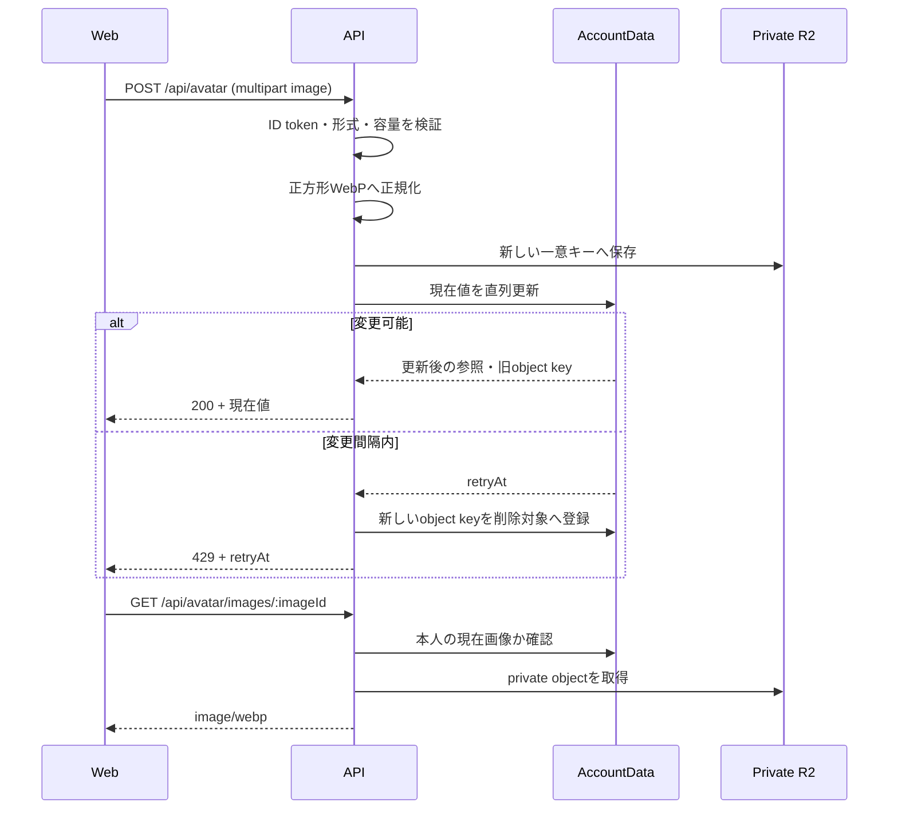

# アバター実装設計

## 1. 目的

この文書は、[アバター設定体験設計](../product/avatar-experience.md)を実装するHTTP API、AccountData、private R2、画像配信、変更間隔制限を所有します。

## 2. 結論

- アップロードAPIの同期処理で画像を検査・正規化し、その画像を現在のアバターへ設定する
- 保存済みアバターがない場合はWebがLIFFのプロフィール画像URLを表示する。LINE画像はR2へ複製しない
- AI、Cloudflare Queues、ジョブ、候補、WebSocket、pollingは使わない
- 画像本文はprivate R2、現在画像の参照と変更日時はAccountDataのDurable Object storageへ保存する
- AccountData内で変更間隔の判定と現在値の更新を直列化する
- 画像は本人確認済みAPIだけから配信する
- 適用済みの旧`0005` SQLite migrationは実行時に参照しない。リポジトリのmigration列から外し、本番には適用しない

試験環境の既存Durable Objectに旧テーブルが残っていても、アプリケーションから読み書きしません。共有試験環境全体の初期化は行いません。

## 3. 処理フロー



R2保存後に応答が不明になった場合、安全性を優先してそのobjectを即時削除しません。後続の差し替えまたは保守処理で参照されないobjectを削除対象へ収束させます。

## 4. HTTP API

すべてのAPIはLIFF ID tokenをBearer tokenとして検証し、Account IDをリクエストから受け取りません。

| Method | Path | 責務 | 正常応答 |
| --- | --- | --- | --- |
| `GET` | `/api/avatar` | 現在のアバターを取得 | `200` |
| `POST` | `/api/avatar` | 画像を検査・正規化して現在値へ設定 | `200`、`429` |
| `DELETE` | `/api/avatar` | 現在値を削除 | `204`、`429` |
| `GET` | `/api/avatar/images/:imageId` | 本人の現在画像をprivate R2から配信 | `200` |

応答は現在値だけを返します。

```ts
type AvatarState = {
  currentAvatar: { id: string; imageUrl: string } | null;
};
```

アップロードは`multipart/form-data`の`image`を必須とし、JPEG、PNG、WebP、最大10MBを受け付けます。成功は`200 OK`です。`PUT /api/avatar`、`POST /api/avatar/uploads`、ジョブ取得、候補取得は公開しません。

本番の差し替えと、現在値がある場合の削除は、最後の変更から7日未満なら`429 Too Many Requests`を返します。本文へ`retryAt`、headerへ`Retry-After`を含めます。初回設定と現在値がない削除は制限しません。previewとlocalの変更間隔は0です。

## 5. AccountData

SQLite tableは追加せず、Durable Object storageのprivate keyへ次を保存します。

```ts
type StoredAvatarState = {
  current: {
    id: string;
    objectKey: string;
    contentType: "image/webp";
    updatedAt: string;
  } | null;
  pendingObjectDeletions: Array<{
    objectKey: string;
    attemptCount: number;
    nextAttemptAt: string;
  }>;
};
```

AccountData RPCは取得、差し替え、削除、画像参照確認、削除対象の追加を提供します。差し替えと削除は同じAccountData Object内で直列化し、変更間隔を同時操作ですり抜けられないようにします。

差し替え・削除されたobject keyは現在値の更新と同時に削除対象へ追加します。AccountData alarmがR2削除を再試行し、成功時だけ対象から除きます。画像本文、Account ID、object keyはログへ出しません。

## 6. R2

object keyはサーバーだけが生成します。

```text
accounts/{accountId}/avatar/images/{imageId}.webp
```

Bucketは公開しません。画像APIはAccountDataで`imageId`が現在値と一致することを確認してからR2を読み、`Cache-Control: private, no-store`を返します。

## 7. 移行

AI生成用の旧`0005`は試験環境へ適用済みですが、本番未適用です。直接保存方式はそのtableへ依存しないため、migration bundleとschema exportから旧migrationを削除します。

- 既存の試験用Durable Objectには旧tableが物理的に残る
- 新規の試験用Durable Objectと本番には旧tableを作成しない
- 旧tableの内容は現在値へ移行せず、試験環境のアバターは未設定へ戻る
- 他機能の共有試験データを守るため、Durable Object namespaceは初期化しない

将来AccountDataへ新しいSQLite migrationを追加するときは、旧migrationと同じjournal時刻・hashを再利用せず、試験環境に記録済みの時刻より新しいmigrationとして作成します。
