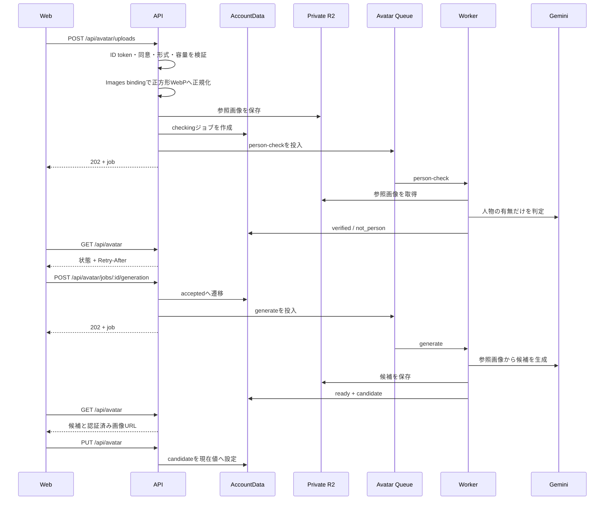

# アバター実装設計

## 1. 目的と所有範囲

この文書は、[アバター設定体験設計](../product/avatar-experience.md)を実装するHTTP API、AccountDataの状態、private R2のオブジェクト、Cloudflare Queuesのmessage、AI接続、再試行、Webの状態取得方法を所有します。

画像を選んでから設定するまでの利用体験、保持期間、プライバシー要件はアバター設定体験設計を正とします。Accountの本人確認、AccountDataの分離、Cloudflare全体の役割は、それぞれ[プロジェクト概要](../product/project-overview.md)、[Accountデータ分離設計](account-data-isolation.md)、[インフラ・システム構成](infrastructure-architecture.md)を正とします。

## 2. 結論

- 人物判定と画像生成はHTTPリクエスト内で完了を待たず、Queue Workerで実行する
- 受付APIは`202 Accepted`とジョブ状態を返す
- WebSocketやServer-Sent Eventsは使わず、画面表示中だけ認証済みGETをpollingする
- 実行中の応答には`Retry-After`を付け、Webはその秒数より短い間隔で再取得しない
- 画面を閉じたらpollingを止め、再訪時にAccountDataから最新状態を復元する
- 画像本文はprivate R2だけに置き、AccountDataにはR2 object keyと状態だけを置く
- 画像は署名付きの恒久URLにせず、本人確認を行うAPIから配信する

同期応答は外部AIの待ち時間、Workersの実行期限、ブラウザ切断、再送による二重課金に弱くなります。WebSocketは双方向性を必要としない低頻度の状態確認に対して、接続維持と再接続の状態を増やします。永続ジョブと通常のHTTP pollingを組み合わせることで、画面の生存期間と生成処理を分離します。

## 3. 処理の流れ



## 4. HTTP API

すべてのAPIはLIFF ID tokenをBearer tokenとして検証し、検証結果からAccountDataを選びます。Account ID、R2 object key、外部サービスの応答本文はクライアントへ返しません。

| Method | Path | 責務 | 正常応答 |
| --- | --- | --- | --- |
| `GET` | `/api/avatar` | 現在値と最新ジョブを取得 | `200` |
| `POST` | `/api/avatar/uploads` | 同意済み画像を検査・正規化し、人物判定を受け付ける | `202` |
| `POST` | `/api/avatar/jobs/:jobId/generation` | 人物確認済みジョブの候補生成を受け付ける | `202` |
| `DELETE` | `/api/avatar/jobs/:jobId` | 未確定ジョブを中止する | `204` |
| `PUT` | `/api/avatar` | 候補1件を現在のアバターへ設定する | `200` |
| `DELETE` | `/api/avatar` | 現在のアバターを削除する | `204` |
| `GET` | `/api/avatar/images/:imageId` | 本人が参照可能な画像をprivate R2から配信する | `200` |

アップロードは`multipart/form-data`の`image`と`consent=true`を受け付けます。最大容量は10 MiB、入力形式はJPEG、PNG、WebPです。`Content-Type`だけでなくmagic bytesとImages bindingのdecode結果を確認し、1024 x 1024以内の正方形WebPへ再encodeしてメタデータを除去します。

実行中の`GET /api/avatar`は`Retry-After: 3`を返します。Webはタブが表示中の間だけ再取得し、`ready`、`not_person`、`failed`、`cancelled`、`selected`では停止します。`Retry-After`がなければ自動再取得しません。

## 5. AccountDataモデル

AccountDataのprivate SQLiteへ次を保存します。各テーブルへ`account_id`を重複保持せず、Durable Objectの名前と固定済みidentityを所有境界にします。

```text
avatar_profile (singleton)
└── current_candidate_id -> avatar_candidates.id

avatar_jobs
├── status
├── reference_object_key
├── pending_operation
├── queue_pending / next_enqueue_at
├── processing_lease_expires_at
└── created_at / updated_at / expires_at

avatar_candidates
├── job_id -> avatar_jobs.id
├── object_key / content_type
└── created_at / expires_at / selected_at

avatar_generation_events
└── job_id / started_at

avatar_object_deletions
├── object_key / delete_after
└── attempt_count / last_error_code
```

ジョブ状態は`checking`、`not_person`、`verified`、`accepted`、`generating`、`ready`、`failed`、`cancelled`、`selected`です。人物判定と生成のQueue投入前には`queue_pending`を同じ状態更新で立て、投入成功後に解消します。AccountDataのalarmは未投入状態を再配送します。

Workerは処理開始時に短いleaseを取得します。同じジョブIDが再配送された場合、terminal状態または有効なleaseなら処理せずackします。外部処理が一時失敗した場合はleaseを解放してQueue retryへ委ね、規定回数を超えた場合だけ`failed`へ遷移します。

新しい候補生成は1 Accountにつき24時間で3ジョブまでとし、同じジョブのQueue再配送と失敗後の再試行は追加計上しません。超過時は`429 Too Many Requests`と`Retry-After`、再開可能時刻を返します。環境全体の費用上限はAI Gatewayと生成事業者側にも設定し、アプリのAccount上限だけを予算管理にしません。

## 6. QueueとR2

Queue messageは画像本文を含めず、次の参照だけを持ちます。

```ts
type AvatarQueueMessage = {
  type: "avatar";
  operation: "person-check" | "generate";
  accountId: string;
  jobId: string;
};
```

R2 object keyはサーバーだけが構築し、ログへ出力しません。

```text
accounts/{accountId}/avatar/jobs/{jobId}/reference.webp
accounts/{accountId}/avatar/jobs/{jobId}/candidates/{candidateId}.webp
```

Bucketは公開しません。候補配信APIはAccountDataで`imageId`の参照権を確認してからR2を読み、`Cache-Control: private, no-store`を返します。

参照画像、期限切れ候補、差し替え・削除された現在値は、AccountDataの削除outboxへ先に記録します。alarmが期限到達後にR2から削除し、失敗時は上限付きbackoffで再試行します。候補を現在値へ設定したときは、その候補の期限削除予定を同じAccountData更新で解除します。

## 7. AI境界

人物判定はGeminiのmultimodal structured outputを使い、`hasPerson: boolean`だけを採用します。説明文や属性は保存しません。候補生成は画像生成対応モデルへ正規化済み参照画像と固定プロンプトを渡し、1:1画像を最大4件生成します。

AI Gatewayではpayload保存とcacheを無効にします。画像生成モデルは`GEMINI_IMAGE_MODEL`で環境ごとに設定し、未設定時はコードが定義する安定版を使用します。モデル変更は状態やAPI契約を変更せず、生成メタデータへ使用モデルだけを記録します。

候補はdecodeと再encodeを通過したものだけR2へ保存します。1件以上成功すれば`ready`、0件なら`failed`です。候補完成だけで現在のアバターを変更しません。
