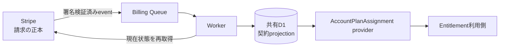
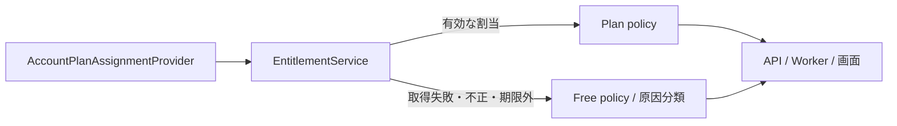
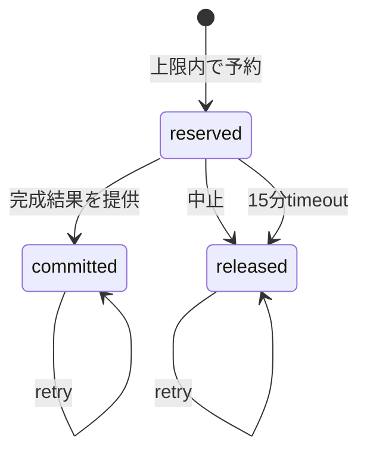
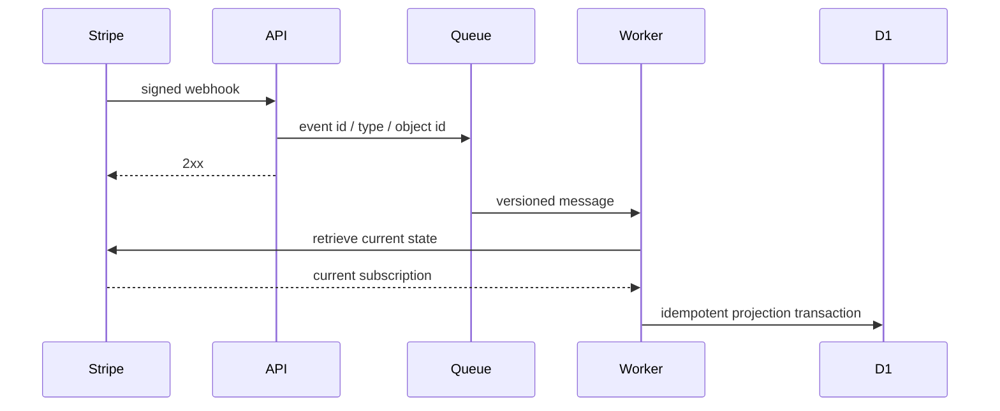

# 課金・Plan紐付け実装設計

## 1. 目的と所有範囲

この文書は、Stripeの契約状態を認証済みAccountへ安全に紐付け、決済事業者に依存しない`AccountPlanAssignment`として読み取る境界を定義します。

### 所有する概念

- Stripe、Webhook、Billing Queue、共有D1の正本境界
- Customer、Subscription、Accountの対応と状態収束
- `AccountPlanAssignment`の読み取り契約
- 障害、重複、順序逆転からの収束原則

### 所有しない概念

- Planの価格、機能、上限、トライアル条件
- CheckoutやPortalの画面仕様
- Account復旧の本人確認手順

価格と権限は[サブスクリプション・料金プラン設計](../product/subscription-plan-design.md)、実装順は[サブスクリプション実装残タスク](../development/subscription-remaining-tasks.md)、本人確認は[Account復旧設計](account-recovery-design.md)を正とします。

## 2. 正本と保存境界

StripeはCustomer、Subscription、請求の正本です。共有D1はStripe識別子と現在契約のprojection、Accountとの対応、処理済みeventを持ちます。初回trialの開始事実はCustomerではなくAccountへ一度だけ記録し、Customerの再作成やPlan付与元の変更では再利用可能に戻しません。ファミリーパックのtrial中に席を有効化した参加者にも、そのSubscriptionを利用したAccountとして同じ開始事実を記録します。退出や別のファミリーパックへの移動後も、この履歴は削除しません。カード番号、支払方法の詳細、Webhook本文、個人コンテンツは保存しません。

1つのStripe Customerは1つの支払者Accountだけに対応し、1つのAccountは同一決済環境で高々1つのCustomerを持ちます。Subscriptionは支払者Accountへ紐付き、ファミリー参加者への付与はStripeではなくアプリ側の席割当として表します。

## 3. `AccountPlanAssignment`契約

利用側が参照できるのはAccount ID、`free | lite | full | family`のPlan、付与元、適用開始、利用可能期限、支払者Account IDだけです。StripeのCustomer ID、Subscription ID、Price ID、status、event typeを公開しません。

契約が存在しない、期限切れ、projectionを取得できない場合はFreeへ安全側に倒します。ただし取得障害は運用ログで契約不在と区別します。B系列は`AccountPlanAssignmentProvider`のfakeを使い、Stripeなしでcontract testを実行できます。

### 3.1 共通Entitlement解決

機能側は`AccountPlanAssignmentProvider`を`EntitlementService`へ渡し、返された共通policyだけで利用可否と上限を判断します。policyの値は[サブスクリプション・料金プラン設計](../product/subscription-plan-design.md)を正とし、この文書では再定義しません。

Account不一致、不明なPlan・付与元、不正な日時、適用開始前、期限切れ、provider障害は、有料権限を推測せずFreeへ倒します。ファミリー席はFamily plan、本人とは異なる支払者Account、`family-seat`付与元が揃った場合だけファミリー由来として解決します。原因分類は運用上の区別に使い、決済事業者固有の状態を機能側へ公開しません。

### 3.2 AI利用量ledger

AI返信とプロフィール要約は、生成開始前に共通Entitlementから得た期間・上限でAccountDataへ利用枠を予約します。利用者へ正常に返した処理だけを確定し、開始前の中止は解放します。request IDを冪等keyにするため、QueueやRPCのretryで二重消費しません。

予約中と確定済みを合わせて上限判定し、AccountDataの直列RPCとSQLiteの条件付きinsertをatomic境界にします。期間が変わっても過去行を削除せず、同じ期間内の上限変更は既存利用量を引き継ぎます。共有D1へrequest単位の利用履歴や個人内容を複製しません。

### 3.3 機能境界への接続

AI返信はChat Turn ID、プロフィール要約はGeneration IDをrequest IDとして、Workerが生成前に利用枠を予約します。プロフィール要約のAPIは受付前にも残量を確認しますが、競合を含む最終判定はWorkerのatomicな予約です。上限到達時も入力済みの日記と生成済みのまとめ版は残し、閲覧、本人データの訂正・削除・エクスポート、共有停止を制限しません。切迫した危機表現の固定安全案内はAIを呼ばず、利用枠の予約対象にも含めません。

AI返信の月次枠は、FreeではUTC暦月、契約Planでは`AccountPlanAssignment.effectiveAt`を起点とする月ごとの期間です。Freeのまとめ枠はUnix epochから区切る固定90日窓とし、APIとWorkerは共通のperiod resolverから同じkeyと境界を得ます。意味検索は共通Entitlementの期間をAccountDataの最終再認可へ渡し、Freeは30日、Liteは365日、Fullとファミリーは期間制限なしで候補を絞ります。

本人向けの`GET /api/profile/entitlement`はPlan、付与元、適用開始、利用可能期限と、AI返信・まとめ生成の上限、確定量、予約量、残量、次回更新日時だけを返します。支払者Account IDや決済事業者の識別子は返しません。provider障害時は`safe-default`としてFree権限を表示し、有料権限を推測しません。

### 3.4 ファミリー席の保存境界

共有D1の`family_packs`と`family_seats`には、支払者Account、4つの固定slot、招待ID、参加Account、席状態と状態変更日時だけを保存します。日記、診断、プロフィール、質問履歴などの個人コンテンツは保存しません。支払者自身がslot 1を使い、参加者はslot 2〜4を使うため、1契約で利用できるのは支払者を含む最大4 Accountです。

live状態は`invited | active`とし、pack内のslotと参加中Accountをpartial unique indexで一意にします。招待予約と承諾はこのDB制約を最終競合判定に使い、同時操作でも5席目や複数packへの参加を許可しません。取消、退出、席からの削除、契約終了は履歴行を消さず、それぞれ`cancelled | left | removed | ended`へ遷移させます。

このmembershipはPlan付与だけを表します。同じpackへの参加を、相性共有、Relationship Category、個人コンテンツ閲覧の同意として扱いません。それらは既存の本人同意境界で個別に判定します。

招待APIが利用者へ一度だけ返すtokenは256 bitの乱数とし、共有D1にはSHA-256 hashだけを保存します。招待は48時間で失効し、承諾、辞退、支払者による取消のいずれかで消費済みにします。承諾はtoken、招待中の席、承諾Accountを同じtransactionで更新し、使用済みtokenを同一・別Accountのどちらから再送しても拒否します。

支払者APIは固定slotのID、番号、状態、作成・更新日時だけを返し、参加者のAccount IDや個人内容を返しません。支払者だけが招待取消と参加者削除を行え、参加者だけが本人の招待承諾・辞退と退出を行えます。認証済みでもこの関係にない第三者は、tokenがなければ席の存在を特定できず、管理操作も行えません。

Webの`/profile/family`は、支払者には4つの固定席と招待リンク、参加者には付与元と退出操作を表示します。招待リンクで開いた画面は承諾前に、共有されるのがPlanだけであることを説明します。退出・辞退後はFreeへ戻ったことと本人データが残ることを表示し、全ロールへ相性共有が別同意であることを常に明示します。

`FamilySeatAccountPlanAssignmentProvider`は共有D1の現在の`active`参加席だけを`family-seat`由来のFamily割当へ変換します。Family policyはFullと同じ機能・利用上限を持ちます。退出、席削除、契約終了後は次の読み取りからFreeを返し、D1取得失敗や未来の開始日時は共通EntitlementがFreeへ安全に縮退させます。

本人データの一覧・訂正・削除・エクスポートは従来どおり認証AccountのAccountDataだけを呼び、family membershipから別Accountのnamespaceを解決しません。Customer Portalは支払者本人の請求情報だけを扱うA系列の境界とし、family APIや参加者画面へPortal URL、Customer ID、Subscription IDを公開しません。運用ログは動的なseat IDをroute patternへ置換し、招待tokenや参加者Account IDを記録しません。

## 4. 状態の変換

有効な`trialing`または`active`契約はPrice catalogでPlanへ変換します。期間末解約予約中も期限までは現在Planを維持します。`past_due`は最初の失敗eventから7日間か契約期間末の早い方まで支払失敗前のPlanを維持し、失敗したupgrade先の権限は付与しません。回復時に失敗開始日時と退避したPlanを消し、支払成功後のPlanへ収束します。猶予を過ぎた`past_due`と`unpaid`、`paused`、`canceled`、未知status、未知Priceは有料権限を付与しません。契約終了、返金、chargebackで既存データを削除せずFreeへ戻します。

## 5. Webhookと収束

APIはraw bodyで署名を検証し、許可したeventの最小メタデータをQueueへ渡して応答します。Workerはevent payloadを正本として上書きせず、対象CustomerまたはSubscriptionの現在状態をStripeから取得します。

- event IDで再配送を冪等化する
- Stripe objectの更新時刻とevent作成時刻を保存し、古い処理で新しいprojectionを巻き戻さない
- Queueのretry後も失敗したmessageはDLQへ送り、管理者の再照合で復旧する
- 再照合はdry-runを既定にし、明示された修復だけを共有D1へ反映する
- projection更新から課金作成、返金、解約は行わない

## 6. ログと秘密情報

ログへCustomer ID、Subscription ID、メールアドレス、支払情報、署名、秘密値、Webhook本文を出しません。処理追跡には内部で生成したcorrelation ID、event種別、安全な原因分類、最終結果だけを使います。
