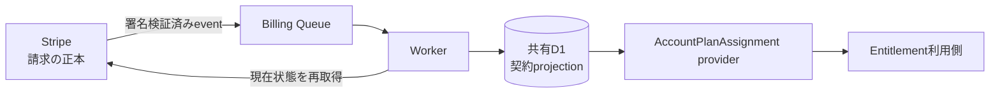
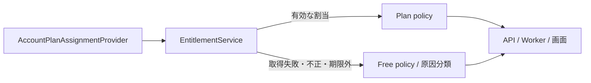
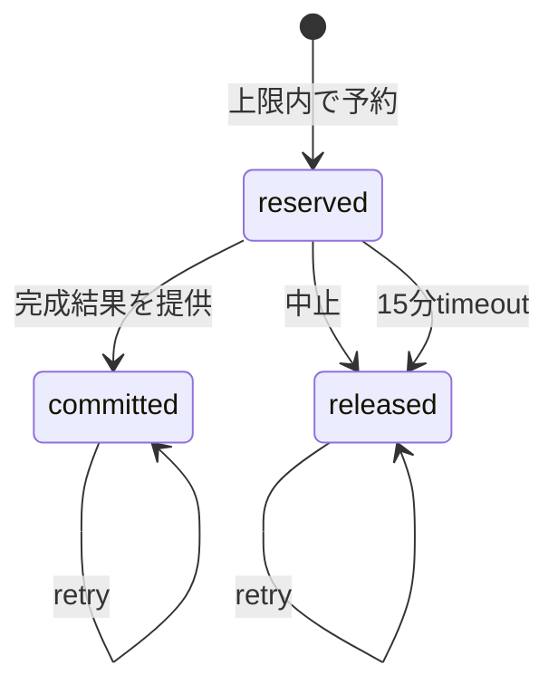
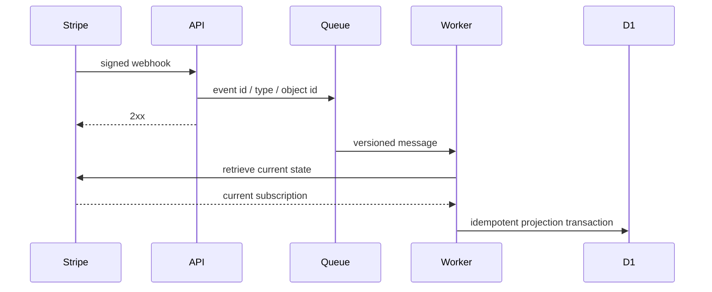

# 課金・Plan紐付け実装設計

## 1. 目的と所有範囲

この文書は、Stripeの契約状態を認証済みAccountへ安全に紐付け、決済事業者に依存しない`AccountPlanAssignment`として読み取る境界を定義します。

### 所有する概念

- Stripe、Webhook、Billing Queue、共有D1の正本境界
- Customer、Subscription、Accountの対応と状態収束
- `AccountPlanAssignment`の読み取り契約
- 障害、重複、順序逆転からの収束原則

### 所有しない概念

- Planの価格、機能、上限、トライアル条件
- CheckoutやPortalの画面仕様
- Account復旧の本人確認手順

価格と権限は[サブスクリプション・料金プラン設計](../product/subscription-plan-design.md)、実装順は[サブスクリプション実装残タスク](../development/subscription-remaining-tasks.md)、本人確認は[Account復旧設計](account-recovery-design.md)を正とします。

## 2. 正本と保存境界

StripeはCustomer、Subscription、請求の正本です。共有D1はStripe識別子と現在契約のprojection、Accountとの対応、処理済みeventを持ちます。カード番号、支払方法の詳細、Webhook本文、個人コンテンツは保存しません。

1つのStripe Customerは1つの支払者Accountだけに対応し、1つのAccountは同一決済環境で高々1つのCustomerを持ちます。Subscriptionは支払者Accountへ紐付き、ファミリー参加者への付与はStripeではなくアプリ側の席割当として表します。

## 3. `AccountPlanAssignment`契約

利用側が参照できるのはAccount ID、`free | lite | full | family`のPlan、付与元、適用開始、利用可能期限、支払者Account IDだけです。StripeのCustomer ID、Subscription ID、Price ID、status、event typeを公開しません。

契約が存在しない、期限切れ、projectionを取得できない場合はFreeへ安全側に倒します。ただし取得障害は運用ログで契約不在と区別します。B系列は`AccountPlanAssignmentProvider`のfakeを使い、Stripeなしでcontract testを実行できます。

### 3.1 共通Entitlement解決

機能側は`AccountPlanAssignmentProvider`を`EntitlementService`へ渡し、返された共通policyだけで利用可否と上限を判断します。policyの値は[サブスクリプション・料金プラン設計](../product/subscription-plan-design.md)を正とし、この文書では再定義しません。

Account不一致、不明なPlan・付与元、不正な日時、適用開始前、期限切れ、provider障害は、有料権限を推測せずFreeへ倒します。ファミリー席はFamily plan、本人とは異なる支払者Account、`family-seat`付与元が揃った場合だけファミリー由来として解決します。原因分類は運用上の区別に使い、決済事業者固有の状態を機能側へ公開しません。

### 3.2 AI利用量ledger

AI返信とプロフィール要約は、生成開始前に共通Entitlementから得た期間・上限でAccountDataへ利用枠を予約します。利用者へ正常に返した処理だけを確定し、開始前の中止は解放します。request IDを冪等keyにするため、QueueやRPCのretryで二重消費しません。

予約中と確定済みを合わせて上限判定し、AccountDataの直列RPCとSQLiteの条件付きinsertをatomic境界にします。期間が変わっても過去行を削除せず、同じ期間内の上限変更は既存利用量を引き継ぎます。共有D1へrequest単位の利用履歴や個人内容を複製しません。

## 4. 状態の変換

有効な`trialing`または`active`契約はPrice catalogでPlanへ変換します。期間末解約予約中も期限までは現在Planを維持します。`past_due`などの猶予期間は商取引条件確定後の状態遷移で扱い、未知statusや未知Priceは有料権限を付与しません。契約終了後は既存データを削除せずFreeへ戻します。

## 5. Webhookと収束

APIはraw bodyで署名を検証し、許可したeventの最小メタデータをQueueへ渡して応答します。Workerはevent payloadを正本として上書きせず、対象CustomerまたはSubscriptionの現在状態をStripeから取得します。

- event IDで再配送を冪等化する
- Stripe objectの更新時刻とevent作成時刻を保存し、古い処理で新しいprojectionを巻き戻さない
- Queueのretry後も失敗したmessageはDLQへ送り、管理者の再照合で復旧する
- 再照合はdry-runを既定にし、明示された修復だけを共有D1へ反映する
- projection更新から課金作成、返金、解約は行わない

## 6. ログと秘密情報

ログへCustomer ID、Subscription ID、メールアドレス、支払情報、署名、秘密値、Webhook本文を出しません。処理追跡には内部で生成したcorrelation ID、event種別、安全な原因分類、最終結果だけを使います。
