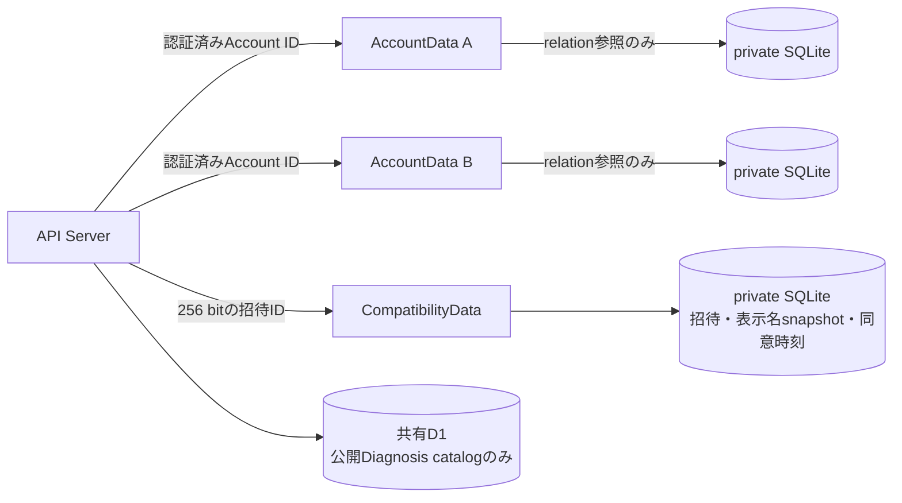
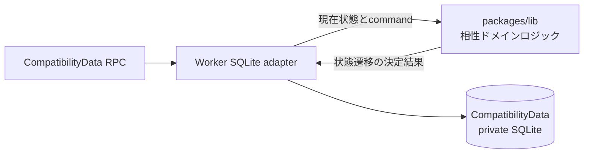
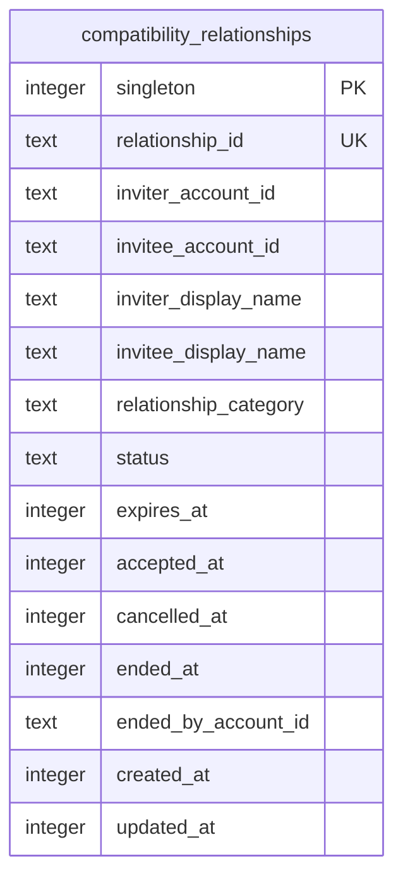
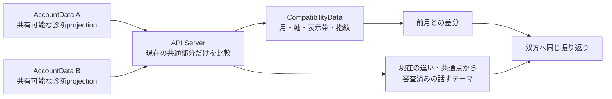
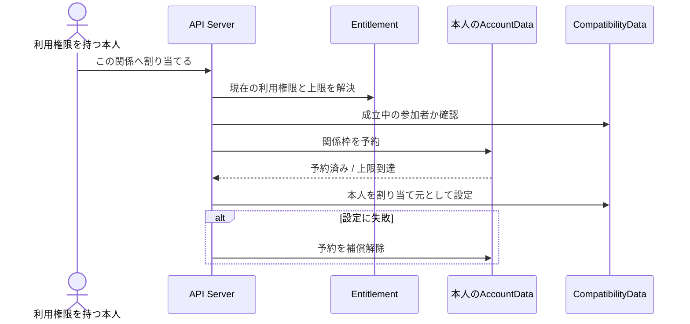
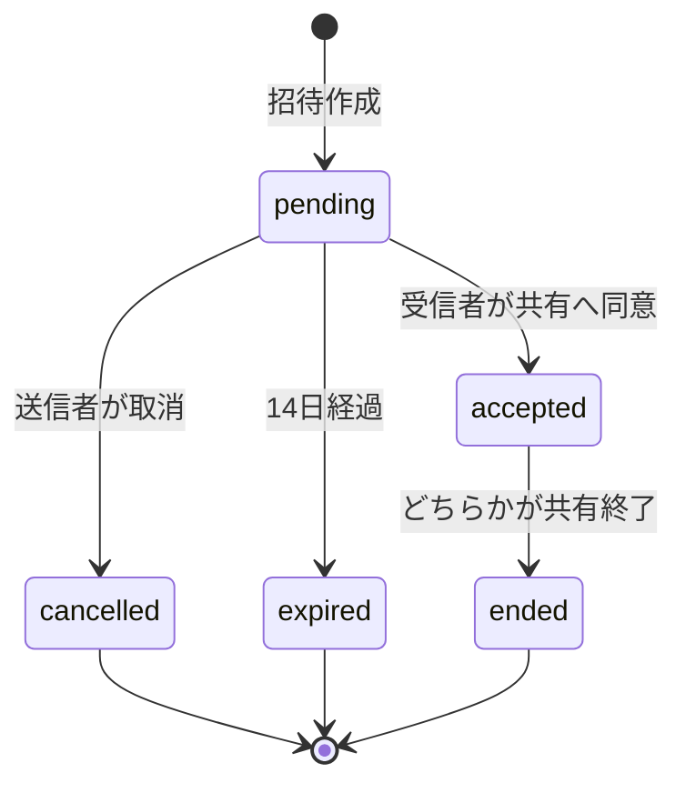

# 相性共有データ実装設計

## 1. この文書の目的

この文書は、1対1の相性共有を永続化する物理データモデルとDurable Object境界を定義します。招待、双方の同意、Account別の一覧参照、状態遷移、再試行時の整合性を所有します。

画面と利用者向けの文言は[相性診断・うつし共有体験設計](../product/compatibility-experience.md)、Account所有データ全般の分離原則は[Accountデータ分離設計](account-data-isolation.md)、診断結果の計算は[診断回答のパラメータ変換設計](../diagnosis/scoring/parameter-scoring-design.md)を正とします。

この文書はHTTP API、画面実装、相性シートの文章生成規則を所有しません。

## 2. 結論

相性関係は2つのAccountに属するため、片方の`AccountData`へ正本を置きません。推測困難な招待IDから決定的に選ぶ`CompatibilityData` Durable Objectを1関係につき1つ作り、そのprivate SQLiteを招待と同意のSSoTにします。

同意は相手単位の継続同意です。基本の相性シートは表示時点で双方の`AccountData`から都度組み立て、共有した表示文章や生の値を`CompatibilityData`へ保存しません。「2人の継続的な振り返り」を割り当てた関係だけは、前月との差分に必要な最小の表示帯snapshotを期限付きで保存します。

各`AccountData`には、自分の一覧を組み立て、同じ相手との重複関係を防ぐための`compatibility_references`だけを保存します。共有D1には相性関係、表示名、同意、診断結果を保存しません。

相性関係の入力検証、招待期限の判定、状態遷移、冪等性、閲覧可否、previewへの変換、および双方のAccountDataを同じ順序で予約する承諾オーケストレーションは`packages/lib`のランタイム非依存なロジックが所有します。`apps/worker`はDurable Objectとprivate SQLiteのadapterとして、現在状態の読込、ドメインロジックが返した決定結果の保存、alarm設定だけを担当します。CloudflareやDrizzleへ依存するコードを`packages/lib`へ持ち込みません。

## 3. データ分類

| データ | 保存先 | 理由 |
| --- | --- | --- |
| 招待状態、参加者、表示名snapshot、Relationship Category | CompatibilityData SQLite | 2者の共有関係を片方のAccount所有にしない |
| 送信者の同意時刻（`created_at`） | CompatibilityData SQLite | 発行時の継続同意の成立時点を残す |
| 受信者の同意時刻（`accepted_at`） | CompatibilityData SQLite | 受信者の明示的同意を送信者の同意と分ける |
| 共有用の一人称文章と内部根拠参照 | 各AccountData SQLiteの専用projection | 本人向けまとめや生の根拠を関係データへ複製しない |
| 生の回答、パラメータ値、表示文章 | 各AccountData SQLiteから都度計算 | 相性関係へ個人データを複製しない |
| 月次振り返り用の比較snapshot | CompatibilityData SQLite | 双方へ同じ差分を返しつつ、AccountDataの非共有情報を関係データへ複製しない |
| Accountごとの相性一覧参照 | 各AccountData SQLite | 全Account走査なしで本人の一覧を取得する |
| Question、Diagnosis、Scoring Config | 共有D1 | 全Account共通の公開catalogである |

表示名は検証済みLINE ID tokenの`name`を招待発行時と承諾時にsnapshotとして保存します。既存関係の表示名をプロフィール変更へ自動追従させません。

## 4. CompatibilityDataモデル

送信者の同意時刻は`created_at`、受信者の同意時刻は`accepted_at`が表します。`relationship_category`は招待時に選択し、受信者が承諾した関係分類です。同意した表示内容、共有プロフィール版、診断テーマ、結果指紋は保存しません。共有対象は関係が`accepted`である間、双方の`AccountData`が現在共有できるもののうち、関係分類が一致するDiagnosisと`general`のDiagnosisです。

招待発行と承諾のcommandは、表示内容を確認するtokenを受け取りません。API Serverは検証済みLINE ID tokenから解決したAccount IDと表示名だけを渡し、`CompatibilityData`が現在時刻で状態遷移を判定します。

共有プロフィールprojectionは、本人向けプロフィールまとめと同じ生成要求から作りますが、本人向け本文とは別のAccountData tableへ保存します。文章、schema version、生成元のプロフィール版、内部根拠参照を持ち、専用RPCだけが読み取ります。専用RPCは常に最新版を返し、内部根拠のどれかが削除または無効化されていればprojectionを返しません。

招待確認用RPCは、表示名と期限だけを持つ専用previewを返します。Account ID、同意時刻、内部状態行をpreviewへ含めません。承諾時に重複関係を確認するために使う送信者Account IDは、画面表示用previewとは別の内部contextとして取得します。内部contextはHTTPレスポンスとログへ出しません。

受信者は共有対象を個別に選べません。共有できる対象が0件のまま関係が成立した場合は、シートを組み立てられない準備待ちとして扱い、双方の対象がそろった時点で追加の同意なしにシートを返します。

### 4.1 月次振り返り用の比較snapshot

「2人の継続的な振り返り」の入力は、表示時点で双方へ共有できる相性シートだけに限定します。`CompatibilityData`は月、Diagnosis ID、Parameter ID、比較定義の版、双方の表示帯（低い・中央・高い）、および組み合わせの指紋を保存します。パラメータの生の数値、表示文章、日記、Brain Item、Source Record、共有専用projection、AccountDataの根拠IDは保存しません。

月keyは`Asia/Tokyo`の`YYYY-MM`とします。割り当て済みの関係で相性シートを取得した時点に、その月のsnapshotを現在共有できる共通部分へ更新します。差分は前月の最後のsnapshotと現在の相性シートを比較して作り、前月のsnapshotがなければ変化を返しません。取得後に回答が更新されても再取得されていない状態は記録せず、月をまたいで取得されなかった期間も推測で補完しません。

話すテーマの文章は保存せず、現在の共有内容と審査済み定型文から都度決定的に組み立てます。双方の表示を一致させるため、参加者の入力順や閲覧者側の並び順ではなく、公開catalogのDiagnosisとParameterの順序で候補を決めます。

snapshotは現在月と前月の2か月分だけを保持し、次の月のsnapshotを保存するときにそれ以前を削除します。関係が`accepted`であり、かつサブスクリプション設計に従う利用権限が割り当てられている場合だけ読み書きします。利用権限を失っている間は保存済みsnapshotを返さず更新もしません。再割り当て時に前月の有効なsnapshotがなければ、その月を新しい基準として扱います。

回答削除などで現在共有できなくなった軸は、過去の表示帯をレスポンスへ戻しません。共有終了時は既存の比較済みテーマと同様に月次snapshotも関係の詳細として削除し、累積値へ変換して残しません。

### 4.2 振り返りの利用権限割り当て

利用できるPlanと関係数は[サブスクリプション・料金プラン設計](../product/subscription-plan-design.md#41-機能一覧)を正とします。`CompatibilityData`は現在の割り当て元Accountだけを関係の状態として持ち、Plan、契約、残り枠を保存しません。各`AccountData`は本人が利用権限を割り当てた関係IDを持ち、本人の同時利用数を直列に予約します。クライアントが送ったPlanや上限値は使わず、API Serverが共通Entitlementから解決した上限だけを予約commandへ渡します。

共通Entitlementは、外部関係へ割り当てられる`concurrentRelationshipLimit`、同じfamily pack参加者間を外部枠へ数えず利用対象に含める`familyPackInternalRelationshipsIncluded`、支払者が管理できる`familySeatLimit`を別々に返します。Free／Lite／Full／family支払者／family参加者のmatrixは、Stripe非依存のcontract testに加え、共有D1の契約projectionとfamily席継承を通すE2Eで固定します。E2Eではfamily参加者の`payerAccountId`も実際の支払者へ一致することを確認し、Plan名だけでfamily内関係と判定しません。基本の相性シートはこの割り当て上限で制限しません。

同じ関係に割り当て元は1 Accountだけとし、先に成立した割り当てを別の参加者が暗黙に上書きしません。解除は割り当て元本人だけが行えます。割り当て元のPlan終了、ファミリー席の終了、または上限低下を読み取り時に検出した場合は振り返りを返さず、安全側に停止します。`CompatibilityData`と`AccountData`をまたぐ途中失敗は冪等な再実行と補償解除で収束させ、片方に古い予約が残っても振り返りを誤って有効化しません。

ファミリーパック参加者間の枠は、両者が同じactiveなパックに属することを課金境界で確認した場合だけ内部関係として扱います。Relationship Categoryが`family`であることだけを根拠にせず、パック外の関係は外部関係の上限へ数えます。

## 5. AccountDataの一覧参照

`compatibility_references`はAccount所有rootです。

| 列 | 内容 |
| --- | --- |
| `relationship_id` | CompatibilityDataを選ぶ不透明なID |
| `account_id` | このAccountData Objectへ固定された所有者 |
| `role` | `inviter`または`invitee` |
| `partner_account_id` | 承諾後の相手。未承諾の送信者参照ではNULL |
| `status` | `pending`、`reserved`、`active`、`ended` |
| `created_at` / `updated_at` | ローカルprojectionの更新時刻 |

`reserved`または`active`の`partner_account_id`へ部分一意indexを置き、同じ相手との承諾処理をAccountData Object内で直列化します。`reserved`は送信者・受信者の双方で別DO更新の途中だけに使い、相性一覧には表示しません。`ended`は監査と冪等な再試行のため保持しますが、通常一覧から除外します。

## 6. 状態遷移と整合性

承諾は複数DOをまたぐため、単一transactionとは扱いません。APIの実装順序を次に固定します。

1. CompatibilityDataからpending招待を読み、送信者と期限を確認する
2. `packages/lib`の承諾オーケストレーターがAccount IDの辞書順で双方のAccountDataを呼び、送信者の既存`pending`参照と受信者の新規参照を同じ相手の`reserved`へ遷移させる
3. どちらかの予約が競合または失敗した場合、先に作成した予約を解放して承諾を中止する
4. CompatibilityDataが双方のAccountDataに同じ関係・相手・roleの`reserved`または`active`参照があることを検証する
5. CompatibilityDataをcompare-and-setで`accepted`へ更新し、受信者の同意を保存する
6. 双方のAccountData参照を`active`へ更新する

双方を同じ順序で予約することで、AからBとBからAへの招待が同時に承諾されても片方だけを成立させます。CompatibilityDataの承諾RPC自身も双方の予約を検証し、オーケストレーターを迂回した直接呼び出しではpendingをacceptedへ遷移させません。同じ入力の再試行は成功済み状態を返します。予約RPCの保存後に応答だけ失われた場合を含め、CompatibilityData更新前に失敗したときは今回の関係について双方へ冪等な解放を試み、受信者の一時参照を削除し、送信者参照を`pending`へ戻します。CompatibilityData更新後に`active`化が失敗した場合は、同じ承諾または一覧取得でprojectionを再同期します。CompatibilityDataの状態を権限判定の正とし、AccountData参照だけで相手の結果を開示しません。

AccountDataの一覧RPCは、内部的に`pending`、`reserved`、`active`の参照を取得し、各CompatibilityDataの現在状態を照合します。acceptedになった`reserved`は`active`へ復旧し、CompatibilityDataがまだpendingの`reserved`は進行中の予約として一覧へ出さず保持します。期限切れ、取消済み、終了済みなど正本と一致しない参照は`ended`へ同期して一覧から除外します。同期後に利用者へ返すのは`pending`と`active`だけです。alarmはCompatibilityDataだけを終端化し、別DOへの通知成功を期限切れの成立条件にしません。

招待作成、確認、承諾、取消、共有終了の判定時刻はCompatibilityData自身の時計を使います。公開RPCから`created_at`、`expires_at`、`accepted_at`などの判定時刻を受け取らず、呼び出し側が過去または未来の時刻を指定して状態遷移を変えられないようにします。Repositoryテストだけは状態機械を決定的に検証するため明示時刻を渡せます。

## 7. 不変条件

- Object名と`relationship_id`が一致しないRPCを拒否する
- 招待IDは256 bitの暗号学的乱数をhex表現にし、URLへAccount IDを含めない
- 招待を開いただけでは受信者Account ID、表示名、閲覧履歴を保存しない
- pending招待だけを送信者が取り消せる
- ドメインの各判断関数が現在時刻と期限を比較し、pendingかつ期限内の招待だけを表示・承諾・取消できる
- 状態遷移と期限判定にはCompatibilityDataが取得した現在時刻だけを使う
- accepted関係だけを参加者が終了できる
- terminal状態から別状態へ戻さない
- CompatibilityData RPCはraw SQLite clientを公開しない
- 招待previewへAccount IDと同意時刻を含めない
- 招待は宛先Accountを事前指定せず、pending状態を最初に承諾した認証済みAccountだけを受信者として固定する
- 最初の承諾後は、同じリンクを持つ別Accountによるpreview、承諾、一覧参照、相性シート取得を拒否する
- AccountData参照は一覧projectionであり、相性シートの閲覧権限に使わない
- 承諾前に双方のAccountDataを同じ順序で予約し、同じ2人のaccepted関係を重複作成しない
- CompatibilityDataは双方の予約を確認できないpending招待の承諾を拒否する
- 共有終了後は相手の内容を返さず、以降の更新も共有しない
- 内部根拠の削除・無効化後は共有専用projectionを返さない
- 相性シートは保存済みの過去の表示内容ではなく、表示時点の双方の内容から組み立てる

## 8. Migrationと運用

`CompatibilityData`は新規DO classとしてWrangler migrationへ追加し、専用のDrizzle migrationを`0000`から管理します。`AccountData`の`compatibility_references`は既存private SQLiteへの追加migrationとし、共有D1 migrationへ追加しません。

表示内容単位の同意をやめた後も、`compatibility_offered_themes`、`compatibility_accepted_themes`、および`compatibility_relationships`の共有プロフィール指紋columnは残したまま書き込みを止めます。削除は[本番データベースマイグレーション運用](../development/production-migration-operations.md)のexpand-contractに従い、後続releaseのcontractで行います。

`relationship_category`追加前の既存行が残るObjectでは、既定値なしの`NOT NULL` column追加をそのまま適用できません。適用済みmigrationは編集せず、初期化時に旧行と旧同意snapshotをprivate SQLite内へ一時退避し、既存migrationを空の関係tableへ前進適用してから復元します。旧招待ではRelationship Categoryを双方が確認していないため、`pending`は`cancelled`、`accepted`は`ended`として終端化し、共有を暗黙に継続しません。復元用tableは復元と同じtransactionで削除し、途中失敗時は次回初期化で同じ退避内容から再実行します。

期限切れはCompatibilityDataのalarmで終端化し、一覧取得時にも現在時刻で再判定します。共有D1をCronで全走査しません。

## 9. この設計で決めないこと

- HTTP path、request / response形式、画面キャッシュ
- 相性シートの文章と比較候補の具体的な生成契約
- terminalデータの削除保留期間とAccount削除時の物理削除手順
- 通知outboxとLINE再通知頻度
