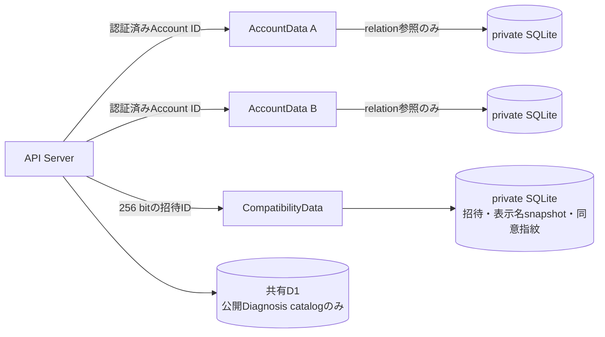
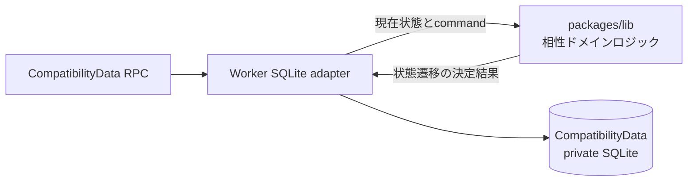
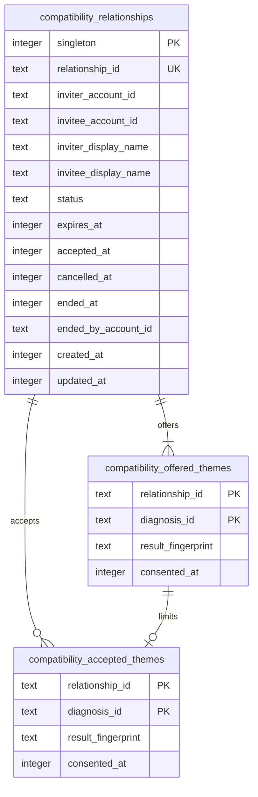
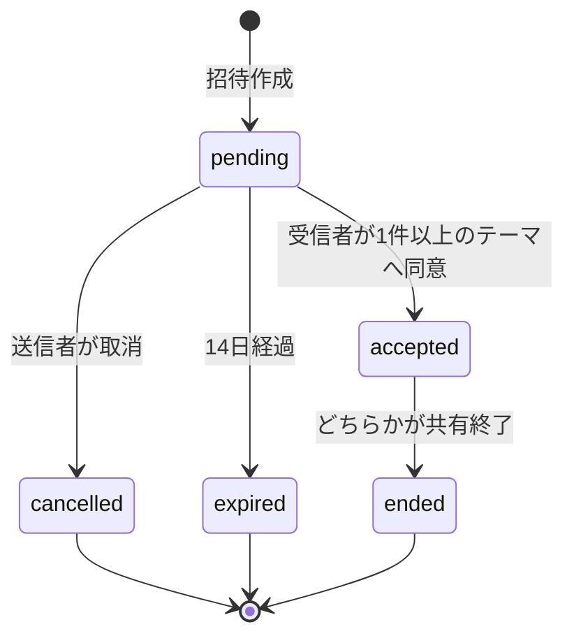

# 相性共有データ実装設計

## 1. この文書の目的

この文書は、1対1の相性共有を永続化する物理データモデルとDurable Object境界を定義します。招待、双方の同意、Account別の一覧参照、状態遷移、再試行時の整合性を所有します。

画面と利用者向けの文言は[相性診断・うつし共有体験設計](../product/compatibility-experience.md)、Account所有データ全般の分離原則は[Accountデータ分離設計](account-data-isolation.md)、診断結果の計算は[診断回答のパラメータ変換設計](../diagnosis/scoring/parameter-scoring-design.md)を正とします。

この文書はHTTP API、画面実装、相性シートの文章生成規則を所有しません。

## 2. 結論

相性関係は2つのAccountに属するため、片方の`AccountData`へ正本を置きません。推測困難な招待IDから決定的に選ぶ`CompatibilityData` Durable Objectを1関係につき1つ作り、そのprivate SQLiteを招待と同意のSSoTにします。

各`AccountData`には、自分の一覧を組み立て、同じ相手との重複関係を防ぐための`compatibility_references`だけを保存します。共有D1には相性関係、表示名、同意、診断結果を保存しません。

相性関係の入力検証、招待期限の判定、状態遷移、冪等性、閲覧可否、previewへの変換は`packages/lib`のランタイム非依存なドメインロジックが所有します。`apps/worker`はDurable Objectとprivate SQLiteのadapterとして、現在状態の読込、ドメインロジックが返した決定結果の保存、alarm設定だけを担当します。CloudflareやDrizzleへ依存するコードを`packages/lib`へ持ち込みません。

## 3. データ分類

| データ | 保存先 | 理由 |
| --- | --- | --- |
| 招待状態、参加者、表示名snapshot | CompatibilityData SQLite | 2者の共有関係を片方のAccount所有にしない |
| 送信者が提示したテーマと結果指紋 | CompatibilityData SQLite | 発行時に確認した共有範囲を固定する |
| 受信者が承諾したテーマと結果指紋 | CompatibilityData SQLite | 受信者の明示的同意を送信者の同意と分ける |
| 生の回答、パラメータ値、表示文章 | 各AccountData SQLiteから都度計算 | 相性関係へ個人データを複製しない |
| Accountごとの相性一覧参照 | 各AccountData SQLite | 全Account走査なしで本人の一覧を取得する |
| Question、Diagnosis、Scoring Config | 共有D1 | 全Account共通の公開catalogである |

表示名は検証済みLINE ID tokenの`name`を招待発行時と承諾時にsnapshotとして保存します。既存関係の表示名をプロフィール変更へ自動追従させません。

## 4. CompatibilityDataモデル

`result_fingerprint`は、本人へプレビューした診断ID、採点設定版、パラメータ位置、審査済み文章を正規化してSHA-256で計算します。回答そのものは含めず、APIレスポンスやログへ出しません。結果表示時に現在の表示内容から再計算した指紋と一致するテーマだけを比較へ使います。不一致または回答削除の場合は古い結果を表示せず、所有者本人へ再確認を求めます。

招待確認用RPCは、表示名、提示された診断ID、期限だけを持つ専用previewを返します。Account ID、結果指紋、同意時刻、内部状態行をpreviewへ含めません。承諾処理が重複関係の確認に使う送信者Account IDは、画面表示用previewとは別の内部contextとして取得します。

受信者は送信者が提示したテーマの部分集合だけを承諾でき、1件以上を必須とします。これにより、共有対象が空のまま関係だけが成立する状態を作りません。

## 5. AccountDataの一覧参照

`compatibility_references`はAccount所有rootです。

| 列 | 内容 |
| --- | --- |
| `relationship_id` | CompatibilityDataを選ぶ不透明なID |
| `account_id` | このAccountData Objectへ固定された所有者 |
| `role` | `inviter`または`invitee` |
| `partner_account_id` | 承諾後の相手。未承諾の送信者参照ではNULL |
| `status` | `pending`、`reserved`、`active`、`ended` |
| `created_at` / `updated_at` | ローカルprojectionの更新時刻 |

`reserved`または`active`の`partner_account_id`へ部分一意indexを置き、同じ相手との承諾処理をAccountData Object内で直列化します。`reserved`は別DO更新の途中だけに使い、相性一覧には表示しません。`ended`は監査と冪等な再試行のため保持しますが、通常一覧から除外します。

## 6. 状態遷移と整合性

承諾は複数DOをまたぐため、単一transactionとは扱いません。APIの実装順序を次に固定します。

1. CompatibilityDataからpending招待を読み、送信者と期限を確認する
2. 受信者AccountDataへ`reserved`参照を作り、同じ相手との既存関係を排除する
3. CompatibilityDataをcompare-and-setで`accepted`へ更新し、受信者の同意を保存する
4. 双方のAccountData参照を`active`へ更新する

同じ入力の再試行は成功済み状態を返します。2の後に失敗した予約は取消でき、3の後に4が失敗した場合は同じ承諾または一覧取得でprojectionを再同期します。CompatibilityDataの状態を権限判定の正とし、AccountData参照だけで相手の結果を開示しません。

AccountDataの一覧RPCは、`pending`と`active`の参照を返す前に各CompatibilityDataの現在状態を照合します。期限切れ、取消済み、終了済みなど正本と一致しない参照は`ended`へ同期して一覧から除外します。alarmはCompatibilityDataだけを終端化し、別DOへの通知成功を期限切れの成立条件にしません。

招待作成、確認、承諾、取消、共有終了の判定時刻はCompatibilityData自身の時計を使います。公開RPCから`created_at`、`expires_at`、`accepted_at`などの判定時刻を受け取らず、呼び出し側が過去または未来の時刻を指定して状態遷移を変えられないようにします。Repositoryテストだけは状態機械を決定的に検証するため明示時刻を渡せます。

## 7. 不変条件

- Object名と`relationship_id`が一致しないRPCを拒否する
- 招待IDは256 bitの暗号学的乱数をhex表現にし、URLへAccount IDを含めない
- 招待を開いただけでは受信者Account ID、表示名、閲覧履歴を保存しない
- pending招待だけを送信者が取り消せる
- pendingかつ期限内の招待だけを、送信者本人ではない1 Accountが承諾できる
- 状態遷移と期限判定にはCompatibilityDataが取得した現在時刻だけを使う
- 承諾テーマは提示テーマの1件以上の部分集合にする
- accepted関係だけを参加者が終了できる
- terminal状態から別状態へ戻さない
- CompatibilityData RPCはraw SQLite clientを公開しない
- 招待previewへAccount ID、結果指紋、同意時刻を含めない
- AccountData参照は一覧projectionであり、相性シートの閲覧権限に使わない
- 共有終了、回答変更、回答削除後は保存済みの古い比較内容を返さない

## 8. Migrationと運用

`CompatibilityData`は新規DO classとしてWrangler migrationへ追加し、専用のDrizzle migrationを`0000`から管理します。`AccountData`の`compatibility_references`は既存private SQLiteへの追加migrationとし、共有D1 migrationへ追加しません。

期限切れはCompatibilityDataのalarmで終端化し、一覧取得時にも現在時刻で再判定します。共有D1をCronで全走査しません。

## 9. この設計で決めないこと

- HTTP path、request / response形式、画面キャッシュ
- 相性シートの文章と比較候補の具体的な生成契約
- 再同意画面と同意指紋更新API
- terminalデータの削除保留期間とAccount削除時の物理削除手順
- 通知outboxとLINE再通知頻度
