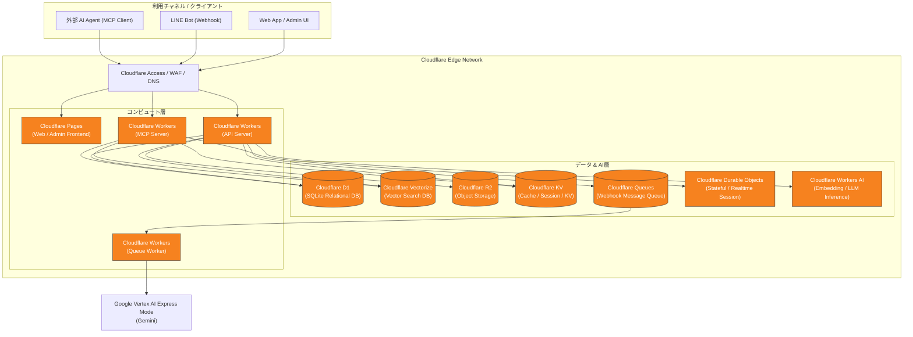
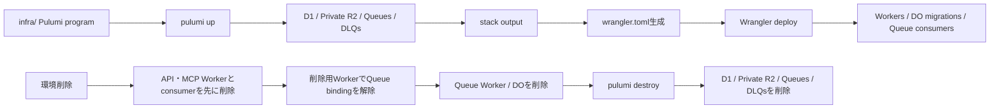
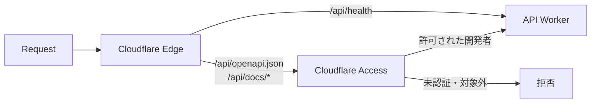

# me-builder インフラ・システム構成

## 1. この文書の目的

me-builderの開発基盤および全体アーキテクチャにおいて、インフラストラクチャおよびシステム構成のSSoT（Single Source of Truth）を定義します。

本サービスでは、高可用性・低遅延・グローバルエッジでのスケーラビリティ・開発運用コストの最小化を実現するため、インフラストラクチャを全面的に **Cloudflare** エコシステムに統一して構築します。

## 2. 所有する概念と所有しない概念

### 所有する概念

- システム全体のブロック構成および技術スタック
- 各 Cloudflare コンポーネント（Pages, Workers, D1, Vectorize, R2, KV, Durable Objects, Workers AI）の役割と配置
- フロントエンド、API、MCPサーバー、ストレージ間のデータフロー
- 開発・プレビュー・本番環境のインフラ運用方針
- Cloudflare Accessで保護する運用エンドポイントと、公開を維持するエンドポイントの境界

### 所有しない概念

- `Account`、`Brain`、`Source` のドメイン境界や責務の定義 — [ドメイン設計](../domain/domain-design.md)
- ラベルの分類・定義およびMCPアクセス許可規則 — [Brainのラベル・アクセス制御設計](../domain/brain/brain-access-label-design.md)
- Brain Itemの分類名および具体例 — [Brain内部情報の分類](../domain/brain/brain-content-taxonomy.md)
- プロジェクトの目標、MVP範囲、全体ロードマップ — [プロジェクト概要](../product/project-overview.md)
- 具体的なデータベーステーブル定義、GraphQL/REST/MCPツール等の個別スキーマ詳細

日記チャットにおける各コンポーネントの連携、物理データモデル、AI実行、安全制御は[日記チャット実装設計](diary-chat-implementation-design.md)を正とします。

## 3. インフラ・システム構成の全体像

me-builderは、全コンポーネントが Cloudflare のグローバルエッジネットワーク上で動作するサーバーレス・エッジファースト構成を採用します。



## 4. コンポーネント別の役割と選定

| コンポーネント | Cloudflare サービス | 主な役割・用途 |
| --- | --- | --- |
| **フロントエンド** | **Cloudflare Pages** | Webアプリケーションおよび管理者画面のビルド・ホスティング。高速なエッジ配信と自動プレビューデプロイを実現。 |
| **API サーバー** | **Cloudflare Workers** | HTTP / REST / Webhook API（LINE連携、認証、データ登録等）の処理。軽量な TypeScript/Hono フレームワーク等で構築。 |
| **MCP サーバー（Phase 2）** | **Cloudflare Workers** | 外部 AI エージェント向け MCP (Model Context Protocol) 端点の提供。Workerは既存の運用経路でデプロイするが、初期リリースではユーザー向けMCP機能を提供せず、Phase 2でSSE (Server-Sent Events) および HTTP 通信を提供する。 |
| **キューワーカー** | **Cloudflare Workers** | Cloudflare Queues から非同期メッセージを受信・消費・バックグラウンド処理する非同期ワーカー。 |
| **メッセージキュー** | **Cloudflare Queues** | Webhook 等のイベントを安全に保持・非同期配送するサーバーレスメッセージキュー。 |
| **構造化データストア** | **Cloudflare D1** | サーバーレスリレーショナルデータベース (SQLite)。Account、Identity、role、status、アバターメタデータ、全Account共通の公開定義、原文を含まない集計projectionを保持。日記や診断回答などの個人コンテンツは保持しない。 |
| **ベクトル検索ストア** | **Cloudflare Vectorize** | 完全マネージドなベクトルデータベース。`Brain Item` の埋め込みベクトル（Embedding）を保存し、コサイン類似度等による高速セマンティック検索を提供。 |
| **メディアストレージ** | **Cloudflare R2** | S3互換のオブジェクトストレージ。環境別のprivate bucketへアバターなどのAccount所有メディア原本を保存し、公開URLを持たせずAPI Server bindingから読み書きする。 |
| **キー・バリュー / キャッシュ** | **Cloudflare KV** | 低遅延グローバルキー・バリューストア。認証トークン、一時セッション、アクセス制御キャッシュ、レート制限カウントを保持。 |
| **状態管理 / ドメイン協調** | **Cloudflare Durable Objects** | 個人コンテンツのSSoT。1 Accountにつき1つのprivate SQLiteへ`Source`・`Brain`・`Diary`・`Diagnosis`回答・プロフィール要約を保存し、連投調停や相性関係の協調も担う。 |
| **AI / 推論基盤** | **Vertex AI Express Mode (Gemini)** | Queue WorkerからAPI key認証でテキスト生成とEmbedding生成を実行。本文、生成結果、API keyをアプリケーションログへ残さない。 |
| **セキュリティ & ネットワーク** | **Cloudflare Access / WAF** | DDoS防御、WAFルール適用、SSL/TLS証明書管理、管理画面等へのゼロトラストアクセス制御（Cloudflare Access）。 |

## 5. データ連携フロー原則

1. **メディア登録とメタデータ保持**
   - ユーザーから投稿されたバイナリデータ（写真・動画・音声）は Cloudflare R2 へ直接保存します。
   - アバターのobject key、content type、byte size、etag、更新日時など、Account運営に必要なメディアメタデータは共有D1へ記録します。個人コンテンツに属するメディアの構造化情報との境界は[Accountデータ分離設計](account-data-isolation.md)を正とします。

2. **テキストおよびメディアのベクトル化と検索**
   - activeなBrain Itemは、AccountDataの同期outboxと専用Queueを経由してVertex AI Express ModeのGeminiでEmbeddingへ変換されます。
   - 生成されたベクトルはCloudflare Vectorizeへ保存します。Vectorizeは候補抽出だけを担い、利用時はAccountDataで現在の状態とAccess Policyを再認可します。

3. **MCPアクセス制限と監査（Phase 2）**
   - MCPリクエスト受領時、Cloudflare Workers は D1 および KV に保持された `Access Profile` と `Access Label` を照合し、認可範囲内の情報のみを返却します。
   - すべての閲覧・検索リクエストは D1 または KV に監査ログとして非同期書き込みされます。

4. **非同期 Webhook メッセージ処理**
   - Webhook リクエスト（LINE 等）は API サーバーで受信後、直ちに `Cloudflare Queues` へ投入され 200/202 応答を返却します。
   - バックグラウンドの Queue Worker (`apps/worker`) がキューから非同期バッチメッセージを取り出し順次処理します。LINE日記メッセージの最終応答、応答期限、再試行は[日記チャット実装設計](diary-chat-implementation-design.md#9-38秒sloと配送)を正とします。

5. **外部LLMの呼び出し**
   - Vertex AI Express Mode の Gemini を利用する処理は、Queue Worker からGoogleへ直接呼び出します。
   - `@google/genai`は`vertexai: true`とAPI version `v1`で初期化し、プロジェクトやロケーションの指定を要しないExpress ModeのAPI key認証を使います。
   - Vertex AI API key (`GOOGLE_VERTEX_AI_API_KEY`) は Worker の Secret として保持し、Web UI、APIレスポンス、ログへ露出させません。
   - 接続確認では、LINEへ `AI: 質問` と明示して送った本文だけをモデルへ渡し、生成結果を同じトークへ返信します。通常の日記と診断要求はモデルへ送りません。
   - モデルへ渡した本文と生成結果はアプリケーションログおよびデータベースへ保存しません。
   - 接続確認の失敗時は、設定不足、空応答、API例外を区別できる構造化ログを出力します。モデルへ渡した本文、生成結果、Google API key はエラーログにも含めません。

## 6. 開発・運用環境方針

開発基盤には **Bun Workspaces** を用いたモノレポ構造（`apps/web`, `apps/api`, `apps/mcp`, `apps/worker`）を採用し、ローカル開発・プレビュー・本番環境で一貫した開発体験と安全なデプロイを実現します。`apps/mcp`はPhase 2向けのスケルトンとしてデプロイを継続しますが、初期リリースのユーザー向け機能には含めません。

- **モノレポ構成 (`Bun Workspaces`)**:

  ```text
  me-builder/
  ├── infra/              # PulumiによるCloudflare基盤リソースとWrangler設定の生成
  ├── Taskfile.yml       # タスクランナー定義 (task dev, task i, task deploy:preview 等)
  ├── package.json       # ルート設定 (workspaces 定義, wrangler devDependency)
  ├── tsconfig.json      # モノレポ共通 TypeScript 設定
  ├── apps/
  │   ├── web/           # Frontend UI (React + Vite + TypeScript, wrangler.toml)
  │   ├── api/           # API Server (Bun.serve / Cloudflare Workers, wrangler.toml)
  │   ├── mcp/           # MCP Server (Bun.serve / Cloudflare Workers, wrangler.toml)
  │   └── worker/        # Queue Worker (Cloudflare Workers, wrangler.toml)
  └── packages/
      ├── shared/        # 共有型定義 & ユーティリティ (純粋な .ts ソース直参照)
      └── lib/           # LINE連携、共有D1とAccountDataのschema・action (Drizzle ORM)
  ```

  - `apps/web`: React (Vite + TypeScript) によるフロントエンド。`apps/web/wrangler.toml` により Pages 設定および環境別設定（local, preview, production）を管理。
  - `apps/api`: `Bun.serve` および Web標準 API 準拠の **Hono** フレームワークを採用。`apps/api/wrangler.toml` により Cloudflare Workers の環境別設定（local, preview, production）を制御。
  - `apps/mcp`: Phase 2でCloudflare Workers / Bun 上に提供する MCP (Model Context Protocol) サーバーのスケルトン。`apps/mcp/wrangler.toml`によりWorkersの環境別設定を制御し、既存のデプロイ経路を維持する。
  - `apps/worker`: Cloudflare Queues メッセージを非同期処理する Cloudflare Workers ワーカー。`apps/worker/wrangler.toml` により Worker の環境別設定を制御。
  - `packages/shared`: 全アプリケーション間で共有されるドメイン型定義およびユーティリティライブラリ。
  - `packages/lib`: LINE Messaging API 連携、共有D1（`d1/shared/`）とAccountData Durable Object（`do/account/`）のschema・action（Drizzle ORM）を所有者ごとに分けて提供するライブラリ。`D1.shared.*`と`DO.account.*`で参照する。境界は[Accountデータ分離設計](account-data-isolation.md)を正とします。

### 6.1 Cloudflareリソースの宣言とデプロイ境界

Cloudflareの基盤リソースは`infra/`のPulumi programをSSoTとします。Pulumiは環境ごとのD1 database、Private R2 bucket、QueueおよびDLQを作成・変更・削除し、stack outputからリポジトリ内の`wrangler.toml`を生成します。リソースIDやbucket名を手作業でTOMLへ複製しません。

会社ドメインの問い合わせ用メールアドレスについて、メールボックスの作成と転送設定はこのリポジトリのPulumi / Wrangler管理対象に含めません。公開窓口としての要件は[サービス紹介サイト設計](../product/service-site-design.md#73-お問い合わせ)、開通確認は[サービス紹介サイト残タスク](../development/service-site-remaining-tasks.md#32-問い合わせ特定商取引法の開示窓口を稼働させる)を正とします。

Worker scriptのbundle、Secretの配布、Durable Object migrationとQueue consumerの登録はWranglerが担当します。Durable Object namespaceとmigration履歴はWorker scriptが所有し、独立したPulumiリソースとして作成・削除できないためです。`infra`のライフサイクルコマンドは、この所有関係に従って実行順を制御します。



Previewの破壊的な検証はPreview専用stackでのみ行います。削除時はAPI・MCP WorkerとQueue consumerを先に削除し、Private R2を空にしてから、削除専用の最小Workerを一度デプロイしてproducer bindingも解除します。その後、Queue Workerの削除で所有するDOとmigration履歴を破棄し、`pulumi destroy`でD1・Private R2・Queue・DLQを削除します。再構築時は`pulumi up`、TOML生成、D1 migration、Workerデプロイの順とします。Productionを破壊対象とするコマンドは提供しません。

GitHub Actionsの手動resetは常に最新`main`を対象にこのライフサイクルを実行し、復旧確認後に新しいD1・Private R2・Queueの情報をmanifestとWrangler TOMLへ反映するPRを自動作成します。通常のPreview CDはデプロイ前にPrivate R2がなければ同じ命名規則で作成し、Cloudflare上の現在リソースを検証・同期するため、自動PRがマージされる前でも古いD1 IDを参照しません。Production CDもPrivate R2の存在をデプロイ前に保証します。

- **環境分類と Pulumi / Wrangler 構成 (`Local` / `Preview` / `Production`)**:
  - **ローカル開発環境 (`Local`)**:
    - `wrangler.toml` 内の `env.local` ターゲット（`me-builder-api-local`, `me-builder-mcp-local`, `me-builder-web-local`）。
    - ルートの `bun dev` または `wrangler dev --env local` によりローカルエミュレーション実行。
  - **プレビュー環境 (`Preview`)**:
    - `wrangler.toml` 内の`env.preview`ターゲット（`me-builder-api-preview`, `me-builder-mcp-preview`, `me-builder-web`）。
    - 全 PR で共有する単一の検証環境。プルリクエストの作成・更新だけでは自動デプロイせず、`CD / Preview` ワークフローが次のいずれかで起動したときのみ `wrangler deploy --env preview` / `wrangler pages deploy` を実行。
      - ブランチを指定した手動実行 (`workflow_dispatch`)
      - `deploy` ラベルが付いた PR（ラベル付与時と、その後の push）
    - **カスタムドメイン・ルーティング配置**:
      - UI (`apps/web`): `stg.kagami.kyosuke.dev`
      - API (`apps/api`): `api.stg.kagami.kyosuke.dev`
      - MCP (`apps/mcp`): `mcp.stg.kagami.kyosuke.dev`
  - **本番環境 (`Production`)**:
    - `wrangler.toml` 内の`env.production`ターゲット（`me-builder-api-production`, `me-builder-mcp-production`, `me-builder-web`）。
    - `main` ブランチマージ時に、CI/CD パイプライン経由で `wrangler deploy --env production` を実行し本番環境へデプロイ。
    - **カスタムドメイン・ルーティング配置**:
      - UI (`apps/web`): `kagami.kyosuke.dev`
      - API (`apps/api`): `api.kagami.kyosuke.dev`
      - MCP (`apps/mcp`): `mcp.kagami.kyosuke.dev`

APIとMCPがブラウザへ返すCORSヘッダは、環境manifestのベースドメインから生成したWeb UIのオリジンだけを許可します。LocalはVite開発サーバーのオリジンを使用し、設定が欠けている場合や一致しないOriginには`Access-Control-Allow-Origin`を返しません。

### 6.2 APIドキュメントのCloudflare Access境界

PreviewとProductionでは、APIドキュメントを利用者向けAPIとは別のCloudflare Access Applicationで保護します。ApplicationはAPIホスト全体ではなく、次のパスだけを対象にします。

| パス | Access | 用途 |
| --- | --- | --- |
| `/api/openapi.json` | 必須 | 機械可読なOpenAPI document |
| `/api/docs`、`/api/docs/*` | 必須 | Swagger UIを提供する場合の画面と配下のアセット |
| `/api/health` | 不要 | 外形監視と死活確認 |



AccessのAllow policyは、IdPが検証した個別メールアドレスまたは開発者グループを対象にし、`Everyone`を指定しません。対象外の主体はAccessのdeny-by-defaultで拒否します。PreviewとProductionはホスト名が異なるため環境ごとにApplicationを持ちますが、同じアクセス境界を適用します。

診断・プロフィール等の利用者向けAPIとLINE WebhookはこのApplicationへ含めません。それぞれが所有するLIFF IDトークン認証またはLINE署名検証を継続します。LocalではCloudflare Accessを経由せず、生成・検証作業から直接OpenAPI documentへアクセスできます。

Access ApplicationとAllow policyが作成され、許可された開発者と未認証リクエストの両方を確認できるまでは、Swagger UIをPreviewまたはProductionへ公開しません。

Applicationとpolicyは`scripts/setup-api-docs-access.ts`で冪等に作成・更新し、CDでAPI Serverのデプロイ前に適用します。デプロイ後は`scripts/verify-api-docs-access.ts`が未認証requestでOpenAPI documentとSwagger UI用パスを取得できないことを確認し、公開されている場合はCDを失敗させます。許可対象やAPI token権限などの実行設定は[開発運用ルール](../../.agents/rules/development.md#apiドキュメントのcloudflare-access設定)を正とします。

## 7. 関連ドキュメント

LIFFと将来のSSOを同じAccountおよびアプリケーションセッションへ収束させる境界は、[Web認証・アプリケーションセッション設計](web-authentication-design.md)を正とします。

- [Agent向けガイド](../../.agents/README.md)
- [開発運用ルール](../../.agents/rules/development.md)
- [プロジェクト概要](../product/project-overview.md)
- [ドメイン設計](../domain/domain-design.md)
- [Brain内部情報の分類](../domain/brain/brain-content-taxonomy.md)
- [Brainのラベル・アクセス制御設計](../domain/brain/brain-access-label-design.md)
- [日記チャット実装設計](diary-chat-implementation-design.md)
