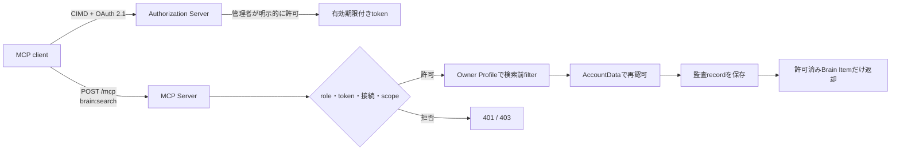

# MCP連携設計

## 1. 目的と所有範囲

この文書は、管理者本人が外部のMCP clientから自分のBrainを安全に検索するためのtransport、認証・認可、同意、開示、監査、解除と運用境界を定義します。

### 所有する概念

- 対応するMCP仕様、transport、client registrationと互換性方針
- MCP接続の認証、scope、Access Profile、同意と解除
- 最初に提供するtoolと返却可能な情報
- MCPによる開示の監査、保持、障害時の振る舞い
- MCP機能の公開、更新、停止条件

### 所有しない概念

- Brain Item、Evidence、Derivationの意味 — [Brain Item生成設計](../domain/brain/brain-item-generation-design.md)と[根拠・反証・改訂のエッジ設計](../domain/brain/evidence-edge-design.md)
- Access Label、Access Policy、Access Profileの共通原則 — [Brainのラベル・アクセス制御設計](../domain/brain/brain-access-label-design.md)
- 実装PRの依存順、Preview検証と公開までの残作業 — [MCP実装残タスク](../development/mcp-remaining-tasks.md)
- 一般利用者向けMCPと、その接続数・利用量に対する課金

## 2. 結論

最初のMCP提供は管理者本人だけを対象にし、最新安定版であるMCP `2026-07-28`のStreamable HTTPを、`POST /mcp`のステートレスな単一endpointとして実装します。旧HTTP+SSEの`/sse`と`/messages`、stdio、旧MCP仕様との互換層は提供しません。

提供するtoolは、読み取り専用の`search_my_brain` 1個です。1接続を`Owner Profile`と`brain:search` scopeへ固定し、Source Recordや原本ではなく、外部MCP提供を許可されたBrain Itemだけを返します。MCP利用にPlanや課金は適用しません。

## 3. Protocolとtransport

### 3.1 対応版

[MCP specification `2026-07-28`](https://modelcontextprotocol.io/specification/2026-07-28)だけをサポートします。実装時は同仕様へ対応する公式TypeScript SDKの安定版を正確なversionで固定し、rangeだけで将来の破壊的変更を取り込みません。

clientから指定されたprotocol versionが対応版と異なる場合は、旧形式へfallbackせず、仕様で定められたunsupported protocol versionとして拒否します。互換性のために旧仕様のsession、handshake、server initiated requestを再実装しません。

### 3.2 Transport

[Streamable HTTP](https://modelcontextprotocol.io/specification/2026-07-28/basic/transports)の`POST /mcp`だけを提供します。protocol層はsessionを持たず、各requestでprotocol version、client identity、client capabilities、access tokenを検証します。

- `Mcp-Session-Id`を発行、保存、復元しない
- request処理の上限は30秒とする
- Brain検索結果をMCP Server、CDN、共有cacheへ保存しない
- responseへ`Cache-Control: no-store`を付ける
- 旧`/sse`と`/messages`は`501 MCP_NOT_AVAILABLE`のまま維持する
- 実装とPreview検証が完了するまでは`POST /mcp`も同じ501境界へ閉じる

clientが一度取得した応答を保持したり、外部AIへ渡したりすることは解除後に取り消せません。この境界は認可画面へ明示し、解除を外部に複製済みの情報の削除手段として説明しません。

## 4. Client registrationと認証

### 4.1 Client ID Metadata Documents

client registrationは、MCP `2026-07-28`で標準となるClient ID Metadata Documents（CIMD）を使います。clientはHTTPS URLを`client_id`として提示し、Authorization ServerはそのURLから取得したmetadataを検証します。

- `client_id`、metadata document内の`client_id`、取得元URLが完全一致することを検証する
- `redirect_uri`はmetadataに列挙された値との完全一致だけを許可する
- metadataの取得先は公開HTTPSだけとし、loopback、private network、link-local、Cloudflare metadata endpointなどへの到達を拒否する
- redirectを辿らず、応答サイズと時間に上限を設け、CIMD取得をSSRF経路にしない
- metadata URLまたはredirect URI等のsecurity-sensitiveな内容が変わったclientは、同じ接続として継続せず再認可を要求する

有効なCIMDを提示するclientは認可開始まで進めますが、Brainへの接続を許可できるresource ownerは現在roleが`admin`のAccountだけです。clientの手動事前登録画面とDynamic Client Registration（DCR）は実装しません。

### 4.2 OAuth境界

[MCP Authorization specification](https://modelcontextprotocol.io/specification/2026-07-28/basic/authorization)に従い、Authorization Code + PKCEによるOAuth 2.1の認可を使います。

- Protected Resource MetadataとAuthorization Server Metadataを公開する
- authorization requestとtoken requestの`resource`を`POST /mcp`のcanonical URIへ固定する
- access tokenのaudienceが同じMCP resourceであることを毎request検証する
- `state`、PKCE、redirect URI、issuerを検証し、authorization server mix-upとcode横取りを防ぐ
- tokenをURL、Cookie、Local Storage、運用ログへ入れず、`Authorization: Bearer`だけで受け取る
- MCP clientが持つ別serviceのtokenを受け付けず、token passthroughを行わない

authorization code、access token、refresh tokenは推測困難な不透明値として発行し、server側にはhashだけを保存します。codeは短時間・1回限りとし、tokenからAccount、接続、CIMDの`client_id`、resource、scopeを解決します。MCP message内の自己申告client情報を認可根拠にせず、tokenが結びつく接続を正とします。

認可画面を開くWeb sessionは、既存のアプリケーション認証で管理者本人へ解決されていなければなりません。tokenへ保存されたroleを権威にせず、tool requestごとに共有D1の現在roleと接続状態を確認します。管理者roleの解除、Account停止、利用規約の未同意ではMCP利用も拒否します。

## 5. Scope、Access Profileと同意

初期scopeは`brain:search`だけです。書き込み、Source Record取得、resource、prompt、sampling、root、task、MCP Appsは提供しません。

各接続は`Owner Profile` 1個へ固定します。ただしOwner Profileで見えることだけを理由に外部提供せず、検索候補へ入れるBrain Itemはすべて次を満たす必要があります。

- 接続先Account自身が所有する
- statusが現在有効で、削除、撤回、置換済みではない
- Access Policyが外部MCP提供を許可している
- 確定したAccess LabelがOwner Profileで許可されている
- `unclassified`ではない
- 機微度が`normal`または`sensitive`で、`highly_sensitive`ではない

filterは検索後の表示加工ではなく、Vector検索の候補を作る前に適用します。検索後もAccountDataが対象IDの所有者、現在status、Access Policy、Access Label、機微度を再評価し、古いVector metadataや検索中の変更による漏えいを防ぎます。

初回認可画面には、次を表示して管理者本人の明示的な操作を得ます。

- CIMDから検証したclient名とmetadata URL
- `search_my_brain`が自分のBrainを検索すること
- `brain:search`と`Owner Profile`の取得可能範囲
- 読み取り専用であり、Source Recordと原本を取得できないこと
- clientが取得後に保持した情報は、接続解除だけでは削除できないこと
- tokenの有効期限と、Web画面から解除できること

client identity、scope、Access Profile、取得可能なAccess Labelまたは最大機微度が広がる変更では既存同意を流用せず、再認可を要求します。表示名だけの変更や権限縮小では再認可を求めませんが、保存済みの接続表示は現在値へ更新します。

## 6. Tokenと接続解除

access tokenの有効期限は1時間とします。refresh tokenは最終利用から30日で失効し、利用のたびにrotationします。使用済みrefresh tokenの再利用を検出した場合は、その接続のrefresh token系列をすべて失効させます。

WebのMCP接続画面から解除した時点で、接続、access token、refresh tokenを失効済みとします。MCP Serverは各requestで接続状態を検証するため、有効期限内のaccess tokenも解除後の新しいrequestには使えません。

解除より前に認可と検索を開始したrequestだけは最大30秒で完了できます。解除後に開始したrequestと、30秒を超えた処理は応答を返しません。MCP Serverに検索結果cacheを持たないため、解除時のcache purge処理は設けません。

## 7. 最初のtoolと開示境界

最初に提供するのは、自然言語queryから自分のBrain Itemを検索する読み取り専用tool `search_my_brain` 1個です。toolの入力上限、返却件数上限とrate limitは、負荷試験で有限の安全な値を決めます。これらは課金やPlan差ではなく、障害と濫用を防ぐ共通上限です。

検索結果は、外部利用に必要な次の論理情報だけを返します。DB column名やJSON schemaは実装PRで固定します。

- Brain Itemのstatementと分類
- 本人自身の情報か、本人による他者・出来事の観察か
- Derivationが本人の明言、AI推定、ルールベース変換のどれか
- Evidenceの件数、Source kind、記録または観察日時

本人が特定の相手について明言した観察は、相手が確認した客観的事実ではなく、「管理者本人がその時点でそう捉えていた情報」として区別します。AI推定も本人の明言として返しません。Confidenceは実装済みの信頼できる算出規則ができるまで応答へ含めず、仮値や固定値を出しません。

次の内容は管理者本人の接続でも返しません。

- Source Record本文とEvidence原文
- 日記、相談、診断回答の原文
- 画像、音声、動画、添付ファイルと保存先URL
- 削除、撤回、置換済み、`unclassified`、`highly_sensitive`、外部MCP提供不可のBrain Item
- 他Accountが所有するBrain Item、Source Record、診断、相性共有情報

原本を例外的に取得するtool、resource、期限付きURLも作りません。原本提供を将来検討する場合は、この不変条件を変更する別の意思決定と脅威評価を必要とします。

## 8. 監査と本人向け履歴

Accountを解決できたMCP requestは、成功、拒否、失敗を同じAccountの監査recordへ保存します。成功した`search_my_brain`の応答は監査保存が完了してから返します。

- 実行日時
- client identityと表示用client名
- tool名、scope、Access Profile
- 成功、拒否、失敗の結果と固定の理由コード
- 返却件数と、返却したBrain Item ID

検索query、Brain Item本文、Evidence原文、Source Record ID、token、IP address、User-Agentは監査recordへ保存しません。Brain Itemを後で削除しても、過去に開示した事実を示すIDと結果は監査recordへ残し、削除済み本文の複製にはしません。Accountを解決できない未認証requestと壊れたrequestは、本文やcredentialを含まない固定の結果だけを運用ログへ残します。

監査保存に失敗した検索結果はclientへ返しません。記録を伴わない開示へfail openしないためです。本人向けWeb画面では管理者本人だけが接続ごとの取得履歴を確認できます。一般の利用者、別Account、外部client、運用ログからは取得できません。

保持期間は90日を目安とするbest effortです。成功した開示の監査記録は行いますが、障害復旧やbackupを含めて履歴画面で90日間常に参照できるSLAは設けません。90日を過ぎたrecordは定期削除し、長期archiveを作りません。

## 9. 課金、仕様更新と停止

管理者限定期間はPlan、接続数、request数、tool利用量による課金・entitlement判定を行いません。監査やrate limitの計数を、請求用meterとして扱いません。一般利用者へ公開するときに、プライバシー境界を変えない別の課金判断を行います。

MCP仕様とSDKは自動追従せず、次のいずれかで更新します。

- 対応版またはSDKにsecurity fixが公開された
- MCPの新しい安定仕様が公開され、現行版の廃止予定へ対応する必要がある
- 管理者が実際に使うclientとの互換性維持に必要である

更新は仕様差分と脅威を確認し、unit test、negative test、実clientによるPreview検証を通してから反映します。旧仕様との二重運用は行わず、切替前に管理者へ再接続の要否を示します。

MCP公開は環境ごとのfeature flagで制御します。認証・認可、監査、データ境界またはclient互換性に問題がある場合は、既存のWeb機能を止めずに`POST /mcp`だけを`501 MCP_NOT_AVAILABLE`へ戻せるようにします。

## 10. 不変条件

- MCPを利用できるresource ownerは現在roleが`admin`のAccountだけとする
- `brain:search`以外のscopeと、`search_my_brain`以外のtoolを提供しない
- Source Record、Evidence原文、相談本文、添付原本を返さない
- 検索候補の作成前と応答直前の両方でAccess Policyを評価する
- `unclassified`、`highly_sensitive`、外部MCP提供不可のBrain Itemを返さない
- 他Accountの存在、件数、識別子、内容を返さない
- AI推定と本人による他者の観察を、本人または相手の客観的事実として返さない
- 監査記録に失敗した検索結果を返さない
- 接続解除後に開始したrequestを許可しない
- 認証情報と個人コンテンツを運用ログへ出さない
- 認可、監査、negative test、Preview検証が完了するまで`POST /mcp`を公開しない
