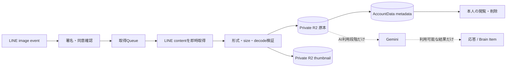

# LINE写真日記入力設計

## 1. 目的と所有範囲

この文書は、LINEの1対1トークから写真付き日記を受け付ける最初のmedia縦切りについて、取得、検証、保存、閲覧、削除、AI利用、安全境界を定義します。

この文書が所有する概念:

- LINE画像messageを写真日記として受け付ける範囲
- 写真原本、thumbnail、一時的なAI用派生物のライフサイクル
- LINE content取得、file検証、冪等性、失敗時の結果
- 第三者や子どもが写る写真、safety blockされた写真の利用境界
- 保存だけの段階とAI利用段階を分けるrelease gate

この文書が所有しない概念:

| 概念 | SSoT |
| --- | --- |
| テキスト日記のSession、Turn、AI応答 | [日記チャット実装設計](diary-chat-implementation-design.md) |
| Plan別の写真保存容量 | [サブスクリプション・料金プラン設計 §4.6](../product/subscription-plan-design.md#46-写真保存容量) |
| Source Recordの訂正、tombstone、派生物への削除波及 | [Source Recordのライフサイクル設計](../domain/source/source-record-lifecycle-design.md) |
| 本人データ特徴APIへ含める範囲 | [本人データ特徴API実装契約](../development/personal-data-export.md) |
| 規約version、再同意、公開手順 | [サービス利用規約・同意体験設計](../product/service-terms-consent-experience.md) |
| 動画、音声、file、location、stickerの導入判断 | [マルチモーダル入力残タスク](../development/multimodal-input-remaining-tasks.md) |

アバター画像はプロフィール表示専用です。アバター用R2 object、API、加工済み画像を写真日記へ流用しません。

## 2. 結論

最初に受け付けるmediaは、本人がLINE公式Accountとの1対1トークへ送った画像1件です。1つの画像messageを1つの写真日記として保存し、1件へ複数画像を束ねません。動画、音声、file、location、sticker、Webからの写真upload、診断の画像回答は対象外です。

公開は次の2段階に分けます。

| 段階 | 提供すること | 提供しないこと |
| --- | --- | --- |
| 保存段階 | LINE取得、検証、原本とthumbnailの保存、本人の閲覧と削除 | AI送信、AI応答、Brain Item、Vector、意味検索、写真の特徴API出力・binary export |
| AI利用段階 | Vertex AI Express ModeのGeminiによる写真日記への応答、許可された写真からのBrain Item生成 | 顔認識、人物特定、年齢・人種・健康・感情などの属性推定、学習目的の二次利用 |

保存段階を公開したことを理由に、AI利用段階を自動的に有効にしません。AI利用段階は、写真を含むAI利用を記載した規約version、AI利用量のPlan境界、安全性検証が揃った後に別のfeature flagで公開します。

## 3. LINE受付と取得

### 3.1 受付条件

次をすべて満たす場合だけ取得jobを作ります。

- raw bodyに対するLINE署名検証に成功している
- `source.type = user`の1対1トークである
- Accountを解決でき、現在の利用規約へ同意済みである
- `message.type = image`かつ`contentProvider.type = line`である
- Accountが写真保存容量を超えていない

Group、複数人トーク、外部URL provider、対象外mediaは取得しません。本人へ現在の対応範囲を固定文面で案内します。画像だけでも日記として保存でき、前後のテキストmessageを同じ写真のcaptionだとは推定しません。

### 3.2 即時取得と再試行

LINEはcontentの保存期間を保証せず、Webhookの再配送も到達を保証しません。このためWebhook handlerは署名と受付条件の確認後、取得jobを直ちにQueueへ投入します。handler内で画像全体のdownloadとdecodeを待ちません。

- `webhookEventId`をWebhook処理の冪等keyにする
- `message.id`をmedia取得と保存の冪等keyにする
- 再配送でも同じ`webhookEventId`と`message.id`から新しい写真を作らない
- 日記の発生時刻には再配送時刻ではなくWebhook eventの`timestamp`を使う
- timeout、429、5xx、network errorは指数backoffで最長1時間再試行する
- 404と410は再試行しない終端失敗とする
- 1時間で取得できなかった場合も終端失敗とし、本人へ写真を保存できなかったことと再送方法を案内する

取得期間を独自に仮定せず、LINEの[メッセージ受信ガイド](https://developers.line.biz/ja/docs/messaging-api/receiving-messages/)と[Messaging APIリファレンス](https://developers.line.biz/ja/reference/messaging-api/#get-content)を実装時の外部仕様として確認します。

## 4. file検証

取得したbytesは永続化前にServer側で検証します。HTTP header、拡張子、LINEが返した`Content-Type`だけを信用しません。

| 項目 | 受付条件 |
| --- | --- |
| 形式 | JPEG、PNG、静止WebP |
| 1件のsize | 10MB以下 |
| decode | 対応decoderで最後まで正常にdecodeできる |
| pixel数 | 幅 × 高さが4,000万pixel以下 |
| animation | 複数frameを持たない |
| 実形式 | magic bytes、decode結果、許可MIMEが一致する |

sizeは`Content-Length`だけでなく実際に読み取ったbytesでも上限を強制し、上限超過でdownloadを打ち切ります。無効な形式、壊れた画像、pixel上限超過、animationは原本として保存せず、一時bytesを破棄して本人へ対応形式と10MB上限を案内します。

JPEG、PNG、WebPを画像decoderへだけ渡し、埋め込みscriptや別形式を実行しません。初期対象に汎用file uploadはないため、画像以外を対象にしたmalware scannerは導入しません。対象形式を増やす場合は、その形式のthreat modelと検証を先に追加します。

## 5. 保存モデルと容量

### 5.1 原本と派生物

写真bytesは日記本文と同じAccountData SQLiteへ入れず、写真日記専用のPrivate R2 bindingへ保存します。AccountDataには、本人所有のSource Recordと、R2 objectを引く内部ID、message ID、MIME、bytes、width、height、取得時刻、状態だけを保存します。R2 keyと署名URLを本人コンテンツやログへ記録しません。

| 種類 | 用途 | metadata | 保持 |
| --- | --- | --- | --- |
| 原本 | 本人が証拠を含む送信内容をそのまま確認する | 受信時のEXIFを含み得る | 自動期限なし。本人削除またはAccount削除まで |
| thumbnail | 日記履歴の表示 | EXIFとGPSを除去 | 原本と同じ削除対象 |
| AI用派生物 | providerの入力上限に合わせた一時加工 | EXIFとGPSを除去 | 処理終了または失敗時に破棄し、永続保存しない |

原本を表示用やAI用に上書きしません。thumbnailとAI用派生物は原本から再生成可能なcacheとして扱い、正本にしません。外部へ返す画像responseは本人のsessionを認証し、`Cache-Control: private, no-store`と`X-Content-Type-Options: nosniff`を付けます。

### 5.2 容量判定

Planごとの上限は[サブスクリプション・料金プラン設計 §4.6](../product/subscription-plan-design.md#46-写真保存容量)を正とします。月間upload件数は制限しません。

同時取得が上限を超えないよう、AccountDataで現在使用量と進行中予約を同じtransactionで判定します。検証後の実bytesで予約を確定し、保存失敗時は予約を解放します。上限到達時は既存写真を削除せず、新規取得を開始せず、本人へ現在のPlanと削除またはPlan変更の選択肢を案内します。

## 6. 第三者、未成年者、安全性

### 6.1 第三者と子どもの写真

他人や子どもが写る日常写真も受け付けます。送信画面または初回案内で、送信者が必要な了承と権利を確認し、第三者のプライバシーや権利を侵害しないよう注意を表示します。運営者が被写体全員の同意を個別確認する機能は設けません。

追加の年齢確認は行いません。本人が未成年者など単独で同意できない場合に必要な同意を得る規則は、サービス利用規約の共通条件を適用します。子どもの通常写真を年齢推定や人物識別へ回しません。

### 6.2 保存とサービス利用を分離する

センシティブ、違法と判定されたもの、違法の疑いがあるもの、またはproviderのsafety policyで処理できない写真も、本人が送った証拠として原本を通常写真と同じPrivate R2へ保存します。safety判定だけを自動削除やAccount停止の根拠にはせず、本人の履歴から閲覧・削除できます。

`usage_eligibility`を保存状態と分け、次のように扱います。

| 状態 | 原本保存・本人閲覧 | AI・Brain・Vector・意味検索・推薦・学習 |
| --- | --- | --- |
| `unreviewed` | 可 | 保存段階では不使用。AI利用段階で最初の安全判定を伴う処理だけ許可 |
| `allowed` | 可 | AI利用段階の目的とPlan上限の範囲で可 |
| `blocked` | 可 | 不可。再送信や別modelによる回避も行わない |

`blocked`は、providerの安全拒否、決定的な安全検査、または適法な運用判断によって設定します。写真本文や安全判定の詳細を運用ログへ複製しません。運営者は通常運用で原本を閲覧せず、モデルへ顔認識、人物特定、年齢、民族、健康、障害、性的指向、感情などの推定を依頼しません。

本人の削除とAccount削除は`blocked`にも同じ規則で適用します。ただし、法令に基づく保存命令など有効なlegal holdがある場合は、その根拠と対象を通常データから分離して扱います。

### 6.3 【検討必須：法務】保存方針の公開前確認

違法と判定された画像も証拠として通常保存し、サービス機能では利用しない方針はプロダクト判断として確定しています。公開前に、日本法と実際の事業形態に照らして、少なくとも児童性的搾取画像、通報、削除要請、捜査照会、legal hold、利用者への表示、運営者が内容を認知した場合の手順を法務確認します。確認の入口には、[法務省による児童ポルノ禁止法改正の説明](https://www.moj.go.jp/KANBOU/KOHOSHI/no47/1.html)と[警察庁の違法情報対策](https://www.npa.go.jp/bureau/cyber/countermeasures/illegal-info.html)を使いますが、これらの公開情報だけで個別の保存・通報義務を推定しません。

法務確認は、本人が入力した内容を常時監視する機能や運営者の常時閲覧を自動的に導入する承認ではありません。必要な運用が確定した場合は、このSSoT、利用規約、プライバシー説明、アクセス監査、Runbookを同じreleaseより前に更新します。

## 7. AI利用段階

AI利用段階では、既存のVertex AI Express ModeのGeminiへ、本人が送った写真と現在の日記文脈を必要最小限で送ります。写真だけの送信にも日記として応答できます。画像からのBrain Item生成は通常の日記と同じSource由来を必須とし、画像だけから人物の内面や属性を断定しません。

写真入力に適用する同意と規約改定は[サービス利用規約・同意体験設計 §3.1](../product/service-terms-consent-experience.md#31-media入力を受け付ける前の重要改定)を正とします。

AI分析回数は写真保存容量と別のEntitlementとして扱います。上限に達しても写真の保存、閲覧、削除を止めず、固定文面で保存済みであることを案内します。具体的なPlan別回数はAI利用段階の実装前に決定します。

## 8. 閲覧、アクセシビリティ、削除

本人の日記履歴にはthumbnailと取得状態を表示します。写真だけの日記には「YYYY年M月D日の日記に添付された写真」という日付を含む汎用代替テキストを付けます。初期版ではcaption編集、AI生成の画像説明、音声による代替説明を提供しません。将来AI説明を表示する場合はAI生成であることを明示し、自動的にBrain Itemへ採用しません。

削除操作では、対象を同期的に閲覧、AI、Brain、Vector、検索から外し、次を24時間以内に物理削除します。

- 写真原本
- thumbnail
- 永続化されてしまった未完了の一時AI派生物
- 写真だけを根拠に生成したAI説明、Embedding、Brain Itemの利用可能な内容

画像と無関係な日記本文は残します。Source Recordの識別子、削除状態、派生関係はtombstoneとして保持し、本文やR2 keyを残しません。Account削除でも同じ対象を削除します。media専用の長期backupは新設せず、基盤上のbackupに含まれる場合は通常の保存期限で失効させ、本人向け機能へ復元しません。

初期版では写真のbinary exportを提供しません。本人データ特徴APIにも写真原本、thumbnail、EXIF、画像固有metadata、画像由来のAI派生物を含めません。正確なAPI境界は[本人データ特徴API実装契約 §2](../development/personal-data-export.md#2-データ境界)を正とします。

## 9. 観測と受け入れ条件

運用metricsには件数、bytes、処理時間、固定理由コードだけを使い、画像bytes、thumbnail、EXIF、LINE user ID、R2 key、署名URLを含めません。

- 同じWebhookまたはQueue jobが再配送されても写真、Source Record、使用量を重複させない
- 10MB超過、許可外形式、壊れた画像、4,000万pixel超過、animationを永続化しない
- LINE contentを取得できなかった場合に、保存済みと誤案内しない
- Plan上限を並行uploadで超えず、downgradeで既存写真を削除しない
- 別Accountから原本、thumbnail、metadataの存在を取得できない
- display用とAI用の派生物からEXIFとGPSが除かれる
- 保存段階ではprovider、Brain、Vectorへ画像を送らない
- `blocked`の写真をAI、Brain、Vector、意味検索、推薦へ再利用しない
- 削除直後に閲覧と利用を止め、24時間以内にR2と写真由来の派生内容を削除する
- 写真だけの日記を支援技術で日付と写真として識別できる
