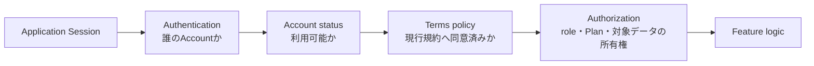
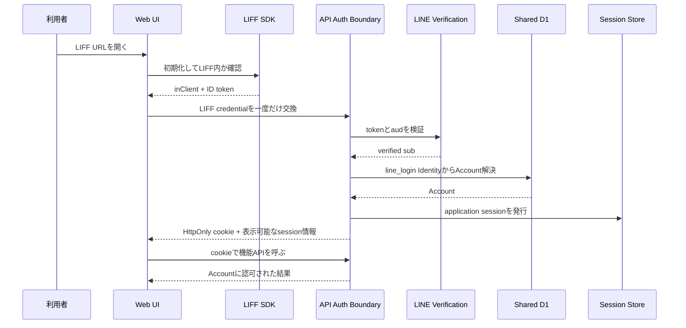
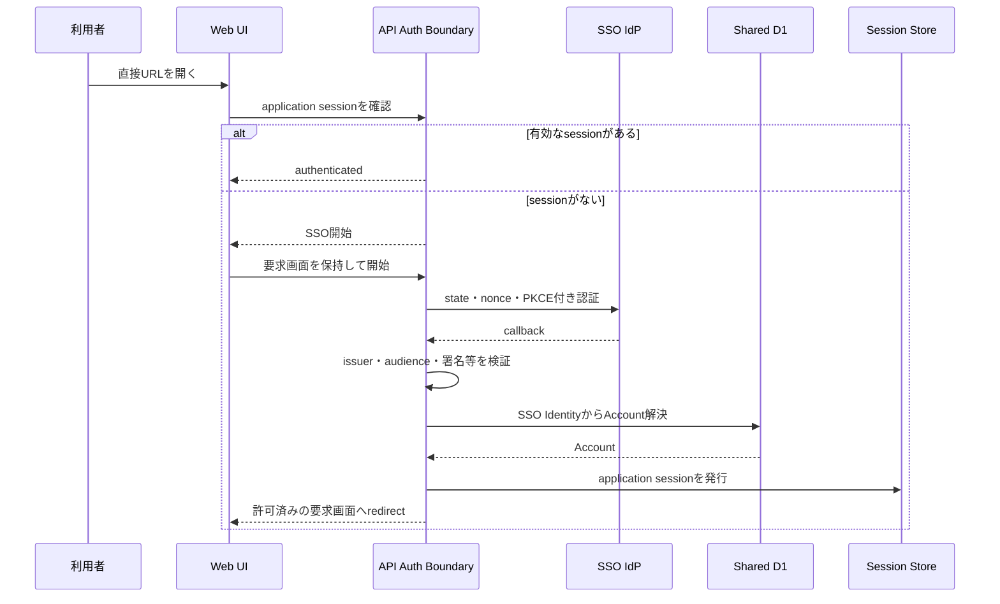
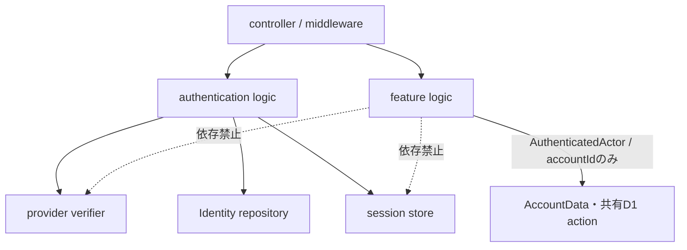

# Web認証・アプリケーションセッション設計

## 1. 目的と所有範囲

この文書は、Webを開いた実行環境に応じてLIFFまたは将来のSSOで本人確認し、どちらの認証結果も同じAccountとme-builderのアプリケーションセッションへ収束させる境界を定義します。

### 所有する概念

- LIFF内と外部ブラウザで認証入口を選ぶ規則
- 外部の認証証明を検証済みIdentityへ変換するadapter境界
- 検証済みIdentityからAccountを解決する境界
- 認証方式に依存しないアプリケーションセッションと`AuthenticatedActor`
- 認証、Account解決、利用規約同意、機能認可の責務分離

### 所有しない概念

- Phase 1で提供するログイン手段と、LINE内・外部ブラウザのプロダクト上の役割 — [プロジェクト概要](../product/project-overview.md)
- 認証前に要求された画面への復帰と、認証失敗時の画面遷移 — [全体画面遷移設計](../product/screen-navigation.md)
- AccountとIdentityのドメイン上の責務、不変条件 — [ドメイン設計](../domain/domain-design.md)
- LINE Account喪失時の本人確認とIdentity再接続 — [Account復旧設計](account-recovery-design.md)
- 実装の残タスク、依存順、各PRの完了条件 — [Web認証・SSO実装残タスク](../development/web-authentication-remaining-tasks.md)
- SSO製品、IdP、session storeの物理構造と整合性方式
- 個別APIのpath、request / response schema、cookie名、セッション有効時間の数値

SSO製品はこの設計では選定しません。外部ブラウザ用adapterは、OpenID Connect（OIDC）のAuthorization Code Flow + PKCE相当の性質を満たす認証結果を受け取れることを前提にします。SAMLしか提供しないIdPを採る場合も、アプリケーションからはOIDC等へ仲介する認証基盤の背後に置きます。

## 2. 結論

認証部分は切り出します。ただし、`LiffAuthProvider`を別のproviderへ丸ごと取り替える構造にはしません。LIFFとSSOは併存する入口adapterとし、検証後はme-builderが発行する同じアプリケーションセッションへ交換します。

```mermaid
flowchart LR
    U[Webを開く] --> R{実行環境を判定}
    R -->|LIFF内| LA[LIFF Auth Adapter]
    R -->|外部ブラウザ| SA[SSO Auth Adapter]
    LA -->|LIFF ID token| LV[LINE Credential Verifier]
    SA -->|認可code / assertion| SV[SSO Credential Verifier]
    LV --> VI[Verified External Identity]
    SV --> VI
    VI --> AR[Account Identity Resolver]
    AR --> AS[Application Session Issuer]
    AS --> C[HttpOnly session cookie]
    C --> M[Authentication Middleware]
    M --> AA[AuthenticatedActor]
    AA --> P[利用規約・role・所有権の認可]
    P --> F[診断・プロフィール・相性などの機能]
```



この構造では、各機能が知るのは`AuthenticatedActor.accountId`だけです。LIFF IDトークン、SSOの認可code、IdPのsubject、LINE LoginチャネルIDを診断やプロフィール等のlogicへ渡しません。

入口adapterを1つ選んで永久に固定するのではなく、次のように使い分けます。

| 実行環境 | 本人確認 | その後のAPI認証 |
| --- | --- | --- |
| LIFF内 | LIFF IDトークンをサーバーで検証 | me-builderのアプリケーションセッション |
| 外部ブラウザ | SSO adapterで認証 | 同じアプリケーションセッション |

Phase 1で外部ブラウザにLINE Loginを使う現在のプロダクト決定は、SSO導入までは維持します。SSO導入時は外部ブラウザのadapterだけを切り替え、LIFF内の入口と各機能の認可は変更しません。

## 3. 現状と変更理由

現在のWeb UIは`apps/web/src/feature/liff/`がLIFF初期化、外部ブラウザでの`liff.login()`、IDトークン取得をまとめて担当しています。取得したLIFF IDトークンを各featureが`Authorization: Bearer`で送っています。

API Serverでは各controllerがBearer tokenとLINE LoginチャネルIDをlogicへ渡し、多数のlogicファイルが`createLiffSession`へ依存しています。`createLiffSession`は名前と異なりサーバーセッションを発行せず、リクエストごとに次を行います。

1. LINEへIDトークン検証を委譲する
2. `line_login` IdentityからAccountを解決する
3. 現行利用規約への同意を確認する

この構造には次の問題があります。

- UIの各featureとAPIの各logicがLIFFという認証方式を知っており、SSO追加時の変更範囲が全機能へ広がる
- 外部IdPのtokenを各機能APIが直接受け取る構造を増やすと、検証規則とエラー処理がproviderごとに分散する
- 本人確認と利用規約同意が同じ`createLiffSession`に入り、未認証と未同意を区別しにくい
- 同じ外部tokenをリクエストごとに検証し、外部認証基盤の障害が認証済み利用者の全APIへ波及する
- provider tokenがWeb UIの多数のhookとAPI adapterを通るため、誤ったログ出力やURL混入を防ぐ範囲が広い
- LIFFから別AccountのSSOセッションが残るブラウザを開いた場合のAccount切替規則がない

## 4. 認証と認可の責務

### 4.1 Entry Auth Adapter

Web UIの認証入口だけを担当します。

- `LiffAuthAdapter`: LIFF SDKを初期化し、LIFF内であることとログイン状態を確認し、IDトークンを認証交換APIへ一度だけ渡す
- `SsoAuthAdapter`: 外部ブラウザをSSO開始処理へ遷移させ、callback後のアプリケーションセッション確認を行う

adapterはAccount IDを決めず、機能APIも呼びません。LIFFの`shareTargetPicker`など認証以外の機能は、LIFF capabilityとして残し、SSO adapterのinterfaceへ含めません。

Web UIが共有するinterfaceはprovider tokenの取得ではなく、アプリケーションセッションの確立を表します。

```ts
type AuthState =
  | { status: "checking" }
  | { status: "redirecting" }
  | { status: "authenticated"; profile: DisplayProfile }
  | { status: "unauthenticated" }
  | { status: "error"; reason: AuthFailureReason };

interface AuthEntryAdapter {
  establishSession(returnTo: string, signal: AbortSignal): Promise<AuthState>;
}
```

これは論理interfaceです。名前や配置は実装PRで既存のfeature規則に合わせます。各featureへ`acquireIdToken`を渡すinterfaceは廃止します。

### 4.2 Credential Verifier

外部provider固有の証明を検証し、共通の`VerifiedExternalIdentity`へ正規化します。

```ts
type VerifiedExternalIdentity = {
  providerKey: string;
  subject: string;
  authenticatedAt: Date;
  displayProfile?: DisplayProfile;
};
```

- LIFF verifierは現在と同じく、LINEが検証した`sub`と期待する`aud`を使う
- SSO verifierはissuer、audience、署名、有効期限、state、nonce、PKCEを検証する
- `subject`、provider token、認可codeはレスポンス、URL、Local Storage、ログへ残さない
- email、表示名、プロフィール画像はAccountの同一性判定に使わない
- `providerKey`は環境設定で管理する安定した内部キーとし、表示名や任意のissuer文字列を直接保存しない

### 4.3 Account Identity Resolver

検証済みの`providerKey + subject`だけを入力にし、共有D1のIdentityからAccountを解決します。現在の`account_identities`が持つ`provider + provider_account_id`の一意制約と`linkIdentity`は、この境界で再利用できます。

守る規則は次のとおりです。

- 同じ外部Identityを複数の有効なAccountへ紐づけない
- email、表示名、プロフィール画像の一致でAccountを自動統合しない
- 認証済みの既存Accountへ新しいIdentityを追加するときだけ`linkIdentity`を使う
- LIFFとSSOが別Accountへ解決された場合は自動統合しない
- SSOの未知Identityを新規Accountにするかは認証providerごとの登録policyで明示し、暗黙の`upsertIdentity`へ任せない

SSO初回導入は`link-only`を推奨します。既存利用者がLIFFで認証済みの設定画面からSSOを追加し、SSO側の再認証に成功した場合だけ同じAccountへIdentityを追加します。その後に外部ブラウザのSSOログインを有効化します。これにより、既存LINE利用者がSSOで別Accountを誤作成することを防ぎます。

SSOだけで新規登録できるようにする判断は別のプロダクト変更です。許可する場合も、既存Accountとの統合は自動化しません。

### 4.4 Application Session Issuer

外部providerのtokenを機能APIのcredentialにせず、Account解決後にme-builder専用の不透明なセッションを発行します。

- セッション参照は`HttpOnly`、`Secure`、`SameSite=Lax`、host-onlyのcookieへ保存する
- cookieはAPI hostだけへ送り、JavaScriptから読み取らせない
- session storeにはAccount ID、認証方式、認証時刻、発行時刻、有効期限、session version、CSRF検証情報、失効状態を保持する
- role、利用規約同意、Plan、データ所有権をcookieの権威ある値にしない
- セッション固定を防ぐため、認証交換、権限上昇、Identity再接続時にセッションをrotationする
- Account停止、Identity解除、復旧完了、明示logout時に関連セッションを失効できるようにする
- 絶対有効期限、idle期限、同時セッション数、session storeのkey構造と失効時の整合性方式は実装前に別途決定する

インフラ上のsession storeは[インフラ・システム構成](infrastructure-architecture.md)が割り当てるCloudflare KVを起点にします。KVの整合性だけでAccount停止、Identity解除、復旧完了時の即時失効を満たせない場合は、共有D1のsession version等による再検証を組み合わせます。安全上必要な失効をKVの反映待ちへ任せません。

WebとAPIは同一siteの別hostで配信されるため、WebのHTTP clientはAPI requestへ`credentials: "include"`を付けます。APIは許可済みWeb originを完全一致で返し、credential付きCORSを許可します。ワイルドカードoriginは使いません。

cookie認証へ移行するため、状態変更APIではsessionに結びついたCSRF tokenを専用headerで要求し、`Origin`も許可済みWeb originと一致することを確認します。`SameSite`だけを唯一のCSRF対策にしません。

### 4.5 Authentication Middleware

機能APIの手前に1つだけ置き、アプリケーションセッションを`AuthenticatedActor`へ変換します。

```ts
type AuthenticatedActor = {
  accountId: string;
  authenticationMethod: "liff" | "sso";
  authenticatedAt: Date;
};
```

middlewareはHTTP cookieとsession storeを知りますが、機能logicは知りません。controllerはmiddlewareが解決したactorをlogicへ渡し、logicはAccount IDを使って本人のAccountDataを選びます。

`authenticationMethod`は監査と再認証policyにだけ使います。診断、プロフィール、相性等の機能差分には使いません。

### 4.6 Policy / Authorization

本人確認後の判定を認証から分けます。



- 認証失敗は「本人を確認できない」結果にする
- Account停止、未同意、Plan不足、role不足、対象データを所有しない状態を未認証へまとめない
- 利用規約の取得・同意APIは認証だけを要求し、現行規約への同意を前提にしない
- 管理者roleは共有D1のAccountから判定し、SSO claimやクライアント表示を認可根拠にしない
- Account IDはURL、query、request bodyから本人指定として受け取らない

HTTP statusとerror bodyの具体的な変更は各API契約で決定します。

## 5. 実行環境ごとのフロー

### 5.1 LIFF内



LIFF内ではLIFFを本人確認の正とします。既存のSSOセッションcookieが同じWebViewに残っていても、LIFF Identityの確認を省略しません。

- 既存セッションとLIFF Identityが同じAccountならsessionを再利用またはrotationする
- 別Accountなら自動linkせず、LIFF側Accountの新しいsessionへ切り替える
- 切替時は、Web UIが保持する以前のAccountのプロフィール、取得済みデータ、戻る履歴を破棄する
- LIFF初期化または検証に失敗したとき、SSOへ自動fallbackしない。再試行と外部ブラウザで開く案内を表示する

最後の規則は、LIFF内で別のSSO Accountへ黙って切り替わり、以前のAccountの画面を表示する事故を防ぐためです。

### 5.2 外部ブラウザ



外部ブラウザではLIFF SDKの`liff.login()`を呼びません。認証前の要求画面は、改ざんできる絶対URLではなく、許可された相対pathとして認証transactionまたはサーバー側stateへ保持します。callback後も対象データの公開状態、所有権、roleを再認可します。

SSOが未導入の環境では、現在のLINE Login adapterを外部ブラウザ用として維持できます。ただし、機能APIへLIFF IDトークンを直接送る方式は維持せず、同じアプリケーションセッションへ交換します。

## 6. 実装上の配置

### Web UI

```text
apps/web/src/
├── feature/
│   ├── auth/
│   │   ├── model/               # AuthState、失敗理由、表示可能なsession情報
│   │   ├── presentation/        # AuthGate、provider非依存のcontext / hook
│   │   └── infrastructure/
│   │       ├── auth-session-api.ts
│   │       ├── liff-auth-adapter.ts
│   │       └── sso-auth-adapter.ts
│   └── liff/
│       └── infrastructure/      # shareTargetPicker等、LIFF固有capability
└── infrastructure/
    └── http-client.ts           # cookie、CSRF、401の共通処理
```

- `LiffSessionProvider`をprovider非依存の`AuthSessionProvider`へ置き換える
- `useLiffSession().acquireIdToken`を各画面へ渡さない
- featureのAPI adapterはtoken引数を受け取らず、共通HTTP clientを使う
- 共通HTTP clientが`credentials`とCSRF headerを付ける
- LIFFプロフィールは認証交換後のsession情報を表示の正とし、SDKから得た`userId`は引き続き扱わない

### API Server

```text
apps/api/src/
├── controller/
│   └── auth.ts                  # 認証交換、SSO開始・callback、session確認、logout
├── middleware/
│   ├── authentication.ts        # session cookieからAuthenticatedActorを解決
│   └── authorization.ts         # terms、role等の共通policy
├── logic/
│   └── authentication/          # Identity解決、link policy、session発行・失効
└── infrastructure/
    └── authentication/
        ├── line-verifier.ts
        ├── sso-client.ts
        └── session-store.ts
```

配置名は既存規則へ合わせて実装時に調整できますが、依存方向は固定します。



`logic/liff-session.ts`の責務は、LINE credential交換側と共通authentication middlewareへ分割します。各feature logicから`idToken`、`lineLoginChannelId`、`createSession` dependencyを削除します。

OpenAPIのsecurity schemeは`liffIdToken`からprovider非依存のアプリケーションセッションへ変更します。認証交換APIだけがLIFFまたはSSO固有の証明を受け取ります。

## 7. 移行計画

実装はAPI共通認証、Web／LIFF移行、SSO追加の3系列に分けます。番号付きのPR境界、依存順、各PRの完了条件は[Web認証・SSO実装残タスク](../development/web-authentication-remaining-tasks.md)を正とします。この文書には進捗やPR番号を重複して持ちません。

## 8. テストと完了条件

### 境界テスト

- LIFF内ではLIFF adapterだけを選び、SSO開始処理を呼ばない
- 外部ブラウザではSSO adapterだけを選び、`liff.login()`を呼ばない
- LIFFとSSOの検証結果が共通の`VerifiedExternalIdentity`へ正規化される
- 未検証のsubject、email、クライアント入力のAccount IDからAccountを解決しない
- 未知のSSO Identityは`link-only`期間中にAccountを作らない

### セキュリティテスト

- provider token、認可code、subject、session参照がURL、Local Storage、レスポンス本文、ログへ出ない
- SSO callbackでstate、nonce、PKCE、issuer、audienceの不一致を拒否する
- credential付きCORSは許可済みWeb origin以外を拒否する
- 状態変更APIはCSRF tokenとOriginの不一致を拒否する
- logout、Account停止、Identity再接続後の失効sessionを拒否する
- roleと利用規約同意を古いsession情報だけで許可しない

### 体験テスト

- 認証前の診断、相性招待、プロフィール、管理者URLへ認証後に復帰する
- LIFF Identityと既存SSO sessionが別Accountなら、LIFF側へ安全に切り替え、以前の画面データを表示しない
- 認証失敗、Account未解決、未同意、権限不足を区別して表示する
- LIFFまたはSSOが一時的に失敗しても白画面にせず、同じ方式の再試行を提示する

## 9. 実装前に決めること

次は、このアーキテクチャを変えずに後続で決定できます。

- 採用するSSO製品、OIDC issuer、client登録とSecret配布方法
- SSOだけの新規Account作成を許可する時期と対象
- Cloudflare KVのkey構造、即時失効を担う共有D1のsession version、絶対期限、idle期限、同時session数
- logoutをme-builderだけにするか、IdPのlogoutまで連動するか
- 再認証を要求する操作と認証からの最大経過時間
- 既存利用者へSSO Identity追加を案内する画面と段階公開方法

SSO製品を決める前でも、[Web認証・SSO実装残タスク](../development/web-authentication-remaining-tasks.md)のA・B系列はLIFFだけで実装でき、各featureから認証provider依存を除去できます。
