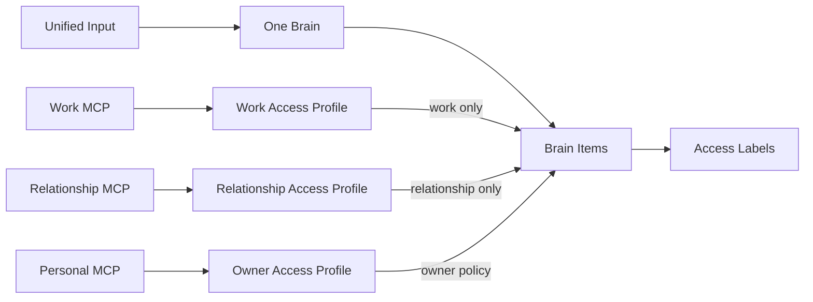

# Brainのラベル・アクセス制御設計

## 1. 結論

仕事、恋愛、プライベートごとに入口やBrainを分けず、**1つのBrainへ統一して情報を入力する**構成にします。

Brain内の情報には用途を表すAccess Labelを付けます。MCPなど外部から利用するときだけAccess Profileを適用し、許可されたラベルの情報だけを検索します。

- 入力の入口は1つにする
- MemoryなどのBrain Itemも重複させず一元管理する
- `work`、`relationship`、`private`はBrainの種類ではなくAccess Labelとして扱う
- MCP接続はBrain全体ではなくAccess Profileを通して利用する
- 未分類データは本人だけが確認でき、外部MCPへは提供しない
- ラベル判定前の本文をLLMや外部検索サービスへ送らない

この文書が扱うAccess Labelは、Brain Itemだけでなく[Source domain](domain-design.md#5-source-domain)のSource Recordにも適用します。文書名はBrainだけを対象としていた時点のものなので、BrainとSourceに共通のSSoTとして改名する方針です。改名と参照の更新は機械的な変更になるため後続の変更で行い、この文書の節番号と節構成は維持します。

## 2. 全体像

`Work Access Profile`は入力先ではなく、外部利用時のフィルターです。ユーザーは通常、WorkやPrivateを選んでから質問へ答える必要はありません。

## 3. 2種類のラベル

通常のタグとアクセス制御用ラベルを分離します。

| 種類 | 目的 | 例 | 認可に使うか |
| --- | --- | --- | --- |
| Topic Label | 検索、整理、関連度 | `career`、`family`、`travel` | 使わない |
| Access Label | 利用可能な用途の制御 | `work`、`relationship`、`private` | 使う |

`career`というTopic Labelが付いているだけで、仕事用MCPへ公開してはいけません。認可では、本人が確認できるAccess LabelとAccess Policyを参照します。

Access Labelは単なる文字列タグではなく、ドメイン上の認可ラベルです。追加・変更履歴、変更主体、確認状態を管理し、Disclosure Policyが必ず強制します。

## 4. Brain ItemのAccess Policy

すべてのBrain ItemにAccess Policyを適用します。Brain Itemの分類は[Brain内部情報の分類](brain-content-taxonomy.md)をSSoTとします。

主な要素:

- 許可するAccess Labelの集合
- 機微度: `normal` / `sensitive` / `highly_sensitive`
- 外部MCPへの提供可否
- 一時的な許可と有効期限
- 明示的な拒否
- ラベルを本人が確認したか

例:

| Brain Item | 分類 | Topic Label | Access Label | 外部提供 |
| --- | --- | --- | --- | --- |
| TypeScriptが得意 | Capability | `skill` | `work`、`private` | 可 |
| 誠実さを大切にする | Value / Motivation | `value` | `work`、`relationship`、`private` | 可 |
| 給与より成長を優先する | Decision Criterion | `career` | `work` | 可 |
| パートナーとの約束 | Goal | `relationship` | `relationship` | 接続先による |
| 家族の病歴 | Memory | `family`、`health` | `private` | 不可 |
| 住所 | Identity | `profile` | `private` | 原則不可 |

複数用途で利用する情報には、複数のAccess Labelを明示的に付けます。新しいAccess Labelを作っても、既存情報へ自動的には追加しません。

Source RecordにもAccess Labelを付けます。既定値は[§6](#6-ラベル付与)で定義します。Source Recordに対して機微度や外部提供可否をどこまでBrain Itemと同じ形で扱うかは、外部連携の設計とあわせて後続で決めます。

## 5. Access Profile

Access Profileは、MCPやエージェントがBrainをどの用途で利用できるかを定義します。

Access Profileでは、次の内容を設定します。

- 表示名と目的
- 許可されたAccess Label
- 利用可能な機能
- 許可できる最大機微度
- 外部提供を拒否された情報の扱い

初期プリセット候補:

- Work Profile: `work`
- Relationship Profile: `relationship`
- Owner Profile: 本人向け。外部提供不可の情報を含め、本人の設定範囲で利用する

Access Profileは複数ラベルを許可できますが、許可ラベルを増やす操作は権限拡大として本人へ明示します。

Brain Itemの根拠・反証のエッジとConfidenceをどの粒度で開示するかは、Access Profileの設定項目にせず固定の規則としています。規則とその根拠は[根拠・反証・改訂のエッジ設計 §6](evidence-edge-design.md#6-外部への開示)をSSoTとします。

## 6. ラベル付与

### 取り込み時と導出時の既定値

**確定**: 取り込んだ時点と導出した時点の既定Access Labelを次のとおりとします。

| 対象 | 既定のAccess Label |
| --- | --- |
| Source Record | `private` |
| Source Recordから導出されたBrain Item | `unclassified` |

根拠:

- Source Recordは原本です。[プロジェクト概要 §3.2](project-overview.md#32-mcpでエージェントへ提供する)は「可能な限り写真や音声などの原本ではなく、本人が確認できる要約・特徴・回答を提供します」としており、原本を外部MCPへ出さない方針です。`private`を許可する外部向けAccess Profileは[§5](#5-access-profile)の初期プリセットに存在しません。これは意図した状態です
- 導出されたBrain Itemの`unclassified`は、後述の「確信できない場合」の定義をそのまま適用したものです。本人の確認を経て`work`や`relationship`へ広がります
- どちらも[プロジェクト概要 §8](project-overview.md#8-プライバシーと安全性)の「初期状態は非公開とし、外部提供は明示的な同意を必要とする」と整合します

### 入力時

ユーザーに毎回用途を選ばせません。質問、入力チャネル、内容からシステムがAccess Labelを提案します。

### 確信できない場合

`unclassified`として扱い、本人が確認するまで外部MCPへ提供しません。AIが確信度だけを理由に公開してはいけません。

### 複数用途に関係する場合

複数のAccess Labelを提案できます。機微な情報を含む場合は、安全側のラベルと外部提供拒否を優先します。

### ユーザーによる変更

ユーザーはラベルを確認・変更できます。公開範囲が広がる変更では、影響するMCP接続先を表示して確認を取ります。

## 7. MCP接続

各MCP接続には1つのAccess Profileを適用します。具体的な接続モデルと権限項目は後続で設計します。

仕事用MCPの検索手順:

1. MCP接続を認証する
2. Work Access Profileを確定する
3. 要求された操作が接続に許可されているか確認する
4. `work`が明示されたBrain Itemだけを検索候補にする
5. 機微度、外部提供可否、拒否ルールを評価する
6. 許可されたBrain Itemだけを検索・モデル入力に使う
7. 使用したBrain Itemと結果を監査ログへ記録する

全データを検索してから結果を隠すのではなく、**検索候補を作る時点で許可されていない情報を除外する**必要があります。

## 8. 派生情報の扱い

AIがMemoryから要約やDecision Criterionなどを作る場合も情報漏えいに注意します。

- 派生したBrain Itemは、元情報の最も厳しいAccess Policyを引き継ぐ
- AIだけでAccess Labelを減らして公開範囲を広げない
- 機微な元情報から安全な表現を作る場合は、新しいBrain Itemとして本人が承認する
- 派生情報から非公開情報の存在や内容を推測できる場合は公開しない

たとえば恋愛相談から「対話を重視する」というValueを推定しても、自動的に`work`を追加しません。本人が内容を確認し、仕事でも使うと許可した場合だけ共有します。

改訂で置き換えられた旧版へこの引き継ぎをどう適用するかは、[根拠・反証・改訂のエッジ設計 §7](evidence-edge-design.md#7-改訂された旧版の扱い)で扱います。

## 9. 不変条件

- 入力入口は用途別に分割しない
- Topic Labelはアクセス許可を与えない
- `unclassified`なBrain Itemは外部MCPへ提供しない
- Access Profileで許可されていないラベルの情報を検索しない
- 拒否ルールは許可ルールより優先する
- 非公開情報の存在自体を許可されていない接続先へ示さない
- 派生情報のAccess Policyを元情報より自動的に緩くしない
- 新しいAccess Labelへ既存情報を自動公開しない
- ラベル変更後の外部アクセスを監査できる

## 10. MVP

- 1つのBrainと1つの入力体験
- `work`、`relationship`、`private`のAccess Label
- Topic Labelとの明確な分離
- `unclassified`状態
- `normal` / `sensitive`の2段階の機微度
- 外部MCPへの提供可否
- Work、Relationship、OwnerのAccess Profile
- MCP接続ごとに1つのAccess Profile
- 認可ラベルによる検索前フィルター
- ユーザーによるラベル確認・変更
- MCPアクセスの監査ログ

高度なポリシー言語、ユーザー独自Access Label、ラベルの自動学習は後続機能とします。

## 11. 今後決めること

1. 質問内容からAccess Labelの初期候補を決める方法
2. ユーザーにラベル確認を求めるタイミング
3. `relationship`を`private`から独立させるか
4. 1つのMCP接続に複数Access Profileを許可するか
5. Brain Itemの一部だけを別用途へ公開できるようにするか
6. ラベル変更後のキャッシュと外部提供済みデータの扱い
7. Owner Profileでも表示しない封印データが必要か
