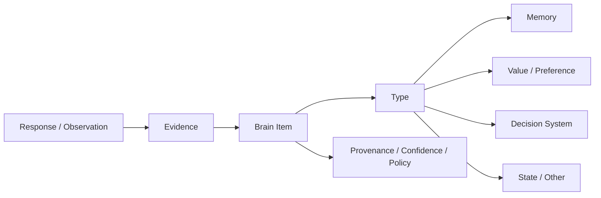

# Brain内部情報の分類

## 1. 目的

Brainが保持する情報を、Memoryだけにまとめず、その役割に応じて分類します。この分類はドメイン上の意味を整理するものであり、テーブルや保存形式を決定するものではありません。

## 2. 推奨する分類

Brainの内部情報を、次の10種類に分けます。

| 分類 | 答える問い | 代表例 |
| --- | --- | --- |
| Identity | 自分は誰か | 役割、所属、自己認識、人生のテーマ |
| Memory | 何があった・何を覚えているか | 出来事、経験、過去の選択、習得した事実 |
| Belief | 何が正しい・事実だと思うか | 信念、仮説、世界観、因果関係の理解 |
| Value | 何を大切にするか | 誠実さ、自由、安定、成長、公平性 |
| Preference | 何を好む・避けるか | 好き嫌い、快適な働き方、苦手な表現 |
| Goal | 何を実現したいか | 目標、意図、計画、約束、期限 |
| Decision System | どのように選ぶか | 判断基準、制約、優先度、トレードオフ、意思決定ルール |
| Capability | 何ができるか | スキル、知識、経験レベル、利用可能な手段 |
| Behavior Style | どのように行動・表現するか | 習慣、口調、コミュニケーション、ストレス時の反応 |
| Current State | 今どういう状態か | 気分、体力、関心、現在地、直近の状況 |

人間関係については独立した型を増やすのではなく、各情報に`Subject / Related Person`を持たせます。たとえば、パートナーとの出来事はMemory、関係で大切にすることはValue、相手への約束はGoal、越えてほしくない線はDecision System内のConstraintとして表現できます。

## 3. 各分類の詳細

### Identity

比較的長期にわたる自己像です。

- 名前やプロフィール
- 職業、家族内の役割、所属
- 自認している性格
- 「自分はこういう人でありたい」という自己物語

外部プロフィールとして公開できるIdentityと、本人だけが持つ自己認識は、同じ公開範囲にしません。

### Memory

過去に起きたことや、本人が覚えている内容です。

- Episodic Memory: いつ、どこで、誰と、何が起きたか
- Semantic Memory: 自分や周囲に関する事実
- Decision Record: 何を選び、なぜ選び、結果がどうだったか

過去のDecision RecordはMemoryです。今後の選び方を定めるDecision Policyとは分離します。

### Belief

本人が真実、妥当、可能性が高いと考えている内容です。

- 「少人数のチームの方が意思決定が速い」
- 「率直な対話は長期的な信頼につながる」
- 「この施策は顧客の離脱を減らすはずだ」

Beliefは事実とは限らないため、確信度、根拠、反証、最終確認時点を持てるようにします。

### Value

本人が大切にする抽象的な原則です。

- 誠実さ
- 自由
- 安定
- 成長
- 家族
- 社会への貢献

Valueは複数用途で共有されやすい一方、仕事や恋愛などの利用場面によって優先順位が異なる場合があります。

### Preference

Valueより具体的な好みや回避傾向です。

- テキストで考えを整理したい
- 大人数より少人数を好む
- 辛い食べ物が苦手
- 突然の予定変更を避けたい

Preferenceには強さ、適用条件、例外を持たせます。一度の選択だけで恒久的なPreferenceにしません。

### Goal

未来に向けた意図です。

- 長期目標
- 短期目標
- 現在の計画
- 他者との約束
- やらないと決めたこと

Goalには状態、期限、優先度、対象領域を持たせます。達成・中止したGoalは、必要に応じてMemoryへ結果を残します。

### Decision System

状況と選択肢から、本人らしい選択を組み立てる仕組みです。

| 要素 | 役割 | 例 |
| --- | --- | --- |
| Criterion | 選択肢を評価する軸 | 収入、成長、安心、家族との時間 |
| Constraint | 選択肢を除外する絶対条件 | 違法なことはしない、転居はしない |
| Priority | 基準やGoalの優先順位 | 今は収入より学習機会を優先する |
| Trade-off | 何と何をどこまで交換できるか | 給与が少し下がってもリモート勤務を選ぶ |
| Risk Attitude | 不確実性への姿勢 | 生活に影響する判断は慎重にする |
| Time Horizon | どの時間軸を重視するか | 短期利益より3年後の成長を重視する |
| Heuristic | 素早く選ぶための経験則 | 迷ったら小さく試せる方を選ぶ |
| Decision Policy | 上記を組み合わせた選択ルール | 転職先を評価する手順と優先順位 |

### 判断基準と意思決定の違い

判断基準は「何を評価するか」です。意思決定は、複数の判断基準に制約、優先度、利用場面、Current Stateを加えて、最終的な選択へ変換するプロセスです。

例:

```text
判断基準:
- 成長機会
- 収入
- 働く場所の自由

意思決定Policy:
1. フルリモート不可なら候補から外す
2. 必要最低収入を満たすか確認する
3. 残った候補は成長機会を最優先する
4. 差が小さければ、小さく試せる方を選ぶ
```

この構造により、「収入を重視する」という1つの基準だけで、本人の意思決定全体を説明してしまうことを防げます。

### Capability

本人が現在できること、知っていること、利用できる手段です。

- 技術や資格
- 実務経験
- 得意・不得意
- 利用できる時間、道具、支援者

Capabilityは自己評価と確認済み実績を区別します。「できること」と「好んで行うこと」も分離します。

### Behavior Style

繰り返し現れる行動・表現パターンです。

- 丁寧で簡潔な文章を好む
- 意見の対立時に一度考える時間を置く
- 緊張すると情報を集めすぎる
- 朝に集中しやすい

本人の明示的な方針と、観察から推定したパターンを区別します。

### Current State

現在または短期間だけ有効な状態です。

- 今日の気分や体調
- 今週の忙しさ
- 現在検討しているテーマ
- 一時的な場所や同行者

Current Stateには有効期限を設け、期限切れの状態を恒久的なPreferenceやIdentityとして扱いません。

## 4. 分類とは別に持つ共通属性

すべてのBrain Itemは、種類とは別に次の情報を持つ必要があります。

| 共通属性 | 目的 |
| --- | --- |
| Access Policy | Access Label、機微度、外部提供可否などを使って利用範囲を制御する |
| Sensitivity | 機微度を表す |
| Provenance | 本人入力、代理入力、インポート、AI推定などの由来を表す |
| Evidence | 根拠となるResponse、Memory、観察を示す |
| Confidence | 確信度や推定の強さを示す |
| Confirmation | 本人が確認・却下したかを示す |
| Valid Time | いつの時点で有効だったかを示す |
| Stability | 一時的、変化しやすい、安定的を区別する |
| Revision | 修正や撤回の履歴を追えるようにする |
| Related Subject | 誰についての情報かを示す |
| Topic Label | 検索・整理に使う。アクセス制御には使わない |

`AIが推定したValue`と`本人が明言したValue`は、同じValue型でも信頼性が異なります。分類だけでなく、Provenance、Evidence、Confirmationを必ず評価します。

## 5. ResponseとInsightの位置づけ

`Response`はBrain Itemの分類ではなく、本人から情報を得た原資料です。1つのResponseから、Memory、Value、Preference、Decision Criterionなど複数のBrain Itemが作られることがあります。

`Insight`も内容分類ではなく、複数のEvidenceから導いた推定であることを示す状態です。Insightの内容自体はValue、Preference、Behavior Styleなどのいずれかに分類します。



## 6. Access Labelとの関係

Brain Itemの分類とAccess Labelは別の軸です。入力時の入口を分けず、外部利用時にAccess Profileで絞り込みます。

- `Value`だから全用途へ公開する、とは限らない
- `Memory`だからPrivateに限定する、とは限らない
- 同じDecision Criterionでも、WorkとRelationshipで優先度が異なる場合がある
- Current Stateは特定用途だけに影響させる場合がある

各Brain ItemにAccess LabelとAccess Policyを適用し、MCP接続先のAccess Profileと組み合わせて利用可否を判断します。Topic Labelはこの判定に使用しません。

例:

| Brain Item | 分類 | Access Label |
| --- | --- | --- |
| 誠実さを大切にする | Value | Work、Relationship、Private |
| 給与より成長機会を優先する | Decision Criterion | Work |
| パートナーとの約束 | Goal | Relationship |
| 家族との出来事 | Memory | Private |
| 今週は疲れている | Current State | Private、必要な場合だけWork |

## 7. 意思決定の組み立て方

Brainが判断を求められたときは、次の順序で情報を使います。

1. AgentConnectionとAccess Profileから利用可能なBrain Itemだけを選ぶ
2. Situationと選択肢を明確にする
3. Constraintに違反する選択肢を除外する
4. 有効なGoalとCommitmentを確認する
5. Criterion、Priority、Trade-offで選択肢を比較する
6. BeliefとMemoryを根拠として結果を補強する
7. Current Stateによる一時的な影響を分けて示す
8. 選択、理由、Evidence、不確実性を返す

生成した結論を自動的に恒久的なDecision Policyへ追加しません。本人が選択した結果はDecision RecordとしてMemoryへ残し、既存Policyの見直し材料にできます。

## 8. 矛盾と優先順位

人は矛盾したValueやPreferenceを持ちます。上書きして1つに統合せず、利用場面、時点、確信度、Evidenceとともに保持します。

意思決定時の基本的な優先順は次のとおりです。

1. 安全・法令・本人が設定した禁止事項
2. 利用場面固有のConstraint
3. 明示的なCommitment
4. 現在有効なGoal
5. Criterionの優先度とTrade-off
6. Preference
7. Heuristic

この優先順自体も将来は本人ごとのDecision Policyとして表現できます。

## 9. MVPで扱う分類

最初から10種類すべてを高度に実装せず、MVPでは次に絞ります。

- Memory
- Value
- Preference
- Goal
- Decision Criterion
- Constraint
- Current State

Identityは基本プロフィール、Capabilityはプロフィール上のスキル、Behavior Styleは確認済みInsightとして簡易的に扱います。複雑なTrade-offやDecision Policyの自動生成は、十分なEvidenceが集まった後に追加します。

## 10. 今後決めること

1. Brain Itemの分類をユーザーへどこまで見せるか
2. 1つのBrain Itemに複数分類を許すか、主分類を1つにするか
3. ValueやDecision Criterionの利用場面別優先度をどう表現するか
4. Current Stateの有効期限を誰が決めるか
5. 矛盾したBrain Itemを統合せず提示するUI
6. Decision Policyを本人が直接編集できるようにするか
7. AI推定をどの時点でBrain Itemとして有効化するか
