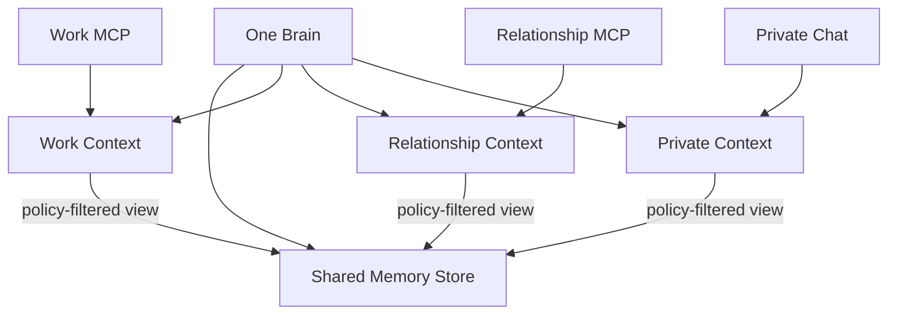

# BrainのContext・Memory設計

## 1. 結論

仕事、恋愛、プライベートごとに独立したBrainを作るのではなく、**1つのBrainが共有Memoryと複数のBrain Contextを持つ**構成を採用します。

- Memoryは重複させず、Brain内で一元管理する
- `Work`、`Relationship`、`Private`などのBrain Contextが、振る舞いと利用可能なMemoryの範囲を定義する
- タグは検索や整理に使い、アクセス制御には使わない
- MCPはBrain全体ではなく、必ず特定のBrain Contextへ接続する
- Memoryへのアクセスは初期状態で拒否し、明示的に許可されたものだけを提供する

この方式なら、共通する記憶を複製せずに利用しながら、プライベートな情報が仕事用MCPへ漏れることを防げます。

## 2. なぜBrainを分けないのか

仕事Brain、恋愛Brain、Private Brainを完全に分けると、同じ人物の基本的な価値観や経験が重複します。コピーされたMemoryは、修正漏れ、内容の矛盾、削除漏れを起こします。

一方、すべてを1つの検索対象にすると、家族との出来事、恋愛相談、健康上の悩みなどが仕事用エージェントへ渡る危険があります。そのため、情報の保存単位と利用時の見え方を分離します。



Brain ContextはMemoryを所有する箱ではなく、共有Memoryに対する安全なViewです。

## 3. 中核となる概念

### Brain

1人のSubjectを表現する頭脳です。MemoryとBrain Contextを束ねます。

### Brain Context

Brainを特定の目的・場面で利用するための文脈です。初期プリセットとして、仕事やキャリア向けの`Work`、恋愛やパートナーとの関係向けの`Relationship`、家族、友人、趣味、日常生活向けの`Private`を想定します。

カテゴリを固定しすぎず、将来は`Health`、`Creative`、`Public Profile`やユーザー独自Contextを追加できる設計にします。

Brain Contextが持つ概念:

- `BrainContextId`
- 表示名と目的
- そのContextらしい口調・判断方針
- Memoryアクセスに対するContext側の制約
- 利用可能な機能
- 状態: `active` / `archived`

### Memory

SubjectについてBrainが保持し、後から検索・利用できる情報単位です。事実、経験、好み、価値観、関係などを表します。

Memoryは、元のResponse、ユーザー入力、インポート、AIによる推定などの由来とEvidenceを失わないようにします。

## 4. タグとAccess Policyを分ける

タグだけで公開可否を決めてはいけません。

| 仕組み | 目的 | セキュリティ境界として使うか |
| --- | --- | --- |
| Topic Tag | `career`、`family`、`travel`などの分類・検索 | 使わない |
| Relevance | どのContextで役立つか | 単独では使わない |
| Sensitivity | 情報の機微度 | Access Policyの判定材料にする |
| Context Access | どのBrain Contextから利用できるか | 使う |
| Agent Scope | 接続先が実行・取得できる機能 | 使う |

タグは付け忘れや誤分類が起こります。`private`タグがないことを理由に仕事用MCPへ公開してはいけません。Memoryごとに、タグとは別の強制的な`ContextAccessPolicy`を持たせます。Brain Context側の制約とMemory側のPolicyが異なる場合は、より厳しい条件を適用します。

### Context Accessの例

| Memory | Topic Tag | Context Access |
| --- | --- | --- |
| 得意なプログラミング言語 | `career`、`skill` | Work、Private |
| 好きな食べ物 | `food` | Work、Relationship、Private |
| パートナーとの相談内容 | `relationship` | Relationshipのみ |
| 家族の病歴 | `family`、`health` | Privateのみ、外部Agent不可 |
| 住所 | `profile` | Privateのみ、原則MCP提供不可 |

同じタグを持つMemoryでも、公開範囲は異なります。

## 5. Context Access Policy

Memoryの利用可否は、少なくとも次の情報で判定します。

- 許可されたBrain Context
- 機微度: `normal` / `sensitive` / `highly_sensitive`
- 外部Agentへの提供可否
- 利用目的
- 有効期限または一時的な許可
- ユーザーによる明示的な拒否

基本ルール:

1. 作成元Contextが明確なMemoryは、そのContextだけに初期許可する
2. 作成元ContextがないMemoryは未分類とし、本人が分類するまでMCPへ提供しない
3. ユーザーが共有を確認したMemoryだけを複数Contextで利用できる
4. `highly_sensitive`は、明示的な個別許可なしに外部Agentへ提供しない
5. 拒否ルールは許可ルールより優先する
6. Contextが未指定の要求は拒否する
7. タグやAIの推定だけでAccess Policyを緩和しない

`Universal`という特別なContextを作るより、複数Contextへの明示的な許可として表現します。新しいContextを追加しただけで既存Memoryが自動公開されることを防ぐためです。

## 6. MCP接続

AgentConnectionは`BrainId`だけでなく、必ず`BrainContextId`を対象にします。

```text
AgentConnection
├── AccountId
├── BrainId
├── BrainContextId: Work
├── Agent Client
├── Scope: profile:read, memory:search
└── Expiration
```

仕事用MCPの検索手順:

1. Agent ClientとAgentConnectionを認証する
2. 接続先が`Work Context`であることを確定する
3. 要求された操作がAgent Scopeに含まれるか確認する
4. Work Contextからアクセス可能なMemoryだけを検索対象にする
5. Sensitivityと外部提供可否を追加で評価する
6. 許可されたMemoryだけをモデルへ渡す
7. 利用したMemoryと結果を監査ログへ記録する

全Memoryを検索してから結果を隠すのではなく、**検索候補を作る時点で許可されていないMemoryを除外する**必要があります。許可されていない本文をLLMや外部検索サービスへ送ってはいけません。

## 7. Response、Memory、Insightの関係

| 概念 | 役割 | 例 |
| --- | --- | --- |
| Response | 質問に対する元の回答 | 「チームでは文章で合意を残したい」 |
| Memory | 後から利用可能な記憶単位 | 「チームの合意は文章で残すことを好む」 |
| Insight | 複数の根拠から導いた推定 | 「非同期コミュニケーションを好む傾向がある」 |

ResponseはEvidenceとして保持され、そこからMemoryやInsightを作成できます。AIが作成したMemoryやInsightは推定であることを明示し、本人が確認・却下できるようにします。

### 推定情報の機密性

Insightや要約は、元のMemoryより安全とは限りません。恋愛相談を要約しても、その内容が仕事向けに公開可能になるわけではありません。

- 派生情報は、原則としてEvidenceの最も厳しいAccess Policyを引き継ぐ
- 複数Contextで利用する場合は、ユーザーが内容と公開先を確認する
- 機微なEvidenceから安全な表現へ変換する場合は、新しいMemoryとして作成し、明示的に承認する
- 派生情報から非公開のEvidenceを推測できる場合は公開しない

## 8. Memoryの登録と変更

### Context内で新しいMemoryが生まれた場合

Work Contextでの会話から生まれたMemoryは、初期状態ではWorkだけに許可します。Privateでも有用だとAIが判断しても、自動的には共有しません。

一般的な質問への回答など、作成元ContextがないMemoryは未分類として保持します。ユーザーが許可Contextを決めるまで、どのMCPからも利用できません。

### 複数Contextで利用できそうな場合

AIは「この情報をPrivateでも共有しますか」と提案できます。共有範囲を変更するのはユーザーの確認後です。

### Contextを変更・削除する場合

Brain Contextを削除してもMemory本体を自動削除しません。そのContextだけに属していたMemoryを、削除、Privateへ移動、未分類として保留のどれにするかユーザーへ確認します。

### 会話から自動記憶する場合

エージェントの生成文をそのままMemoryとして確定しません。記憶候補として作成し、由来、Context Access、機微度を判定してから有効化します。

## 9. 不変条件

- MCP要求には必ず`BrainContextId`が存在する
- AgentConnectionの対象外Contextへ切り替えられない
- MemoryのTopic Tagはアクセス許可を与えない
- Context AccessがないMemoryは検索・要約・生成の入力に使わない
- 未分類のMemoryはMCPへ提供しない
- 非公開Memoryの存在自体を、許可されていないContextへ示さない
- 派生情報はEvidenceより緩いAccess Policyへ自動変更しない
- 撤回・削除されたMemoryを新しい回答の根拠にしない
- 新しいContextへ既存Memoryを自動的に公開しない
- 外部Agentへ渡したMemoryを監査できる

## 10. MVPで実装する範囲

- 1つのBrain
- `Work`、`Relationship`、`Private`の3つのBrain Context
- Memoryごとの許可Context
- Context未指定Memoryの未分類状態
- `normal` / `sensitive`の2段階の機微度
- 外部Agentへの提供可否
- AgentConnectionは1つのBrain Contextだけを対象とする
- デフォルト拒否の検索フィルター
- ユーザーによるContext Accessの確認・変更
- MCPアクセスの監査ログ

Topic Tagの自動付与、高度なポリシー言語、Contextの共同管理は後続機能とします。

## 11. 今後決めること

1. `Work`、`Relationship`、`Private`という初期分類が利用者にとって自然か
2. RelationshipをPrivateから独立させる必要があるか
3. 質問へ回答する時点でBrain Contextを選ばせるか
4. Memoryの共有確認をどの頻度・画面で行うか
5. 同じMemoryの一部だけを別Contextへ公開できるようにするか
6. 一時的なContext Accessを提供するか
7. ユーザー自身がContextを追加・統合できるようにするか
8. Access Policy変更後に、過去のキャッシュや外部提供済みデータをどう扱うか
