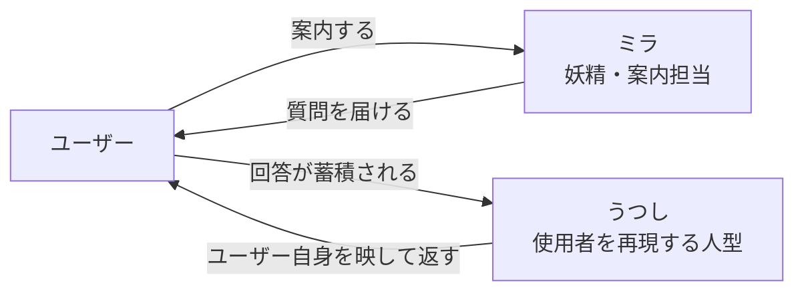

# キャラクターデザイン

## 1. この文書の目的

me-builderに登場するキャラクターの名前、役割、外見設定、およびデザインアセットの置き場所と命名規則を定義します。

デザインを実装や制作へ渡すとき、キャラクターの呼び方と参照すべき画像がここだけで確定するようにします。

### 所有する概念

- キャラクターの名前と役割
- 各キャラクターの外見設定（造形、配色、表情バリエーション）
- サービスアイコンの構図と、切り抜き時の前提
- デザインアセットのディレクトリ構成、ファイル命名規則、各アセットの内容

### 所有しない概念

- キャラクターを画面上でどう配置・演出するか（UI・体験設計）
- ユーザーの分身そのものの仕様（[プロジェクト概要](project-overview.md)、[ドメイン設計](domain-design.md)）
- アセットの配信方法やストレージ（[インフラ・システム構成](infrastructure-architecture.md)）

## 2. キャラクター一覧

| 名前 | ローマ字（ファイル接頭辞） | 種別 | 役割 |
| --- | --- | --- | --- |
| うつし | `utushi` | 人型 | 使用者本人を再現するキャラクター |
| ミラ | `mira` | 妖精 | 案内担当 |



## 3. うつし

使用者本人を再現するキャラクターです。回答が蓄積されるほど、その人らしさを映す存在として扱います。

### 造形

- 3〜4頭身のちびキャラ体型で、白を基調とした素体
- 短めのボブヘア。髪はラベンダーから水色、クリームへ向かうグラデーション
- 右側の髪に星形のヘアピン
- 胸に金縁の楕円形の鏡。上部に水色の菱形の宝石、下部に金の菱形の飾りが付く
- 体の各所に花（ピンク・水色・紫・クリーム）と4方向の光（キラキラ）の模様
- 背面には鏡がなく、花と光の模様だけが入る

模様の配置は固定パターンではなく、参照アセットの分布を基準にします。

### 表情バリエーション

微笑み、目を閉じた笑顔、考え込む（指を口元に添える）、驚きの4種を基本とします。

### 参考配色

画像から抽出した参考値です。実装で使うカラートークンとしては未確定です。

| 用途 | 参考値 |
| --- | --- |
| 髪（紫系） | `#E1D0ED` |
| 髪・模様（淡い水色） | `#CDE4EE` |
| 髪（クリーム） | `#FEEDD7` |
| 模様（ピンク） | `#FCD0D5` |
| 模様（水色） | `#B1DCEF` |
| 鏡の縁・飾り（ゴールド） | `#E7BC86` |

### アセット

| ファイル | 内容 |
| --- | --- |
| [utushi-three-view.png](assets/characters/utushi-three-view.png) | 三面図（正面・側面・背面） |
| [utushi-expression-sheet.png](assets/characters/utushi-expression-sheet.png) | 表情差分、全身、鏡と模様のクローズアップ、配色・モチーフ一覧 |

## 4. ミラ

案内担当の妖精です。ユーザーに質問を届けたり、操作の手引きをしたりする役として扱います。

### 造形

- 鏡そのものが顔になった造形。金の楕円形のミラーフレームが顔の輪郭を作る
- フレーム上部に星形の飾りと水色の菱形の宝石。フレームには小さな菱形の装飾が並ぶ
- 鏡面は白く、丸い黒目、頬の赤み、小さな口を持つ
- 左右に半透明の水色の羽が2枚ずつ、計4枚。羽の中に光の粒が入る
- 下半身は白いふわりとしたスカート状で、短い脚が2本
- 首元に金と水色の菱形のペンダント
- 手は丸い白色

### 表情バリエーション

にこやかな笑顔、目を閉じた笑顔、考え込む、驚きの4種を基本とします。

### 別バージョン

青い魔法書（表紙に4方向の光のモチーフ）を両手で持つバージョンがあります。説明や案内の場面向けの派生で、素体はミラ本体と同じです。

### 参考配色

画像から抽出した参考値です。実装で使うカラートークンとしては未確定です。

| 用途 | 参考値 |
| --- | --- |
| 鏡面・体（白） | `#FDF9F4` |
| 頬（ピーチ） | `#FEE8DD` |
| 羽（淡い青） | `#E8EFEF` |
| 羽・宝石（水色） | `#CBE6EF` |
| 飾り（ライトゴールド） | `#FEE0B2` |
| フレーム（ゴールド） | `#E4AE66` |

### アセット

| ファイル | 内容 |
| --- | --- |
| [mira-three-view.png](assets/characters/mira-three-view.png) | 三面図（正面・側面・背面） |
| [mira-expression-sheet.png](assets/characters/mira-expression-sheet.png) | 表情差分、全身、羽とペンダントのクローズアップ、配色・モチーフ一覧 |
| [mira-expression-sheet-with-book.png](assets/characters/mira-expression-sheet-with-book.png) | 魔法書を持つバージョンの表情差分、全身、小物一覧 |

## 5. サービスアイコン

うつしとミラが並ぶ1枚絵を、アイコン用途の正方形画像として持ちます。

- うつしを大きく手前に置き、右上にミラを浮かべた構図。うつしは手を上げた挨拶の姿勢
- 背景はパステルの虹色グラデーションで、花と光（キラキラ）のモチーフを散らす
- 実サイズは1254×1254px

円形や角丸に切り抜かれる用途では、四隅の花と光のモチーフが欠けることを前提とします。

| ファイル | 内容 |
| --- | --- |
| [app-icon.png](assets/app-icon.png) | うつしとミラが並ぶアイコン用の正方形画像 |

## 6. アセットの置き場所と命名規則

```tree
docs/
└── assets/
    ├── app-icon.png
    └── characters/
        ├── mira-expression-sheet-with-book.png
        ├── mira-expression-sheet.png
        ├── mira-three-view.png
        ├── utushi-expression-sheet.png
        └── utushi-three-view.png
```

特定のキャラクターに属する設定画は `characters/` へ置き、`<キャラクターのローマ字>-<アセット種別>[-<バリエーション>].<拡張子>` の形式で命名します。

| アセット種別 | 意味 |
| --- | --- |
| `three-view` | 三面図（正面・側面・背面） |
| `expression-sheet` | 表情差分と細部・配色をまとめた設定シート |

キャラクターのローマ字は[キャラクター一覧](#2-キャラクター一覧)の接頭辞を使います。

複数のキャラクターが登場するアセットや、キャラクターに属さないアセットは `assets/` 直下へ置き、用途を表す名前を付けます（例: `app-icon.png`）。

## 7. アセットを追加するときの手順

1. `docs/assets/` へ[命名規則](#6-アセットの置き場所と命名規則)に沿って配置する
2. 該当キャラクターの節、または[サービスアイコン](#5-サービスアイコン)の節のアセット表へ1行追加する
3. 新しいアセット種別を使う場合は種別の表にも追加する
4. 新しいキャラクターを追加する場合は[キャラクター一覧](#2-キャラクター一覧)と専用の節を追加する
5. `assets/` 直下へ置いた場合は[ディレクトリ構成](#6-アセットの置き場所と命名規則)のツリーも更新する
