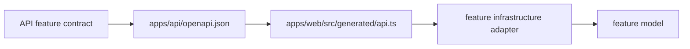

# API契約とクライアント型の生成

## 1. この文書の目的

この文書は、API ServerのHTTP契約の配置と、OpenAPI documentおよびWeb UI用TypeScript型の生成運用を所有します。

### 所有する概念

- HTTP契約を機能単位で配置するディレクトリ構成
- OpenAPI documentとWeb UI用TypeScript型の生成フロー
- 生成物の更新と検査方法

### 所有しない概念

- 各APIの認証、利用条件、入出力の意味
- ドメインの状態と不変条件
- Web UIのfeature内部構造

各APIの意味は、たとえば診断なら[診断API契約](diagnosis-api.md)を正とします。ドメイン規則は[ドメイン設計](../domain/domain-design.md)、Web UIの構造は[開発運用ルール](../../.agents/rules/development.md)を参照します。

## 2. API ServerのHTTP契約

Valibot schemaとroute metadataは、単一の`openapi.ts`へ集約せず、`contract/`の下で機能とエンドポイント単位に配置します。共通エラーだけを`shared/`に置き、OpenAPI document全体の情報は`contract/openapi.ts`へ分離します。

```text
apps/api/src/
├── contract/                    # 機械可読なHTTP契約
│   ├── <feature-name>/
│   │   └── <endpoint-name>.ts   # 機能ごとのschema・route metadata
│   ├── shared/
│   │   └── errors.ts            # 複数機能で共有するエラー契約
│   └── openapi.ts               # API情報・security schemeなど文書全体の設定
├── controller/                  # HTTP入出力とlogic結果の変換
├── logic/                       # HTTP非依存のユースケース
├── config/                      # 環境設定
├── app.ts                       # middlewareとrouteの組み立て
├── index.ts                     # 起動処理
└── types.ts                     # Honoアプリ全体の環境型
```

新しいエンドポイントは、対応する機能の`contract/<feature>/`へ追加します。機能固有のschemaを`shared/`へ移してはいけません。controllerは対応するcontractを使って実行時にも入出力を検証し、実装とOpenAPIの乖離を防ぎます。

## 3. 生成フロー

機械可読なHTTP schemaは`apps/api/src/contract/`のValibot schemaを正とします。生成物は直接編集しません。



両方の生成物はルートで次を実行して更新します。

```bash
task generate:api
```

API Serverは同じdocumentを`GET /api/openapi.json`でも提供します。PreviewとProductionでの公開範囲は[インフラ・システム構成のAPIドキュメント用Cloudflare Access境界](../architecture/infrastructure-architecture.md#61-apiドキュメントのcloudflare-access境界)に従います。リポジトリ内の生成処理は`apps/api/openapi.json`を直接入力とするため、Cloudflare Accessには依存しません。

`task ci`とGitHub Actionsの`check:generated`は、OpenAPI documentとWeb UI用TypeScript型を単一コマンドで再生成し、両方にGit差分が残らないことを検査します。contract変更時は生成物も同じcommitへ含めます。

API contractテストは、Honoへ登録された`/api/*`のruntime route（OpenAPI document自身を除く）とOpenAPIのpath／HTTP methodを双方向比較します。また、全operationで`operationId`、security、response status、schema、content typeを必須検査し、空bodyとbinary responseも表現に応じて検査します。runtimeでも実際に返すstatusとcontent typeを同じOpenAPI documentへ照合します。routeを追加するときはcontract middlewareを同じrouteへ登録し、公開routeを含めてsecurityを明示します。
