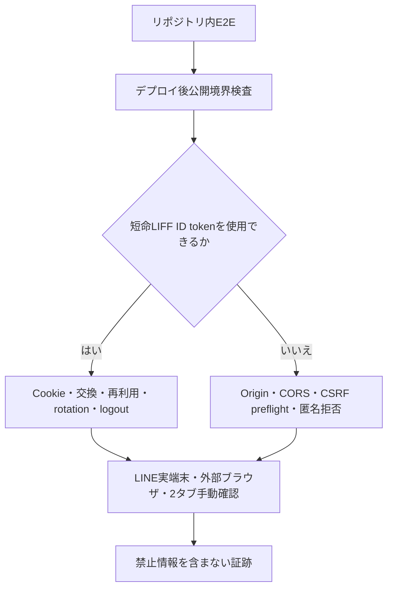

# LIFF交換・アプリケーションセッション境界検証Runbook

## 1. 目的と所有範囲

このRunbookは、デプロイ済みのLIFF credential交換とprovider非依存application sessionの境界を、PreviewとProductionで検証する手順、失敗時の確認方法、証跡形式を定義します。

### 所有する概念

- Cookie、Origin、CSRFのデプロイ後自動検査
- LINE実端末、外部ブラウザ、2 Account・2タブで行う境界シナリオ
- session store／D1障害時のHTTP結果、運用ログ、再認証導線の確認手順
- 機微情報を残さない証跡形式と完了判定

### 所有しない概念

- sessionの保存形式、期限、rotation、失効規則 — [アプリケーションセッション実装契約](application-session-contract.md)
- LIFF／SSO、Identity、Accountの認証・認可境界 — [Web認証・アプリケーションセッション設計](../architecture/web-authentication-design.md)
- Auth0固有のPreviewシナリオと切り戻し — [SSO Preview検証Runbook](sso-preview-verification.md)
- ProductionへのSSO段階公開 — [SSO Production段階公開Runbook](sso-production-rollout.md)
- ログへ記録できる情報 — [アプリケーション運用ログ方針](operational-logging.md)

## 2. 検証の構成



資格情報を使わない公開境界検査はPreview／Production CDがデプロイ後に自動実行します。短命LIFF ID tokenが必要な検査と画面cacheの確認は、専用の検証Accountで明示的に実行します。

## 3. 開始条件

- 対象commitの`task ci`が成功し、WebとAPIが同じcommitからデプロイ済み
- 実在する個人データを持たない専用Account A、Bを用意済み
- Account A、Bは表示だけで区別でき、復旧・Identity解除・停止を行ってよい
- LINE実端末と、Cookieを分離できる外部ブラウザprofileを用意済み
- Productionでは通常利用者のAccountを使わず、logout確認文字列を指定する前に全session失効の影響を確認済み

ID token、Cookie、CSRF token、Account ID、Identity subjectをterminal出力、shell history、issue、PR、スクリーンショットへ残しません。

## 4. 自動検証

### 4.1 リポジトリ内

```sh
task ci
```

E2Eでは、2 Account・2タブの切替、旧Accountのfeature request拒否、logout、期限切れ、Account復旧、Identity解除、Account停止、KV／D1障害時のsafe failure、別タブ通知後の画面cache破棄を確認します。

### 4.2 デプロイ済み公開境界

```sh
task auth:verify:deployed-preview
task auth:verify:deployed-production
```

資格情報なしで次を検査します。

- `/api/health`が指定環境を返す
- 許可Web Originだけがcredential付きCORS headerを受け取る
- `DELETE /api/auth/session`のpreflightが`X-CSRF-Token`を許可する
- 未許可OriginのLIFF交換が403となり、CookieとCORS headerを返さない
- Cookieなしのsession確認が401となる

CDはこの範囲をデプロイのたびに実行します。

### 4.3 短命LIFF credentialを使う検査

専用AccountのLIFFを開き、remote debuggingで取得した短命ID tokenを画面やファイルへ保存せずterminalへ入力します。Account切替まで検査する場合はA、Bの順で入力します。

```bash
read -rs AUTH_BOUNDARY_LIFF_ID_TOKEN_A
export AUTH_BOUNDARY_LIFF_ID_TOKEN_A
read -rs AUTH_BOUNDARY_LIFF_ID_TOKEN_B
export AUTH_BOUNDARY_LIFF_ID_TOKEN_B
export AUTH_BOUNDARY_LOGOUT_CONFIRMATION=disposable-accounts
task auth:verify:deployed-preview
unset AUTH_BOUNDARY_LIFF_ID_TOKEN_A AUTH_BOUNDARY_LIFF_ID_TOKEN_B AUTH_BOUNDARY_LOGOUT_CONFIRMATION
```

Productionでは最後のtaskだけ`task auth:verify:deployed-production`へ置き換えます。credentialを使う検査はAccount単位で既存sessionを失効するため、`AUTH_BOUNDARY_LOGOUT_CONFIRMATION=disposable-accounts`の明示確認を必須とします。明示確認なしで実行できるのは、資格情報を使わない公開境界検査だけです。

2つ目のtokenを省略した場合は同じAccountでrotationを確認します。2つ目を指定した場合、検証担当者は別Account Bのtokenであることを事前に確認し、Account Aの旧sessionが401になることを自動検査します。コマンドはtoken、Cookie、CSRF token、プロフィールを出力せず、固定check名だけをJSONで返します。

## 5. 実端末・ブラウザシナリオ

| ID | 条件と操作 | 期待結果 |
| --- | --- | --- |
| A-S01 | Account AのLINE実端末でLIFFを初回表示する | sessionが発行され、本人画面へ到達する |
| A-S02 | LIFFを閉じて再訪する | LIFF Identityで安全に交換され、Account Aの画面だけを表示する |
| A-S03 | Account Aで外部ブラウザを再訪する | 既存application sessionを再利用し、provider tokenをfeature APIへ送らない |
| A-N01 | Account Aを2タブで開き、片方でlogoutする | 両タブの次のrequestが401となり、戻る操作でも旧画面内容を表示しない |
| A-N02 | Account Aを2タブで開き、片方のLIFFでAccount Bへ切り替える | Account Aの全旧sessionが401となり、他タブは通知後に再確認して画面cacheと履歴を破棄する |
| A-N03 | Account復旧を完了する | 復旧元と復旧先の旧sessionが401となり、新しい交換だけが成功する |
| A-N04 | 認証に使ったIdentityを解除する | KV recordの削除反映を待たず旧sessionが401となる |
| A-N05 | Accountを停止する | KV recordの削除反映を待たず旧sessionが401となる |
| A-N06 | Cookieの絶対期限またはidle期限を超える | 401と再試行導線を表示し、旧Account内容を表示しない |

CookieはブラウザのApplication／Storage表示で、値を撮影せず`HttpOnly`、`Secure`、`SameSite=Lax`、`Path=/`、Domainなしだけを確認します。外部ブラウザとLINE WebViewの双方でA-S01〜A-S03を実施します。

## 6. KV／D1障害時

Productionでbindingを外したりnamespaceを削除したりして障害を作りません。リポジトリ内E2Eで一時失敗を注入し、実環境で自然発生した場合は次の固定情報だけを照合します。

| 境界 | HTTP／画面 | 運用ログ |
| --- | --- | --- |
| `SESSION_STORE` bindingまたはD1 bindingなし | 503。旧sessionを採用せず「本人確認が必要です」と再試行を表示 | `http.request.failed`、対象path、status 503 |
| KV read／write／delete失敗 | 500、bodyは固定のInternal Server Error。Cookieを発行せず旧内容を隠す | `SESSION_STORE_READ_FAILED`／`WRITE_FAILED`／`DELETE_FAILED`、`dependency=cloudflare-kv`、`retryable=true` |
| D1 session version read／invalidate失敗 | 500、sessionを認証済みとして扱わず再試行を表示 | `SESSION_VERSION_READ_FAILED`／`INVALIDATION_FAILED`、`dependency=cloudflare-d1`、`retryable=true` |

利用者は同じ画面の「再試行」から同じ認証入口を再実行します。LIFF障害時にSSOへ自動fallbackしません。復旧前に再試行しても旧CSRF tokenは破棄され、旧画面cacheは再表示されません。

## 7. 証跡テンプレート

検証用チケットには次のテンプレートをシナリオごとに記録します。

```text
deploy: <commit SHA>
environment: preview | production
scenario: <A-S01など>
client: LINE iOS | LINE Android | external browser
time: <UTC timestamp>
result: pass | fail
http: <statusまたはnone>
event: <固定event／error codeまたはnone>
traceId: <application-generated trace IDまたはnone>
note: <固定分類だけ。画面内容、token、Cookie、本人識別子は記載しない>
```

スクリーンショットを添付する場合は、Cookie値、request／response header、プロフィール、Account ID、Identity subject、tokenを完全にマスクします。

## 8. 完了判定

次をすべて満たした場合だけ検証完了とします。

- `task ci`と対象環境のデプロイ済み境界検査が成功した
- LINE実端末と外部ブラウザで発行、再利用、logoutを確認した
- 2 Account・2タブで旧Account内容を表示・取得しなかった
- 復旧、Identity解除、Account停止後の旧sessionが即時401になった
- KV／D1障害のHTTP、ログ、再試行導線が固定契約と一致した
- 証跡に記録禁止情報がない

実LINE WebView、実ブラウザCookie policy、実Cloudflare KV／D1の挙動はリポジトリ内だけでは完了扱いにしません。資格情報がない場合は、未実施のシナリオIDと必要な外部環境だけを明示して引き継ぎます。
