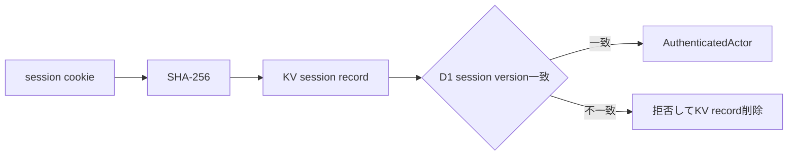

# アプリケーションセッション実装契約

## 1. 目的と所有範囲

この文書は、provider非依存のアプリケーションセッションについて、保存形式、有効期限、同時session、rotation、logout、即時失効の実装契約を定義します。

### 所有する概念

- session参照とCloudflare KV keyの対応
- 絶対期限、idle期限、同時sessionの扱い
- rotation、logout、Account停止、Identity解除、Account復旧時の失効方法

### 所有しない概念

- LIFF／SSOからAccountへ到達する認証・認可境界 — [Web認証・アプリケーションセッション設計](../architecture/web-authentication-design.md)
- 実装PRの依存順とリリースゲート — [Web認証・SSO実装残タスク](web-authentication-remaining-tasks.md)
- Web UIの認証状態と画面復帰 — [全体画面遷移設計](../product/screen-navigation.md)

## 2. 保存と有効期限

session参照は32 byteの乱数をbase64urlで表現し、cookie値そのものは保存しません。Cloudflare KVではSHA-256 hashを`session:v1:{hash}`として引き、Account ID、認証方式、外部providerでの認証時刻、発行時刻、最終利用時刻、絶対期限、D1 session version、CSRF検証情報、交換時に検証済みの表示プロフィールを保存します。

- 絶対期限: 発行から30日
- idle期限: 最終利用から7日
- KV TTL: 絶対期限まで。idle期限はrequestごとの検証で判定する
- 同時session: hard capを設けず複数発行できる。ただし、後述のAccount単位失効ではすべて失効する

期限切れ、形式不正、Accountの現在versionと異なるrecordはfail-closedで拒否し、参照できたKV recordを削除します。

## 3. 失効契約

Cloudflare KVの更新・削除は他拠点への反映に時間がかかるため、安全上必要な失効判定には共有D1の`accounts.session_version`を使います。認証requestはKV recordと現在versionを照合します。

次の操作は同じAccountのversionを単調増加させます。

- Account停止
- Identity解除
- Account復旧完了
- session rotation
- 明示logout

rotationはversion更新後に新versionのsessionを発行します。logoutは現在のブラウザだけでなく、同じAccountの既存application sessionをすべて失効します。これによりKV deleteの伝播前でも旧sessionを拒否します。

## 4. HTTP境界

session参照は`__Host-me_builder_session` cookieへ保存します。属性は`HttpOnly`、`Secure`、`SameSite=Lax`、`Path=/`とし、`Domain`は付けません。

- `POST /api/auth/liff/exchange`: 許可済みWeb OriginとLIFF IDトークンを検証し、以前のcookie sessionを失効してから新sessionを発行する
- `GET /api/auth/session`: application sessionだけを受け付け、CSRF tokenを含む表示可能なsession状態を返す
- `DELETE /api/auth/session`: application session、許可済みOrigin、`X-CSRF-Token`を要求し、Accountの全sessionを失効する

機能APIはapplication sessionだけを認証に使用します。`Authorization: Bearer`は認証情報として扱わず、Bearerだけのリクエストは拒否し、有効なcookie sessionへ添付されていても認証結果へ影響させません。`POST`、`PUT`、`PATCH`、`DELETE`では、cookieに加えて許可済みOriginの完全一致と`X-CSRF-Token`を必須にします。
