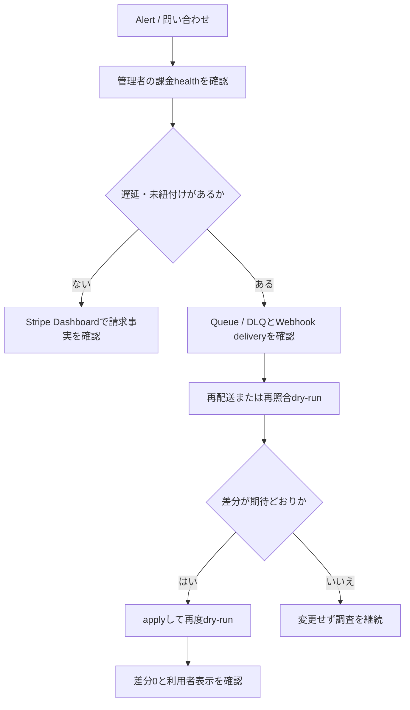

# 課金監視・復旧Runbook

## 1. 目的と所有範囲

この文書は、Stripe課金の異常を検知し、利用者の契約を別Accountへ誤接続せずに判断・復旧する運用手順を定義します。

### 所有する概念

- Webhook、Billing Queue / DLQ、契約projection遅延の監視と初動
- 二重請求疑い、誤Plan、解約不能、Account復旧、Secret rotationの運用手順
- Stripeと共有D1の再照合を実行する判断境界

### 所有しない概念

- Stripeと共有D1の正本境界、状態変換、API契約
- 価格、返金条件、利用権限
- Account復旧の本人確認要件

正本境界と再照合の原則は[課金・Plan紐付け実装設計](../architecture/billing-implementation-design.md)、価格と返金条件は[サブスクリプション・料金プラン設計](../product/subscription-plan-design.md)、本人確認は[Account復旧設計](../architecture/account-recovery-design.md)を正とします。

## 2. 検知と判断

`GET /api/admin/billing/health`はCustomer数、有効契約数、遅延projection数、projection未作成Customer数、有効だがPlan未解決の件数だけを返します。Account ID、Stripe ID、個人内容は返しません。遅延判定は`BILLING_PROJECTION_STALE_AFTER_SECONDS`で環境ごとに差し替え、既定は15分です。

Alertの最小条件は次です。

- Billing DLQに1件以上ある
- `customerWithoutProjectionCount`または`projectionWithoutPlanCount`が1件以上ある
- `staleProjectionCount`が1件以上ある
- StripeのWebhook失敗率または請求失敗件数が通常範囲を超える

売上、返金、手数料はStripe Dashboard、Plan別の有料Account数は管理者課金healthと共有D1の運用集計で確認します。カード情報、日記、診断、AI相談内容を集計へ含めません。

## 3. 代表的な復旧

### 3.1 projection遅延・誤Plan

1. Stripe Dashboardで対象Customerの現在Subscription、Price、状態を確認する
2. 管理者再照合APIを`dry-run`で実行する
3. 差分がStripeの現在状態と一致するときだけ`apply`する
4. 同じ対象へ再度`dry-run`し、差分0を確認する
5. 誤ったPriceや未知Priceならcatalogを先に修正し、返金・解約を再照合処理から実行しない

### 3.2 Webhook / Queue / DLQ

1. Stripe Dashboardのdelivery履歴でHTTP statusを確認する
2. 署名失敗ならendpoint Secretとデプロイ版を確認する
3. Queue retry中なら収束を待ち、上限到達後はDLQ messageのevent typeと安全なfailure codeを確認する
4. Stripeから現在Subscriptionを再取得する再照合で復旧する
5. message本文やStripe IDをticket、チャット、通常ログへ転記しない

### 3.3 二重請求疑い・解約不能

Stripe Dashboardで請求事実を確認し、同一Accountに複数Subscriptionがある場合は新しい課金操作を停止します。返金・Subscription取消は商取引条件に基づく運営者の明示操作とし、再照合APIから自動実行しません。

Accountへログインできない利用者には、購入時のメールアドレスとStripeのワンタイムパスコードで入るコード不要Customer Portalを案内します。Portalを開けない場合は[公開中の問い合わせ窓口](../product/service-site-design.md#73-お問い合わせ)で受け付け、請求上の本人確認後に運営経路から期間末解約だけを行います。この確認をAccount復旧や本人データ開示へ流用しません。

### 3.4 Account復旧

StripeのメールアドレスやCustomer IDだけでは本人と判定しません。[Account復旧設計](../architecture/account-recovery-design.md)の確認を完了し、既存AccountへIdentityを追加した後、同じ`AccountPlanAssignment`へ到達することを確認します。

## 4. Secret rotation

1. Stripe sandboxで新しいrestricted keyまたはWebhook endpoint Secretを発行する
2. PreviewのGitHub Environment Secretを更新してデプロイする
3. catalog setup、Webhook署名fixture、sandbox lifecycle E2E、課金healthを確認する
4. Production Secretを更新し、同じWorker Versionと原子的にデプロイする
5. Webhook delivery成功と課金healthを確認してから旧Secretを失効する

Secret、Webhook署名、Customer ID、Subscription IDをログへ出しません。catalog setupの新規Webhook Secretは`BILLING_SETUP_OUTPUT`で指定した権限`0600`のファイルだけへ書き、内容を標準出力へ出しません。
