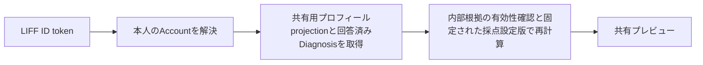
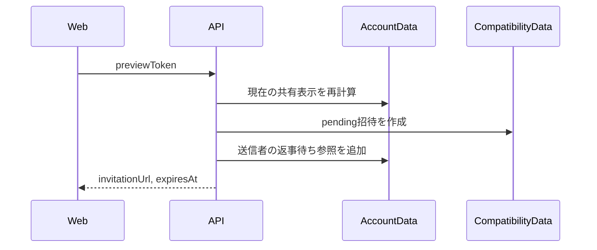
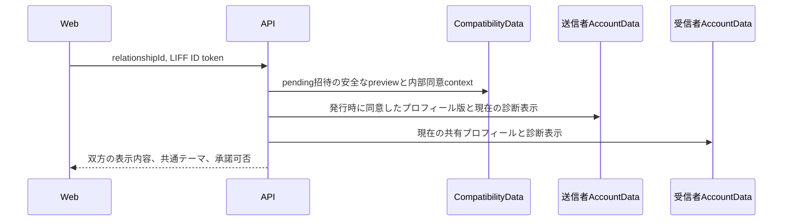

# 相性API契約

## 1. この文書の目的

この文書は、Web UIとAPI Serverの間で利用する相性APIのパス、認証、リクエスト、レスポンス、エラー契約を所有します。

招待と相性シートの利用体験は[相性診断・うつし共有体験設計](../product/compatibility-experience.md)、相性関係の状態と永続化境界は[相性共有データ実装設計](../architecture/compatibility-data-design.md)、診断結果の計算は[診断回答のパラメータ変換設計](../diagnosis/scoring/parameter-scoring-design.md)を正とします。この文書は画面デザイン、相性関係の物理データモデル、診断の採点規則を所有しません。

## 2. 認証境界

相性APIはLIFF IDトークンをAuthorizationヘッダーで受け取り、API ServerがLINEへ検証した`sub`からAccountを解決します。クライアント指定のAccount ID、表示名、診断結果は受け付けません。

```http
Authorization: Bearer <LIFF ID token>
```

IDトークン、Account ID、生の回答、結果指紋はレスポンスとログへ出しません。

## 3. 共有プレビュー

### `GET /api/compatibility/share-preview`

本人が招待リンクを発行する前に確認する表示名と、相性診断へ利用できる現在の傾向を返します。



`themes`へ含めるのは、本人の現在有効な回答による回答済みDiagnosisのうち、Diagnosisが固定した採点設定版で1件以上のパラメータを計算できるものです。Diagnosisは表示順とDiagnosis ID、`parameters`は採点設定内の定義順で安定して返します。

回答済みDiagnosisのうち1件でも採点設定の欠落・不正または計算可能なパラメータの不足があれば、計算できたテーマは確認用に返しますが、`scoring_unavailable`として招待発行を許可しません。確認対象の一部を黙って除外した状態では同意を成立させません。

各パラメータの`statement`は、現在の帯域に対応する審査済みラベルから`「{帯域の表示名}」傾向があります`の形で決定的に組み立てます。中央帯ではDiagnosisの採点設定が持つ中央帯の表示名を使います。関わり方の審査済み定型文は現在の採点設定に存在しないため、このAPIで推測して返しません。

```json
{
  "displayName": "あおい",
  "previewToken": "csp2.aaaaaaaaaaaaaaaaaaaaaaaaaaaaaaaaaaaaaaaaaaaaaaaaaaaaaaaaaaaaaaaa",
  "aboutMe": {
    "profileSummaryVersionId": "summary-version-id",
    "generatedAt": "2026-08-11T00:00:00.000Z",
    "statements": [
      {
        "key": "planning-style",
        "label": "予定の立て方",
        "statement": "私は、先の見通しを持って動けると安心しやすいです"
      }
    ]
  },
  "themes": [
    {
      "diagnosisId": "time-planning",
      "title": "時間と予定",
      "parameters": [
        {
          "id": "advance-planning",
          "label": "予定を決めるタイミング",
          "lowLabel": "その場で決めたい",
          "highLabel": "早めに決めたい",
          "position": 78,
          "statement": "「早めに決めたい」傾向があります"
        }
      ]
    }
  ],
  "canIssueInvitation": true,
  "blockingReasons": [],
  "nextAction": null
}
```

`displayName`は検証済みIDトークンに表示名がなければ`null`です。`aboutMe`は本人向けまとめと同じ生成要求から作った共有専用projectionであり、内部の根拠ID、日記・会話本文、Brain Item本文は含めません。projectionがない、または内部根拠が削除・無効化されている場合は`null`です。

`previewToken`は表示名、共有プロフィール版と文章、画面へ返した診断由来の共有表示、各テーマの採点設定IDとversionから決定的に計算するバージョン付きの不透明な確認tokenです。後続の招待発行APIはtokenを受け取り、現在状態から再計算した値と一致しない場合に再確認を要求します。tokenは共有プロフィール指紋やテーマ別の結果指紋ではなく、招待リンクやログへ含めません。

`canIssueInvitation`は`blockingReasons`が空の場合だけ`true`です。`blockingReasons`は次の値を表示順で返します。

| 値 | 条件 |
| --- | --- |
| `display_name_unavailable` | 検証済みIDトークンに表示名がない |
| `profile_summary_required` | 共有専用プロフィールprojectionを持つ生成済み版がない |
| `profile_summary_stale` | 共有専用プロフィールprojectionの内部根拠が削除または無効化されている |
| `diagnosis_required` | 共有可能なテーマがなく、現在回答できる未完了Diagnosisがある |
| `scoring_unavailable` | 回答済みDiagnosisのうち1件以上で共有表示を計算できない |
| `diagnosis_unavailable` | 回答済みDiagnosisも現在回答できる未完了Diagnosisもない |

`nextAction`は共有専用プロフィールprojectionが利用できなければ`profile-summary`、それ以外で共有可能なテーマがなく現在回答できる未完了Diagnosisがあれば`diagnosis`、それ以外は`null`にします。表示名、プロフィール版、Diagnosisの不足は同時に発生し得るため、クライアントは`blockingReasons`を配列として扱います。

このAPIは本人が発行前に確認する読み取りモデルです。生の回答、具体的な出来事、日記・会話本文、Source Record、Brain Item本文、内部根拠ID、質問文、Choice、回答日時、Account ID、採点設定本体、`coverage`、各種指紋を返しません。

認証・基盤の共通エラーは次のとおりです。

| HTTP | 条件 | レスポンス |
| --- | --- | --- |
| `401` | IDトークンがない、検証できない、またはLINE Login設定がない | `{ "error": "Unauthorized" }` |
| `404` | 検証済みLINE Accountに対応するAccountがない | `{ "error": "Account not found", "reason": "friendship_required" }` |
| `503` | D1またはAccountData bindingがない | `{ "error": "Service Unavailable" }` |
| `500` | 未処理のサーバーエラー | `{ "error": "Internal Server Error" }` |

## 4. 招待リンク発行

### `POST /api/compatibility/invitations`

共有プレビューで確認した内容から、1人だけが承諾できる招待リンクを発行します。クライアントは直前の共有プレビューで受け取った`previewToken`だけを送り、Account ID、表示名、共有プロフィール、診断結果を送りません。

```json
{
  "previewToken": "csp2.aaaaaaaaaaaaaaaaaaaaaaaaaaaaaaaaaaaaaaaaaaaaaaaaaaaaaaaaaaaaaaaa"
}
```

API Serverは本人の現在状態から共有プレビューを再計算します。tokenが一致し、現在も発行可能な場合だけ、256 bitの不透明な関係IDでCompatibilityDataへ`pending`招待を作成し、送信者のAccountDataへ一覧参照を保存します。招待リンクへAccount IDと`previewToken`を含めません。



成功時は`201`を返します。`expiresAt`はCompatibilityDataが決定した14日後の期限です。

```json
{
  "invitationUrl": "https://example.com/compatibility/invitations/aaaaaaaaaaaaaaaaaaaaaaaaaaaaaaaaaaaaaaaaaaaaaaaaaaaaaaaaaaaaaaaa",
  "expiresAt": "2026-08-26T00:00:00.000Z"
}
```

| HTTP | 条件 | レスポンス |
| --- | --- | --- |
| `400` | JSONまたは`previewToken`の形式が不正 | `{ "error": "Invalid request" }` |
| `409` | 確認後に表示内容が変わった | `{ "error": "Compatibility invitation unavailable", "reason": "preview_changed" }` |
| `409` | 現在の状態では共有を開始できない | `{ "error": "Compatibility invitation unavailable", "reason": "share_unavailable" }` |

認証・基盤の共通エラーは共有プレビューと同じです。`DB`、`AccountData`、`CompatibilityData`、またはWeb UI originのbindingがなければ`503`を返し、招待を作成しません。

## 5. 招待内容の確認

### `GET /api/compatibility/invitations/:relationshipId`

招待リンクを開いた受信者が、関係を成立させる前に双方の共有内容を確認します。`relationshipId`は招待リンクに含まれる256 bitの不透明な関係IDです。クライアントからAccount IDや表示内容を送りません。



送信者については、CompatibilityDataに保存した共有プロフィール版・指紋とテーマ別指紋に現在のAccountDataから再構築した内容が一致する場合だけ返します。発行後に回答が変わった、同意版の内部根拠が無効になった、または表示を再構築できない場合は、別の内容へ同意を読み替えず招待を利用不可にします。

受信者については、本人の現在の共有プロフィールと、送信者が提示したテーマとの共通部分だけを返します。個別選択は受け付けません。`previewToken`は受信者の表示名、共有プロフィール、現在の診断表示全体を結ぶ不透明な確認tokenであり、後続の承諾APIが再確認に利用します。

```json
{
  "inviter": {
    "displayName": "あおい",
    "aboutMe": {
      "profileSummaryVersionId": "summary-version-inviter",
      "generatedAt": "2026-08-11T00:00:00.000Z",
      "statements": [
        {
          "key": "planning-style",
          "label": "予定の立て方",
          "statement": "私は、先の見通しを持って動けると安心しやすいです"
        }
      ]
    },
    "themes": [
      {
        "diagnosisId": "time-planning",
        "title": "時間と予定",
        "parameters": [
          {
            "id": "advance-planning",
            "label": "予定を決めるタイミング",
            "lowLabel": "その場で決めたい",
            "highLabel": "早めに決めたい",
            "position": 78,
            "statement": "「早めに決めたい」傾向があります"
          }
        ]
      }
    ]
  },
  "recipient": {
    "displayName": "はる",
    "previewToken": "csp2.aaaaaaaaaaaaaaaaaaaaaaaaaaaaaaaaaaaaaaaaaaaaaaaaaaaaaaaaaaaaaaaa",
    "aboutMe": {
      "profileSummaryVersionId": "summary-version-recipient",
      "generatedAt": "2026-08-12T00:00:00.000Z",
      "statements": [
        {
          "key": "planning-style",
          "label": "予定の立て方",
          "statement": "私は、予定に余白があると心地よく感じます"
        }
      ]
    },
    "themes": []
  },
  "expiresAt": "2026-08-26T00:00:00.000Z",
  "canAccept": false,
  "blockingReasons": ["common_diagnosis_required"],
  "nextAction": "diagnosis"
}
```

`inviter.themes`は送信者が発行時に提示したテーマ、`recipient.themes`はそのうち受信者も現在確認できる共通テーマを、共有プレビューと同じ構造で返します。

`canAccept`は受信者の検証済み表示名、利用可能な共有プロフィール、計算可能な診断表示、1件以上の共通テーマがそろう場合だけ`true`です。`blockingReasons`は共有プレビューの受信者側理由に`common_diagnosis_required`を加えた配列です。共通テーマがなければ`nextAction`を`diagnosis`にし、共有プロフィールを利用できなければ`profile-summary`を優先します。

| HTTP | 条件 | レスポンス |
| --- | --- | --- |
| `404` | 関係IDが不正、存在しない、期限切れ、取消済み、承諾済み、または送信者の同意内容を安全に再構築できない | `{ "error": "Compatibility invitation unavailable", "reason": "invitation_unavailable" }` |
| `409` | 送信者本人が自分の招待を開いた | `{ "error": "Compatibility invitation unavailable", "reason": "own_invitation" }` |

認証・基盤の共通エラーは共有プレビューと同じです。`DB`、`AccountData`、または`CompatibilityData` bindingがなければ`503`を返します。成功レスポンスへAccount ID、生の回答、具体的な出来事、日記・会話本文、内部根拠ID、採点設定、各種指紋を含めません。招待の状態変化をブラウザや中継キャッシュが保持しないよう、成功・エラーを問わず`Cache-Control: no-store`を付けます。リンクを開いただけでは受信者のAccount、閲覧履歴、同意をCompatibilityDataまたは送信者AccountDataへ保存しません。
