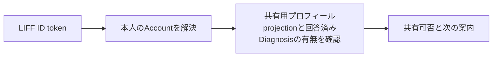
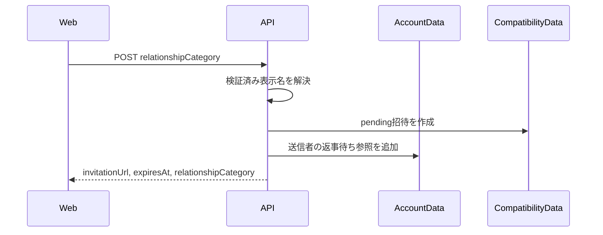
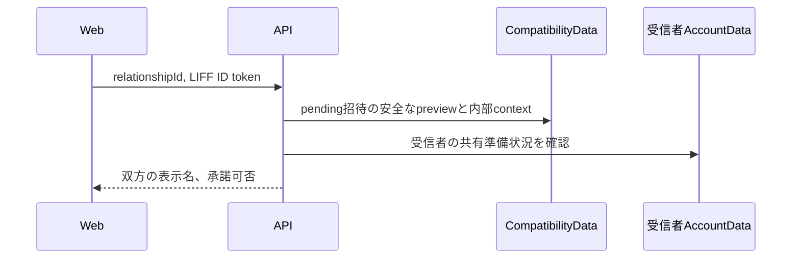
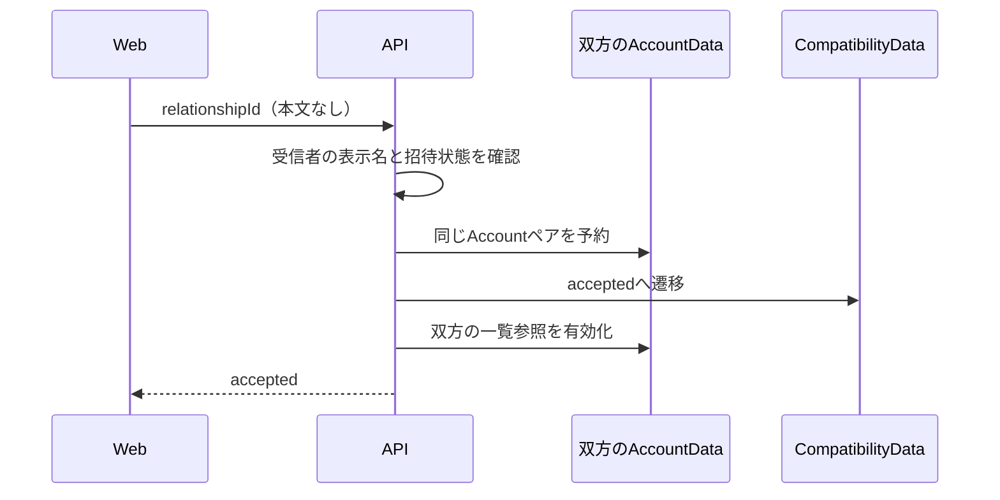

# 相性API契約

## 1. この文書の目的

この文書は、Web UIとAPI Serverの間で利用する相性APIのパス、認証、リクエスト、レスポンス、エラー契約を所有します。

招待と相性シートの利用体験は[相性診断・うつし共有体験設計](../product/compatibility-experience.md)、相性関係の状態と永続化境界は[相性共有データ実装設計](../architecture/compatibility-data-design.md)、診断結果の計算は[診断回答のパラメータ変換設計](../diagnosis/scoring/parameter-scoring-design.md)を正とします。この文書は画面デザイン、相性関係の物理データモデル、診断の採点規則を所有しません。

## 2. 認証境界

相性APIはLIFF IDトークンをAuthorizationヘッダーで受け取り、API ServerがLINEへ検証した`sub`からAccountを解決します。クライアント指定のAccount ID、表示名、診断結果は受け付けません。

```http
Authorization: Bearer <LIFF ID token>
```

IDトークン、Account ID、生の回答、内部の指紋はレスポンスとログへ出しません。

### 2.1 相性画面のプロフィール画像

共有の可否と招待確認で返す`avatarUrl`は、API Serverが当事者のAccountを確定した後、次の順で解決します。

1. 共有D1が参照するPrivate R2のプロフィール設定画像
2. LINEプロフィール画像
3. 画像なし

本人のLINE画像は検証済みLIFF IDトークンの`picture`を使います。相手のLINE画像は、Accountに紐づくMessaging APIのuser IDを共有D1から解決し、[Messaging APIのGet profile](https://developers.line.biz/en/reference/messaging-api/#get-profile)をAPI Serverから呼び出して取得します。このAPIが相手のLIFFトークンを要求することはありません。本システムでは公式アカウントの友だち追加をAccount作成の起点としており、Messaging APIチャネルとLINE Loginチャネルを同じProviderに置くため、両チャネルのuser IDを同一人物へ安全に対応付けられます。

`avatarUrl`には画像本体や外部画像URLではなく、Bearer認証付きで取得する同一APIの相対pathを入れます。本人は`GET /api/profile/avatar`、招待の送信者は`GET /api/compatibility/invitations/:relationshipId/avatar`から画像bodyを取得します。Web UIは取得したBlobのObject URLを表示に使い、LIFF IDトークンをquery parameterや画像URLへ含めません。

R2 objectの欠落・メタデータ不一致、Messaging APIの取得失敗、LINE画像未設定はいずれもプロフィールや招待の取得全体を失敗させず、画像APIの次候補またはbodyなしの`204`へ縮退します。Web UIは画像がない場合や画像読み込み失敗時に表示名の先頭文字を表示します。表示名も取得できない本人については「あなた」の先頭文字を使います。

`avatarUrl`は表示補助であり、共有の同意対象には含めません。各GET時点の現在画像を表示します。相手の画像取得pathは、招待の送信者・受信者としてサーバー側で認可できる応答にだけ含め、Account IDやLINE user IDをクライアントへ返しません。

## 3. 共有の可否

### `GET /api/compatibility/share-consent`

本人が招待リンクを発行する前に、相手へ表示される名前と共有を始められるかどうかを返します。共有される具体的な内容は返しません。招待相手との関係を選んだ後は、任意の`relationshipCategory` query parameterへ`partner`、`family`、`friend`、`work`のいずれかを指定します。



```json
{
  "displayName": "あおい",
  "avatarUrl": "/api/profile/avatar",
  "canShare": true,
  "blockingReasons": [],
  "nextAction": null
}
```

`displayName`は検証済みIDトークンに表示名がなければ`null`です。`avatarUrl`の決定と縮退は[相性画面のプロフィール画像](#21-相性画面のプロフィール画像)に従います。`canShare`は`blockingReasons`が空の場合だけ`true`です。

| 値 | 条件 |
| --- | --- |
| `display_name_unavailable` | 検証済みIDトークンに表示名がない |

共有できる内容がまだない状態でも共有は開始できます。`nextAction`は、共有専用プロフィールprojectionを開示できなければ`profile-summary`、それ以外で共有可能なテーマがなく現在回答できる未完了Diagnosisがあれば`diagnosis`、それ以外は`null`です。`relationshipCategory`を指定した場合、共有可能なテーマと未完了Diagnosisは指定カテゴリと`general`に絞って判定します。これは本人への案内だけに使い、発行可否には影響しません。

このAPIは共有可否の読み取りモデルです。共有専用プロフィールの文章、診断テーマ、パラメータの位置、生の回答、具体的な出来事、日記・会話本文、Source Record、Brain Item本文、内部根拠ID、Account ID、各種指紋を返しません。プロフィール画像をブラウザや中継キャッシュへ保持させないため、成功・エラーを問わず`Cache-Control: no-store`を付けます。

認証・基盤の共通エラーは次のとおりです。

| HTTP | 条件 | レスポンス |
| --- | --- | --- |
| `400` | `relationshipCategory`が`partner`、`family`、`friend`、`work`以外である | `{ "error": "Invalid request" }` |
| `401` | IDトークンがない、検証できない、またはLINE Login設定がない | `{ "error": "Unauthorized" }` |
| `503` | D1またはAccountData bindingがない | `{ "error": "Service Unavailable" }` |
| `500` | 未処理のサーバーエラー | `{ "error": "Internal Server Error" }` |

## 4. 招待リンク発行

### `POST /api/compatibility/invitations`

共有へ同意した本人が、1人だけが承諾できる招待リンクを発行します。クライアントは相手との関係を`partner`、`family`、`friend`、`work`から1つ選び、`relationshipCategory`として送ります。Account ID、表示名、共有プロフィール、診断結果、確認tokenは送りません。

```json
{ "relationshipCategory": "partner" }
```

API Serverは検証済みIDトークンから本人と表示名を解決し、表示名を取得できる場合だけ、256 bitの不透明な関係IDでCompatibilityDataへ`pending`招待を作成し、送信者のAccountDataへ一覧参照を保存します。招待リンクへAccount IDを含めません。



成功時は`201`を返します。`expiresAt`はCompatibilityDataが決定した14日後の期限です。

```json
{
  "invitationUrl": "https://liff.line.me/1234567890-AbCdEfGh/compatibility/invitations/aaaaaaaaaaaaaaaaaaaaaaaaaaaaaaaaaaaaaaaaaaaaaaaaaaaaaaaaaaaaaaaa",
  "expiresAt": "2026-08-26T00:00:00.000Z",
  "relationshipCategory": "partner"
}
```

| HTTP | 条件 | レスポンス |
| --- | --- | --- |
| `400` | 関係カテゴリがない、`general`、または定義外である | `{ "error": "Invalid request" }` |
| `409` | 相手へ表示する名前を確認できず共有を開始できない | `{ "error": "Compatibility invitation unavailable", "reason": "share_unavailable" }` |

`invitationUrl`はLINE内でLIFFとして開ける`https://liff.line.me/{LIFF_ID}/compatibility/invitations/{relationshipId}`です。LIFFは設定済みのWeb endpointへpathを`liff.state`として引き継ぎ、Web UIが招待画面を解決します。

認証・基盤の共通エラーは共有の可否と同じです。`DB`、`AccountData`、`CompatibilityData`、または`LIFF_ID`のbindingがなければ`503`を返し、招待を作成しません。

## 5. 招待内容の確認

### `GET /api/compatibility/invitations/:relationshipId`

招待リンクを開いた受信者が、関係を成立させる前に招待者と自分の共有可否を確認します。`relationshipId`は招待リンクに含まれる256 bitの不透明な関係IDです。クライアントからAccount IDや表示内容を送りません。



送信者については、CompatibilityDataに保存した表示名snapshotだけを返します。送信者の共有プロフィールや診断表示は読み込まず、招待画面へ出しません。

```json
{
  "relationshipCategory": "partner",
  "inviter": {
    "displayName": "あおい",
    "avatarUrl": "/api/compatibility/invitations/aaaaaaaaaaaaaaaaaaaaaaaaaaaaaaaaaaaaaaaaaaaaaaaaaaaaaaaaaaaaaaaa/avatar"
  },
  "recipient": { "displayName": "はる", "avatarUrl": "/api/profile/avatar" },
  "expiresAt": "2026-08-26T00:00:00.000Z",
  "canAccept": true,
  "blockingReasons": [],
  "nextAction": "diagnosis"
}
```

双方の`avatarUrl`は[相性画面のプロフィール画像](#21-相性画面のプロフィール画像)に従い、送信者側も招待が特定したAccountからサーバー側で解決します。

`GET /api/compatibility/invitations/:relationshipId/avatar`は、招待確認APIと同じBearer認証を要求し、受信者としてpending招待を確認できる場合だけ送信者の現在画像を返します。送信者Accountは招待contextから決め、path、query、bodyでAccount IDを受け取りません。画像がなければ`204`、招待が無効なら`404`、自分の招待なら`409`とし、画像応答には`Cache-Control: no-store`と`X-Content-Type-Options: nosniff`を付けます。

`relationshipCategory`は送信者が招待発行時に選んだ関係カテゴリで、受信者はこの値を確認して承諾します。`canAccept`は受信者の検証済み表示名がある場合だけ`true`です。`blockingReasons`は共有の可否と同じ`display_name_unavailable`だけを返します。`nextAction`は受信者への案内であり、承諾可否には影響しません。共有できる内容がまだない場合も承諾でき、双方の内容がそろった時点で追加の同意なしに相性シートを表示します。

| HTTP | 条件 | レスポンス |
| --- | --- | --- |
| `404` | 関係IDが不正、存在しない、期限切れ、取消済み、または承諾済みである | `{ "error": "Compatibility invitation unavailable", "reason": "invitation_unavailable" }` |
| `409` | 送信者本人が自分の招待を開いた | `{ "error": "Compatibility invitation unavailable", "reason": "own_invitation" }` |

認証・基盤の共通エラーは共有の可否と同じです。`DB`、`AccountData`、または`CompatibilityData` bindingがなければ`503`を返します。成功レスポンスへAccount ID、共有プロフィールの文章、診断テーマ、生の回答、内部根拠ID、各種指紋を含めません。招待の状態変化をブラウザや中継キャッシュが保持しないよう、成功・エラーを問わず`Cache-Control: no-store`を付けます。リンクを開いただけでは受信者のAccount、閲覧履歴、同意をCompatibilityDataまたは送信者AccountDataへ保存しません。

## 6. 招待の承諾

### `POST /api/compatibility/invitations/:relationshipId/accept`

共有を確認した受信者が、相性関係を成立させます。リクエスト本文はありません。クライアントはAccount ID、表示名、プロフィール、診断結果、共有対象の選択を送りません。

API Serverは受信者の検証済み表示名を解決し、双方のAccountDataで同じAccountペアの予約を直列化した後、CompatibilityDataを`accepted`へ遷移させ、双方の一覧参照を有効化します。



成功時は`200`を返します。

```json
{
  "relationshipId": "aaaaaaaaaaaaaaaaaaaaaaaaaaaaaaaaaaaaaaaaaaaaaaaaaaaaaaaaaaaaaaaa",
  "status": "accepted"
}
```

| HTTP | 条件 | レスポンス |
| --- | --- | --- |
| `404` | 関係IDが不正、招待が存在しない、期限切れ、または取消済みである | `{ "error": "Compatibility invitation unavailable", "reason": "invitation_unavailable" }` |
| `409` | 送信者本人が承諾しようとした | `{ "error": "Compatibility invitation unavailable", "reason": "own_invitation" }` |
| `409` | 受信者の表示名を確認できない | `{ "error": "Compatibility invitation unavailable", "reason": "share_unavailable" }` |
| `409` | 同じ2人の別の相性関係がすでに成立している | `{ "error": "Compatibility invitation unavailable", "reason": "duplicate_relationship" }` |

認証・基盤の共通エラーは共有の可否と同じです。成功・エラーを問わず`Cache-Control: no-store`を付けます。

## 7. 相性関係の詳細

### `GET /api/compatibility/relationships/:relationshipId`

成立中の相性関係について、閲覧者と相手が現在共有している「私について」と共通テーマを返します。閲覧者が送信者・受信者のどちらであっても`partner`を先、`viewer`を後として返します。

```json
{
  "relationshipId": "aaaaaaaaaaaaaaaaaaaaaaaaaaaaaaaaaaaaaaaaaaaaaaaaaaaaaaaaaaaaaaaa",
  "status": "ready",
  "relationshipCategory": "partner",
  "partner": {
    "displayName": "あおい",
    "aboutMe": {
      "profileSummaryVersionId": "summary-version-inviter",
      "generatedAt": "2026-08-11T00:00:00.000Z",
      "statements": []
    },
    "themes": []
  },
  "viewer": {
    "displayName": "はる",
    "aboutMe": {
      "profileSummaryVersionId": "summary-version-recipient",
      "generatedAt": "2026-08-12T00:00:00.000Z",
      "statements": []
    },
    "themes": []
  }
}
```

双方の`themes`は、取得時点で双方が共有できるDiagnosisのうち、招待で選んだ`relationshipCategory`または`general`に該当する共通部分だけを同じ順序で返します。過去に同意した表示内容とは照合せず、双方の最新の共有専用プロフィールと診断表示を使います。双方の「私について」を開示でき、共通テーマが1件以上ある場合だけ`ready`にします。それ以外では片方だけの内容を返さず、次の待機状態を返します。

```json
{
  "relationshipId": "aaaaaaaaaaaaaaaaaaaaaaaaaaaaaaaaaaaaaaaaaaaaaaaaaaaaaaaaaaaaaaaa",
  "status": "waiting",
  "relationshipCategory": "partner",
  "nextAction": "diagnosis"
}
```

`nextAction`は閲覧者自身の共有プロフィールを開示できなければ`profile-summary`、共通テーマがなく閲覧者がまだ回答できる診断が残っていれば`diagnosis`、それ以外は`null`です。閲覧者が回答し終えていて相手の準備だけが足りない場合は、本人の操作では解消できないため`null`にします。

| HTTP | 条件 | レスポンス |
| --- | --- | --- |
| `404` | 関係IDが不正、存在しない、未成立、終了済み、または閲覧者が当事者でない | `{ "error": "Compatibility relationship unavailable", "reason": "relationship_unavailable" }` |

認証・基盤の共通エラーは共有の可否と同じです。成功レスポンスへAccount ID、各種指紋、生の回答、内部根拠を含めません。成功・エラーを問わず`Cache-Control: no-store`を付けます。

## 8. 相性一覧

### `GET /api/compatibility/relationships`

本人のAccountDataが持つ一覧参照をCompatibilityDataの正本へ同期した後、発行中の招待と成立中の相性関係を作成日時の昇順で返します。

```json
{
  "items": [
    {
      "relationshipId": "aaaaaaaaaaaaaaaaaaaaaaaaaaaaaaaaaaaaaaaaaaaaaaaaaaaaaaaaaaaaaaaa",
      "status": "pending",
      "relationshipCategory": "partner",
      "expiresAt": "2026-08-26T00:00:00.000Z",
      "invitationUrl": "https://liff.line.me/1234567890-AbCdEfGh/compatibility/invitations/aaaaaaaaaaaaaaaaaaaaaaaaaaaaaaaaaaaaaaaaaaaaaaaaaaaaaaaaaaaaaaaa"
    },
    {
      "relationshipId": "bbbbbbbbbbbbbbbbbbbbbbbbbbbbbbbbbbbbbbbbbbbbbbbbbbbbbbbbbbbbbbbb",
      "status": "accepted",
      "relationshipCategory": "friend",
      "partnerDisplayName": "はる",
      "readiness": {
        "status": "waiting",
        "nextAction": "diagnosis"
      }
    },
    {
      "relationshipId": "cccccccccccccccccccccccccccccccccccccccccccccccccccccccccccccccc",
      "status": "accepted",
      "relationshipCategory": "family",
      "partnerDisplayName": "あおい",
      "readiness": {
        "status": "ready",
        "comparableThemeCount": 3
      }
    }
  ]
}
```

`pending`は本人が発行した利用可能な招待だけです。`invitationUrl`は発行時と同じ正規LIFF URLで、一覧からLINEへ再送する場合に使います。受信者がリンクを開いただけでは一覧参照を作らないため、未承諾の受信者側一覧には現れません。

成立中の関係は、デプロイ中や既に開かれているWebとの後方互換性を保つため、外側の`status`を`accepted`のまま維持します。一覧の取得時点で詳細APIと同じ現在の共有内容を判定し、`readiness.status`で、比較可能なら`ready`、まだ比較できなければ`waiting`を返します。`ready`の`comparableThemeCount`は双方に共通する比較可能な診断テーマ数です。`waiting`の`nextAction`は詳細APIと同じく、閲覧者自身の共有プロフィールを開示できなければ`profile-summary`、共通テーマがなく閲覧者がまだ回答できる診断を持つ場合は`diagnosis`、本人側に必要な操作がなければ`null`です。これにより、相手側だけの準備待ちでは本人へ不要な操作を促しません。

取消・期限切れ・終了を検出した参照はAccountData側で非表示へ同期し、レスポンスへ含めません。成立中の関係は一覧を取得するたびに現在の共有内容から判定し、過去の比較可能状態をキャッシュしません。

認証・基盤の共通エラーは共有の可否と同じです。成功レスポンスへ相手のAccount IDや相性シート本文を含めません。成功・エラーを問わず`Cache-Control: no-store`を付けます。

## 9. 招待の取消

### `DELETE /api/compatibility/invitations/:relationshipId`

送信者本人が`pending`の招待を取り消します。CompatibilityDataの正本を先に`cancelled`へ遷移させ、その後に送信者AccountDataの一覧参照を非表示にします。正本更新後に一覧参照の更新が失敗しても、同じリクエストの再試行で参照更新を完了できるよう冪等に処理します。

成功時はレスポンス本文のない`204`を返します。

| HTTP | 条件 | レスポンス |
| --- | --- | --- |
| `404` | 関係IDが不正、存在しない、期限切れ、成立済み、または本人が送信者でない | `{ "error": "Compatibility invitation unavailable", "reason": "invitation_unavailable" }` |

認証・基盤の共通エラーは共有の可否と同じです。成功・エラーを問わず`Cache-Control: no-store`を付けます。

## 10. 相性関係の終了

### `DELETE /api/compatibility/relationships/:relationshipId`

成立中の相性関係を、どちらかの当事者が終了します。CompatibilityDataの正本を先に`ended`へ遷移させ、その後に双方のAccountData一覧参照を非表示にします。正本更新後に一覧参照の更新が失敗しても、同じリクエストの再試行で双方の参照更新を完了できるよう冪等に処理します。

成功時はレスポンス本文のない`204`を返します。終了後は双方の一覧・詳細から関係が消え、以前の直接リンクでも相性シートを再表示できません。

| HTTP | 条件 | レスポンス |
| --- | --- | --- |
| `404` | 関係IDが不正、存在しない、未成立、または本人が当事者でない | `{ "error": "Compatibility relationship unavailable", "reason": "relationship_unavailable" }` |

認証・基盤の共通エラーは共有の可否と同じです。成功・エラーを問わず`Cache-Control: no-store`を付けます。
