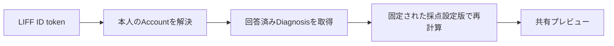

# 相性API契約

## 1. この文書の目的

この文書は、Web UIとAPI Serverの間で利用する相性APIのパス、認証、リクエスト、レスポンス、エラー契約を所有します。

招待と相性シートの利用体験は[相性診断・うつし共有体験設計](../product/compatibility-experience.md)、相性関係の状態と永続化境界は[相性共有データ実装設計](../architecture/compatibility-data-design.md)、診断結果の計算は[診断回答のパラメータ変換設計](../diagnosis/scoring/parameter-scoring-design.md)を正とします。この文書は画面デザイン、相性関係の物理データモデル、診断の採点規則を所有しません。

## 2. 認証境界

相性APIはLIFF IDトークンをAuthorizationヘッダーで受け取り、API ServerがLINEへ検証した`sub`からAccountを解決します。クライアント指定のAccount ID、表示名、診断結果は受け付けません。

```http
Authorization: Bearer <LIFF ID token>
```

IDトークン、Account ID、生の回答、結果指紋はレスポンスとログへ出しません。

## 3. 共有プレビュー

### `GET /api/compatibility/share-preview`

本人が招待リンクを発行する前に確認する表示名と、相性診断へ利用できる現在の傾向を返します。



`themes`へ含めるのは、本人の現在有効な回答による回答済みDiagnosisのうち、Diagnosisが固定した採点設定版で1件以上のパラメータを計算できるものです。Diagnosisは表示順とDiagnosis ID、`parameters`は採点設定内の定義順で安定して返します。

各パラメータの`statement`は、現在の帯域に対応する審査済みラベルから`「{帯域の表示名}」傾向があります`の形で決定的に組み立てます。中央帯ではDiagnosisの採点設定が持つ中央帯の表示名を使います。関わり方の審査済み定型文は現在の採点設定に存在しないため、このAPIで推測して返しません。

```json
{
  "displayName": "あおい",
  "previewToken": "csp1.aaaaaaaaaaaaaaaaaaaaaaaaaaaaaaaaaaaaaaaaaaaaaaaaaaaaaaaaaaaaaaaa",
  "themes": [
    {
      "diagnosisId": "time-planning",
      "title": "時間と予定",
      "parameters": [
        {
          "id": "advance-planning",
          "label": "予定を決めるタイミング",
          "lowLabel": "その場で決めたい",
          "highLabel": "早めに決めたい",
          "position": 78,
          "statement": "「早めに決めたい」傾向があります"
        }
      ]
    }
  ],
  "canIssueInvitation": true,
  "blockingReasons": [],
  "nextAction": null
}
```

`displayName`は検証済みIDトークンに表示名がなければ`null`です。`previewToken`は表示名、画面へ返した共有表示、各テーマの採点設定IDとversionから決定的に計算するバージョン付きの不透明な確認tokenです。後続の招待発行APIはtokenを受け取り、現在状態から再計算した値と一致しない場合に再確認を要求します。tokenはテーマ別の結果指紋ではなく、招待リンクやログへ含めません。

`canIssueInvitation`は`blockingReasons`が空の場合だけ`true`です。`blockingReasons`は次の値を表示順で返します。

| 値 | 条件 |
| --- | --- |
| `display_name_unavailable` | 検証済みIDトークンに表示名がない |
| `diagnosis_required` | 共有可能なテーマがなく、現在回答できる未完了Diagnosisがある |
| `scoring_unavailable` | 回答済みDiagnosisがあるが、共有表示を計算できない |
| `diagnosis_unavailable` | 回答済みDiagnosisも現在回答できる未完了Diagnosisもない |

`nextAction`は、共有可能なテーマがなく、現在回答できる未完了Diagnosisがある場合だけ`diagnosis`とし、それ以外は`null`にします。表示名の不足とDiagnosisの状態は同時に発生し得るため、クライアントは`blockingReasons`を配列として扱います。

このAPIは本人が発行前に確認する読み取りモデルです。生の回答、質問文、Choice、回答日時、Account ID、採点設定本体、`coverage`、テーマ別の結果指紋を返しません。

認証・基盤の共通エラーは次のとおりです。

| HTTP | 条件 | レスポンス |
| --- | --- | --- |
| `401` | IDトークンがない、検証できない、またはLINE Login設定がない | `{ "error": "Unauthorized" }` |
| `404` | 検証済みLINE Accountに対応するAccountがない | `{ "error": "Account not found", "reason": "friendship_required" }` |
| `503` | D1またはAccountData bindingがない | `{ "error": "Service Unavailable" }` |
| `500` | 未処理のサーバーエラー | `{ "error": "Internal Server Error" }` |
