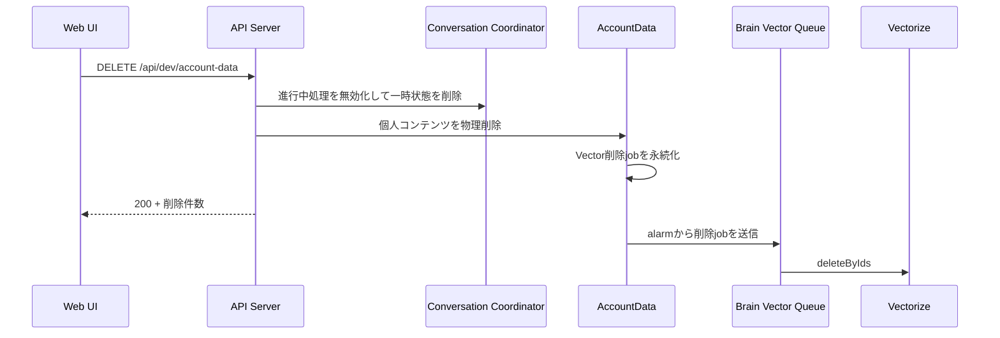

# 開発用AccountデータリセットAPI契約

## 1. 目的

この文書は、開発環境でログイン中Accountの個人コンテンツを初期状態へ戻すAPIとWeb UIの契約を定義します。利用可能な環境、本人確認、削除対象、残すデータ、Vector削除の完了境界、およびプロフィール画面の操作を所有します。

AccountDataと共有D1の保存境界は[Accountデータ分離設計](../architecture/account-data-isolation.md)、プロフィール画面全体の体験は[プロフィール設定体験設計](../product/profile-settings-experience.md)を正とします。本番のAccount削除、相性関係の終了、Source Recordの通常削除は所有しません。

## 2. API

### `DELETE /api/dev/account-data`

`ENVIRONMENT` bindingに`development`、`local`、`preview`、`test`のいずれかが明示されている環境だけで利用できます。未設定、空文字、未知値、`production`では`404`を返し、削除処理を実行しません。

クライアントからAccount IDを受け取りません。LIFF ID tokenを他の本人向けAPIと同じ境界で検証し、解決したAccountのAccountDataとConversation Coordinatorだけを操作します。

## 3. 削除対象

本人のAccountDataにある次の個人コンテンツを物理削除します。

- 診断回答、回答進捗、「あとで回答」、診断projection
- 日記のSource Recordと本文、会話Session、user／assistant message、Chat Turn、Brain checkpoint、利用監査
- すべてのSource Recordと改訂関係
- すべてのBrain Item、Evidence、Access Label、Topic Label、改訂関係
- 生成中と生成済みの「わたしのまとめ」および相性共有用projection
- Conversation Coordinatorの受付済みmessage、Turn、配送outbox、alarm、memory上の一時token

削除開始時点でAccountDataが把握しているBrain Item、Vector対応表、Vector同期jobのBrain Item IDを和集合にし、各IDへVectorize削除jobを登録します。AccountDataの個人コンテンツを先に利用不能にし、Vectorizeの削除はQueueで非同期に完了させます。APIの`200`はAccountDataの削除とVector削除jobの永続化までを表し、Vectorizeからの物理削除完了は表しません。



## 4. 残すデータ

開発者が同じLINE Accountですぐ検証を再開できるよう、次を削除しません。

- 共有D1のAccount、Identity、role、status
- アバターの共有D1 metadataとPrivate R2 object
- ブラウザに保存した表示テーマ
- Diagnosis、Question、Choice、Scoring Configなど全Account共通の定義
- 相性関係の正本と、各AccountDataにある相性一覧用参照
- 他のAccountが所有するデータ
- AccountData Object identityと共有catalog snapshot
- Vector削除の完了に必要なVector対応表と同期job

これは本番の退会またはAccount削除ではありません。通常のSource Record削除にあるtombstoneも作らず、開発用リセットとして物理削除します。

## 5. 応答

```json
{
  "deletedDiagnosisResponseCount": 2,
  "deletedConversationSessionCount": 3,
  "deletedSourceRecordCount": 18,
  "deletedBrainItemCount": 7,
  "deletedProfileSummaryVersionCount": 1,
  "scheduledVectorDeletionCount": 7
}
```

削除対象がない場合も各件数を`0`として`200`を返します。全削除はAccountData内の1つのatomic batchで確定し、失敗時に一部だけ削除された状態を残しません。

## 6. Web UI

プロフィール画面の一番下に`DEV ONLY`の「自分のデータを全削除」を表示します。Web UIの`ENVIRONMENT`がAPIと同じ開発環境として明示されている場合だけ表示し、未設定時とproductionでは表示しません。

操作前に、診断、日記、Brain Item、「わたしのまとめ」、Vectorが対象であり、取り消せないことを確認します。成功後は削除件数とVector削除が非同期であることを表示します。API側の環境制限と本人確認を認可境界とし、UIの非表示だけには依存しません。
