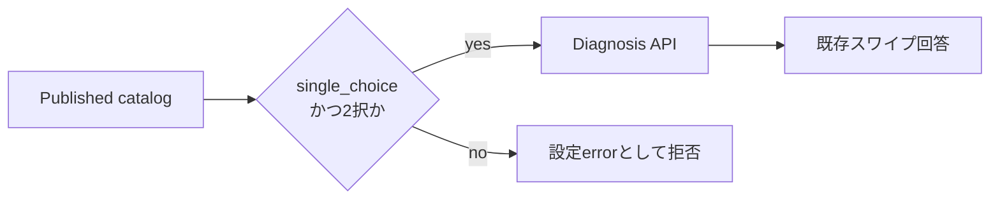

# 診断回答形式の残タスク

## 1. 目的

この文書は、Phase 1の2択`single_choice`へ新しい回答形式を追加する前に必要な意思決定、不変条件、縦切りの順序を管理します。

### 所有する概念

- 新しい診断回答形式を選ぶ前の未検討事項
- 形式ごとにdomain、API、保存、採点、UIを接続する実装順
- 未設計の形式を現在の回答経路へ流さない境界

### 所有しない概念

- Phase 1のQuestion、Diagnosis、DiagnosisResponseの定義
- 現在の2択診断の画面体験とAPI契約
- 形式固有の採点規則

現在の集約と不変条件は[Phase 1 診断ドメイン設計](../diagnosis/diagnosis-domain-design.md)、画面は[Phase 1 診断体験設計](../diagnosis/diagnosis-experience.md)、HTTP契約は[診断API契約](diagnosis-api.md)を正とします。

## 2. 現在の安全境界

Phase 1のQuestion Versionは、Choiceをちょうど2件持つ`single_choice`だけです。公開catalogの読込時にも形式とChoice件数を検査し、DBへ未設計の形式や壊れた2択が混入してもWeb UIへ返しません。

「あとで回答」は回答ではなく進捗です。恒久的なskip、回答拒否、空の自由記述として解釈しません。既存回答の意味、Source Recordの粒度、採点結果を変えず、新形式は別の縦切りとして追加します。

## 3. 【検討必須】未検討事項

| 未検討事項 | 決定する内容 |
| --- | --- |
| 最初の1形式 | 自由記述、複数選択、尺度、rankingのどれを、どの価値仮説で最初に追加するか |
| 回答済み条件 | 空値、部分回答、最小・最大選択数、同順位、範囲外値をどう扱うか |
| skipとの違い | 「あとで回答」、恒久skip、回答拒否、未回答をどう区別するか |
| Source Record粒度 | 1問を1原本とするか、複数選択やrankingの各要素をどう保存するか |
| 訂正・削除 | 部分変更を改訂とする単位、過去版、削除後の回答状態 |
| 採点 | 採点の有無、設定版、比較可能性、未回答を含む結果の扱い |
| AI利用 | 自由記述の原文とAI派生の分離、AIなしで保存・閲覧・削除できる範囲 |
| 相性共有 | 異なる形式・設定版を比較できる条件と、共有対象外にする条件 |
| export | 原文、選択順、尺度値、設定版、AI派生を区別する形式 |
| UI・アクセシビリティ | keyboard、screen reader、mobile gesture、入力途中保存、error復帰 |
| 版互換性 | 既存`single_choice`と新形式を同じDiagnosisへ混在させるか、旧clientの扱い |

未決定の項目を現在のChoice ID、左右スワイプ、2択採点へ当てはめません。最初の1形式と回答済み条件、Source Record粒度、訂正・削除が決まるまで、schemaのformat enumを増やしません。

## 4. 決定後の実装順

1. 最初の1形式についてQuestion Version、DiagnosisResponse、Source Recordの不変条件をSSoTへ追加する
2. 保存、訂正、削除、exportをAIなしで縦に接続する
3. 採点する形式だけに版付き採点契約を追加する
4. 形式専用UIとkeyboard、screen reader、mobileの操作試験を追加する
5. AI派生や相性共有を、それぞれの利用条件が決まった後の別PRで追加する
6. 既存2択回答の取得、修正、採点、exportが変わらない回帰試験を通す

## 5. 完了条件

- 最初に追加する1形式と価値仮説が決まっている
- domain、API、採点、訂正、exportのSSoTがある
- 既存`single_choice`回答の意味を変えない
- 回答原文とAI派生を区別する
- keyboard、screen reader、mobileで回答できる

## 6. 更新ルール

- 複数形式を1つの決定や実装PRにまとめない
- 決定済みの項目は、形式固有SSoTへのリンクへ置き換える
- UI都合でdomainの回答済み条件を決めない
- 1形式を完了しても、未実装の形式はこの文書へ残す
