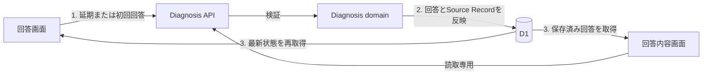

# Diagnosis実装計画

## 1. この文書の目的

この文書は、診断の一覧表示、回答実行、回答保存を実際に利用できる縦切りにするための、現在の実装状況、残作業、実装順序を所有します。

画面と遷移の正は[Phase 1 診断体験設計](../diagnosis/diagnosis-experience.md)、集約と不変条件の正は[Phase 1 診断ドメイン設計](../diagnosis/diagnosis-domain-design.md)、HTTP契約の正は[診断API契約](diagnosis-api.md)、永続化への写像の正は[`packages/lib`のcatalog schema](../../packages/lib/src/d1/shared/schema/catalog.ts)と[diagnosis schema](../../packages/lib/src/do/account/schema/diagnosis.ts)です。この文書は、それらの定義や具体的なAPIスキーマを所有しません。

## 2. 現在地

2026-08-23時点では、一覧・質問詳細・回答保存・「あとで回答」・回答内容取得がWebからD1まで接続済みです。受付中は保存済み回答を読み込み、回答途中の診断を最初の未回答から再開できます。受付終了後は保存済み回答を閲覧できますが、追加入力と途中回答からの結果生成はできません。`/diagnosis/:diagnosisId`は`liff.state`からも解決され、認証・規約同意後に対象診断を直接開きます。

| 利用者の操作 | 現在の状態 | 主な根拠 |
| --- | --- | --- |
| 一覧を見る | 接続済み | Webの`fetchDiagnosisList`、`GET /api/diagnoses`、D1の`listVisibleDiagnoses` |
| 未回答の診断を開く | 接続済み | 詳細APIが返す質問とChoiceを回答画面へ表示する |
| 質問へ回答する | 接続済み | `SwipeDiagnosis`の操作を1問単位で回答保存APIへ送る |
| あとで回答する | 接続済み | 延期APIが操作をD1へ保存し、成功後に一覧へ戻す |
| 回答を保存する | 接続済み | 回答APIがAnswerとSource RecordをD1へ原子的に保存する |
| 回答途中から再開する | 接続済み | 質問詳細と現在回答を取得し、保存済みの質問を除いて再開する |
| 回答内容を見る | 接続済み | 保存済み回答を取得し、同じ設定版で傾向を再計算する |

すでに再利用できる土台として、Diagnosisの純粋なドメイン操作、D1 schemaとmigration、5件の公開Diagnosis seed、本人確認、一覧APIとE2Eテストがあります。

## 3. 縦切りの進捗

### 3.1 「あとで回答」の保存

- [x] 「あとで回答」の作成と解消を扱うD1 actionを追加する
- [x] 延期APIを追加し、回答APIと同じLIFF本人確認と受付状態の検証を行う
- [x] 保存成功後は一覧へ戻し、再開時は延期した質問を最初の未回答として表示する
- [x] 保存失敗時は操作を失わず、再試行または一覧へ戻れるようにする

### 3.2 回答の修正・削除

- [x] 同じChoiceの再送だけを冪等に受け付け、異なるChoiceを`answer_is_immutable`で拒否する
- [x] 開発用入力データ画面でも診断回答をread-onlyにする
- [x] Account削除だけは診断回答を含むAccountData全体へ適用する

### 3.3 回答画面の操作を完成させる

- [x] 選択時に即確定し、直前の質問へ戻る操作を設けない
- [x] アプリ内の戻る操作では、一覧起点・直接URL・連続操作のいずれも未完了の回答保存を待ち、成功後だけ履歴上の遷移先へ移動する
- [x] 保存失敗時は回答画面に留まり、同じ回答を再試行できる状態を維持する
- [x] 再読込、tab終了、外部遷移では未保存回答がある間だけ標準の離脱警告を表示する
- [x] 回答保存の既存PUT契約を変えず、開始済みリクエストへWeb標準の`keepalive`を付ける

`keepalive`は離脱後も小さい回答保存リクエストを継続できる可能性を高めるためのbest effortです。ブラウザやOSによる強制終了、LINE内WebViewの強制終了、通信断、端末の電源断では完了を保証しません。利用者向けの保証範囲は[Phase 1 診断体験設計 §8](../diagnosis/diagnosis-experience.md#8-共通状態と復帰先)を正とします。

### 3.4 縦切りの検証

- [x] 延期・初回回答・不変性のAPI controller、logic、D1 actionを層ごとにテストする
- [x] Miniflare D1へmigrationとseedを適用し、延期、初回回答、異なるChoiceの拒否、再開をE2Eで確認する
- [x] Webでは延期後の復帰、保存済み回答の閲覧、戻る操作をテストする
- [x] 遅延するsave Promiseで、一覧起点・直接URL・連続操作での保存中の戻る、標準離脱警告、保存後の再開をテストする
- [x] 保存失敗時に遷移せず、同じ回答の再試行経路を保つことをテストする
- [x] `task ci`でリポジトリ全体を検証する

## 4. 推奨する実装順序

1. [x] [診断API契約](diagnosis-api.md)へ延期の契約とエラーを追加する
2. [x] 延期のD1 actionとAPIを実装し、Webの「あとで回答」を接続する
3. [x] 受理済み回答の不変契約をAPI、D1 action、Webで接続する
4. [x] 回答内容画面をread-onlyにし、回答画面に直前の質問へ戻る操作を設けない
5. [Phase 1の完了条件](../diagnosis/diagnosis-experience.md#9-実際に診断できる状態の完了条件)を通しで検証する

LINE通知とリッチメニューはPhase 1全体の完了には必要ですが、回答保存と延期の縦切りとは分けて進められます。残作業は[§6](#6-縦切り外の残作業)で管理します。

## 5. 完了した最短縦切り

- [x] seed済みのDiagnosisが本人の回答状態付きで一覧表示される
- [x] 一覧から開いた質問とChoiceがD1の公開済みQuestion Versionに由来する
- [x] 1問回答した直後にD1へAnswerとSource Recordが保存される
- [x] 同じ回答の再送で新しいSource Recordが増えない
- [x] 再読み込み後に回答途中として表示され、最初の未回答から再開できる
- [x] 全問保存後に一覧が回答済みへ変わる
- [x] 認証失敗、受付終了、保存失敗で白画面にならず、再試行または一覧へ戻れる

## 6. 縦切り外の残作業

Phase 1の完了に必要で、[§3](#3-縦切りの進捗)の縦切りとは分けて進められる残作業です。

### 6.1 通知からの診断入口を接続する

対象診断を直接開くWeb入口は実装済みです。定期的なLINE通知は提供せず、本人が開く診断一覧とリッチメニューからの手動導線だけを提供します。

- [x] `/diagnosis/:diagnosisId`を直接開く入口をWebへ追加する
- [x] `liff.state`に保持された対象診断pathを認証・規約同意後も復元する
- [x] リッチメニューと診断一覧から対象診断のLIFF URLへ遷移できるようにする

完了条件は、[Phase 1 診断体験設計](../diagnosis/diagnosis-experience.md)が定める「一覧・リッチメニューのどちらからでも同じ診断入口を開ける」状態です。
