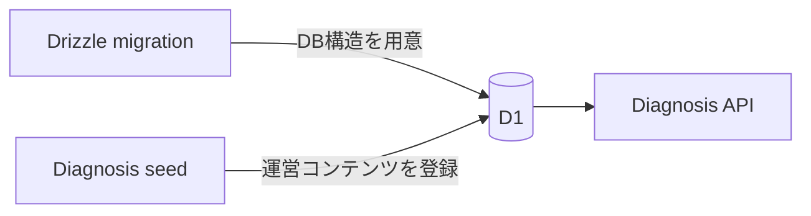
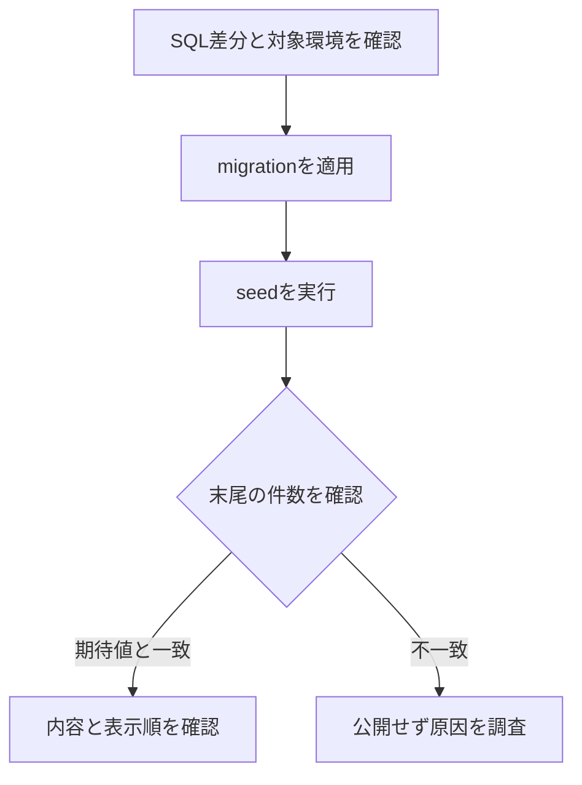

# 診断seed運用

## 1. この文書の目的

この文書は、運営がQuestion、Question Version、Choice、Diagnosis、版付き採点設定をCloudflare D1へ登録するseedの配置、実行、更新、検証方法を所有します。

Question、Diagnosisの状態と不変条件は[Phase 1 診断ドメイン設計](../diagnosis/diagnosis-domain-design.md)、質問文は[診断の質問集](../diagnosis/content/relationship-values-yes-no-question-bank.md)、回答からパラメータへの変換は[診断回答のパラメータ変換設計](../diagnosis/scoring/parameter-scoring-design.md)を正とします。この文書は、質問内容、スコアリング設定、D1スキーマを所有しません。

## 2. migrationとseedの境界

Drizzle migrationはテーブル、カラム、制約、インデックスなどの構造だけを変更します。診断内容は独立した公開ライフサイクルを持つため、migrationへ含めず[`packages/lib/seeds/diagnoses.sql`](../../packages/lib/seeds/diagnoses.sql)で管理します。



seedは必ずmigration適用後に実行します。localでは開発者が明示的に実行し、previewとproductionでは登録漏れを防ぐためCDがmigration直後に適用します。CDへ入る変更は、SQL差分と対象環境をレビューしてからマージします。

## 3. seedの原則

- Question ID、Diagnosis Question ID、Diagnosis IDは環境間で同じ固定値を使う
- SQLは再実行できるようにし、既存行を上書きしない
- 公開済みQuestion Versionの質問文、Choice、状態を更新しない
- 質問内容を変える場合は、同じQuestionへ新しいversionを追加する
- 公開済みDiagnosisのタイトル、受付期間、質問、版、質問順を更新しない
- 公開内容を変える場合は、新しいDiagnosis IDで登録する
- `created_at`などの日時はDrizzleの`timestamp` modeに合わせたUnix秒で記録する
- 採点設定の意味と計算規則は各スコアリング設計を正とし、実行時の設定値をseedから版付きの不変な行として登録する
- 公開済みDiagnosisが参照する採点設定行を更新せず、変更時は新しい設定IDとversionを追加する
- seedのcatalog内容を変更したら、同じ変更で`catalog_versions`のversionを1つ上げる

`INSERT OR IGNORE`は同じ主キーの既存行を変更しません。そのため再実行前には、既存行がseedの期待内容と一致しているかを確認します。意図しない差分がある場合、SQLの上書き更新で解消せず、Question VersionまたはDiagnosisを新しく作ります。

スキーマ拡張で既存行に新しい必須項目を追加した場合だけ、空の初期値を正式な値へ補完する条件付き`UPSERT`を許可します。既に値がある行は更新対象にせず、公開済み内容の変更には使いません。

## 4. 登録する診断

現在のseedは次の公開済みDiagnosisを登録します。

| 表示順 | Diagnosis ID | タイトル | Relationship Category | Question Version | 受付開始 |
| ---: | --- | --- | --- | --- | --- |
| 10 | `relationship-priority` | 自分と相手の優先・境界線 | `partner` | すべてversion 1 | 2026-08-04 00:00:00 UTC |
| 20 | `money-values` | お金と消費 | `partner` | すべてversion 1 | 2026-08-04 00:00:00 UTC |
| 30 | `leisure-style` | インドア・アウトドアと余暇 | `partner` | すべてversion 1 | 2026-08-04 00:00:00 UTC |
| 40 | `time-planning` | 時間と予定 | `partner` | すべてversion 1 | 2026-08-04 00:00:00 UTC |
| 50 | `conversation-emotion` | 会話と感情表現 | `partner` | すべてversion 1 | 2026-08-04 00:00:00 UTC |
| 60 | `life-priorities` | 優先順位と人生の方向性 | `general` | すべてversion 1 | 2026-08-14 00:00:00 UTC |
| 70 | `work-values` | 仕事の価値観・働き方 | `general` | すべてversion 1 | 2026-08-14 00:00:00 UTC |
| 80 | `work-relationship-style` | 仕事の変化・周囲との関わり方 | `work` | すべてversion 1 | 2026-08-14 00:00:00 UTC |
| 90 | `family-support-style` | 家族との距離感・支え合い | `family` | すべてversion 1 | 2026-08-14 00:00:00 UTC |
| 100 | `friendship-style` | 友達との距離感・付き合い方 | `friend` | すべてversion 1 | 2026-08-14 00:00:00 UTC |

いずれも終了日時を持たず、Question Versionは`approved`、Diagnosisは`published`として登録します。先行5件の質問は交際、家計、パートナーとの余暇、一緒に過ごす時間、愛情表現など、パートナーとの関係を前提にしているため`partner`とします。「優先順位と人生の方向性」と「仕事の価値観・働き方」は、特定の相手との関係を前提にせず本人の価値観を尋ねるため`general`とします。「仕事の変化・周囲との関わり方」は、同僚、上司、部下、取引先など仕事で関わる相手との場面を前提にするため`work`とします。「家族との距離感・支え合い」は、親、子、きょうだいなど家族との場面を前提にするため`family`とします。「友達との距離感・付き合い方」は、友達との連絡、予定、悩みの共有などの場面を前提にするため`friend`とします。Relationship Category追加時のmigrationで既存行へ入る`general`は、先行5件に限りseedの条件付きUPSERTで`partner`へ補正します。すでに別カテゴリを持つ行は上書きしません。Diagnosisには一覧表示用の短い説明、表示順、版付き採点設定への参照を持たせます。Choiceは「いいえ」「はい」の2件です。表示順は診断内容ではなく一覧上の優先順位として変更でき、将来の差し込みに備えて10刻みで設定します。

## 5. 実行方法

先に対象環境のmigrationを適用し、その後seedを実行します。

```bash
# local
task db:migrate:local
task db:seed:local

# preview
task db:migrate:preview
task db:seed:preview

# production
task db:migrate:production
task db:seed:production
```

previewとproductionではCDがmigration直後に同じseedを自動適用します。上記コマンドは手動での再適用や復旧確認に使用します。リモートD1へ手動実行する場合は、事前に`packages/lib/wrangler.toml`のdatabase名とID、およびSQL差分を確認します。



## 6. 実行後の検証

SQL末尾の検証クエリは、現在のseedだけを適用した場合に次の件数を返します。

| 項目 | 期待値 |
| --- | ---: |
| Diagnosis | 10 |
| Question Version | 100 |
| Choice | 200 |
| Diagnosis Question | 100 |
| Diagnosis Scoring Config | 10 |

件数だけでなく、次も確認します。

- Diagnosisが`published`で、受付開始日時を過ぎている
- 先行5件のRelationship Categoryが`partner`であり、「優先順位と人生の方向性」と「仕事の価値観・働き方」が`general`、「仕事の変化・周囲との関わり方」が`work`、「家族との距離感・支え合い」が`family`、「友達との距離感・付き合い方」が`friend`である
- 1つのDiagnosisにposition 0から9までの10問がある
- 各Question Versionが`approved`である
- 各Question Versionにposition 0の「いいえ」とposition 1の「はい」がある
- 各Diagnosisが対応するversion 1の採点設定を参照している
- 各Diagnosisの表示順が登録表と一致する
- seedを2回実行しても件数と内容が変わらない
- 採点設定とQuestion ID、Question Version、Choice IDが一致する
- `catalog_versions`の`diagnosis`が今回のseedのversionと一致する

`catalog_versions`は、AccountDataが保持する公開定義snapshotを再同期するか判断する版です。AccountDataは共有D1のversionと自分が同期済みのversionが一致する間、公開定義を読み直しません。versionを上げ忘れると、新しい診断が利用者へ表示されません。境界の定義は[Accountデータ分離設計](../architecture/account-data-isolation.md)を正とします。

`task ci`はseedを適用したローカルD1に対し、採点設定を参照する全Diagnosisへ回答保存・回答内容取得を行います。採点設定と質問定義が一致せず計算結果を返せない場合はE2Eテストを失敗させ、preview・productionへの適用前に停止します。

## 7. 追加・改訂手順

新しい診断を追加するときは、質問内容とスコアリング設定をそれぞれのSSoTで確定してからseedへ追記します。

1. Question IDとQuestion Versionを決める
2. Question VersionとChoiceを`approved`として追加する
3. 新しいIDとversionで採点設定を追加する
4. 新しいDiagnosis ID、採点設定への参照、固定した質問順を追加する
5. `catalog_versions`のversionを1つ上げる
6. localへ適用し、再実行と取得結果を検証する
7. マージ後、preview CDの適用結果をAPIとWebから確認する
8. production CDの対象DBと適用結果を確認する

公開済みの内容を改訂するときは、既存のSQL行を書き換えて既存DBへ反映させようとしてはいけません。新しいQuestion VersionとDiagnosisを追記し、過去の回答が参照する版を残します。
