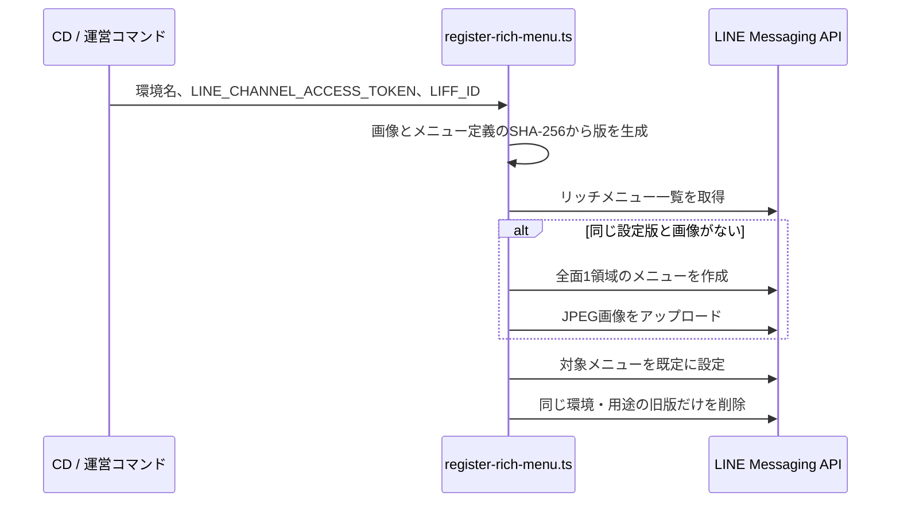

# LINEリッチメニュー運用

## 1. この文書の目的

この文書は、LINE Messaging APIでリッチメニューを登録し、デプロイ時に更新する実装と運用手順を定義します。

メニューの項目、表示文言、遷移先の役割は[Phase 1 診断体験設計](../diagnosis/diagnosis-experience.md#7-リッチメニュー)を正とします。この文書では体験設計を定義しません。また、LIFFアプリ自体の認証と画面遷移も対象外です。

## 2. 登録フロー

リッチメニューはLINE Official Account ManagerではなくMessaging APIで管理します。公式仕様どおり、メニュー作成、画像アップロード、既定メニュー設定の順に実行します。



画像は[`apps/api/assets/rich-menu-diagnosis.jpg`](../../apps/api/assets/rich-menu-diagnosis.jpg)を使います。2500×843pxのJPEGで、全面を1つのURI actionにします。遷移先は`https://liff.line.me/{LIFF_ID}`であり、Account IDや認証トークンを含めません。

LINEの画像要件は[Messaging API reference](https://developers.line.biz/en/reference/messaging-api/#upload-rich-menu-image)を確認します。現在のアセットは幅800〜2500px、高さ250px以上、縦横比1.45以上、1MB以下という要件を満たします。

## 3. 実行方法

次の環境変数を設定します。

| 環境変数 | 用途 |
| --- | --- |
| `LINE_CHANNEL_ACCESS_TOKEN` | Messaging APIのリッチメニュー操作 |
| `LIFF_ID` | タップ時に開くLIFFアプリ |

ローカルから対象環境へ明示的に登録する場合は次を実行します。

```bash
bun --cwd apps/api run register:rich-menu:preview
bun --cwd apps/api run register:rich-menu:production
```

preview / productionのCDでは、WebとLIFF Endpointの登録後に同じ処理を自動実行します。設定が不足している場合やLINE APIが失敗した場合は、リンク切れのメニューを公開済みとして扱わずジョブを失敗させます。

## 4. 更新と復旧

画像内容と、LIFF IDを含むメニュー定義全体のSHA-256をメニュー名の版に使います。同じ設定で再実行した場合は、画像の存在を確認してから既存メニューを再利用します。画像またはメニュー定義が変わった場合や、同名メニューの画像を確認できない場合は新しいメニューを作成します。新しいメニューを既定に設定できてから、`me-builder-diagnosis-{environment}-`で始まる旧版だけを削除します。他環境、他用途、LINE Official Account Managerで作成したメニューは削除しません。

画像アップロードまでに失敗した場合は、今回作成した未完成のメニューを可能な範囲で削除します。既定設定の応答が失敗した場合はLINE側の現在値を照会し、新メニューが既定になっていれば成功として扱います。照会にも失敗して結果を確定できない場合は新メニューを削除せず、既定メニューを誤って失うことを避けます。既定設定済みの旧版は新しいメニューの設定成功まで残るため、更新途中の失敗で現在の導線を失いません。
