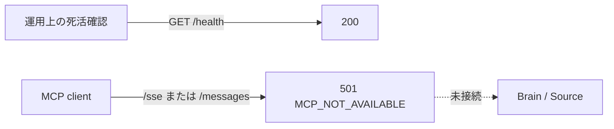

# MCP実装残タスク

## 1. 目的

この文書は、Phase 2のMCP提供を開始する前に必要な意思決定、実装順、公開ゲートを管理します。

### 所有する概念

- MCPを利用可能にする前の未検討事項
- 未検討事項の決定後に進める実装順
- スケルトンを利用可能な機能として公開しない現在の境界

### 所有しない概念

- `Access Label`、`Access Profile`と外部提供の高レベルな原則
- Brain Item、Evidence、Source Recordの意味
- 将来決定するtransport、client、scope、監査record、toolの具体的なschema

外部提供の原則は[Brainのラベル・アクセス制御設計](../domain/brain/brain-access-label-design.md)、MCPのロードマップ上の位置は[プロジェクト概要](../product/project-overview.md)を正とします。

## 2. 現在の公開境界

MCPは初期リリースに含めません。`apps/mcp`はデプロイ経路と死活確認を維持しますが、`/sse`と`/messages`は常に`501 MCP_NOT_AVAILABLE`と`Cache-Control: no-store`を返します。tool、認証済みtransport、Brain検索は提供しません。

501境界を解除する変更は、この文書の未検討事項を決定し、認可とnegative testを同じStackで実装した後に行います。

## 3. 【検討必須】未検討事項

| 未検討事項 | 決定する内容 |
| --- | --- |
| transport | 対応するMCP仕様版、通信方式、接続の有効期限、互換性方針 |
| client registration | clientを誰がどの画面で登録し、client identityをどう検証するか |
| scope | read-only権限の粒度と、Access Profileとの対応 |
| 同意UI | 接続先、取得可能範囲、権限変更差分を本人へどう提示して確認するか |
| 監査保持 | 取得履歴に残す項目、保持期間、本人への表示、運用者の閲覧境界 |
| 解除 | token失効、cache、実行中requestを含め、解除をいつ完了とみなすか |
| 最初のtool | 最初に提供するread-only toolと、返してよい確認済みデータの範囲 |
| AI生成の区別 | 本人の明言、観察、AI推定、Evidenceを応答でどう区別するか |
| 原本 | 例外的に原本を返すか。返す場合の用途、期限、再取得防止 |
| 課金 | 接続数、request数、tool利用をPlanへどう対応させるか |
| 仕様追従 | MCP仕様とSDKのversionを更新する条件、互換性試験、停止手順 |

未決定の項目を実装都合の既定値で補いません。特にscope、同意、監査、解除、最初のtoolが未決定の間は、認証tokenの発行と501境界の解除を行いません。

## 4. 決定後の実装順

1. threat modelと認証、認可、scope、同意、監査、解除のSSoTを作る
2. 本人が接続先、許可範囲、取得履歴を確認し、権限を狭めたり解除したりできるWeb UIを作る
3. read-onlyの最小toolを、許可済みAccess Labelだけを検索する経路へ接続する
4. 他Account、scope不足、期限切れ、解除直後、`private`／`unclassified`、原本取得のnegative testを追加する
5. Previewでclient互換性と監査記録を検証してから段階公開する

## 5. 完了条件

- スケルトンを一般提供していない
- 認証、認可、scope、同意、監査、解除のSSoTがある
- 確認済み範囲だけを返す最小toolがある
- 他Account、scope不足、期限切れ、解除後のアクセスを拒否する
- 本人が接続先、許可範囲、取得履歴を確認し、解除できる

## 6. 更新ルール

- 決定済みになった項目は、決定内容のSSoTへのリンクへ置き換える
- toolやschemaの候補を、この残タスク文書で確定しない
- 501境界を解除するPRは、未検討事項とnegative testの完了を同時に更新する
- 全完了条件を満たしたら、この文書とドキュメントマップのリンクを同じ変更で削除する
