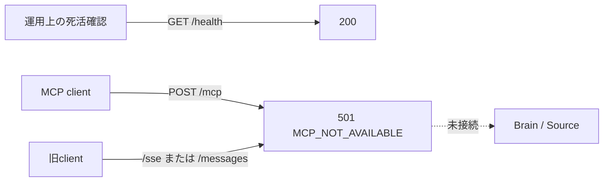

# MCP実装残タスク

## 1. 目的

この文書は、管理者限定MCPを決定済みの設計どおり実装し、現在の501公開境界を解除するまでの依存順、検証と公開ゲートを管理します。

### 所有する概念

- MCPを利用可能にするまでの実装順とPR境界
- Previewで確認する互換性、安全性と運用証跡
- スケルトンを利用可能な機能として公開しない現在の境界

### 所有しない概念

- MCPのtransport、認証・認可、同意、開示、監査、解除の決定 — [MCP連携設計](../architecture/mcp-integration-design.md)
- `Access Label`、`Access Profile`と外部提供の共通原則 — [Brainのラベル・アクセス制御設計](../domain/brain/brain-access-label-design.md)
- Brain Item、Evidence、Source Recordの意味
- 一般利用者向けMCP、課金と複数toolへの拡張

## 2. 現在の公開境界

MCPはまだ利用できません。`apps/mcp`はデプロイ経路と死活確認を維持しますが、将来の標準endpointである`POST /mcp`と旧`/sse`、`/messages`は常に`501 MCP_NOT_AVAILABLE`と`Cache-Control: no-store`を返します。tool、OAuth token、Brain検索は提供しません。

501境界を解除する変更は、[MCP連携設計](../architecture/mcp-integration-design.md)の認可、監査、データ境界を実装し、negative testとPreview互換性検証を完了した後に行います。部分実装を公開するために501を先に外しません。

## 3. 意思決定の状態

transport、client registration、scope、同意UI、監査保持、解除、最初のtool、AI生成の区別、原本、課金、仕様追従はすべて決定済みです。決定内容は[MCP連携設計](../architecture/mcp-integration-design.md)だけをSSoTとし、この残タスク文書へ値や規則を複製しません。

ConfidenceはMCP固有の未検討事項ではありません。共通の算出規則が未実装の間はMCP応答へ含めないことが決定済みです。一般利用者への公開、課金、原本取得、tool追加は現在の完了条件に含めず、それぞれ別の意思決定として扱います。

## 4. 実装順

### 4.1 Protocol・OAuth基盤

- MCP `2026-07-28`対応の公式TypeScript SDK安定版を固定する
- ステートレスなStreamable HTTP、Protected Resource Metadata、Authorization Server Metadataを実装する
- CIMDの検証とSSRF対策、Authorization Code + PKCE、resource・audience・issuer検証を実装する
- access token、refresh token rotation、30日idle失効、接続状態による即時失効を実装する
- authorization codeとtokenを不透明値で発行し、hashだけを保存してAccount・接続・client・resource・scopeへ結びつける
- 現在roleが`admin`であるAccountだけが認可とtool呼び出しへ進めるnegative testを追加する
- 環境別feature flagが無効なら`POST /mcp`を現在の501応答へ戻す

### 4.2 同意・接続・監査UI

- 既存Web sessionで管理者本人を確認する認可画面を作る
- CIMDから検証したclientと、固定scope・Access Profile・開示境界・解除の限界を表示する
- 接続一覧、最終利用、token期限、解除操作を管理者向けWeb画面へ追加する
- MCP取得監査recordと、管理者本人だけが見られる90日best effortの履歴画面を実装する
- 90日を過ぎた監査recordの定期削除を実装し、長期archiveを作らない
- 監査保存失敗では検索結果を返さず、本文やqueryを運用ログへ出さないことをtestする

### 4.3 `search_my_brain`

- `brain:search`だけで呼べる`search_my_brain`を実装する
- Vector検索の候補作成前にOwner ProfileとAccess Policyを適用する
- 検索後にAccountDataで所有者、status、Access Label、機微度、外部MCP提供可否を再認可する
- 本人の明言、本人による他者・出来事の観察、AI推定、ルールベース変換を区別して返す
- Evidenceは件数、Source kind、日時だけとし、Source RecordとEvidenceの原文を取得できる経路を作らない
- 入力長、返却件数、rate limitは負荷試験で有限の共通上限を固定する

### 4.4 Negative testとPreview検証

次の拒否と境界を自動testで固定します。

- 未認証、別resource用token、scope不足、期限切れ、refresh token再利用
- 非管理者、停止Account、利用規約未同意、別Account、接続解除直後
- CIMD不一致、不正redirect URI、private networkへのmetadata取得、metadata変更後の同意流用
- `unclassified`、`highly_sensitive`、外部MCP提供不可、削除・撤回・置換済みItem
- Source Record、Evidence原文、相談本文、添付原本、他Account情報の取得試行
- 監査保存失敗、30秒timeout、feature flag無効化

Previewでは管理者が実際に使用するCIMD対応clientで、認可、検索、token更新、30日idle失効相当の時刻制御、解除、再接続を確認します。検索結果と監査画面の内容を照合し、運用ログ、URL、browser storageにtokenや個人コンテンツがないことを証跡へ残します。

## 5. 公開手順

1. §4.1〜§4.3をfeature flag無効のままデプロイする
2. unit testとnegative testを全件通す
3. Previewだけでfeature flagを有効にし、実client互換性と監査を確認する
4. 不具合時に`POST /mcp`だけを501へ戻せることを確認する
5. Productionでは管理者Accountだけを対象に有効化する
6. 公開後も非管理者、旧仕様、旧endpointは閉じたままであることを確認する

## 6. 完了条件

- 認証、認可、scope、同意、監査、解除が[MCP連携設計](../architecture/mcp-integration-design.md)どおり動く
- 確認済み範囲だけを返す`search_my_brain`がある
- 他Account、scope不足、期限切れ、解除後、非公開データへのアクセスを拒否する
- 管理者本人が接続先、許可範囲、取得履歴を確認して解除できる
- Previewで実client互換性、監査、停止と再開を検証している
- Productionのfeature flagを有効にしても管理者以外へ公開されない

全完了条件を満たしたら、この文書を削除するのではなく、MCPの検証runbookへ役割を変更するか、後続の一般公開Issueへ未完了事項を移してからドキュメントマップを更新します。
