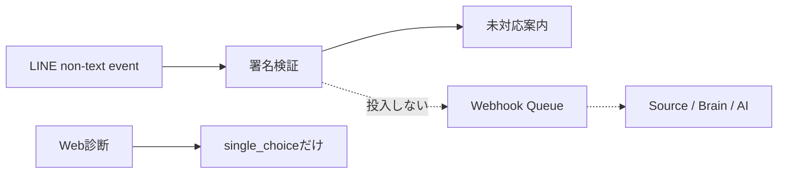

# マルチモーダル入力残タスク

## 1. 目的

この文書は、写真、動画、音声などの入力を導入する前に必要な横断的な意思決定、安全境界、実装順を管理します。

### 所有する概念

- media入力を保存・処理する前の未検討事項
- media原本、派生物、AI送信、削除、exportを接続する実装順
- 未対応mediaを現在の入力経路へ混ぜない境界

### 所有しない概念

- LINE日記の入力体験と受付済み本文の処理
- 診断のQuestion、DiagnosisResponseと回答形式
- Source Recordの訂正、削除、撤回の一般規則
- Private R2の既存アバター画像契約

日記固有の残作業は[日記入力残タスク](diary-remaining-tasks.md)、診断の現在の回答形式は[Phase 1 診断ドメイン設計](../diagnosis/diagnosis-domain-design.md)、削除とexportの一般規則は[Source Recordのライフサイクル設計](../domain/source/source-record-lifecycle-design.md)を正とします。

## 2. 現在の安全境界

現在の本人入力はLINEのテキスト日記とWebの`single_choice`診断です。LINEのimage、video、audio、file、location、stickerは署名検証後にテキストeventから分離し、本人へ未対応案内を返します。media contentを取得せず、Queue、Source Record、Brain、Vector、AI providerへ渡しません。

アバター画像はプロフィール表示専用の既存契約であり、日記、診断、Brainのmedia入力として再利用しません。

## 3. 【検討必須】未検討事項

| 未検討事項 | 決定する内容 |
| --- | --- |
| 最初の入力種別 | 写真付き日記を最初の縦切りとするか、MVPとV2の位置付け |
| 保存期間 | 原本と派生物の保持期間、期限後の削除、法的・運用上の例外 |
| 容量・Plan | 1件とAccount全体の上限、月間upload量、Free／Lite／Fullの差 |
| AI provider送信 | 送るmedia、送信目的、provider、保持設定、本人への表示と同意 |
| 第三者情報 | 他人の顔、声、会話、位置情報が含まれる場合の受付・警告・削除 |
| 年齢制限 | 未成年者と子どものmediaを受け付ける条件、保護者同意の要否 |
| moderation | 受付前後の検査対象、拒否・隔離・削除・異議申立て、運用者の閲覧境界 |
| file検証 | 許可形式、signature検証、size／duration上限、metadata除去、malware対策 |
| 原本と派生 | thumbnail、文字起こし、特徴量、要約の作成条件と、それぞれのSSoT |
| 削除・export | 原本、派生、Vector、AI入力、backupを除外する期限と、export形式 |
| LINE取得 | content取得期限、再配送と二重実行時の冪等key、取得失敗時の本人案内 |
| アクセシビリティ | caption、文字起こし、代替入力、再生制御を必須にする範囲 |

未決定の項目をproviderやstorageの既定値で補いません。保存期間、AI provider送信、第三者情報、moderation、削除・exportが決まるまで、media contentの取得と永続化を開始しません。

## 4. 決定後の実装順

1. 最初の1種類について、原本と派生物のthreat model、保存、削除、export、Access LabelのSSoTを作る
2. file signature、容量、metadata、malware、冪等性を入力境界へ実装する
3. 原本保存と受付結果だけを接続し、AI送信なしで本人が確認・削除・exportできるようにする
4. 明示した目的と同意境界で派生処理とAI送信を追加する
5. 実端末、取得期限、再配送、途中失敗、削除後のnegative testを完了する
6. 写真、動画、音声を別々のrelease gateで公開する

## 5. 完了条件

- 公開説明が実際に提供する入力形式と一致する
- mediaごとの原本、派生、AI送信、削除、export境界がSSoTにある
- file検証、容量、metadata、malware対策がある
- 削除後に原本、派生、Vector、AI入力から除外される
- 実端末と障害再送で重複保存しない

## 6. 更新ルール

- media種別ごとの詳細は、最初の縦切りを決めてから専用SSoTへ分離する
- 決定済みの項目は、決定内容のSSoTへのリンクへ置き換える
- アバター画像の実装をmedia入力の決定根拠として流用しない
- すべてのmedia種別を一括で完了扱いにしない
