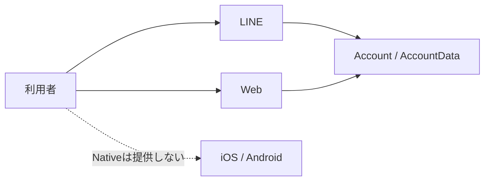

# ネイティブアプリ提供境界

## 1. 目的

この文書は、iOS・Androidネイティブアプリを提供せず、LINEとWebに機能を分担させる確定方針を所有します。

LINEとWebの機能分担は[プロジェクト概要 §4](../product/project-overview.md#4-想定する利用体験)、両チャネル間の遷移は[全体画面遷移設計](../product/screen-navigation.md)を正とします。各Web画面とLINE会話の詳細、Account、Identity、application session、課金の実装契約は所有しません。

## 2. 確定した提供チャネル

LINEとWebの機能分担は[プロジェクト概要のチャネルごとの役割分担](../product/project-overview.md#チャネルごとの役割分担)を正とし、この文書に重複して定義しません。両チャネルは同じAccountとAccountDataを使い、チャネルごとの個人データ正本を作りません。

## 3. 作らないもの

- iOS・Androidのアプリpackage、store商品、store課金、push credential
- Apple・Google固有のIdentity、端末内の個人データ正本、offline同期
- Native固有の通知、camera・microphone権限、background upload
- Native向けの審査、配布、analytics、remote revokeの運用

既存のLINEまたはWebの機能要件を理由に、Native用の空packageやstore設定を追加しません。

## 4. 完了条件

- プロジェクトのSSoTがLINEとWebだけを提供チャネルとして扱う
- LINEとWebの役割分担がプロジェクト概要と画面遷移で一致する
- Native用のpackage、store・課金・Identity・push・端末内データ設計を残タスクにしない
- 将来候補としてNative提供をロードマップへ残さない
