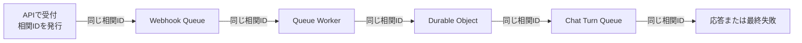
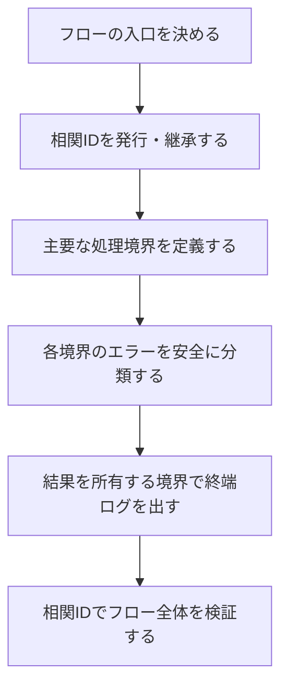

# アプリケーション運用ログ方針

## 1. 目的

この文書は、API、Queue Worker、Durable Object、外部サービス接続をまたぐ一連の処理について、運用者が次の問いへすぐ答えられる状態を目指す方針を定めます。

- どの入口から始まった処理か
- 処理はどこまで進み、最終的にどうなったか
- 失敗した場合、どこで何が原因だったか
- 自動で再試行されるのか、人による対応が必要なのか

利用者の入力内容や本人識別子をログへ出さず、この判断に必要な情報だけを残します。

### 所有する概念

- アプリケーション運用ログが目指す状態と基本方針
- 一連の処理を横断して追跡する相関IDの考え方
- 成功、失敗、再試行を判断できる終端ログの考え方
- エラー原因を安全かつ一貫して表す考え方
- 現在のログから目指す状態へ移行する進め方

### 所有しない概念

- 個々のイベント名、エラーコード、型の完全な一覧
- 利用者へ見せるエラー文言と画面状態
- BrainやMCPアクセスの監査ログ
- 会話、診断、画像などのプロダクトデータの保存規則
- Cloudflare上の保存期間、通知先、ダッシュボード製品の具体的な設定

個々のイベント名やエラーコードは、実装対象のフローごとにこの方針から導き、コードとテストを正とします。会話原文の扱いは[日記チャット体験設計](../product/diary-chat-experience.md#11-安全性とプライバシー)、画像情報の扱いは[アバター設定体験設計](../product/avatar-experience.md#10-プライバシーと安全性)、インフラ全体の境界は[インフラ・システム構成](../architecture/infrastructure-architecture.md)を正とします。

## 2. 目指す状態

### 2.1 一連の処理を入口から完了まで追える

HTTPリクエストを受け、Queueへ渡し、Durable Objectや外部サービスを呼び出して応答するまでを、別々の処理としてではなく1つのフローとして追える状態にします。

フローの入口で本人識別子ではない共通の相関IDを発行し、非同期処理や再試行を含む後続処理へ引き継ぎます。運用者は相関IDで検索することで、サービスや実行時刻をまたいだログを時系列に並べられます。



相関IDは処理を追うためのものであり、Account ID、LINE `userId`、会話IDなどを代用しません。同じフローの再試行では同じ相関IDを維持し、試行回数を別の情報として区別します。

### 2.2 処理の最終結果が分かる

途中経過が並んでいるだけでは、処理が成功したのか、例外で中断したのか、再試行待ちなのかを判断できません。

フロー全体と各非同期メッセージに結果を記録する境界を決め、成功、縮退成功、再試行、恒久失敗のいずれで終わったかを表す終端ログを残します。入口ログと終端ログを相関IDで対応させることで、完了していない処理も発見できるようにします。

### 2.3 エラーの原因と次の挙動が一目で分かる

`Error processing`や`errorName: Error`だけでは、ログが存在しても調査を始められません。失敗ログだけを見て、少なくとも次を判断できる状態にします。

- 失敗した工程
- 設定不足、入力不正、内部不変条件、外部依存、タイムアウトなどの原因分類
- 原因を一意に検索できる安定したエラーコード
- 同じ処理が再試行されるか、終了したか
- 影響を受けた処理の種類

生の例外メッセージへ依存せず、アプリケーションが管理する安全な分類へ変換します。未知の例外も単に隠すのではなく、どの工程と依存先で発生したかまでは分かるようにします。

### 2.4 ログの件数が処理の件数と対応する

同じ例外を各階層で`catch -> log -> throw`すると、1つの障害が複数のエラーログに見えます。エラーを記録する所有境界を1つにし、原則として1つの実行結果に1つの終端ログを対応させます。

下位層はエラーに安全な分類と発生工程を付けて上位へ返します。下位層自身がログを残すのは、フォールバックを選んで処理を継続した場合など、その層で結果が確定したときだけです。

### 2.5 調査可能性のためにプライバシーを犠牲にしない

ログへ記録できる情報はallowlistで決めます。任意のオブジェクトやSDK例外をそのまま出力せず、処理状態、固定分類、件数、時間など、障害判断に必要な情報だけを構造化して残します。

## 3. 全体方針

目指す状態を実現するため、ログを次の流れで設計します。



### 3.1 フローを先に定義する

個々の`logger.info`から考え始めず、利用者または外部システムから見た処理の開始と終了を先に決めます。

たとえばLINEの日記入力では、Webhook受理を開始、Source保存と後続Chat Turnの受付をWebhook処理の終了、LINEへの応答または最終失敗をフロー全体の終了として扱います。QueueやDurable Objectはフローを構成する境界であり、それぞれを無関係な処理にはしません。

### 3.2 相関IDをフローのデータとして運ぶ

相関IDはログ出力時にその場で作るのではなく、フローの入口で発行してQueueメッセージや内部呼び出しへ明示的に渡します。

- 同じ原因から派生した後続処理では同じ相関IDを使う
- 独立した利用者操作では新しい相関IDを発行する
- 再試行では相関IDを維持する
- 既存メッセージとの互換期間は相関IDを省略可能にし、最初に受けた境界で補う

### 3.3 エラーは発生源に近い境界で分類する

LINE、Gemini、D1、Durable Objectなどのadapterは、外部ライブラリ固有の例外をそのまま上位へ漏らさず、固定の原因分類とエラーコードへ変換します。

上位の処理境界は、その分類と現在の工程を使って再試行、終了、フォールバックを判断します。これにより、ログのためだけに下位層で例外を記録する必要がなくなります。

### 3.4 結果を知る境界が終端ログを所有する

HTTPステータス、Queueのack / retry、フォールバックの採用などを決定できる境界が、最終結果を1件記録します。途中経過は調査に必要な場合だけ`debug`で残し、通常時の`info`を開始ログで埋めません。

終端ログでは、実装対象に応じて次の概念を構造化フィールドとして持たせます。

- 相関ID
- サービスと処理の種類
- 成功、縮退成功、失敗、破棄などの結果
- 実行時間
- Queueの場合はMessage ID、試行回数、ack / retry / DLQの判断
- 失敗時は工程、原因分類、エラーコード、再試行可否、依存先

フィールド名とenumの詳細は共通型を実装するときに確定し、自由な文字列が各所へ増えないようにします。

## 4. 今回のログにある課題

2026-08-09に確認したQueue障害では、次の順序でログが表示されました。

```text
Worker queue handler triggered
Received batch from queue
Processing webhook message from queue
LINE Account identity ensured
Error processing webhook message in worker
Unhandled exception in worker queue handler
Rollback
```

このログからは、Accountの解決後に失敗したことまでは分かりますが、次を判断できません。

- Source保存、Coordinator受付などのどの工程で失敗したか
- 設定、データ、外部依存のどれが原因か
- 再試行されるのか、DLQへ送られるのか
- 同じ入力から派生した後続Chat Turnが存在するか
- 同時刻の複数のエラーログが同じ障害か別の障害か

`Rollback`はアプリケーション内で出力している文言ではありません。アプリケーション例外の再送出と同時に表示されるプラットフォーム側のログとして扱い、アプリケーションの障害件数には数えません。

## 5. 記録しない情報

次の情報は、レベルや環境を問わずアプリケーション運用ログへ記録しません。

- 日記、会話、診断回答、自己紹介、AIプロンプト、AI生成結果の本文
- LINE `userId`、ID token、access token、reply token、署名、channel secret
- Account ID、外部サービスの本人識別子
- HTTP request / responseのbody、headers、Cookie、認証付きURL、署名付きURL
- 画像本体、base64、EXIF、元ファイル名、端末パス
- SDK例外や任意オブジェクトの無加工出力

件数、文字数、固定enum、HTTP status、アプリ発行の相関ID、Cloudflare Queue Message IDは記録できます。新しいフィールドは「禁止一覧にない」ことではなく、「障害判断に必要で、本人や入力内容を表さない」ことを基準に追加します。

## 6. 進め方

全ログを一括で置き換えず、利用者から見た1つのフローを入口から終端まで縦に完成させ、その方法を他のフローへ展開します。

### Step 1: 対象フローと完了条件を決める

最初は今回障害が発生したLINE Webhookから日記Chat Turn受付までを対象とします。開始、主要工程、終了、再試行の境界を図にし、ログから答えたい問いをテスト条件にします。

### Step 2: 相関IDを終端まで引き継ぐ

APIで発行した相関IDをWebhook Queue、Worker、AccountData、Conversation Coordinator、Chat Turn Queueへ渡します。ローリングデプロイ中の旧メッセージも処理できる互換性を保ちます。

### Step 3: 失敗工程とエラー分類を整える

主要な呼び出し境界へ工程名を付け、設定不足、入力不正、内部不変条件、外部依存、タイムアウトなどの分類を共通型として実装します。生の例外を安全なエラーへ変換する責務をadapterへ置きます。

### Step 4: 終端ログを1件にまとめる

重複する`catch -> log -> throw`と途中経過の`info`を整理し、成功、再試行、破棄の判断を行うQueueメッセージ境界へ終端ログを集約します。

### Step 5: フローとして検証する

単一のロガー呼び出しだけでなく、次を自動テストします。

- APIから後続Queueまで同じ相関IDが引き継がれる
- 成功と失敗のどちらにも終端ログが1件だけ存在する
- 失敗ログから工程、原因、再試行判断が分かる
- 再試行でも相関IDが変わらず、試行回数を区別できる
- 本文、本人識別子、生の例外がログへ出ない

### Step 6: 次のフローへ展開する

最初の縦切りで得た共通型と処理境界を、Chat Turn生成・配送、HTTP API、alarm、管理処理の順に展開します。展開時もフローの入口と終了を先に定義し、ログ行単位の置換作業にはしません。

## 7. 最初の実装の完了条件

最初のLINE Webhookフローでは、Cloudflare上のログだけを使って次を満たせれば完了です。

- 1つの相関IDでWebhook受理からChat Turn受付または最終失敗まで追える
- 失敗した工程、原因分類、エラーコード、再試行の有無が終端ログ1件で分かる
- 正常終了にも対応する終端ログがある
- 同じ失敗に対するアプリケーションのエラーログが重複しない
- 既存Queueメッセージをローリングデプロイ中も処理できる
- 記録禁止情報がログへ出ないことをテストで確認できる
