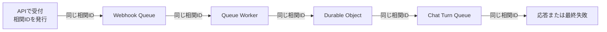
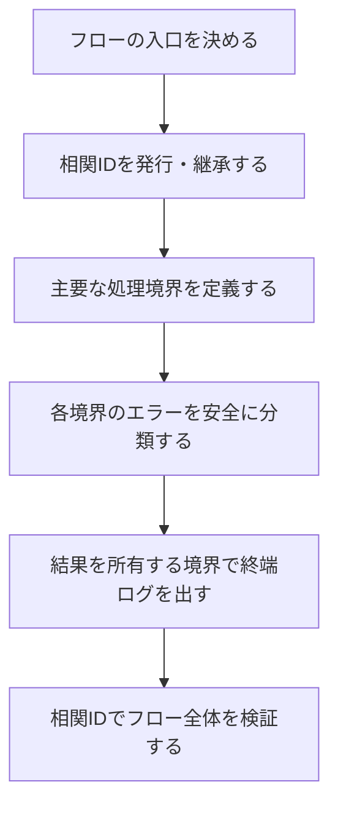
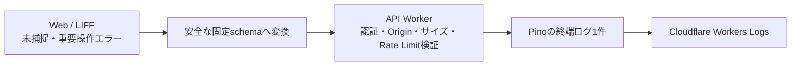

# アプリケーション運用ログ方針

## 1. 目的

この文書は、API、Queue Worker、Durable Object、外部サービス接続をまたぐ一連の処理について、運用者が次の問いへすぐ答えられる状態を目指す方針を定めます。

- どの入口から始まった処理か
- 処理はどこまで進み、最終的にどうなったか
- 失敗した場合、どこで何が原因だったか
- 自動で再試行されるのか、人による対応が必要なのか

利用者の入力内容や本人識別子をログへ出さず、この判断に必要な情報だけを残します。

### 所有する概念

- アプリケーション運用ログが目指す状態と基本方針
- 一連の処理を横断して追跡する相関IDの考え方
- 成功、失敗、再試行を判断できる終端ログの考え方
- エラー原因を安全かつ一貫して表す考え方
- ログ一覧で読むログ行の種類と、messageの文言規則
- 現在のログから目指す状態へ移行する進め方

### 所有しない概念

- 個々のイベント名、エラーコード、型の完全な一覧
- 利用者へ見せるエラー文言と画面状態
- BrainやMCPアクセスの監査ログ
- 会話、診断、画像などのプロダクトデータの保存規則
- Cloudflare上の保存期間、通知先、外部転送先の具体的な設定

個々のイベント名やエラーコードは、実装対象のフローごとにこの方針から導き、コードとテストを正とします。会話原文の扱いは[日記チャット体験設計](../product/diary-chat-experience.md#11-安全性とプライバシー)、画像情報の扱いは[アバター設定体験設計](../product/avatar-experience.md#10-プライバシーと安全性)、インフラ全体の境界は[インフラ・システム構成](../architecture/infrastructure-architecture.md)を正とします。

## 2. 目指す状態

### 2.1 一連の処理を入口から完了まで追える

HTTPリクエストを受け、Queueへ渡し、Durable Objectや外部サービスを呼び出して応答するまでを、別々の処理としてではなく1つのフローとして追える状態にします。

フローの入口で本人識別子ではない共通の相関IDを発行し、非同期処理や再試行を含む後続処理へ引き継ぎます。運用者は相関IDで検索することで、サービスや実行時刻をまたいだログを時系列に並べられます。



相関IDは処理を追うためのものであり、Account ID、LINE `userId`、会話IDなどを代用しません。同じフローの再試行では同じ相関IDを維持し、試行回数を別の情報として区別します。

### 2.2 処理の最終結果が分かる

途中経過が並んでいるだけでは、処理が成功したのか、例外で中断したのか、再試行待ちなのかを判断できません。

フロー全体と各非同期メッセージに結果を記録する境界を決め、成功、縮退成功、再試行、恒久失敗のいずれで終わったかを表す終端ログを残します。入口ログと終端ログを相関IDで対応させることで、完了していない処理も発見できるようにします。

### 2.3 エラーの原因と次の挙動が一目で分かる

`Error processing`や`errorName: Error`だけでは、ログが存在しても調査を始められません。失敗ログだけを見て、少なくとも次を判断できる状態にします。

- 失敗した工程
- 設定不足、入力不正、内部不変条件、外部依存、タイムアウトなどの原因分類
- 原因を一意に検索できる安定したエラーコード
- 同じ処理が再試行されるか、終了したか
- 影響を受けた処理の種類

生の例外メッセージへ依存せず、アプリケーションが管理する安全な分類へ変換します。未知の例外も単に隠すのではなく、どの工程と依存先で発生したかまでは分かるようにします。

### 2.4 ログの件数が処理の件数と対応する

同じ例外を各階層で`catch -> log -> throw`すると、1つの障害が複数のエラーログに見えます。エラーを記録する所有境界を1つにし、原則として1つの実行結果に1つの終端ログを対応させます。

下位層はエラーに安全な分類と発生工程を付けて上位へ返します。下位層自身がログを残すのは、フォールバックを選んで処理を継続した場合など、その層で結果が確定したときだけです。

### 2.5 ログ一覧を上から読むだけで処理内容が分かる

運用者が最初に見るのはCloudflareのログ一覧であり、そこに並ぶのは各行のmessageです。構造化フィールドを開かないと何も分からない状態では、ログがあっても異常を見つけられません。

一覧に並ぶ行は、次の2種類を混ぜません。

- **プラットフォームの起動ログ**: Cloudflareが実行ごとに自動で出す行。messageは処理内容ではなく入口の識別子になり、Durable Objectでは公開しているRPC method名、Queue consumerではQueue名、alarmでは起動時刻、fetchでは空になります。アプリケーションが何をしたかを表さないため、`invocation_logs = false`で出力しません。
- **アプリケーションの終端ログ**: 結果を所有する境界が出す行。message単体で「どの処理が」「どの工程で」「どうなり」「次にどうなるか」を表します。

この方針により、一覧に残る行はすべてアプリケーションが意図して出したものになり、行数が処理の件数と対応します。

起動ログを止めると、アプリケーションが1行も出さずに終わった実行の記録は残りません。CPU時間超過やメモリ超過でランタイムが実行を打ち切った場合、`catch`へ到達しないため終端ログも出ません。この状態は、Queueのメッセージが終端ログを持たないまま再試行されることや、Cloudflareのメトリクスに現れるエラー率で検知します。頻発する場合は、原因の切り分けが終わるまで対象Workerの起動ログを一時的に戻します。

### 2.6 調査可能性のためにプライバシーを犠牲にしない

ログへ記録できる情報はallowlistで決めます。任意のオブジェクトやSDK例外をそのまま出力せず、処理状態、固定分類、件数、時間など、障害判断に必要な情報だけを構造化して残します。

## 3. 全体方針

目指す状態を実現するため、ログを次の流れで設計します。



### 3.1 フローを先に定義する

個々の`logger.info`から考え始めず、利用者または外部システムから見た処理の開始と終了を先に決めます。

たとえばLINEの日記入力では、Webhook受理を開始、Source保存と後続Chat Turnの受付をWebhook処理の終了、LINEへの応答または最終失敗をフロー全体の終了として扱います。QueueやDurable Objectはフローを構成する境界であり、それぞれを無関係な処理にはしません。

### 3.2 相関IDをフローのデータとして運ぶ

相関IDはログ出力時にその場で作るのではなく、フローの入口で発行してQueueメッセージや内部呼び出しへ明示的に渡します。

- 同じ原因から派生した後続処理では同じ相関IDを使う
- 独立した利用者操作では新しい相関IDを発行する
- 再試行では相関IDを維持する
- 既存メッセージとの互換期間は相関IDを省略可能にし、最初に受けた境界で補う

### 3.3 エラーは発生源に近い境界で分類する

LINE、Gemini、D1、Durable Objectなどのadapterは、外部ライブラリ固有の例外をそのまま上位へ漏らさず、固定の原因分類とエラーコードへ変換します。

上位の処理境界は、その分類と現在の工程を使って再試行、終了、フォールバックを判断します。これにより、ログのためだけに下位層で例外を記録する必要がなくなります。

外部APIのHTTP statusは、分類とは別に残します。流量制限(429)、資格情報の誤り(401 / 403)、一時障害(5xx)は運用上の対応がまったく違うため、statusを失うとログから次の行動を決められません。statusは記録し、quota名やmodel名を含むresponse bodyは記録しません。

### 3.3.1 同じ原因の繰り返しをwarnで並べない

1つの処理の中で同種の呼び出しを繰り返す場合、各回の失敗を`warn`で並べると、1つの原因が複数の軽微な事象に見えます。流量制限のように全回が同じ原因で失敗するときは、これが特に問題になります。

繰り返しの各回は記録せず、結果を所有する境界が終端ログ1件へ集約します。集約したログには、成功件数、失敗件数、代表する原因分類を構造化フィールドとして持たせます。縮退成功（一部だけ成功して処理を続けた）と恒久失敗（1件も成功しなかった）は`outcome`で区別します。

### 3.4 結果を知る境界が終端ログを所有する

HTTPステータス、Queueのack / retry、フォールバックの採用などを決定できる境界が、最終結果を1件記録します。途中経過は調査に必要な場合だけ`debug`で残し、通常時の`info`を開始ログで埋めません。

終端ログでは、実装対象に応じて次の概念を構造化フィールドとして持たせます。

- 相関ID
- サービスと処理の種類
- 成功、縮退成功、失敗、破棄などの結果
- 実行時間
- Queueの場合はMessage ID、試行回数、ack / retry / DLQの判断
- 失敗時は工程、原因分類、エラーコード、再試行可否、依存先

フィールド名とenumの詳細は共通型を実装するときに確定し、自由な文字列が各所へ増えないようにします。

### 3.5 messageは構造化フィールドから機械的に組み立てる

messageをcall siteごとに自由記述すると、同じ結果が違う文言で現れ、文言とフィールドがずれます。終端ログのmessageは構造化フィールドと同じ情報から共通関数で組み立て、次の順に並べます。

```text
[処理名] 結果 at 工程 -> 次の挙動 (試行回数/最大試行回数, 所要時間, 結果コード, 原因分類, 依存先)
```

```text
[LINE webhook] succeeded at chat.accept -> ack (attempt 1/4, 412ms)
[Chat turn] deferred at generation.acquire -> retry (attempt 3/6, 22ms, GENERATION_LEASE_BUSY)
[Chat turn] failed at ai.generate -> retry (attempt 2/6, 9820ms, DIARY_CHAT_GENERATION_FAILED, category:dependency, via:google-ai)
```

- **処理名**は利用者から見たフローの名前とし、componentごとに1つだけ定義します。ログ一覧での見出しになります。
- **試行回数**は最大試行回数と併記し、次の失敗でDLQへ落ちるかを1行で判断できるようにします。
- messageへ入れてよいのは、構造化フィールドとして許可した固定値だけです。本文や本人識別子はmessageにも入れません。

HTTPの終端ログも同じ読み方に揃えます。

```text
[API] POST /api/line/webhook -> 200 (35ms)
```

### 3.6 Webブラウザの未捕捉・操作エラーをWorkers Logsへ合流させる

Cloudflare Pagesが配信する静的Web UIの`console`出力は、APIやQueue WorkerのWorkers Logsへは自動的に保存されません。Web UIは未捕捉例外、未処理Promise rejection、React Error Boundaryが捕捉した描画失敗に加え、利用者向けエラー表示へ変換して処理済みにした重要操作の失敗を安全なイベントへ変換し、API Workerの専用受付経路へ送信します。処理済み操作エラーを明示的に送らない場合、グローバルエラーハンドラは発火せず、Pages上の失敗がWorkers Logsから欠落します。



ブラウザから送れるのは、固定のエラー種別、登録route pattern、リリース識別子、固定の例外分類、自サイト配下のJavaScript bundle名と行・列、オンライン状態、自動復旧の有無だけです。重要操作エラーでは、これに固定の操作種別、allowlist済みエラーコード、400から599のHTTP statusだけを加えます。`ErrorEvent`が位置を持たない描画失敗と未処理Promise rejectionでは、stackをブラウザ内だけで走査し、最初の自サイトbundle frameを同じ固定項目へ変換します。実URL、query、生の例外message、stack、React component stack、任意の例外objectは送信しません。

受付経路はログの真正性と正常利用者の受付枠を守るため、HttpOnly Cookieのapplication sessionとCSRF tokenを要求します。application sessionが確立する前のエラーは送信せず、ブラウザconsoleと画面上の復旧導線だけに留めます。受付経路は次で制限します。

- 設定済みWeb Originと一致する`Origin`だけを受け入れる
- application sessionから認証済みAccountを解決し、CSRF tokenを検証できないrequestを拒否する
- request bodyはstreamを4 KiBまで読み、超過時点で打ち切って、固定schema以外のフィールドを拒否する
- Cloudflare Rate Limiting bindingで、認証済みAccountあたり1分300件までに制限する
- 同じブラウザタブ内の同一エラーは5分間再送しない

送信はbest effortとし、失敗しても利用者操作を止めず、送信失敗自体を再度ブラウザエラーとして送らないようにします。API Workerは受理したブラウザイベントの終端ログを所有するため、そのrequestに対する通常のHTTP成功ログは重ねて出力しません。拒否・流量制限・未処理失敗は通常のHTTP終端ログで判断できる状態を保ちます。

## 4. 今回のログにある課題

2026-08-09に確認したQueue障害では、次の順序でログが表示されました。

```text
Worker queue handler triggered
Received batch from queue
Processing webhook message from queue
LINE Account identity ensured
Error processing webhook message in worker
Unhandled exception in worker queue handler
Rollback
```

このログからは、Accountの解決後に失敗したことまでは分かりますが、次を判断できません。

- Source保存、Coordinator受付などのどの工程で失敗したか
- 設定、データ、外部依存のどれが原因か
- 再試行されるのか、DLQへ送られるのか
- 同じ入力から派生した後続Chat Turnが存在するか
- 同時刻の複数のエラーログが同じ障害か別の障害か

`Rollback`はアプリケーション内で出力している文言ではありません。アプリケーション例外の再送出と同時に表示されるプラットフォーム側のログとして扱い、アプリケーションの障害件数には数えません。

### 4.1 ログ一覧が処理内容を表していない

2026-08-10に確認したログ一覧では、約60行のうち半数以上が次の行で占められていました。

```text
execute                            <- Durable Objectが公開するRPC method名
me-builder-avatar-queue-preview    <- Queue consumerのQueue名
2026-08-10T02:32:31.457Z           <- alarmの起動時刻
                                   <- fetchの空のmessage
```

いずれもCloudflareの起動ログであり、アプリケーションが何をしたかを表しません。とくに`execute`は、Durable ObjectがAccount固定のRPC境界として単一のmethodだけを公開しているため、どの操作でも同じ文言になります。

残るアプリケーションのログにも、次の課題がありました。

- `logger.info({ ... })`のようにmessageを省略した行があり、一覧では空行として並ぶ
- 同じ結果に対する文言がcall siteごとに異なる
- `Queue message failed`のように、どの処理のmessageだったかが文言から分からない
- 終端ログを持たないフローがあり、成功したのか途中で止まったのかを一覧から判断できない

これらは[2.5](#25-ログ一覧を上から読むだけで処理内容が分かる)と[3.5](#35-messageは構造化フィールドから機械的に組み立てる)で解消します。

## 5. 記録しない情報

次の情報は、レベルや環境を問わずアプリケーション運用ログへ記録しません。

- 日記、会話、診断回答、自己紹介、AIプロンプト、AI生成結果の本文
- LINE `userId`、ID token、access token、reply token、署名、channel secret
- Account ID、外部サービスの本人識別子
- HTTP request / responseのbody、headers、Cookie、認証付きURL、署名付きURL
- 画像本体、base64、EXIF、元ファイル名、端末パス
- SDK例外や任意オブジェクトの無加工出力

件数、文字数、固定enum、HTTP status、アプリ発行の相関ID、Cloudflare Queue Message IDは記録できます。新しいフィールドは「禁止一覧にない」ことではなく、「障害判断に必要で、本人や入力内容を表さない」ことを基準に追加します。

HTTPの終端ログはpathを記録します。現在のpathは診断IDや質問IDなどのコンテンツ識別子だけを含みますが、招待tokenのように秘密を含むpath parameterを持つ経路を追加するときは、実際のpathではなく登録したroute pattern（`/api/compatibility/invitations/:token`）を記録します。pathへ秘密を置く設計そのものを避けることを優先します。

## 6. 進め方

全ログを一括で置き換えず、利用者から見た1つのフローを入口から終端まで縦に完成させ、その方法を他のフローへ展開します。

### Step 1: 対象フローと完了条件を決める

最初は今回障害が発生したLINE Webhookから日記Chat Turn受付までを対象とします。開始、主要工程、終了、再試行の境界を図にし、ログから答えたい問いをテスト条件にします。

### Step 2: 相関IDを終端まで引き継ぐ

APIで発行した相関IDをWebhook Queue、Worker、AccountData、Conversation Coordinator、Chat Turn Queueへ渡します。ローリングデプロイ中の旧メッセージも処理できる互換性を保ちます。

### Step 3: 失敗工程とエラー分類を整える

主要な呼び出し境界へ工程名を付け、設定不足、入力不正、内部不変条件、外部依存、タイムアウトなどの分類を共通型として実装します。生の例外を安全なエラーへ変換する責務をadapterへ置きます。

### Step 4: 終端ログを1件にまとめる

重複する`catch -> log -> throw`と途中経過の`info`を整理し、成功、再試行、破棄の判断を行うQueueメッセージ境界へ終端ログを集約します。

### Step 5: フローとして検証する

単一のロガー呼び出しだけでなく、次を自動テストします。

- APIから後続Queueまで同じ相関IDが引き継がれる
- 成功と失敗のどちらにも終端ログが1件だけ存在する
- 失敗ログから工程、原因、再試行判断が分かる
- 再試行でも相関IDが変わらず、試行回数を区別できる
- 本文、本人識別子、生の例外がログへ出ない

### Step 6: 一覧の読みやすさを整える

起動ログを止め、messageを共通関数へ寄せます。起動ログを止めるとプラットフォーム側に残る記録がなくなるため、先に各入口が終端ログを持っていることを確認してから止めます。

### Step 7: 次のフローへ展開する

最初の縦切りで得た共通型と処理境界を、Chat Turn生成・配送、HTTP API、alarm、管理処理の順に展開します。展開時もフローの入口と終了を先に定義し、ログ行単位の置換作業にはしません。

新しいフローを追加するときは、次を満たしてからマージします。

- 処理名を1つ決め、共通の処理名一覧へ追加する
- ackまたはHTTP応答を決める境界が終端ログを1件出す
- 失敗は安全なエラーコードと原因分類へ変換し、生の例外をログへ渡さない

## 7. 最初の実装の完了条件

最初のLINE Webhookフローでは、Cloudflare上のログだけを使って次を満たせれば完了です。

- 1つの相関IDでWebhook受理からChat Turn受付または最終失敗まで追える
- 失敗した工程、原因分類、エラーコード、再試行の有無が終端ログ1件で分かる
- 正常終了にも対応する終端ログがある
- 同じ失敗に対するアプリケーションのエラーログが重複しない
- 既存Queueメッセージをローリングデプロイ中も処理できる
- 記録禁止情報がログへ出ないことをテストで確認できる
- ログ一覧に並ぶ行がすべてアプリケーションの出力であり、message単体で処理内容と結果が読める
