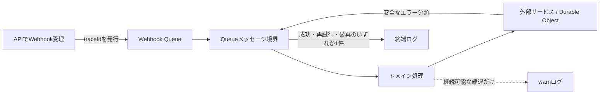

# アプリケーション運用ログ設計

## 1. 目的

この文書は、API、Queue Worker、Durable Object、外部サービス接続を横断する処理を、利用者の入力内容や本人識別子を漏らさずに調査できるようにするための運用ログ規約を定めます。

### 所有する概念

- アプリケーション運用ログのイベント、フィールド、レベル
- 処理を横断して追跡する `traceId`
- 例外を安全なエラー分類へ変換する規則
- Queue処理の開始、完了、再試行、破棄の記録方法
- ログへ記録してよい情報と禁止する情報

### 所有しない概念

- 利用者へ見せるエラー文言と画面状態
- BrainやMCPアクセスの監査ログ
- 会話、診断、画像などのプロダクトデータの保存規則
- Cloudflare上の保存期間、通知先、ダッシュボード製品の具体的な設定

会話原文の扱いは[日記チャット体験設計](../product/diary-chat-experience.md#11-安全性とプライバシー)、画像情報の扱いは[アバター設定体験設計](../product/avatar-experience.md#10-プライバシーと安全性)、インフラ全体の境界は[インフラ・システム構成](../architecture/infrastructure-architecture.md)を正とします。

## 2. 現状の問題

2026-08-09に確認したQueue障害では、次の順序でログが表示されました。

```text
Worker queue handler triggered
Received batch from queue
Processing webhook message from queue
LINE Account identity ensured
Error processing webhook message in worker
Unhandled exception in worker queue handler
Rollback
```

この状態には次の問題があります。

- 同じ例外をメッセージ処理層とQueue最上位層で記録しており、障害件数をログ行数から判断できない
- `errorName` が一般的な `Error` だけで、失敗した工程と対処方法を判別できない
- 成功前の途中経過が `info` に並ぶ一方、メッセージ全体の成功を表す終端ログがない
- APIが発行したWebhook ID、Cloudflare QueueのMessage ID、後続Chat Turnを同じ処理として追跡できない
- 再試行されるのか、ackして終了したのか、DLQへ向かうのかが分からない

`Rollback`はアプリケーション内で出力している文言ではありません。アプリケーション例外を再送出した結果と同時に表示されるプラットフォーム側のログとして扱い、アプリケーションログのイベント件数には数えません。

## 3. 基本原則

### 3.1 1つの処理結果を1つの所有境界で記録する

HTTPリクエスト、Queueメッセージ、alarmなどの実行単位ごとに、入口に最も近く、結果と再試行判断の両方を知る境界が終端ログを1件だけ記録します。

下位層は、処理を継続できるフォールバックを選んだ場合だけログを記録できます。処理できない例外は安全な分類を付けて上位へ返し、`catch -> log -> throw`を繰り返しません。



### 3.2 メッセージ本文ではなく、検索できる安定したフィールドを記録する

人が読む文章である `msg` は短い要約とします。検索、集計、通知条件には、後述する `event`、`errorCode`、`stage`、`disposition`などの構造化フィールドを使います。`msg`の文言を監視条件にしません。

### 3.3 記録可能な情報をallowlistで決める

「危険なキーだけを消す」のではなく、各ログイベントの型で記録可能なフィールドを列挙します。SDKの例外、HTTP request / response、任意オブジェクトをそのままロガーへ渡しません。

## 4. 共通フィールド

すべてのアプリケーション運用ログは、可能な範囲で次のフィールドを使います。Pinoが付与する時刻とレベルは重複して追加しません。

| フィールド | 必須 | 内容 |
| --- | --- | --- |
| `event` | 必須 | 機械検索用の安定名。`queue.message.failed`のような小文字dot形式 |
| `service` | 必須 | `api`、`worker`、`mcp` |
| `environment` | 必須 | `local`、`preview`、`production` |
| `traceId` | 処理境界 | API受理から後続Queueまで引き継ぐアプリ発行UUID |
| `component` | 必須 | `line-webhook`、`chat-turn`などの責務名 |
| `stage` | 複数工程時 | `account.resolve`、`source.store`、`chat.accept`など失敗地点を表す安定名 |
| `outcome` | 終端ログ | `succeeded`、`degraded`、`failed`、`discarded` |
| `durationMs` | 終端ログ | 実行境界で計測した整数ミリ秒 |

Queueの終端ログには次も追加します。

| フィールド | 必須 | 内容 |
| --- | --- | --- |
| `queue` | 必須 | Queue名 |
| `queueMessageId` | 必須 | Cloudflareが付与したMessage ID |
| `messageType` | 必須 | `line-webhook`、`chat-turn` |
| `attempt` | 必須 | Cloudflare Messageのattempt回数 |
| `disposition` | 必須 | `ack`、`retry`、`platform-retry`、`dead-letter` |

`traceId`は本人識別子ではなく処理の相関だけに使います。APIでWebhookを受理した時点で発行し、Webhook Queue、Conversation Coordinator、Chat Turn Queueへ同じ値を引き継ぎます。既存Queueメッセージとのローリングデプロイ中はoptionalとして読み、存在しないメッセージには処理境界で新しく発行します。

## 5. エラー分類

### 5.1 記録するフィールド

失敗の終端ログには次の安全なフィールドだけを追加します。

| フィールド | 内容 |
| --- | --- |
| `errorCode` | コード上で定義した安定識別子。例: `ACCOUNT_DATA_BINDING_MISSING` |
| `errorCategory` | `configuration`、`validation`、`invariant`、`dependency`、`timeout`、`concurrency`、`unknown` |
| `errorName` | JavaScript例外クラス名。補助情報であり、原因判定には使わない |
| `retryable` | 同じ入力を再実行すると成功しうるか |
| `dependency` | 失敗した外部境界。必要な場合だけ `d1`、`account-data`、`line`、`gemini`などを記録 |
| `httpStatus` | 外部接続が返したステータス。本文を伴わず、安全に取得できる場合だけ記録 |

`errorCode`ごとに`errorCategory`と`retryable`をコードで一意に定義します。呼び出し側が場当たり的に再試行可否を上書きしません。

### 5.2 エラーを安全に変換する境界

- 自分たちが検出する設定不足や不変条件違反は、固定の`errorCode`を持つ型付きエラーにする
- LINE、Gemini、D1、Durable ObjectなどのadapterはSDK例外を受け取り、安全なステータスと固定コードへ変換する
- 分類されていない例外は`UNEXPECTED_ERROR`、`unknown`、`retryable: true`として処理境界へ渡す
- 生の`error.message`、`stack`、`cause`は、入力本文やSDKのrequest / responseを含む可能性があるためproductionログへ記録しない
- 調査にメッセージが必要な自作エラーは、任意文字列ではなく`errorCode`の定義側に固定の安全な説明を置く

未知の例外を一律に隠すだけでは調査できないため、`stage`と`dependency`は例外が起きる前の呼び出し境界で必ず確定させます。今回のような失敗であれば、少なくとも`source.store`と`account-data`まで絞れる状態を完了条件とします。

## 6. ログレベル

| レベル | 用途 | 例 |
| --- | --- | --- |
| `debug` | 通常は検索不要な開始・途中経過 | batch開始、Account解決完了 |
| `info` | 正常終了を表す終端、重要な状態遷移 | Queueメッセージ成功、Webhook受理 |
| `warn` | 処理は継続・終了できたが縮退した、または想定内の再試行 | AI無効でSourceだけ保存、lease待ち再試行 |
| `error` | 実行単位が失敗し、再試行・DLQ・運用対応が必要 | Queueメッセージ処理失敗、設定不備 |

単に関数へ入ったことを`info`にしません。`Worker queue handler triggered`、`Received batch from queue`、`LINE Account identity ensured`のような途中経過は`debug`へ下げるか、終端ログから復元できるなら削除します。

## 7. Queueの記録と再試行

### 7.1 メッセージ単位の結果

各メッセージは次のいずれか1つで終了し、その判断を終端ログへ記録します。

| 結果 | `outcome` | `disposition` | レベル |
| --- | --- | --- | --- |
| 正常完了 | `succeeded` | `ack` | `info` |
| 代替処理で完了 | `degraded` | `ack` | `warn` |
| 一時障害 | `failed` | `retry`または`platform-retry` | `warn`または`error` |
| 恒久障害・不正入力 | `discarded` | `ack` | `warn` |
| 規定回数失敗 | `failed` | `dead-letter` | `error` |

再試行時も同じ`traceId`を維持し、`attempt`で区別します。成功済みメッセージはackし、同じbatch内の別メッセージの失敗で再実行しません。

### 7.2 設定とコードを一致させる

- すべてのconsumerで最大再試行回数とDLQを明示し、Cloudflareの既定値へ依存しない
- コードで最終attemptを判定する場合、設定値を別の数値リテラルとして重複させない
- retryableでない設定不足や入力不正を、同じ内容のまま規定回数再実行しない
- DLQへ到達したメッセージを検出できる運用ログと通知を用意する。本文は通知へ転記しない

## 8. 記録禁止情報

次の情報は、レベルや環境を問わずアプリケーション運用ログへ記録しません。

- 日記、会話、診断回答、自己紹介、AIプロンプト、AI生成結果の本文
- LINE `userId`、ID token、access token、reply token、署名、channel secret
- Account ID、外部サービスの本人識別子
- HTTP request / responseのbody、headers、Cookie、認証付きURL、署名付きURL
- 画像本体、base64、EXIF、元ファイル名、端末パス
- SDK例外や任意オブジェクトの無加工出力

件数、文字数、固定enum、HTTP status、アプリ発行の`traceId`、Cloudflare Queue Message IDは記録できます。新しいフィールドを追加するときは「禁止一覧にない」ことではなく、「障害判断に必要で本人を表さない」ことをレビューで確認します。

## 9. イベント例

失敗したWebhook Queueメッセージは、Cloudflare上で概ね次の1件として読める状態にします。

```json
{
  "level": "error",
  "event": "queue.message.failed",
  "service": "worker",
  "environment": "production",
  "component": "line-webhook",
  "stage": "source.store",
  "traceId": "01f8e03e-...",
  "queue": "me-builder-webhook-queue-production",
  "queueMessageId": "...",
  "messageType": "line-webhook",
  "attempt": 1,
  "outcome": "failed",
  "disposition": "platform-retry",
  "durationMs": 537,
  "errorCode": "ACCOUNT_DATA_OPERATION_FAILED",
  "errorCategory": "dependency",
  "errorName": "Error",
  "retryable": true,
  "dependency": "account-data",
  "msg": "Queue message processing failed"
}
```

本文、Account ID、生の例外がなくても、「どの処理が」「どの工程で」「何回目に」「どう終了し」「再試行されるか」を1行で判断できます。

## 10. 実装順序と完了条件

実装は次の縦切りで進めます。

1. `packages/shared`へ共通ログフィールド、エラー分類、安全なserializerを追加する
2. APIで`traceId`を発行し、Webhook QueueとChat Turn Queueへ引き継ぐ
3. WorkerのWebhook Queue処理を、メッセージ単位の終端ログ1件へ置き換える
4. AccountData、Conversation Coordinator、LINE、Geminiの呼び出しを固定`stage`と安全な`errorCode`へ変換する
5. Chat Turn QueueとHTTP境界へ同じ規則を展開する
6. consumerの再試行設定を明示し、DLQ検知と通知を構成する

最初の実装は、今回障害が発生したWebhook Queueの`account.resolve`以降を対象とします。次を満たせば完了です。

- 同じ失敗に対するアプリケーションの`error`終端ログが1件である
- `traceId`、`stage`、`errorCode`、`attempt`、`disposition`から次の調査行動を決められる
- 成功時には対応する`queue.message.succeeded`が1件ある
- 再試行しても同じ`traceId`で検索できる
- 禁止情報と生の例外がログへ出ないことをテストで検証している
- 既存Queueメッセージをローリングデプロイ中も処理できる
