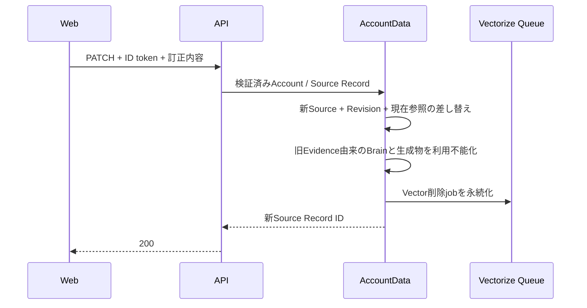

# 本人入力データ訂正・削除API契約

## 1. 目的

この文書は、本人がWebで現在有効な診断回答と日記を確認し、原本を訂正または削除するAPI契約を定義します。本人確認、対象範囲、Source Recordの状態遷移、派生物への波及、応答と失敗時の結果を所有します。

Source Recordの不変性、Revision、tombstoneの意味は[Source Recordのライフサイクル設計](../domain/source/source-record-lifecycle-design.md)、画面の入口と戻る操作は[プロフィール設定体験設計](../product/profile-settings-experience.md)を正とします。Accountの退会、Identity削除、データエクスポート、送信後10分以内のLINE取り消しは所有しません。

## 2. API

| Method | Path | 結果 |
| --- | --- | --- |
| `GET` | `/api/personal-data/records` | 現在有効な診断回答と日記を新しい順で返す |
| `PATCH` | `/api/personal-data/records/:sourceRecordId` | 原本を上書きせず、新しいSource RecordとRevisionを作る |
| `DELETE` | `/api/personal-data/records/:sourceRecordId` | Source Recordをtombstoneへ遷移する |

全経路でLIFF ID tokenを検証し、解決したAccountのAccountDataだけを操作します。Account IDはpath、query、bodyのいずれからも受け取りません。`sourceRecordId`が別Accountの所有物、削除済み、または既に訂正された旧版の場合は、存在を区別せず`404`を返します。

一覧は本人の原文を含むため`Cache-Control: no-store`を付けます。運用ログにはpathの`sourceRecordId`も、診断回答、日記本文、訂正後の本文も記録しません。

## 3. 訂正

診断回答は同じQuestion Versionで有効なChoiceだけへ訂正できます。日記本文は空文字を受け付けず、5,000文字を上限とします。



訂正前のSource Recordと本文は改訂履歴と将来のエクスポートのために保持します。通常の診断回答・日記一覧、チャット文脈、Brain検索は新版だけを使います。同じ値への再送は新しい版を作らず`unchanged`を返します。

## 4. 削除と派生物への波及

削除はSource Record metadata、Revision、Evidenceの来歴を残し、原文payloadを同じatomic操作で削除します。診断回答または日記messageの現在参照を利用不能にし、以後の一覧とチャット文脈から除外します。

削除または訂正の影響を受けるBrain Itemは、古いEvidenceとConfidenceを開示しないため同期的に`invalidated`へ遷移します。対応するVector削除jobを同じ操作で永続化し、Vectorizeの物理削除は既存の再試行可能なQueue経路で収束させます。

「わたしのまとめ」は入力Source Record IDを全件保持しないため、本人操作時はAccount内の生成版と相性共有projectionを利用不能にします。訂正後または残った有効データから、本人が新しいまとめを再生成できます。診断訂正では同じ操作でprojection要求を作り、APIからの即時処理に失敗してもAccountData alarmで再試行します。

## 5. 応答

訂正・削除の成功応答は、結果、新しいまたは削除対象のSource Record ID、無効化したBrain Item件数を返します。

```json
{
  "outcome": "updated",
  "recordId": "new-source-record-id",
  "invalidatedBrainItemCount": 2
}
```

`outcome`は`updated`、`deleted`、`unchanged`のいずれかです。APIの成功はAccountDataの状態変更とVector削除jobの永続化までを表し、Vectorizeからの物理削除完了は表しません。

## 6. 完了条件

- Freeを含むすべてのPlanで同じ操作を利用できる
- 別Account、削除済み、改訂済みのSource Recordを操作できない
- 訂正で旧版を上書きせずRevisionを保持する
- 削除直後から原文、Brain、生成済みまとめ、相性共有projectionを利用できない
- Vectorize削除が一時失敗と再配送を経ても収束する
- 診断訂正と日記訂正後の現在一覧が新版だけを返す
- API、Web、運用ログからAccount IDと本人の原文を漏らさない
