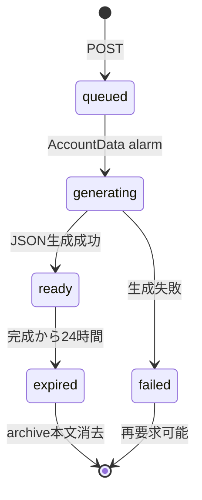

# 本人データエクスポート実装契約

## 1. 目的

この文書は、本人が自分のデータのportable archiveを非同期に生成し、期限内に認証付きでダウンロードする実装契約を定義します。archiveの分類、他者・内部運用・決済情報との境界、生成状態、API、失敗時の結果を所有します。

Source Recordの履歴とtombstoneを含める原則は[Source Recordのライフサイクル設計](../domain/source/source-record-lifecycle-design.md)、本人入力の訂正・削除は[本人入力データ訂正・削除API契約](personal-data-api.md)、保存先は[Accountデータ分離設計](../architecture/account-data-isolation.md)を正とします。この文書は、Accountの復旧、データのimport、各データモデルの意味、料金プラン、決済事業者の支払情報を所有しません。

## 2. データ境界

archiveは生成時点の本人AccountDataから、次の本人所有データだけをJSONへ複製します。

| 分類 | 含める内容 |
| --- | --- |
| Source | 現行版、改訂済み旧版、Revision、tombstone。削除済み本文は`null` |
| 診断 | 回答履歴、設問・選択肢の本人向け表示値、対応Source |
| 日記・会話 | Session、本人発言、AI応答。削除済み本文は`null` |
| Brain | Item、本人向けlabel、Evidence、Revision、本人へ提供済みの利用履歴 |
| 生成結果 | 本人の「わたしのまとめ」と、本人データから作った共有projection |
| 設定・進行 | 日々の声かけ設定、うつしレベルとmilestone |

次は含めません。

- CompatibilityDataと、相手のAccount ID、相手の非共有情報、招待・関係の内部参照
- 認証token、LINE event ID、Queue job、再試行回数、failure code、model・prompt・生成job状態
- Stripe Customer、Subscription、Price、カード、請求書など決済事業者の支払情報
- Account全体の運用情報、管理者向け情報、サービス秘密値

archiveの`formatVersion`は`1`とし、トップレベルに`format`、`formatVersion`、`generatedAt`、`owner`を持ちます。後方互換で追加できない変更だけversionを上げます。これはデータのimport契約を意味しません。

## 3. 非同期生成と期限

同じAccountに`queued`または`generating`があれば、重複要求は既存IDを返します。生成は本人のAccountData alarmで行い、archive本文と状態を同じprivate SQLiteへ置きます。`ready`から24時間後に`expired`へ遷移し、本文を消去します。失敗時は内部failure codeを本人へ返さず、再要求できる状態にします。

## 4. APIと認可

| Method | Path | 結果 |
| --- | --- | --- |
| `POST` | `/api/personal-data/exports` | `202`で要求IDと現在状態を返す |
| `GET` | `/api/personal-data/exports/:exportId` | 本人の要求状態、完成日時、期限、download pathを返す |
| `GET` | `/api/personal-data/exports/:exportId/download` | `ready`かつ期限内ならJSON attachmentを返す |

すべての経路でHttpOnlyのアプリセッションCookieを検証し、解決したAccountのAccountDataだけを参照します。Account IDはクライアントから受け取りません。変更系リクエストでは同一OriginとCSRFトークンも検証します。別Accountの要求は`404`、生成前は`409`、期限切れは`410`です。状態とarchiveは`Cache-Control: no-store`とし、運用ログではexport IDをroute patternへ置換し、archive本文を記録しません。

Webは要求後に状態をpollし、完成後も同一Originのcredential付き`fetch`でarchiveを取得して端末へ保存します。CookieをURLへ露出する直接リンクは提供しません。

## 5. Planとの関係

訂正、削除、エクスポートは本人データの操作でありEntitlement判定を通しません。有料期間中に作成したデータも、Freeへのdowngrade後に同じ境界で書き出せます。上限到達や課金projection取得失敗でも制限しません。

## 6. 完了条件

- 代表Accountの原本、改訂履歴、Brain、生成結果を非同期にarchive化できる
- 削除済み本文、他者の非共有情報、内部運用情報、決済情報が含まれない
- 別Accountが状態とarchiveの存在を取得できない
- 期限切れ後にarchive本文が消去される
- Freeを含むすべてのPlanで要求・ダウンロードできる
- API、Web、E2Eで認証付きの生成からダウンロードまで確認できる
