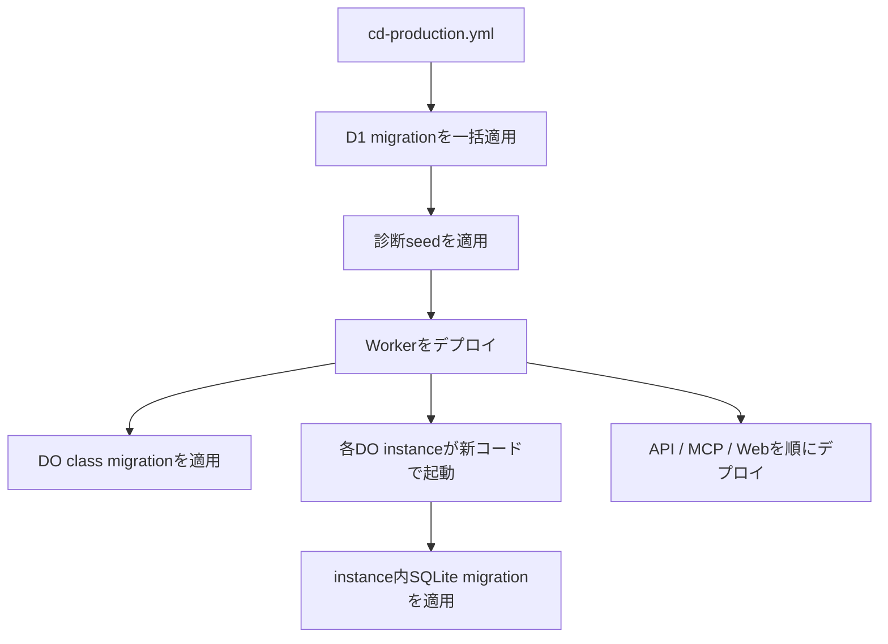

# 本番データベースマイグレーション運用

## 1. 目的

この文書は、本番のD1とDurable Object内SQLiteについて、データを失わずにスキーマを変更し、失敗時に復旧するための運用方針を定めます。

### 所有する概念

- 本番データベースマイグレーションのforward-only方針
- 破壊的変更を複数リリースへ分けるexpand-contract手順
- D1 migration、コードデプロイ、Durable Object migrationの順序と互換性要件
- migration適用失敗、コードデプロイ失敗、データ破損時の復旧判断
- D1 migration、Durable Object class migration、Durable Object内SQLite migrationの違い

### 所有しない概念

- D1と各Durable Objectへ保存するデータの責務
- Preview環境を削除して再構築する手順
- 診断seedの内容と更新規則
- Cloudflareリソース全体の作成、削除、配置
- 各migrationファイルのSQLとスキーマ定義

保存先の責務は[Accountデータ分離設計](../architecture/account-data-isolation.md)、インフラ全体の所有境界は[インフラ・システム構成](../architecture/infrastructure-architecture.md)、診断seedとmigrationの境界は[診断seed運用](diagnosis-seed.md)を正とします。Preview環境の再構築は[`reset-preview-migrations.yml`](../../.github/workflows/reset-preview-migrations.yml)だけが所有し、本番の復旧へ転用しません。

## 2. 対象とmigrationの違い

本リポジトリには、適用単位と適用時期が異なる3種類のmigrationがあります。

| 種類 | 所有する変更 | リポジトリ上の正本 | 適用時期 |
| --- | --- | --- | --- |
| D1 migration | 共有D1のtable、column、index、constraint | [`packages/lib/drizzle/`](../../packages/lib/drizzle/) | `cd-production.yml`がコードデプロイ前に一括適用する |
| Durable Object class migration | DO classの作成、改名、削除などnamespaceのライフサイクル | [`apps/worker/wrangler.toml`](../../apps/worker/wrangler.toml)の`[[migrations]]` | Workerの`wrangler deploy`時にCloudflareが適用する |
| Durable Object内SQLite migration | 各DO instanceが持つprivate SQLiteのtable、column、index、constraint | [`packages/lib/drizzle-do-account/`](../../packages/lib/drizzle-do-account/)、[`apps/worker/drizzle/`](../../apps/worker/drizzle/) | 新しいWorkerコードで各instanceが起動するとき、Drizzle migratorがinstanceごとに適用する |

`AccountData`、`ConversationCoordinator`、`CompatibilityData`は、constructorの`blockConcurrencyWhile`から各repositoryの`initialize`を呼び、そこでDrizzle migrationを適用します。このためDO内SQLiteはD1のように全instanceへ事前一括適用されません。起動済みinstance、未起動instance、適用失敗したinstanceが一時的に異なるschema版を持ち得る前提で設計します。

Durable Object class migrationは、DO内SQLiteのSQL migrationではありません。現在はWranglerのlegacy `[[migrations]]`配列で`new_sqlite_classes`を管理しています。tagは一意な履歴として追加し、適用済みtagの書き換えや削除をしません。classの削除はnamespace内の全データを失う操作であり、通常のschema変更やコードのロールバック手段として使用しません。Cloudflareも、class lifecycle変更をまたぐWorker versionのrollbackを許可していません。詳細はCloudflare公式の[Durable Object class migration](https://developers.cloudflare.com/durable-objects/reference/durable-objects-migrations/)と[Workers rollbackの制約](https://developers.cloudflare.com/workers/versions-and-deployments/rollbacks/)を参照します。

## 3. Forward-only方針

本番migrationはforward-onlyとし、down migrationを作成・実行しません。適用済みmigrationを戻す代わりに、必要な状態へ進める新しいmigrationと互換コードを追加します。

理由は次のとおりです。

- schemaだけを戻しても、適用後に書き込まれたデータを安全に元の形へ戻せるとは限らない
- D1、複数のDO instance、段階的に切り替わるアプリコードを同じ時点へ原子的に戻せない
- DO内SQLite migrationはinstanceの起動時に個別適用されるため、全instanceへ一斉にdown migrationを実行できない
- CloudflareのWorker rollbackは接続先ストレージの状態を戻さず、DO class lifecycle変更をまたげない

次を禁止します。

- 適用済みSQLファイルやmigration journalの編集、並べ替え、削除
- 本番のmigration管理tableを手動で書き換えて再適用させること
- Preview用の全消し再構築を本番へ適用すること
- column、table、DO classの削除と、それを使わないコードへの切り替えを同じリリースで行うこと

## 4. Expand-contract手順

破壊的変更は少なくとも「追加」「移行」「削除」の3段階へ分け、各段階を独立した本番リリースとして完了させます。

### 4.1 Expand: 追加する

既存コードがそのまま動く追加的なschema変更だけを先に適用します。新しいtableやindex、nullable column、既定値を持つcolumnなどを追加し、既存のcolumn、table、constraintの意味は変えません。

同じリリースの新コードは、旧schemaではなくexpand後のschemaを前提にできます。ただしデプロイ失敗時に旧コードへ戻せるよう、旧コードがexpand後のschemaでも動くことを事前に検証します。

### 4.2 Migrate: データと読み書きを移す

次のリリースで新旧両方の表現を扱う互換コードを出します。必要に応じてdual-writeまたは新形式から旧形式を導ける書き込みを行い、既存データを再実行可能な処理でbackfillします。途中で止まっても再開でき、複数回実行しても結果が壊れないことを条件とします。

backfill完了は件数だけでなく、新旧データの対応、欠損、constraint違反、利用中の全DO instanceでのmigration成功を確認します。DO内SQLiteではinstanceごとに適用時期が異なるため、「Workerをデプロイした」ことを全instanceの移行完了とはみなしません。

### 4.3 Contract: 削除する

新形式だけを読むコードが安定し、backfillと観測期間が完了し、旧versionへ戻す必要がないと判断した後の別リリースで、旧column、table、書き込み経路を削除します。

削除前に、現在のコードと直前の安定版のどちらも削除対象を参照しないこと、Queueやalarmに旧形式のmessageが残っていないことを確認します。DO classの削除はschemaのcontractとは分け、namespaceの全データを保存または廃棄できることを個別に承認してから行います。

## 5. 本番への適用順序と互換性要件

[`cd-production.yml`](../../.github/workflows/cd-production.yml)の現在の順序を本番適用の正とします。

1. `bun run ci`でデプロイ対象を検証する
2. `task db:migrate:production`でD1 migrationを適用する
3. `task db:seed:production`で診断seedを適用する
4. Workerをデプロイし、DO class migrationを適用可能にする
5. API、MCP、Webを順にデプロイする

この順序では、D1 migration適用後から全アプリのデプロイ完了まで、旧コードと新schemaの組み合わせが存在します。Workerの切り替え中やDO instanceの再起動時には新旧コードと異なるschema版が同居し得ます。そのため、各リリースで許可するのは次の両方を満たす変更だけです。

- migration適用後のschemaで、直前の安定版コードが読み書きできる
- 新コードが、遅延適用中のDO instanceや旧形式のQueue messageを安全に扱える

この要件を満たさない変更は、単一リリースへ入れず[expand-contract手順](#4-expand-contract手順)へ分割します。

## 6. 失敗時の復旧

復旧では、最初に自動デプロイの再実行を止め、失敗したstep、対象commit、開始・失敗時刻、D1 migration一覧、デプロイ済みの各アプリversion、影響を受けたDO classとinstanceを記録します。復旧中に失われる書き込みを増やさないよう、影響する入口を止められるか判断します。D1とDOは別の履歴を持つため、片方の復元だけで参照関係が壊れないかを確認してからデータを戻します。

### 6.1 D1 migrationの適用が失敗した

Wranglerはエラーになった1件のD1 migrationをrollbackし、それ以前に成功したmigrationは適用済みのまま残します。まずworkflow logと`wrangler d1 migrations list`で実際の状態を確認します。

データ破損がなければTime TravelでDB全体を戻しません。失敗原因を直す新しいforward migrationを作り、Previewで既存データからの適用を検証してから、通常のCDで再適用します。適用済みファイルや`d1_migrations`を編集してやり直してはいけません。Wranglerの動作はCloudflare公式の[D1 migrations apply](https://developers.cloudflare.com/d1/wrangler-commands/#migrations-apply)を参照します。

### 6.2 D1 migration成功後にコードデプロイが失敗した

expand後のschemaは直前の安定版コードと互換であるため、D1は戻さず、未完了のアプリを直前の安定版へ揃えてサービスを復旧します。その後、デプロイ失敗を修正した新しいcommitを通常のCDで前進適用します。Worker versionをCloudflareのrollback機能で戻す場合もストレージは戻らず、DO class lifecycle変更をまたぐrollbackはできないため、対象versionとbindingを確認します。

デプロイがWorker、API、MCP、Webの途中で失敗した場合は部分デプロイです。各アプリの実versionを確認し、相互に互換な安定版へ揃えます。migrationを戻すことでコードへ合わせてはいけません。

### 6.3 D1で破壊的変更またはデータ破損が起きた

D1のTime Travelは自動で履歴を保持し、対応するD1 databaseを分単位の過去時点へ上書き復元できます。復元はin-flight queryを中断し、復元時点より後の書き込みをDBから失わせる破壊的操作です。通常のmigration失敗には使わず、forward修復では被害を止められない場合の最終手段とします。

本番での利用可否は次の手順で判断します。

1. `wrangler d1 info`で対象databaseと`version: production`を確認する。現在の本番databaseが対応backendかは実環境で**要確認**
2. workflowの時刻と運用ログから、破損直前のtimestampに対応するbookmarkを取得する
3. 復元後に失われる書き込みとDO内SQLiteとの不整合を洗い出し、再投入または利用者対応を決める
4. 対象database、bookmark、復元責任者の相互確認後にTime Travel restoreを実行する
5. restoreが返す復元直前bookmarkを保存し、schema、migration履歴、代表データ、各アプリの疎通を確認する

Time Travelの保持期間は契約planにより異なるため、事故時に[Cloudflare公式のTime Travelとbackups](https://developers.cloudflare.com/d1/reference/time-travel/)で現在の期間を確認します。期間を超える保管が必要な場合はD1からR2への定期exportを別途設計します。このリポジトリには現在、長期backupの自動export運用はありません。

### 6.4 Durable Object内SQLite migrationまたはデプロイが失敗した

DO内SQLite migrationはinstance起動時に適用されるため、影響はinstanceごとに異なります。失敗したDOへの呼び出しを止め、class名、object IDまたはname、旧schema版、適用済みmigration、失敗時刻を特定します。まず互換性を保つ新しいSQL migrationとWorkerコードを作り、Previewと既存schemaからのruntime testで検証して前進復旧します。

SQLite-backed DOには、過去30日以内のbookmarkへinstance内DB全体を戻す[Point In Time Recovery API](https://developers.cloudflare.com/durable-objects/api/sqlite-storage-api/#pitr-point-in-time-recovery-api)があります。D1 Time Travelとは異なり、DOのstorage APIをそのinstance内から呼び、次のsessionで復元する仕組みです。namespace全体をWranglerで一括復元する手順ではありません。

このリポジトリには現在、PITRを認可・監査付きで実行する管理経路がないため、本番運用では**利用準備未完了**です。緊急時に未検証の復旧RPCを直接追加せず、対象instance、認可、bookmarkの保全、復元後の検証、操作の監査を備えた経路を先に実装・検証します。PITRが準備できていない状態ではforward修復を優先し、DO namespaceの削除やPreview resetで代替してはいけません。

### 6.5 Durable Object class migrationが失敗した

class migrationの失敗時は、Cloudflareが適用したclass lifecycleの状態とWorker deploymentを確認します。新しい一意なtagを使う後続migrationで前進修復し、既存tagを書き換えません。classの改名、移動、削除は通常のコードrollbackと分離し、Cloudflare公式の複数deploy手順へ従います。

class削除はnamespaceと保存データを恒久的に削除し、Worker rollbackやDO PITRの代わりにはなりません。削除を含む変更は、データの退避、参照bindingの除去、rollback不能になる境界を明示した個別の運用計画なしに本番適用しません。

## 7. リリース前チェックリスト

- [ ] 変更対象がD1、DO class、DO内SQLiteのどれかを区別した
- [ ] 既存migrationを変更せず、新しいforward migrationを追加した
- [ ] 直前の安定版コードがmigration後のschemaで動作する
- [ ] 破壊的変更をexpand、migrate、contractの別リリースへ分けた
- [ ] backfillが再実行可能で、完了と整合性を検証できる
- [ ] DO内SQLiteは既存schemaからのruntime testを行った
- [ ] Queue、alarm、未起動DO instanceに残る旧形式を扱える
- [ ] 失敗時に戻すコードversionと、前進修復の担当を決めた
- [ ] データ復元が必要な変更では、D1とDOそれぞれの利用可能な復旧手段を確認した
