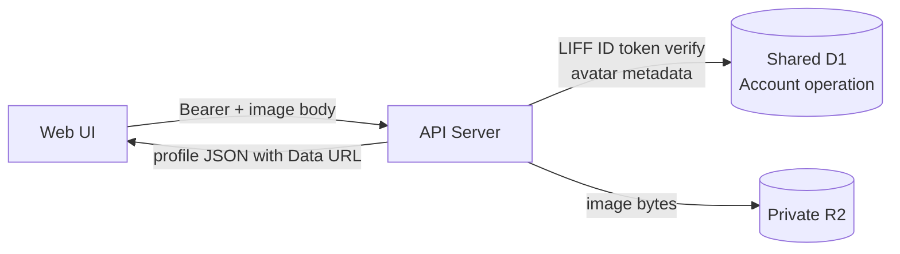

# プロフィールAPI契約

## 1. この文書の目的

この文書は、Web UIが本人のプロフィールを取得し、アバター画像を保存・削除するHTTP API契約と保存境界のSSoTです。APIのパス、認証、入出力、画像検査、共有D1とPrivate R2の更新順序、失敗時の扱いを所有します。

プロフィール画面とアバター変更の利用体験は[プロフィール設定体験設計](../product/profile-settings-experience.md)と[アバター設定体験設計](../product/avatar-experience.md)、Account所有データの配置は[Accountデータ分離設計](../architecture/account-data-isolation.md)、Cloudflareサービスの配置は[インフラ・システム構成](../architecture/infrastructure-architecture.md)を正とします。

この文書は、テーマ設定の保存、LINEプロフィール画像そのものの複製、人物判定、AI加工、画像編集UIを所有しません。

## 2. 結論

- 本人のプロフィール取得は`GET /api/profile`とし、Account IDをpath、query、bodyで受け取らない
- LIFF IDトークンを検証して解決したAccountだけを読み書きする
- 取得結果には表示名、role、現在表示するアバターを含め、プロフィール表示に別のアバター取得APIを要求しない
- 保存は`PUT /api/profile/avatar`、削除は`DELETE /api/profile/avatar`とする
- 保存・削除の応答も更新後のプロフィール全体を返し、直後の再取得を不要にする
- 画像本体は環境別のPrivate R2、現在画像のメタデータは共有D1のAccount運営情報へ保存する
- 日記、診断回答、Source、Brain、プロフィール要約はAccountDataに残し、アバターメタデータを複製しない
- アバターの更新間隔による拒否は行わず、`updatedAt`は現在画像の更新日時としてだけ扱う

`/api/accounts/:accountId/profile`は採用しません。本人専用操作へAccount IDを指定させると、認証結果ではなくクライアント入力を認可に使う実装を誘発するためです。`/api/profile`は常にBearerトークンで解決した本人を表します。

## 3. エンドポイント

| Method | Path | 用途 | 成功時 |
| --- | --- | --- | --- |
| `GET` | `/api/profile` | 本人の表示用プロフィールを取得 | `200`とプロフィール |
| `PUT` | `/api/profile/avatar` | 現在のアバターを画像bodyで置換 | `200`と更新後プロフィール |
| `DELETE` | `/api/profile/avatar` | 保存画像を外してLINE画像へ戻す | `200`と更新後プロフィール |

すべてのエンドポイントは`Authorization: Bearer <LIFF ID token>`を要求します。Accountを解決できない場合の`401`、`404`は既存の認証済みAPIと同じ契約にします。

## 4. プロフィール応答

プロフィールは次の形で返します。

```json
{
  "role": "user",
  "displayName": "表示名",
  "avatar": {
    "source": "uploaded",
    "url": "data:image/webp;base64,...",
    "updatedAt": "2026-08-11T00:00:00.000Z"
  }
}
```

`avatar`の決定順は次のとおりです。

1. 共有D1のAccount運営情報が参照するPrivate R2の保存画像
2. 検証済みLIFF IDトークンのLINEプロフィール画像
3. `null`

LINE画像の場合は`source`を`line`、`url`をLINEのHTTPS URL、`updatedAt`を`null`にします。保存画像はPrivate R2から読み出した内容をData URLとして同じJSONへ含めます。最大512×512pxのプロフィール画像に限定することで、Web UIがプロフィールJSONの後に認証付き画像APIを追加で呼ばずに表示できます。

応答は本人の画像を含むため`Cache-Control: no-store`とします。Account ID、R2 object key、etag、元ファイル名は返しません。

## 5. アバター保存入力

`PUT /api/profile/avatar`はJSONやmultipartではなく画像本体をrequest bodyとして受け取ります。`Content-Type`は次のいずれかです。

- `image/jpeg`
- `image/png`
- `image/webp`

サーバーは次を検査します。

- bodyが空でなく2 MiB以下
- `Content-Type`と実データの形式が一致する
- 画像全体の構造が正しく、headerから寸法を取得できる
- 幅と高さが同じ
- 幅と高さが1px以上512px以下

Web UIによる縮小・切り抜きは通信量と操作体験のための一次処理です。サーバー検査の代わりにはしません。SVG、拡張子だけが画像のファイル、上限を超える画像、正方形でない画像は保存しません。

## 6. 保存モデル



R2 object keyは認証で解決したAccount IDとアップロードごとの一意なIDから決定します。同じ画像を再送してもkeyを再利用しないため、並行した置換・削除の後処理が新しい現在画像を削除しません。別Accountとobjectを共有しません。

共有D1の`account_profiles`は現在画像のobject key、content type、byte size、etag、更新日時を持ちます。更新日時は表示・監査用の現在値であり、次回変更可能日時ではありません。R2は画像bytesとHTTP metadataだけを持ち、どの画像が現在値かを決めません。

## 7. 更新順序と回復

保存は次の順序で行います。

1. 認証
2. 画像検査
3. 新しいobjectをPrivate R2へ保存
4. 共有D1の現在画像メタデータを置換
5. 以前のobjectが別keyなら削除
6. 入力済みbytesから更新後プロフィールを返却

共有D1更新に失敗した場合は、D1を再読込して新しいobjectが現在値でないことを確認してからR2 objectを削除し、失敗を返します。D1を再確認できない場合は参照中の可能性があるobjectを削除せず、本文やobject keyを含めないerrorログを残します。以前のobject削除だけが失敗した場合は現在画像の更新を成功として返し、同じ安全なerrorログを残します。孤立objectの定期清掃はこのAPIの提供範囲に含めません。

削除は共有D1の現在画像を先に外し、以前のR2 objectを削除します。R2削除に失敗しても、削除済みのプロフィールへ戻し、同じ安全なerrorログを残します。

## 8. エラー契約

| Status | 意味 |
| --- | --- |
| `400` | bodyが空 |
| `401` | LIFF IDトークンを検証できない |
| `404` | 対応するAccountがない |
| `413` | 画像が2 MiBを超える |
| `415` | 対応外形式、または`Content-Type`と実データが一致しない |
| `422` | 寸法を取得できない、正方形でない、または512pxを超える |
| `503` | 共有D1またはPrivate R2のbindingが設定されていない |
| `500` | 保存先の不整合または未処理エラー |

認証失敗時にAccountやobjectの存在を開示しません。保存画像のメタデータがあるのにR2 objectが存在しない場合は不整合として失敗させ、LINE画像へ暗黙に切り替えません。

## 9. プライバシーと運用ログ

- 画像bytes、Data URL、元ファイル名、Account ID、LINE user ID、R2 object keyをログへ出さない
- R2 bucketは公開せず、API Server bindingからだけ読み書きする
- 画像を人物判定、属性推定、AI加工、Brain Item生成へ利用しない
- Content-Type、byte size、検査結果、最終outcomeなど、原因特定に必要な非識別情報だけを構造化ログへ残す

## 10. 完了条件

- Account IDをクライアント指定せず、認証済みの本人だけを読み書きできる
- GET 1回で表示名、role、現在のアバターを取得できる
- PNG、JPEG、WebPの正方形画像をPrivate R2へ保存できる
- 現在画像のメタデータを共有D1へ保存できる
- 保存・削除の応答だけで更新後表示へ切り替えられる
- 不正形式、形式偽装、過大画像、非正方形画像を拒否できる
- 別AccountのプロフィールやR2 objectを取得・更新できない
- OpenAPIとWeb UI用の生成型へ契約が反映される
