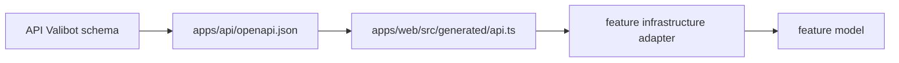

# アンケートAPI契約

## 1. この文書の目的

この文書は、Web UIとAPI Serverの間で利用するアンケートAPIのパス、認証、リクエスト、レスポンス、エラー契約を所有します。

Question、Survey、SurveyResponseの状態と不変条件は[Phase 1 アンケートドメイン設計](../questionnaire/questionnaire-domain-design.md)、一覧画面の表示と遷移は[Phase 1 アンケート体験設計](../questionnaire/questionnaire-experience.md)、D1への写像は[`packages/lib`のschema](../../packages/lib/src/d1/schema/questionnaire.ts)を正とします。この文書はドメイン規則、画面デザイン、D1スキーマを所有しません。

## 2. 認証境界

アンケートAPIはクライアント指定のAccount IDを受け付けません。LIFF IDトークンをAuthorizationヘッダーで受け取り、API ServerがLINEへ検証した`sub`からAccountを解決します。

```http
Authorization: Bearer <LIFF ID token>
```

サーバー発行セッションが導入されるまでは、各リクエストでIDトークンを検証します。これは継続リクエスト用セッションを確定するまでの境界であり、URL、レスポンス、ログへIDトークンやAccount IDを出しません。

## 3. アンケート一覧

### `GET /api/surveys`

本人が閲覧できるSurveyと現在の回答進捗を一覧用の要約として返します。質問文とChoiceは含めず、アンケート詳細APIで取得します。

一覧へ含めるのは、削除されていない`published`のSurveyのうち、サーバー時刻が受付開始時点以降のものです。受付終了後のSurveyは回答内容への導線を維持するため一覧へ含め、`availability`を`closed`にします。公開前、公開停止、削除済みのSurveyは含めません。

```json
{
  "surveys": [
    {
      "id": "relationship-priority",
      "title": "自分と相手の優先・境界線",
      "description": "頼まれごとや意思決定で、自分と相手をどう尊重するかを見ます。",
      "opensAt": "2026-08-04T00:00:00.000Z",
      "closesAt": null,
      "availability": "open",
      "responseStatus": "unanswered",
      "answeredCount": 0,
      "questionCount": 10
    }
  ]
}
```

`responseStatus`は現在有効なAnswer数から導出し、「あとで回答」は回答数へ含めません。

| 値 | 条件 |
| --- | --- |
| `unanswered` | `answeredCount`が0 |
| `in-progress` | 1件以上かつ`questionCount`未満 |
| `answered` | `answeredCount`と`questionCount`が一致 |

同じ公開時点の場合にもレスポンス順が変動しないよう、公開時点の降順、Survey IDの昇順で返します。

## 4. エラー

| HTTP | 条件 | レスポンス |
| --- | --- | --- |
| `401` | Bearerトークンがない、検証できない、または検証設定がない | `{ "error": "Unauthorized" }` |
| `404` | トークンは有効だが対応するAccountがない | `{ "error": "Account not found", "reason": "friendship_required" }` |
| `503` | D1 bindingがない | `{ "error": "Service Unavailable" }` |
| `500` | 未処理のサーバーエラー | `{ "error": "Internal Server Error" }` |

認証失敗の詳細、トークン、`sub`、Account IDはレスポンスへ含めません。

## 5. ローカルE2Eテスト

アンケート一覧APIのE2Eテストは`apps/api/src/e2e/survey-list.test.ts`に置きます。Miniflareが提供するローカルD1へ本番と同じmigrationとアンケートseedを適用し、Honoの`app.request`へD1 bindingとして渡します。

LINEのIDトークン検証エンドポイントだけは外部通信を行わず、検証成功・失敗のHTTP応答へ差し替えます。Honoのルーティング、Bearerヘッダーの解釈、Account解決、Drizzleのクエリ、D1上の回答進捗集計、JSONレスポンスはモックしません。

テストごとに独立したインメモリD1を作り、終了時にMiniflareを破棄します。開発者の`.wrangler/state`やpreview、productionのD1は使用しません。

単独で実行する場合は`bun --cwd apps/api test:e2e`を使います。通常の`task ci`にも含まれます。

## 6. OpenAPIとWeb型の生成

人が判断する認証・エラー・利用条件はこの文書が所有します。機械可読なHTTP schemaは[`apps/api/src/openapi.ts`](../../apps/api/src/openapi.ts)のValibot schemaを正とし、API controllerも同じschemaで入出力を検証します。

OpenAPI documentとWeb用TypeScript型は次の流れで生成します。生成物は直接編集しません。



```text
apps/
├── api/
│   ├── src/openapi.ts        # 機械可読なHTTP schema
│   └── openapi.json          # 生成物
└── web/src/
    ├── generated/api.ts      # 生成物
    └── feature/*/infrastructure/
                               # 生成DTOをfeature modelへ変換
```

両方の生成物はルートで次を実行して更新します。

```bash
task generate:api
```

API Serverは同じdocumentを`GET /api/openapi.json`でも公開します。`task ci`とGitHub Actionsは再生成後にGit差分が残らないことを検査するため、schema変更時は生成物も同じcommitへ含めます。
