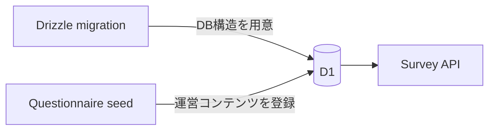
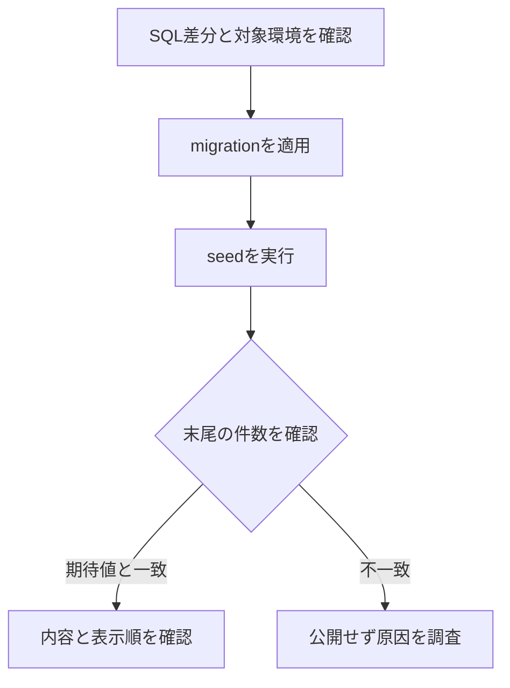

# アンケートseed運用

## 1. この文書の目的

この文書は、運営がQuestion、Question Version、Choice、SurveyをCloudflare D1へ登録するseedの配置、実行、更新、検証方法を所有します。

Question、Surveyの状態と不変条件は[Phase 1 アンケートドメイン設計](../questionnaire/questionnaire-domain-design.md)、質問文は[アンケートの質問集](../questionnaire/content/relationship-values-yes-no-question-bank.md)、回答からパラメータへの変換は[アンケート回答のパラメータ変換設計](../questionnaire/scoring/parameter-scoring-design.md)を正とします。この文書は、質問内容、スコアリング設定、D1スキーマを所有しません。

## 2. migrationとseedの境界

Drizzle migrationはテーブル、カラム、制約、インデックスなどの構造だけを変更します。アンケート内容は独立した公開ライフサイクルを持つため、migrationへ含めず[`packages/lib/seeds/questionnaires.sql`](../../packages/lib/seeds/questionnaires.sql)で管理します。



seedはmigration適用後に明示的に実行します。アプリの起動や通常のデプロイに暗黙で組み込まず、特にproductionでは実行対象と差分を確認してから適用します。

## 3. seedの原則

- Question ID、Survey Question ID、Survey IDは環境間で同じ固定値を使う
- SQLは再実行できるようにし、既存行を上書きしない
- 公開済みQuestion Versionの質問文、Choice、状態を更新しない
- 質問内容を変える場合は、同じQuestionへ新しいversionを追加する
- 公開済みSurveyのタイトル、受付期間、質問、版、順序を更新しない
- 公開内容を変える場合は、新しいSurvey IDで登録する
- `created_at`などの日時はDrizzleの`timestamp` modeに合わせたUnix秒で記録する
- スコアリング設定はseed SQLへ重複させず、各スコアリング設計と実装を正とする

`INSERT OR IGNORE`は同じ主キーの既存行を変更しません。そのため再実行前には、既存行がseedの期待内容と一致しているかを確認します。意図しない差分がある場合、SQLの上書き更新で解消せず、Question VersionまたはSurveyを新しく作ります。

スキーマ拡張で既存行に新しい必須項目を追加した場合だけ、空の初期値を正式な値へ補完する条件付き`UPSERT`を許可します。既に値がある行は更新対象にせず、公開済み内容の変更には使いません。

## 4. 登録するアンケート

現在のseedは次の公開済みSurveyを登録します。

| Survey ID | タイトル | Question Version | 受付開始 |
| --- | --- | --- | --- |
| `relationship-priority` | 自分と相手の優先・境界線 | すべてversion 1 | 2026-08-04 00:00:00 UTC |
| `money-values` | お金と消費 | すべてversion 1 | 2026-08-04 00:00:00 UTC |

どちらも終了日時を持たず、Question Versionは`approved`、Surveyは`published`として登録します。Surveyには一覧表示用の短い説明を持たせ、Choiceの`presentation`にはWeb表示用のアイコン名をJSONで保持します。

## 5. 実行方法

先に対象環境のmigrationを適用し、その後seedを実行します。

```bash
# local
task db:migrate:local
task db:seed:local

# preview
task db:migrate:preview
task db:seed:preview

# production
task db:migrate:production
task db:seed:production
```

previewとproductionはリモートD1を変更します。実行前に`packages/lib/wrangler.toml`のdatabase名とID、およびSQL差分を確認します。



## 6. 実行後の検証

SQL末尾の検証クエリは、現在のseedだけを適用した場合に次の件数を返します。

| 項目 | 期待値 |
| --- | ---: |
| Survey | 2 |
| Question Version | 20 |
| Choice | 40 |
| Survey Question | 20 |

件数だけでなく、次も確認します。

- Surveyが`published`で、受付開始日時を過ぎている
- 1つのSurveyにposition 0から9までの10問がある
- 各Question Versionが`approved`である
- 各Question Versionにposition 0の「いいえ」とposition 1の「はい」がある
- seedを2回実行しても件数と内容が変わらない
- Webの固定定義とQuestion ID、Question Version、Choice ID、表示順が一致する

## 7. 追加・改訂手順

新しいアンケートを追加するときは、質問内容とスコアリング設定をそれぞれのSSoTで確定してからseedへ追記します。

1. Question IDとQuestion Versionを決める
2. Question VersionとChoiceを`approved`として追加する
3. 新しいSurvey IDと固定した質問順を追加する
4. localへ適用し、再実行と取得結果を検証する
5. previewへ適用し、APIとWebから確認する
6. productionの対象DBと差分を確認して適用する

公開済みの内容を改訂するときは、既存のSQL行を書き換えて既存DBへ反映させようとしてはいけません。新しいQuestion VersionとSurveyを追記し、過去の回答が参照する版を残します。
