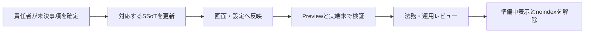

# サービス紹介サイト残タスク

## 1. 目的

この文書は、[サービス紹介サイト設計](../product/service-site-design.md)に基づく公開サイトについて、コード実装後も完了していない意思決定、法務確認、実環境検証を管理します。

### 所有する概念

- サービス紹介サイトの公開前に残っている作業
- Previewおよび実端末で確認する項目
- 各作業を完了とする条件
- 実装着手後のIssueまたはPRへの移管方法

### 所有しない概念

- 公開サイトの目的、サイトマップ、画面構成、CTA、受け入れ条件
- 利用規約とプライバシーポリシーの本文
- LINE、LIFF、本人向けWebアプリの画面遷移
- 共通のデプロイ手順

公開サイトの要件は[サービス紹介サイト設計](../product/service-site-design.md)、料金プランは[サブスクリプション・料金プラン設計](../product/subscription-plan-design.md)、規約と同意は[サービス利用規約・同意体験設計](../product/service-terms-consent-experience.md)、LINEとWebの遷移は[全体画面遷移設計](../product/screen-navigation.md)を正とします。

## 2. 公開までの進め方

コードだけで確定できない項目を推測で本文へ反映しません。各項目の正本と運用責任を確定し、Previewで検証してから公開状態へ切り替えます。

## 3. 現在の残タスク

### 3.1 正式なプライバシーポリシーを公開する

- 実装とインフラ設定から、取得情報、利用目的、外部送信先、第三者提供、保存、削除の実態を棚卸しする
- 運営者情報、利用者の権利、未成年者の扱い、制定日、適用日、改定方法を責任者が確定する
- LINE、AIサービス、Cloudflareなど外部サービスへ送る情報と目的を、実際の処理に一致させる
- 法務レビューを終えた版付きの正本を作成し、公開画面から同じ正本を表示する
- 正式版への置き換え後に`noindex,nofollow`を解除する

完了条件は、[サービス紹介サイト設計の個別ページ要件](../product/service-site-design.md#72-プライバシーポリシー)を満たす正本が承認され、Previewで表示内容と実際のデータ処理が一致することを確認できることです。

### 3.2 運営者情報とお問い合わせ窓口を確定する

- 公開する運営者の正式名称と、有効な連絡先を責任者が確定する
- 利用前の質問、不具合、データ関連の請求、権利侵害を受け付ける運用を決める
- 本人確認が必要な依頼を、公開フォームだけで完了させない手順を決める
- LINEトークを問い合わせ窓口として使う場合は、通常メッセージを日記として扱う現在の処理と混同せず、問い合わせを安全に識別・転送できることを確認する
- 受付後の保存先、閲覧権限、返信方法、削除時期をプライバシーポリシーへ反映する
- 有効な窓口へ置き換えた後に`noindex,nofollow`を解除する

完了条件は、テスト送信へ実際に返信でき、機微情報を最初の連絡で要求せず、利用規約が参照する窓口として継続運用できることです。

### 3.3 料金と掲載機能の公開状態を確定する

- [サブスクリプション・料金プラン設計](../product/subscription-plan-design.md)の初期価格と利用権限を前提に、公開時点の提供開始時期、決済方法、返金条件を責任者が確定する
- 公開時点で提供するプラン、更新、トライアル、変更、解約の条件を、実装済みの購入・復旧手段と一致させる
- Webの診断、LINEの日記、「わたしのまとめ」について、本番で利用できる対象者と制約を確認する
- 未提供の機能を「利用できます」と表示せず、実態に合わせて「準備中」または「構想中」へ分ける
- 公開時点の料金情報をFAQと必要な法務文書へ反映する

完了条件は、公開サイトの表示とProductionの提供・決済状態が一致し、料金に関する未確定表現が残っていないことです。価格や利用権限を変更する場合は、先に[サブスクリプション・料金プラン設計](../product/subscription-plan-design.md)を更新します。

### 3.4 公開名称とLINE上の表示を確認する

- サービス名、ロゴ、document title、利用規約、LINE公式アカウント、リッチメニューの利用者向け名称を確認する
- 開発用の`me-builder`を、利用者向け名称として誤って表示していないことを確認する
- LINE公式アカウントのプロフィールと友だち追加後の案内から、サービス内容とWeb機能への入口が分かることを確認する

完了条件は、利用者がWebとLINEを同じ「かがみ」サービスとして認識でき、旧名称や開発用名称が公開面へ残っていないことです。

### 3.5 LINE友だち追加とLIFF導線を実環境で確認する

- 公開サイトの友だち追加ボタンが`https://lin.ee/YezPSYA`を開くことを、モバイルとデスクトップで確認する
- 友だち追加済みと未追加の両方で、LINE公式アカウントへ到達できることを確認する
- リッチメニューから診断と「わたしのまとめ」を開き、要求した画面へ復帰できることを確認する
- LIFF endpointが`/app`として登録され、pathなしのLIFF URLが本人向けWebアプリを開くことを確認する
- 診断、相性招待、プロフィールなどのLIFF deep linkで`liff.state`が復元されることを確認する
- LINEアプリがない環境や遷移失敗時の再試行案内を用意する

完了条件は、PreviewのLINE内ブラウザと外部ブラウザで友だち追加から本人確認、規約同意、目的画面への遷移を完了できることです。確認時にLINE user ID、Account ID、認証tokenをログやチケットへ残しません。

### 3.6 検索・共有メタデータをデプロイ環境で確認する

- `/`、`/terms`、`/privacy`、`/contact`の初期HTMLに、画面固有のtitle、description、canonical URL、robotsが含まれることを確認する
- 本人向けWebアプリと管理者画面のHTTP responseに`X-Robots-Tag: noindex, nofollow`が付くことを確認する
- SNS共有時にタイトル、説明、共有画像が個人データを含まず表示されることを確認する
- 正式なプライバシーポリシーと窓口の公開後だけ、対応ページを検索対象へ変更する

完了条件は、JavaScriptを実行しないHTTP取得でも必要なメタデータを確認でき、本人向け画面が検索対象にならないことです。

### 3.7 モバイル表示、アクセシビリティ、性能を確認する

- LINE内ブラウザと外部ブラウザで、主要文章、友だち追加ボタン、法務リンクが隠れないことを確認する
- キーボード操作、本文へのスキップ、画面拡大、ライト・ダークテーマ、動きを減らす設定を確認する
- 画像の転送量、LCP、CLSをPreviewで計測し、低速回線でも最初の説明とCTAを利用できることを確認する
- LINE公式の友だち追加ボタン画像が取得できない場合も、リンクの目的を支援技術が認識できることを確認する

完了条件は、[サービス紹介サイト設計の受け入れ条件](../product/service-site-design.md#13-初期公開の受け入れ条件)を実機と支援技術で確認し、発見した不具合を個別IssueまたはPRへ移せることです。

### 3.8 計測方針を決める

- 初期公開で計測する到達点と、計測しない本人データを責任者が確定する
- 導入する製品、送信項目、保存期間、同意要否を確定する
- 診断回答や日記と公開サイトの閲覧行動を横断してプロファイリングしないことを確認する
- 計測を導入する場合は、開始前にプライバシーポリシーへ反映する

完了条件は、計測しない判断を含めて方針が記録され、導入する場合は実装、同意、公開文書が一致することです。

## 4. 更新ルール

- 未完了の作業だけをこの文書へ残し、完了した項目は削除する
- 実装を始めた項目は個別のIssueまたはPRへ移し、この文書にはリンクと未完了の確認事項だけを残す
- 公開サイトの要件を変更する場合は、先に[サービス紹介サイト設計](../product/service-site-design.md)を更新する
- 法務本文を確定する作業では、この文書へ本文を置かず、承認された正本を別途SSoTとして登録する
- すべての項目が完了したら、この文書とドキュメントマップのリンクを同じ変更で削除する
