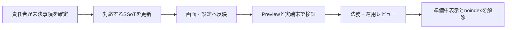

# サービス紹介サイト残タスク

## 1. 目的

この文書は、[サービス紹介サイト設計](../product/service-site-design.md)に基づく公開サイトについて、コード実装後も完了していない意思決定、法務確認、実環境検証を管理します。

### 所有する概念

- サービス紹介サイトの公開前に残っている作業
- Previewおよび実端末で確認する項目
- 各作業を完了とする条件
- 実装着手後のIssueまたはPRへの移管方法

### 所有しない概念

- 公開サイトの目的、サイトマップ、画面構成、CTA、受け入れ条件
- 利用規約、プライバシーポリシー、特定商取引法に基づく表記の本文
- LINE、LIFF、本人向けWebアプリの画面遷移
- 共通のデプロイ手順

公開サイトの要件は[サービス紹介サイト設計](../product/service-site-design.md)、料金プランは[サブスクリプション・料金プラン設計](../product/subscription-plan-design.md)、規約と同意は[サービス利用規約・同意体験設計](../product/service-terms-consent-experience.md)を正とします。公開する正確な取引条件は[`commercial-transactions.ts`](../../packages/shared/src/legal/commercial-transactions.ts)、LINEとWebの遷移は[全体画面遷移設計](../product/screen-navigation.md)を正とします。

## 2. 公開までの進め方

コードだけで確定できない項目を推測で本文へ反映しません。各項目の正本と運用責任を確定し、Previewで検証してから公開状態へ切り替えます。

## 3. 現在の残タスク

### 3.1 プライバシーポリシーを実環境で確認する

- Previewで正本の表示と実際のデータ処理が一致することを確認する
- Vertex AIの学習不使用条件とCloudflare標準保持を実設定で確認する

完了条件は、[サービス紹介サイト設計の個別ページ要件](../product/service-site-design.md#72-プライバシーポリシー)を満たす正本が承認され、Previewで表示内容と実際のデータ処理が一致することを確認できることです。

### 3.2 お問い合わせ窓口を実送信で確認する

- `support@kagami.kyosuke.dev`へテスト送信し、サービス運用者だけが受信・返信できることを確認する
- 対応後に不要となった問い合わせを手動削除できることを確認する

完了条件は、テスト送信へ実際に返信でき、機微情報を最初の連絡で要求せず、利用規約が参照する窓口として継続運用できることです。

### 3.3 無料提供と掲載機能をProductionで確認する

- Webの診断、LINEの日記、「わたしのまとめ」について、本番で利用できる対象者と制約を確認する
- Productionで有料Plan名、価格、無料トライアル、購入導線が表示されないことを確認する

完了条件は、公開サイトの表示とProductionの提供・決済状態が一致し、料金に関する未確定表現が残っていないことです。価格や利用権限を変更する場合は、先に[サブスクリプション・料金プラン設計](../product/subscription-plan-design.md)を更新します。

### 3.4 公開名称とLINE上の表示を確認する

- サービス名、ロゴ、document title、利用規約、LINE公式アカウント、リッチメニューの利用者向け名称を確認する
- 開発用の`me-builder`を、利用者向け名称として誤って表示していないことを確認する
- LINE公式アカウントのプロフィールと友だち追加後の案内から、サービス内容とWeb機能への入口が分かることを確認する

完了条件は、利用者がWebとLINEを同じ「かがみ」サービスとして認識でき、旧名称や開発用名称が公開面へ残っていないことです。

### 3.5 LINE友だち追加とLIFF導線を実環境で確認する

- 公開サイトの友だち追加ボタンが`https://lin.ee/YezPSYA`を開くことを、モバイルとデスクトップで確認する
- 友だち追加済みと未追加の両方で、LINE公式アカウントへ到達できることを確認する
- リッチメニューから診断と「わたしのまとめ」を開き、要求した画面へ復帰できることを確認する
- LIFF endpointが`/app`として登録され、pathなしのLIFF URLが本人向けWebアプリを開くことを確認する
- 診断、相性招待、プロフィールなどのLIFF deep linkで`liff.state`が復元されることを確認する
- LINEアプリがない環境や遷移失敗時の再試行案内を用意する

完了条件は、PreviewのLINE内ブラウザと外部ブラウザで友だち追加から本人確認、規約同意、目的画面への遷移を完了できることです。確認時にLINE user ID、Account ID、認証tokenをログやチケットへ残しません。

### 3.6 SNS共有表示をデプロイ環境で確認する

CDはデプロイ直後に、`/`、`/terms`、`/privacy`、`/commercial-transactions`、`/contact`の非JavaScript初期HTMLと、本人向けWebアプリ・管理者画面の`X-Robots-Tag: noindex, nofollow`を自動検査します。次の実サービス確認は引き続き必要です。

- SNS共有時にタイトル、説明、共有画像が個人データを含まず表示されることを確認する
- 正式なプライバシーポリシーと窓口の公開後だけ、対応ページを検索対象へ変更する

完了条件は、主要SNSの実previewで共有表示を確認し、公開ページと検索対象外ページが意図した範囲に分かれていることです。

### 3.7 モバイル表示、アクセシビリティ、性能を確認する

- LINE内ブラウザと外部ブラウザで、主要文章、友だち追加ボタン、法務リンクが隠れないことを確認する
- キーボード操作、本文へのスキップ、画面拡大、ライト・ダークテーマ、動きを減らす設定を確認する
- 画像の転送量、LCP、CLSをPreviewで計測し、低速回線でも最初の説明とCTAを利用できることを確認する
- LINE公式の友だち追加ボタン画像が取得できない場合も、リンクの目的を支援技術が認識できることを確認する

完了条件は、[サービス紹介サイト設計の受け入れ条件](../product/service-site-design.md#13-初期公開の受け入れ条件)を実機と支援技術で確認し、発見した不具合を個別IssueまたはPRへ移せることです。

### 3.8 計測を追加していないことを確認する

- analytics、広告Cookie、横断profilingが導入されていないことをNetwork panelで確認する
- 認証・セキュリティCookieだけであることを確認する

完了条件は、計測しない判断を含めて方針が記録され、導入する場合は実装、同意、公開文書が一致することです。

## 4. 更新ルール

- 未完了の作業だけをこの文書へ残し、完了した項目は削除する
- 実装を始めた項目は個別のIssueまたはPRへ移し、この文書にはリンクと未完了の確認事項だけを残す
- 公開サイトの要件を変更する場合は、先に[サービス紹介サイト設計](../product/service-site-design.md)を更新する
- 法務本文を確定する作業では、この文書へ本文を置かず、承認された正本を別途SSoTとして登録する
- すべての項目が完了したら、この文書とドキュメントマップのリンクを同じ変更で削除する
