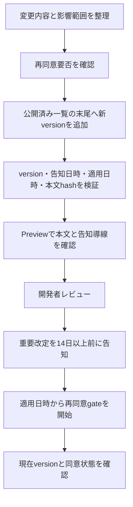

# サービス利用規約の公開運用

## 1. 目的

この文書は、サービス利用規約の新しいversionを安全に追加し、Previewで確認してから本番へ公開する手順を所有します。

### 所有する概念

- 新しい規約versionを追加する作業順序
- `requiresReacceptance`を決定・確認する担当境界
- version、公開日時、本文hashを公開前に検証する方法
- 公開後に問題が見つかった場合のforward-onlyな訂正方法

### 所有しない概念

- 規約本文と再同意要否のプロダクト上の意味
- Accountごとの同意履歴と同意画面
- プライバシーポリシー、問い合わせ先、運営者情報
- D1マイグレーション全般の適用・復旧方法

規約本文、版管理規則、同意体験は[サービス利用規約・同意体験設計](../product/service-terms-consent-experience.md)、D1の適用順序と復旧は[本番データベースマイグレーション運用](production-migration-operations.md)を正とします。

## 2. 公開フロー



### 2.1 変更内容を確定する

1. 変更理由と利用者への影響をPRへ記載する
2. [同意体験設計の版管理規則](../product/service-terms-consent-experience.md#3-規約の版管理)に基づき、開発者が`requiresReacceptance`を決定してPRで確認する
3. 個人開発の通常改定では外部法務承認を必須gateにしない。media入力など別SSoTで法務確認を必須とした変更は、その条件を維持する
4. 再同意要否と内容確認が完了していない状態で公開用versionを追加しない

### 2.2 新しいversionを追加する

[`service-terms.ts`](../../packages/shared/src/legal/service-terms.ts)の公開済み一覧の末尾へ、[版管理規則](../product/service-terms-consent-experience.md#3-規約の版管理)に従って追加します。

- `publishedAt`は実際に公開する日時をISO 8601で記録し、Asia/Tokyoでの公開日をversionの日付と一致させ、一覧で単調増加させる
- `contentHash`以外の公開文書全体を`JSON.stringify`したUTF-8バイト列のSHA-256を保存する
- 公開済みversionごとの固定hash一覧へ新versionのhashを追加し、既存の固定値は変更しない
- 重要改定は`serviceTermsAnnouncements`へ適用日の14日以上前の告知日時を追加する。告知releaseでは新本文を閲覧可能にするが、適用日時までは旧版を現行規約として返す
- 軽微改定は公開日時から30日間だけWeb／LIFFへ非遮断通知を表示する

## 3. 自動検証

規約だけを確認する場合は、リポジトリルートで次を実行します。

```bash
task terms:verify
```

この検証は次を確認し、通常の`task ci`でも同じテストを実行します。

- versionの形式、一意性、日付ごとの連番
- `publishedAt`の形式、versionとの日付一致、公開順
- 本文hashの一致とhashの一意性
- 重要改定が1件以上あり、最新の同意必須versionを解決できること
- 全公開済みversionの本文と運用属性が固定hashから変更されていないこと
- 重要改定の告知日時が適用日時の14日以上前であること
- 適用日前は旧版、適用日時以後は新versionが同意対象になること

PreviewとProductionのCDは、外部resourceの変更やデプロイより前に`task terms:verify`を独立したrelease gateとして実行します。不一致時は後続stepへ進みません。`task ci`にも同じ検証を含めますが、Preview CDは全CIを実行しないため、このgateを省略できません。

## 4. Previewとレビュー

Previewでは、初回利用者と既存利用者の両方で確認します。

- 最新のタイトル、version、適用日、全文が表示される
- 重要改定では既存利用者にも再同意を求め、軽微改定では利用を継続できる
- 同意後は「わたしのまとめ」へ遷移する
- プロフィールの同意履歴へ新しいversion、本文hash、同意日時が追加される
- 同じversionへの再送で履歴が重複しない

PRでは変更理由、`requiresReacceptance`の判断根拠、Preview確認結果を記載します。本文の意味に影響する変更は、実装レビューとは別に必要な内容確認を完了してからマージします。

重要改定の告知releaseでは、Web／LIFF通知が表示され、対象AccountへのLINE pushが同じversionについて1回だけ記録されることを確認します。適用releaseでは、Web、LINE誘導先、直接APIが同じ新versionへ収束することを確認します。軽微改定は30日間の表示と、LINE push・再同意がないことを確認します。証跡へAccount ID、外部identity、token、日記本文を残しません。

## 5. 公開後の訂正

公開後に誤りが見つかった場合は、[版管理規則](../product/service-terms-consent-experience.md#3-規約の版管理)に従い、一覧の末尾へ訂正版を追加します。訂正版も通常の公開フローを通し、再同意要否を改めて確認します。

実環境でだけ確認できる事項と、法務・プロダクト判断を待つ事項は[サービス利用規約・同意残タスク](service-terms-remaining-tasks.md)で管理します。
